# BitEngine：边缘智能平台技术架构方案（v7）

> 工作代号 BitEngine，取"边缘锻造"之意——在用户自己的设备上锻造应用。
> 
> v7 更新：**全标准协议栈升级**。基于 2026 年 3 月技术审查，协议栈从"四协议"升级为"七层行业标准"——新增 Google A2A（Linux Foundation 标准）、OTel GenAI（CNCF 标准），MCP 补充 Elicitation 能力，MQTT 明确 5.0 版本。A2A 从 v2.0 提前到 v1.5。安全模型扩展新协议攻击面覆盖。DD 文档编号重新对齐修订计划。
> 
> v6 更新：从"AI 应用平台"升级为"三中心 + 底座"的边缘智能平台架构。新增数据中心（Data Hub）、物联网中心（IoT Hub），平台服务层重构为"平台底座"（安全/网络/备份/监控/身份五大基础设施）。
> 
> v5 更新：整合 AI 技术调研，引入 Structured Output 约束解码、本地 RAG 引擎、SLM 多模型矩阵、WASM+AI 浏览器端推理。
> 
> v4 更新：整合 AI Agent 协议栈分析（MCP / A2A / A2H / AG-UI + A2UI），明确四协议在平台中的分工与优先级。
> 
> v3 更新：整合 OpenFang 架构分析，引入 WASM 双层隔离、自主应用包（Hands）、10 层安全模型。

---

## 一、产品定位

BitEngine 是一个本地优先的边缘智能平台，围绕"三中心 + 底座"架构，让非技术用户在自己的设备上创建应用、管理数据、控制设备。

**一句话定义**：你的私人边缘智能平台——AI 帮你造工具、管数据、控设备，全部跑在你自己的机器上。

### 1.1 三中心 + 底座架构（v6 新增）

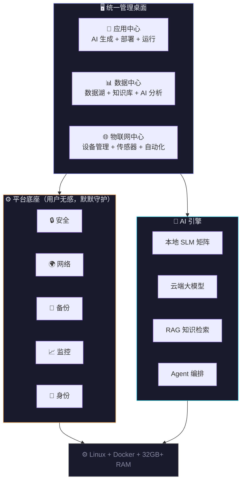

**三中心**是用户日常打交道的——应用中心帮你造工具，数据中心帮你管信息，物联网中心帮你控设备。三者在一个管理桌面上深度打通：IoT 传感器数据自动流入数据中心，数据中心的分析结果可触发应用中心的告警，一句话就能串联三者。

**底座**是用户不需要操心但默默守护的——自动加密让所有连接安全，自动备份让数据永不丢失，远程访问让你在任何地方都能用，智能监控让系统自己照顾自己。

### 1.2 三平台定位对比

| 维度 | OpenClaw | OpenFang | BitEngine |
|------|----------|----------|-----------|
| **定位** | AI 消息助手 | Agent 操作系统 | AI 应用平台 |
| **核心理念** | AI 帮你做事 | Agent 当作进程管理 | AI 帮你造工具 |
| **核心产物** | Agent 即时执行结果 | Agent 持续运行的任务 | 持久运行的 Web 应用 |
| **隔离模型** | 无（共享宿主） | WASM 沙箱 | Docker + WASM 双层 |
| **语言** | TypeScript / Node.js | Rust | Go |
| **安全深度** | 基础（1-2 层） | 16 层 | 10 层 |
| **生态格式** | SKILL.md + ClawHub | SKILL.md + HAND.toml + FangHub | MODULE.md（兼容两者）|
| **协议支持** | 无 | MCP + A2A + OFP | MCP + A2H + AG-UI/A2UI + A2A + MQTT 5.0 + OTel GenAI |
| **用户画像** | 开发者/极客 | DevOps / 技术团队 | 个人/SOHO → 中型企业（200人） |
| **状态** | 234K ⭐ · 创始人已离开 | 4K ⭐ · v0.1.0 刚发布 | 规划中 |

**BitEngine 的差异化**：
- OpenClaw 和 OpenFang 都是 **Agent 平台**——让 AI 执行任务。BitEngine 是 **边缘智能平台**——让 AI 生成应用 + 统一管理数据 + 控制 IoT 设备。
- 同时吸收两者优点：OpenClaw 的生态规模 + OpenFang 的安全架构，服务于完全不同的用户群体。
- v6 关键升级：从"AI 应用工厂"扩展为"三中心 + 底座"，覆盖用户数字生活的应用、数据、设备三大支柱。

---

## 二、系统架构总览

> v6 更新：从单一"应用平台"架构升级为"三中心 + 底座"的边缘智能平台架构。

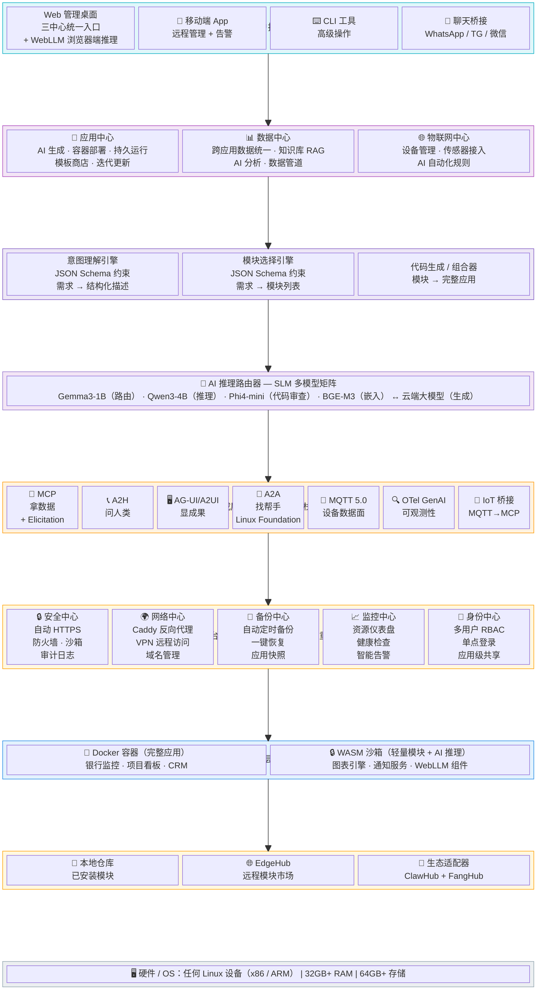

**部署拓扑演进（v2.0 企业版，DD-09 详述）**：

上图为逻辑架构。物理部署上，BitEngine 支持三级拓扑平滑升级：

| 拓扑 | 适用规模 | 节点数 | 说明 |
|------|---------|--------|------|
| **Tier 1: 单机** | 1-50 人 | 1 台 | MVP ~ v1.0 默认，所有服务运行在单台 32GB+ 设备 |
| **Tier 2: 分离** | 50-200 人 | 2-5 台 | v2.0 企业版，Platform / Data / AI / Worker 分离部署 |
| **Tier 3: 集群** | 200-500+ 人 | 5-15 台 | v3.0 远期，K3s 编排 + 弹性伸缩 |

Tier 2 分离部署中，Platform 节点运行 bitengined 主进程（Active-Standby 双节点），Data 节点运行 PostgreSQL 主从 + Redis Sentinel，AI 节点运行 Ollama + GPU，Worker 节点运行应用容器。通过一份 `deploy.yaml` 配置文件切换拓扑，现有代码接口不变。

---

## 三、各层详细设计

### 3.1 应用运行层：双层隔离架构

这是整个平台的地基。借鉴 OpenFang 的 WASM 沙箱思路，结合 Docker 容器的成熟生态，BitEngine 采用**双层隔离**——根据工作负载特性选择最佳隔离方案。

**设计原则**：
- 完整应用 = Docker 容器（有状态、有 UI、需要持久化）
- 轻量模块 = WASM 沙箱（无状态、纯计算、调用频繁）
- 两种隔离方式共存，由平台根据模块声明自动选择
- 容器/沙箱之间默认网络隔离，通过平台定义的内部网络通信
- 容器不能访问宿主文件系统（除了指定的数据卷）
- 容器不能访问宿主网络（通过平台代理访问外部服务）

**双层隔离模型**：

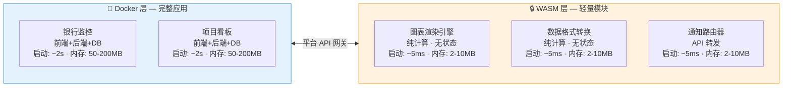

**何时用 Docker，何时用 WASM**：

| 特性 | Docker 容器 | WASM 沙箱 |
|------|------------|-----------|
| **适用场景** | 完整应用、有 UI、有持久状态 | 纯函数计算、数据转换、API 适配 |
| **启动速度** | 秒级 | 毫秒级 |
| **内存占用** | 50-200MB | 2-10MB |
| **隔离强度** | Linux namespace + cgroups | WASM 内存沙箱 + 燃料计量 |
| **文件系统** | 独立数据卷 | 无（通过 API 传入传出） |
| **网络访问** | 通过 Docker 网络 | 通过宿主 API 代理 |
| **开发语言** | 任意（AI 默认生成 Python） | 任意→编译到 WASM |
| **资源计量** | cgroups CPU/内存配额 | WASM 燃料 + epoch 中断 |
| **AI 推理** | Ollama 容器（完整 SLM） | WASI-NN / WebLLM（轻量推理，v5 新增） |

**WASM 沙箱细节**（借鉴 OpenFang）：

```yaml
wasm_sandbox:
  runtime: wasmtime             # WASM 运行时
  metering:
    fuel_limit: 1_000_000       # 燃料计量，防止无限循环
    epoch_interrupt: 5s         # epoch 中断，硬性超时
    watchdog: true              # 看门狗线程，强制终止失控模块
  isolation:
    memory_limit: 10MB          # 内存上限
    filesystem: none            # 无文件系统访问
    network: api_proxy_only     # 只能通过平台 API 代理访问网络
    host_functions: allowlist   # 只允许白名单中的宿主函数
```

**运行时类型**：

| 运行时类型 | 标识 | 说明 |
|-----------|------|------|
| **应用容器** | App | 完整的用户应用（前端 + 后端 + 数据库），由 AI 生成或模块组合而成 |
| **WASM 模块** | WasmModule | 轻量级能力模块，纯函数计算，毫秒级启动，可被多个应用高频调用 |
| **WASM+AI 模块** | WasmAIModule | 集成 WASI-NN 的智能模块，可在沙箱内执行轻量 AI 推理（v5 新增·v1.1） |
| **Docker 模块** | DockerModule | 需要持久状态或特殊运行时的能力模块（如需要 FFmpeg、Playwright 等） |
| **平台服务** | Platform | 数据库 / 认证 / 代理等基础设施，由平台管理，用户不直接接触 |

**网络模型**：

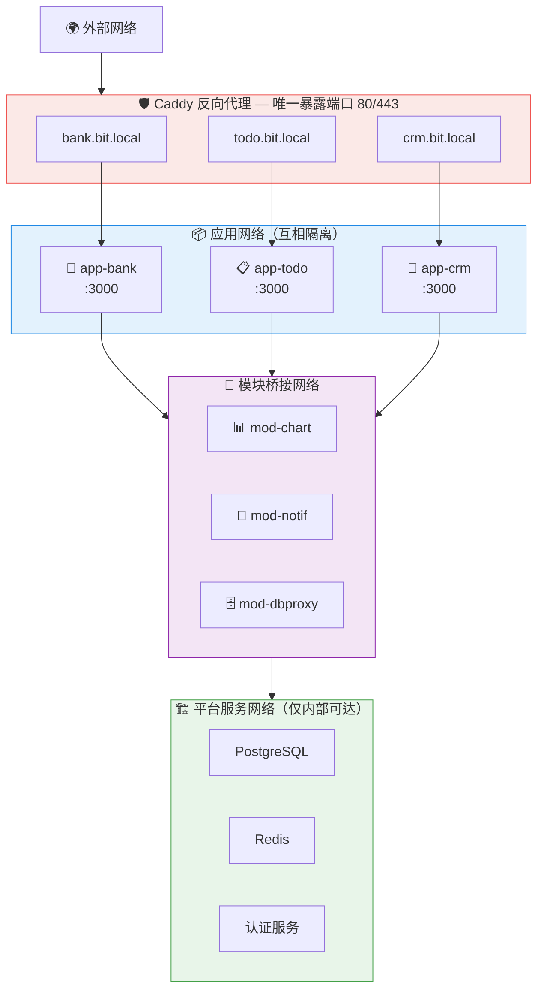

每个应用容器只能访问它声明依赖的模块容器，不能访问其他应用。模块容器可以被多个应用共享，但每个应用看到的是模块的独立实例或隔离的命名空间。

**数据持久化**：

```
/bitengine/
├── data/
│   ├── apps/                         # 应用中心数据
│   │   ├── bank-monitor/             # 每个应用的数据卷
│   │   │   ├── db/                   # SQLite/数据文件
│   │   │   ├── uploads/              # 用户上传
│   │   │   └── config.json           # 应用配置
│   │   ├── todo-board/
│   │   └── crm-tool/
│   ├── data-hub/                     # 数据中心数据（v6 新增）
│   │   ├── knowledge-base/           # RAG 知识库
│   │   │   ├── vectors/              # ChromaDB 向量存储
│   │   │   └── documents/            # 原始文档备份
│   │   ├── pipelines/                # 数据管道配置
│   │   └── exports/                  # 数据导出缓存
│   ├── iot-hub/                      # 物联网中心数据（v6 新增）
│   │   ├── device-registry/          # 设备注册信息
│   │   ├── rules/                    # 自动化规则
│   │   ├── sensor-data/              # 传感器原始数据（90天滚动）
│   │   └── mosquitto/                # MQTT Broker 数据
│   ├── modules/
│   │   ├── chart-engine/
│   │   └── notification-hub/
│   └── platform/
│       ├── postgres/                 # 统一 PostgreSQL（应用+数据+IoT 共用）
│       ├── redis/                    # 事件总线 + 缓存（v6 新增）
│       └── auth/
├── backups/                          # 自动备份（v6 强化）
│   ├── daily/
│   │   ├── 2026-03-01.tar.gz.enc
│   │   └── 2026-03-02.tar.gz.enc
│   ├── weekly/
│   └── snapshots/                    # 应用级快照（v6 新增）
│       └── bank-monitor-pre-update-20260302.tar.gz
├── registry/                         # 本地模块缓存
└── config/                           # 平台配置
    ├── bitengine.yaml
    ├── apps.yaml
    ├── data-hub.yaml                 # 数据中心配置（v6 新增）
    └── iot-hub.yaml                  # IoT 中心配置（v6 新增）
```

### 3.2 三大中心详细设计（v6 新增）

#### 3.2.1 应用中心（App Center）

应用中心是 BitEngine 的核心差异化——AI 从自然语言生成完整 Web 应用，自动容器化部署，持久运行管理。其详细的 Agent 编排流程、代码生成管线、迭代更新机制见 Section 3.4（Agent 编排层）。

**核心能力**：

| 能力 | 说明 | 技术实现 |
|------|------|----------|
| 自然语言生成应用 | 用户描述需求 → AI 生成前后端代码 + 数据库 | 云端大模型 + Structured Output |
| 自动容器化部署 | 生成代码自动打包为 Docker 容器 | Docker API + Caddy 反向代理 |
| 持久运行管理 | 应用桌面管理启停/日志/更新/回滚 | Docker lifecycle + 蓝绿部署 |
| AI 对话迭代 | "加一个过滤功能" → 增量修改代码 | 云端大模型 + Phi-4-mini 审查 |
| 定时任务与自动化 | Cron 调度 + 事件触发 + 通知推送 | 平台 Cron 调度器 + A2H 网关 |
| 应用模板商店 | 社区贡献的预制应用模板一键部署 | EdgeHub 模块市场 |
| 本地代码安全审查 | AI 生成代码部署前自动扫描 | Phi-4-mini 本地执行 |

#### 3.2.2 数据中心（Data Hub）（v6 新增）

数据中心是 BitEngine 的"记忆和智慧"——统一管理跨应用数据、私有文档知识库、AI 分析，让用户的所有数据在一个地方可查、可搜、可分析。

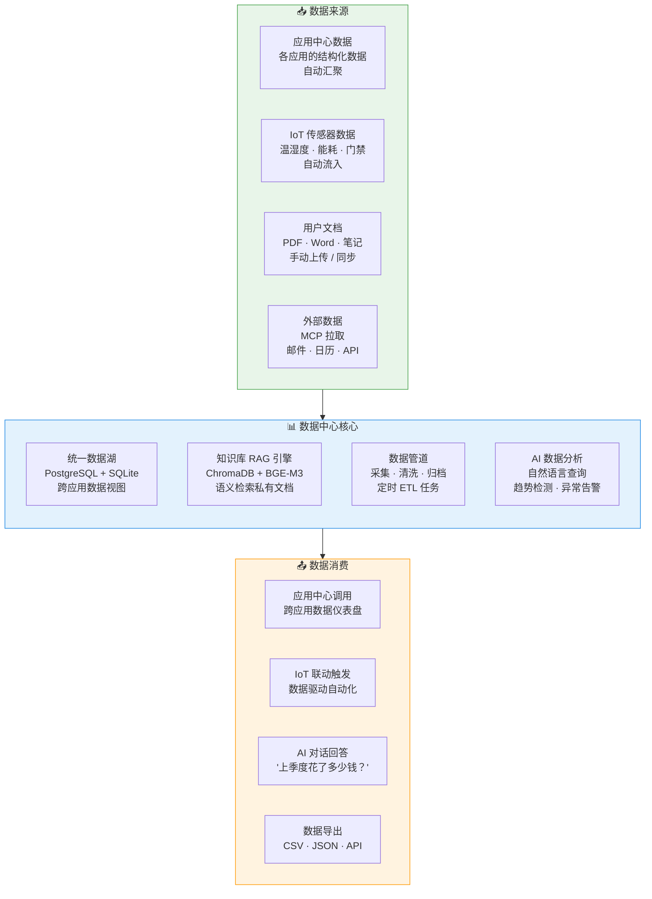

**核心能力**：

| 能力 | 说明 | 优先级 |
|------|------|--------|
| 跨应用数据统一 | 各应用的结构化数据自动汇聚，支持跨应用查询和可视化 | v1.0 |
| 私有文档知识库 | PDF/Word/笔记上传 → 分块 → 嵌入 → 语义检索（RAG） | v1.0 |
| 自然语言数据查询 | "上季度花销最高的三个类目是什么？" → AI 自动查数据回答 | v1.0 |
| 数据管道 | 定时从外部源采集数据 → 清洗 → 标准化 → 存储 | v1.0 |
| IoT 传感器数据汇聚 | 物联网中心的传感器数据自动流入数据中心，供历史分析 | v1.0 |
| 文件管理器 | 浏览和管理本地文件，上传/下载，目录结构 | MVP |
| 数据可视化仪表盘 | 跨应用数据的统一可视化面板 | v1.0 |
| 数据导出 | CSV / JSON / API 多种格式导出 | v1.0 |

**数据中心与 RAG 引擎的关系**：v5 中的 RAG 引擎（ChromaDB + BGE-M3）现在成为数据中心的核心组件。v5 的设计是"每应用独立 Collection"，v6 扩展为"每应用 + 全局共享"两级 Collection：

```yaml
data_hub:
  # 结构化数据
  structured:
    engine: postgresql               # 跨应用统一数据库
    per_app_schema: true              # 每应用独立 schema（隔离）
    cross_app_views: true             # 支持跨应用视图（用户授权后）

  # 非结构化数据（RAG 知识库）
  knowledge_base:
    engine: chromadb + bge-m3         # 沿用 v5 RAG 引擎
    collections:
      per_app: true                   # 每应用独立 Collection（隔离）
      shared: true                    # 全局共享 Collection（跨应用搜索，v6 新增）
    access_control: rbac              # 基于角色的访问控制

  # 数据管道
  pipelines:
    scheduler: platform_cron          # 复用平台 Cron 调度器
    transformers:
      - csv_import                    # CSV → 结构化表
      - pdf_ingest                    # PDF → 向量知识库
      - api_fetch                     # 外部 API → 本地存储
      - iot_aggregate                 # IoT 传感器 → 聚合统计（v6 新增）
```

#### 3.2.3 物联网中心（IoT Hub）（v6 新增，v6.1 MCP-first 升级）

> v6.1 关键变更：IoT 中心从"MQTT/Zigbee 传统协议优先"升级为 **MCP-first 架构**。核心判断——IoT 设备厂商正在从"为每个平台写私有 API"转向"提供标准 MCP Server"（Digi International、ThingsBoard、Litmus 等已发布 MCP Server；EMQX 提出 MCP over MQTT 方案让资源受限设备也能接入）。Home Assistant 的 2000+ 手写集成正从"护城河"变为"历史包袱"，BitEngine 以 MCP-native Client 身份押注后发优势。

物联网中心是 BitEngine 的"触手"——统一管理智能家居和工业传感器设备，实时监控、AI 驱动的自动化规则，传感器数据自动流入数据中心。

**与 Home Assistant 的竞争策略**：

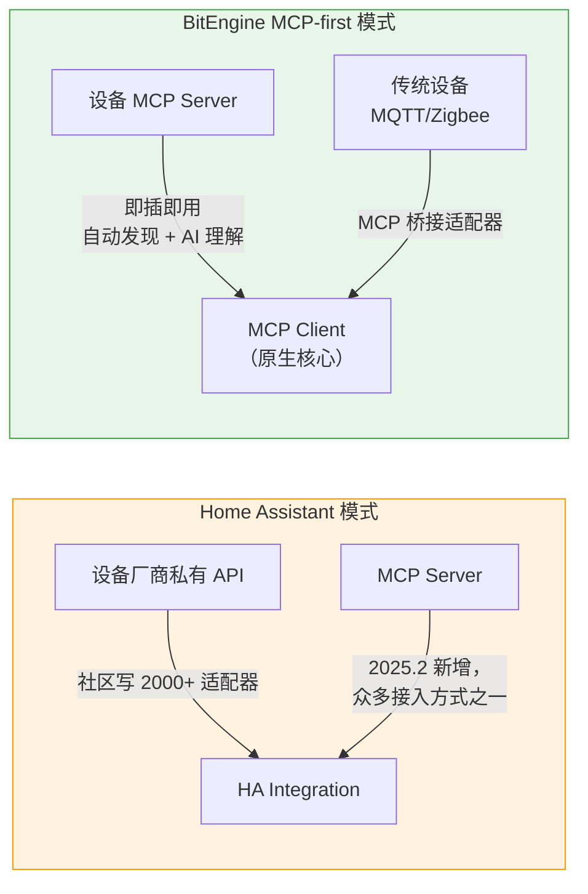

| 维度 | Home Assistant | BitEngine IoT Hub |
|------|:---:|:---:|
| **设备接入架构** | 集成优先（2000+ 手写适配器）+ MCP 作为补充 | **MCP-first**（MCP 为核心）+ 传统协议桥接 |
| **新设备接入** | 等社区写集成（数周到数月）| 设备提供 MCP Server → **即插即用** |
| **AI 理解设备** | 刚开始（2025.2 加 LLM 对话）| **原生** — MCP tool schema 让 AI 自动理解设备能力 |
| **自动化规则** | 手写 YAML / 可视化编辑 | **AI 自然语言生成**，直接调用 MCP tools |
| **数据分析** | 需手动配 InfluxDB + Grafana | 传感器数据自动流入数据中心 + AI 分析 |
| **自定义面板** | 学 Lovelace 配置语法 | AI 一句话生成监控面板应用 |
| **短期劣势** | 已有 2000+ 设备支持 | MCP 生态尚在早期，需传统协议兜底 |
| **长期优势** | 手写集成成为维护负担 | **MCP 成为标准后，自动覆盖所有设备** |

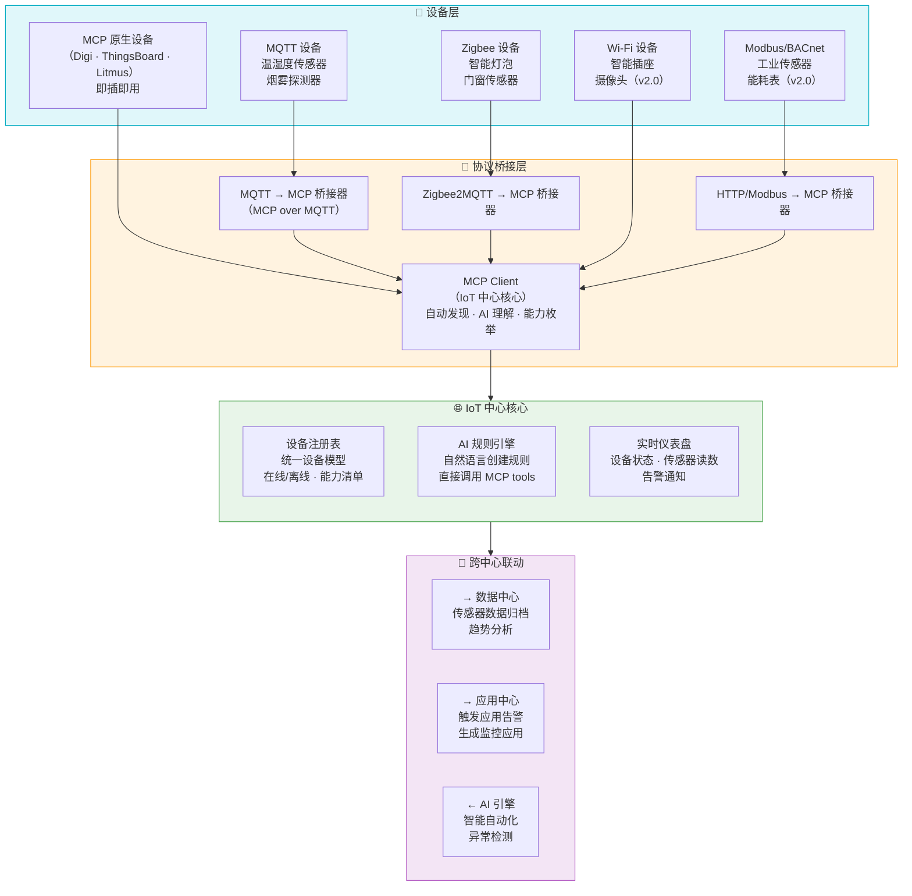

**核心能力**：

| 能力 | 说明 | 优先级 |
|------|------|--------|
| **MCP 设备自动发现** | 局域网发现 MCP Server，自动枚举设备能力（tools/resources） | **MVP** |
| **MCP 设备即插即用** | 新设备提供 MCP Server → 零配置接入，AI 自动理解 | **MVP** |
| MQTT 设备接入 | 内嵌 Mosquitto Broker（MQTT 5.0）+ MCP over MQTT 桥接 | v1.0 |
| Zigbee 设备接入 | Zigbee2MQTT + MCP 桥接器 | v1.0 |
| 设备注册与管理 | 统一设备模型、状态监控（在线/离线/故障） | v1.0 |
| 实时监控仪表盘 | 传感器读数实时展示、历史曲线、设备地图 | v1.0 |
| **AI 自动化规则** | 自然语言创建："温度>35° → 开空调 + 通知我"，AI 直接调用 MCP tools | v1.0 |
| 传感器数据归档 | 自动流入数据中心，供历史分析和趋势检测 | v1.0 |
| 告警联动 | 设备异常 → A2H 多渠道通知（微信/邮件/App推送） | v1.0 |
| 设备驱动市场 | 社区贡献的 MCP 桥接器（让非 MCP 设备接入） | v2.0 |
| 计算机视觉模块 | 摄像头接入 + 本地物体检测 + 异常识别 | v2.0 |
| 工业协议支持 | Modbus / BACnet → MCP 桥接 | v2.0 |

**IoT 中心技术实现**：

```yaml
iot_hub:
  # MCP-first 架构（v6.1 核心变更）
  mcp_client:
    role: primary                       # MCP Client 是 IoT 中心的核心
    discovery:
      mdns: true                        # 局域网 mDNS 发现 MCP Server
      manual: true                      # 手动添加远程 MCP Server URL
    transport:
      - streamable_http                  # MCP Streamable HTTP（主要）
      - sse                             # SSE 兼容（部分设备）
    capabilities:
      tool_call: true                   # 调用设备 MCP tools（控制设备）
      resource_read: true               # 读取设备 MCP resources（获取状态）
      subscription: true                # 订阅设备状态变更
    ai_integration:
      auto_understand: true             # AI 自动解析 tool schema，理解设备能力
      natural_language_control: true    # "把客厅灯调到50%暖光" → AI 选择正确 tool + 参数

  # 协议桥接层（让传统设备也通过 MCP 接入）
  bridges:
    mqtt_to_mcp:
      engine: built_in                  # 内置 MQTT→MCP 桥接器
      broker: mosquitto                 # 内嵌 Mosquitto（MQTT 5.0）
      protocol: "MCP over MQTT 5.0"    # 参考 EMQX 方案，必须 5.0
      mqtt_version: "5.0"              # v7: 明确要求 MQTT 5.0
      mqtt5_features:                   # v7: MQTT 5.0 特性启用
        user_properties: true           # 消息附加元数据（device_id、MIME type）
        shared_subscriptions: true      # 规则引擎多实例负载均衡（HA 场景）
        message_expiry: true            # 设备事件自动过期清理
        request_response: true          # MCP↔MQTT Bridge 控制面操作
        content_type: true              # 自动标记 payload 格式
        reason_codes: true              # 设备断连原因上报
      ports: { mqtt: 1883, tls: 8883 }
    zigbee_to_mcp:
      engine: zigbee2mqtt               # Zigbee2MQTT → MCP 桥接
      coordinator: usb_dongle           # 需要 Zigbee USB 协调器
      status: v1.0
    http_to_mcp:
      engine: built_in                  # HTTP API 设备 → MCP 桥接
      polling_interval: 30s

  # 统一设备模型（所有设备无论原始协议，统一为 MCP 语义）
  device_registry:
    storage: postgresql
    model:
      identity: { id, name, manufacturer, model, firmware }
      capabilities: mcp_tools_schema    # 直接存储 MCP tool 定义
      state: mcp_resources              # 设备状态映射为 MCP resources
      health: { last_seen, online, heartbeat_interval }
    features:
      auto_discovery: true
      health_check: 60s
      offline_alert: 300s

  # AI 规则引擎（直接操作 MCP tools）
  rules_engine:
    type: event_driven
    ai_powered: true
    execution_model: mcp_tool_call      # 规则动作 = 调用设备的 MCP tool
    rule_format: yaml
    examples:
      - trigger: "resource://sensor-hub/humidity < 40"
        action: "tool://humidifier/turn_on({level: 'medium'})"
        notify: "a2h.inform('湿度过低，已开启加湿器')"
      - trigger: "resource://thermostat/temperature > 35"
        action:
          - "tool://ac/set_temperature({temp: 26})"
          - "tool://ventilation/turn_on()"
        notify: "a2h.inform('温度过高，已开启空调和通风')"
      - trigger: "resource://door-sensor/state == 'open' AND time.is('22:00-06:00')"
        action: null
        notify: "a2h.authorize('深夜门禁触发，是否报警？')"

  # 数据流出
  data_export:
    to_data_hub: true
    aggregation: 5min
    retention: 90days
```

**MCP-first 架构的关键优势**：

1. **零适配器接入**：设备提供 MCP Server 后，BitEngine 自动发现 → 读取 tool schema → AI 理解设备能力 → 用户可以直接自然语言控制。不需要任何人写任何适配器代码。

2. **AI 原生控制**：MCP 的 tool 定义自带参数描述和类型约束，AI 可以像调用函数一样精确控制设备。而 HA 的 AI 对话需要先将自然语言映射到 HA 的实体模型，再转化为具体命令，多了一层翻译。

3. **生态自动扩张**：随着 MCP 成为 IoT 行业标准（Digi、ThingsBoard、Litmus、EMQX 等已入场），BitEngine 无需做任何开发，新设备的 MCP Server 上线即可被 BitEngine 接入。

4. **统一设备模型**：传统协议（MQTT/Zigbee/HTTP）的设备通过桥接器也被转化为 MCP 语义，IoT 中心内部只有一种设备抽象——MCP tools + resources。这大幅简化了规则引擎和 AI 理解的复杂度。

#### 3.2.4 跨中心联动（v6 新增）

三个中心不是三个独立的产品，而是在一个管理桌面上深度打通的统一平台。跨中心联动是 BitEngine 相比 "Home Assistant + Notion + Bolt.new 分别使用" 的核心差异化。

**联动架构**：

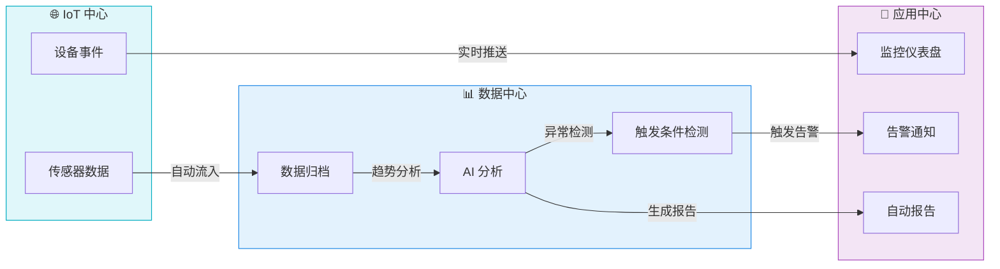

**三个典型跨中心场景**：

**场景 1：智慧办公** — 律所用户

```
IoT 中心：门禁传感器记录出入 → 数据中心：归档出入记录 + 案件管理数据
→ 数据中心 AI 分析：发现合同 30 天到期
→ 应用中心：案件管理应用弹出提醒 + A2H 微信通知律师
```

**场景 2：智慧农业** — 温室用户

```
IoT 中心：温湿度传感器每 5 分钟上报 → 数据中心：归档趋势 + AI 异常检测
→ IoT 中心规则引擎：温度 > 35° → 自动开通风
→ 应用中心：温室管理仪表盘实时更新 + 生成每日报告
```

**场景 3：自由职业者** — 远程工作

```
IoT 中心：智能插座检测电脑开机 → 触发"工作模式"
→ 应用中心：项目管理工具自动开始计时
→ 数据中心：月底汇总工时 + 收入 → AI 生成月度报告
→ A2H 通知：推送月度总结到微信
```

**跨中心通信机制**：

```yaml
cross_center:
  # 内部事件总线
  event_bus:
    engine: redis_pubsub              # 轻量级，复用平台 Redis
    topics:
      - iot.sensor.*                   # IoT 传感器事件
      - iot.device.*                   # IoT 设备状态事件
      - data.alert.*                   # 数据分析告警事件
      - app.status.*                   # 应用状态事件
      - platform.system.*             # 平台系统事件

  # 跨中心 API
  internal_api:
    format: rest + grpc               # REST 通用 + gRPC 高频数据流
    auth: internal_token              # 内部服务间 JWT token
    rate_limit: none                  # 内部无限流

  # 自然语言联动（AI 驱动）
  ai_orchestration:
    enabled: true
    example: "每天下班后自动关闭办公室所有设备，并生成今日工时报告"
    # → IoT 规则 + 数据管道 + 应用任务，一句话创建
```

### 3.3 平台底座详细设计（v6 重构）

> v6 关键变更：原"平台服务层"重构为"平台底座"，新增备份与恢复、系统监控两大子系统，安全和网络能力显著扩展。平台底座是用户不需要直接操作但不可或缺的基础设施。

#### 3.3.1 安全中心

> 整合 v5 原有安全能力 + v6 新增：自动 SSL/TLS、Anti-DDoS、审计日志强化。

原有安全能力（v3-v5）保留在 Section 四（安全模型·十层纵深防御），此处聚焦平台底座的安全基础设施：

```yaml
security_center:
  # 自动 HTTPS（v6 强化：从"可选"升级为"默认"）
  tls:
    engine: caddy                     # 自动 Let's Encrypt 证书
    default: always_https             # 所有应用默认 HTTPS（v6：不再可选）
    local_ca: mkcert                  # 局域网内使用自签 CA
    renewal: auto                     # 证书到期前自动续期

  # 防火墙与入侵检测（v6 新增）
  firewall:
    engine: nftables                  # Linux 原生防火墙
    default_policy: deny_all_inbound  # 默认拒绝所有入站
    allowed_ports: [80, 443, 1883]    # 只开放必要端口
    rate_limiting:                    # 请求频率限制
      enabled: true
      window: 60s
      max_requests: 300

  # Anti-Bot / Anti-DDoS（v6 新增 · v2.0 实现）
  anti_abuse:
    smart_shield: true                # 参考 Cosmos Cloud Smart-Shield
    captcha_fallback: true            # 异常流量触发验证码
    geo_blocking: optional            # 可选地理位置封禁

  # 审计日志（v6 强化）
  audit:
    engine: merkle_chain              # 沿用 v5 Merkle 审计链
    enhanced_events:                  # v6 新增事件类型
      - iot_device_connected          # IoT 设备连接/断开
      - data_export                   # 数据导出操作
      - cross_center_trigger          # 跨中心联动触发
      - backup_completed              # 备份完成
      - remote_access_session         # 远程访问会话
```

#### 3.3.2 网络中心（v6 强化）

```yaml
network_center:
  # 反向代理（v5 已有，v6 扩展路由范围）
  reverse_proxy:
    engine: caddy
    routes:
      # 应用中心路由
      - "bank.bit.local → app-bank-monitor:3000"
      - "todo.bit.local → app-todo-board:3000"
      # 数据中心路由（v6 新增）
      - "data.bit.local → data-hub:5000"
      # IoT 中心路由（v6 新增）
      - "iot.bit.local → iot-hub:6000"
      # 平台路由
      - "console.bit.local → bitengine-console:8080"

  # 远程访问（v6：从"可以后做"升级为"v1.0 必须"）
  remote_access:
    primary: tailscale                # 零配置 VPN，首选方案
    fallback: cloudflare_tunnel       # Cloudflare Tunnel 备选
    features:
      auto_connect: true              # 安装时引导配置
      mobile_access: true             # 手机也能访问
      split_tunnel: true              # 只路由 BitEngine 流量

  # 域名管理（v6 新增）
  dns:
    local: avahi                      # .local 域名自动解析
    custom: optional                  # 用户可绑定自定义域名
    auto_cert: caddy                  # 自定义域名自动获取 SSL 证书
```

#### 3.3.3 备份与恢复中心（v6 新增）

> 边缘设备不是云——硬件坏了、断电了、误操作了，数据就没了。自动备份是用户愿意信赖平台的基本门槛。

```yaml
backup_center:
  # 自动定时备份
  scheduled:
    frequency: daily                  # 每天凌晨 3:00
    scope:
      - app_data                      # 应用数据卷
      - app_configs                   # 应用配置
      - knowledge_base                # 知识库向量数据
      - iot_rules                     # IoT 自动化规则
      - iot_device_registry           # IoT 设备注册信息
      - platform_config               # 平台配置
      - audit_chain                   # 审计链（不可篡改副本）
    encryption: aes-256-gcm           # 备份文件加密
    retention:
      daily: 7                        # 保留 7 天每日备份
      weekly: 4                       # 保留 4 周每周备份
      monthly: 3                      # 保留 3 个月每月备份

  # 应用级快照（v6 新增）
  snapshots:
    trigger: before_update            # 更新前自动创建快照
    manual: true                      # 用户可手动创建
    rollback: one_click               # 一键回滚到任意快照

  # 一键恢复
  recovery:
    full_restore: true                # 全量恢复到指定备份点
    selective_restore: true           # 单应用恢复
    disaster_recovery:                # 灾难恢复
      new_device_restore: true        # 新设备一键恢复整个平台
      export_format: tar.gz.enc      # 加密压缩包

  # 异地备份（v2.0）
  offsite:
    enabled: false                    # v2.0 启用
    targets:
      - type: s3_compatible           # MinIO / AWS S3
      - type: another_bitengine       # 另一台 BitEngine 设备
      - type: nas                     # NAS / 外接硬盘
```

#### 3.3.4 系统监控中心（v6 新增）

```yaml
monitoring_center:
  # 资源仪表盘
  dashboard:
    metrics:
      - cpu_usage                     # CPU 使用率
      - memory_usage                  # 内存使用（系统 + 各应用 + AI 模型）
      - disk_usage                    # 磁盘使用和剩余
      - network_io                    # 网络流量
      - container_stats               # 各容器资源消耗
      - ai_model_status               # 本地 AI 模型加载状态
      - iot_device_count              # IoT 在线/离线设备数（v6 新增）
    refresh: 5s                       # 5 秒刷新

  # 应用健康检查
  health_check:
    interval: 30s                     # 每 30 秒检查一次
    checks:
      - http_ping                     # HTTP 健康端点
      - container_running             # 容器运行状态
      - memory_threshold              # 内存超限检测
    auto_restart:
      enabled: true                   # 异常自动重启
      max_retries: 3                  # 最多重启 3 次
      cooldown: 300s                  # 300 秒冷却期

  # 智能告警
  alerts:
    rules:
      - condition: "disk_usage > 85%"
        severity: warning
        message: "磁盘空间不足，请清理或扩容"
      - condition: "memory_usage > 90%"
        severity: critical
        message: "内存即将耗尽，建议停止部分应用"
      - condition: "app_health_check_failed"
        severity: warning
        message: "应用 {app_name} 健康检查失败"
      - condition: "iot_device_offline > 5min"
        severity: info
        message: "设备 {device_name} 已离线"
      - condition: "backup_failed"
        severity: critical
        message: "自动备份失败，请检查存储空间"
    channels: a2h_gateway             # 复用 A2H 多渠道通知
```

#### 3.3.5 身份与权限中心（v6 强化）

> v5 已有基础认证（admin / member / viewer），v6 扩展为完整的身份基础设施。

```yaml
identity_center:
  # 多用户支持（v6：从 v1.1 提前到 v1.0）
  users:
    max_users: 50                     # 单设备最多 50 用户
    storage: postgresql               # 用户数据库
    invitation: link                  # 邀请链接注册

  # 角色权限 RBAC
  roles:
    owner:                            # 平台所有者
      permissions: ["*"]
    admin:                            # 管理员
      permissions: ["app.*", "data.*", "iot.*", "user.manage"]
    member:                           # 普通成员
      permissions: ["app.use:{assigned}", "data.read:{assigned}", "iot.view"]
    guest:                            # 访客
      permissions: ["app.use:{shared_link}"]

  # 应用级共享（v6 新增）
  sharing:
    public_link: true                 # 生成公开访问链接（只读）
    password_protected: true          # 密码保护的共享链接
    expiry: configurable              # 可设置过期时间
    use_case: "诊所分享预约页面给患者"

  # 单点登录（v2.0）
  sso:
    enabled: false                    # v2.0 启用
    providers: [oidc, saml]           # 标准 SSO 协议
```

### 3.4 平台服务层（原有内容保留）

> 以下为 v5 原有的平台服务层组件，现归入平台底座统一管理。

提供所有应用共用的基础能力，避免每个应用重复造轮子。

**认证网关 (Auth Gateway)**

```yaml
# 统一认证模型
users:
  - id: admin
    role: owner          # 完全控制权
  - id: alice
    role: member         # 可使用被授权的应用
    apps: [bank-monitor, todo-board]
  - id: guest
    role: viewer         # 只读访问特定应用
    apps: [todo-board]
```

所有应用的访问都经过认证网关。用户只需要一套账号密码（或 SSO），就能访问所有被授权的应用。应用本身不需要实现用户系统。

**反向代理 (Caddy)**

| 域名 | 后端服务 |
|------|---------|
| `bank.bit.local` | `app-bank-monitor:3000` |
| `todo.bit.local` | `app-todo-board:3000` |
| `crm.bit.local` | `app-crm-tool:3000` |
| `console.bit.local` | `bitengine-console:8080` |
| `api.bit.local` | `bitengine-api:9000` |

Caddy 自动管理 HTTPS 证书（如果有公网域名）。局域网内使用 `.local` 域名或 IP+端口。通过 Tailscale/Cloudflare Tunnel 可从外部安全访问。

**数据库服务**

默认提供两级数据库：
- SQLite：每个应用自带，适合小数据量，零配置
- PostgreSQL：共享实例，适合需要复杂查询的应用，每个应用使用独立的 schema

应用在生成时由 AI 自动选择合适的数据库方案。

**Cron 调度器**

统一的定时任务管理，支持：
- 应用内的定时任务（如每小时拉取银行数据）
- 平台级的定时任务（如每日凌晨自动备份）
- 事件触发的任务（如检测到数据异常时发通知）

**A2H 通知网关**（v4 升级：从简单通知中心进化为标准 A2H 网关）

> 原"通知中心"升级为 A2H 网关，不仅能推送消息，还能收集人类反馈、请求授权、升级处理，并生成加密证据。

```yaml
a2h_gateway:
  # 五种原子意图
  intents:
    INFORM:                         # 发通知（即发即忘）
      use: 日报推送、状态变更通知
    COLLECT:                        # 收集数据（阻塞等待人类回复）
      use: 应用生成时询问配置偏好
    AUTHORIZE:                      # 请求授权（带加密证据）
      use: 部署确认、删除确认、危险操作审批
      auth_methods: [webauthn, pin, otp]
      evidence: jws_signed          # 每次授权生成 JWS 签名
    ESCALATE:                       # 升级处理
      use: AI 无法理解需求时转交人类
    RESULT:                         # 返回执行结果
      use: 应用生成完毕的成功/失败报告

  # 通信渠道（优先级从高到低，自动降级）
  channels:
    - type: web_console             # Web 控制台弹窗（优先）
    - type: wechat                  # 微信（Server 酱/企业微信 Webhook）
    - type: telegram                # Telegram Bot
    - type: email                   # 邮件（SMTP）
    - type: dingtalk                # 钉钉 Webhook
    - type: sms                     # 短信（最终降级）
    - type: custom_webhook          # 自定义 Webhook

  # 降级策略
  fallback:
    timeout: 300s                   # 5 分钟无响应自动降级到下一渠道
    max_retries: 3

  # 加密证据 → Merkle 审计链
  evidence:
    format: jws                     # JSON Web Signature
    algorithm: Ed25519              # 与清单签名使用相同算法
    chain: merkle_audit             # 写入审计链，不可篡改
```

应用不需要自己实现通知或审批逻辑——调用平台的 A2H API 即可。A2H 网关自动处理渠道选择、送达确认、降级重试和证据收集。

**本地 AI 推理服务 — SLM 多模型矩阵**（v5 升级）

> v5 关键变更：从"单一本地模型"升级为"按任务选模型"的多模型矩阵。2026 年 SLM 进展表明，Qwen3-4B 的推理能力可匹敌 72B 模型，Gemma 3 1B 仅 529MB 即可实现 2585 tokens/s。小模型不再只能做分类。

```yaml
# AI 推理配置 — 多模型矩阵
inference:
  local:
    runtime: ollama                 # 支持多模型并行加载
    models:
      # 全量加载（目标硬件 32GB+ RAM，所有模型常驻）
      - name: gemma3-1b             # 529MB，极速路由和分类
        purpose: [intent_routing, quick_classify, simple_qa]
        memory: ~0.5GB
        priority: always_loaded     # 路由常驻
      
      - name: bge-m3                # 568M 参数，MIT 协议
        purpose: [embedding, rag_retrieval]
        memory: ~1GB
        priority: always_loaded     # RAG 嵌入常驻
      
      - name: qwen3-4b              # 推理能力匹敌 72B 模型
        purpose: [intent_understanding, reasoning, module_selection]
        memory: ~3GB
        priority: always_loaded     # 32GB 设备全量常驻
      
      - name: phi4-mini             # 3.8B，微软出品，代码能力强
        purpose: [code_review, config_generation, bug_detection]
        memory: ~2.5GB
        priority: always_loaded     # 代码安全审查常驻
      
      - name: qwen2.5-7b            # 全能型，中文优化
        purpose: [complex_local_reasoning, chinese_optimization]
        memory: ~5GB
        priority: always_loaded     # 复杂本地推理

      # 总计本地模型内存占用 ≈ 12GB（32GB 设备余 20GB 给应用和系统）

  cloud:
    # 云端模型：代码生成的主力（v5 决策：代码生成不依赖本地 AI）
    providers:
      - name: anthropic
        model: claude-sonnet-4-5-20250929
        purpose: [code_generation, complex_reasoning, app_architecture]
        tier: primary               # 代码生成首选
      - name: deepseek
        model: deepseek-chat
        purpose: [code_generation, chinese_reasoning]
        tier: secondary             # 备选 / 中文场景
      - name: openai
        model: gpt-4.1
        purpose: [code_generation, complex_reasoning]
        tier: secondary             # 备选
    
    # 结构化输出约束（v5 新增）
    structured_output:
      enabled: true                 # 所有 API 调用默认启用
      schema_library: pydantic      # Python 端 Schema 定义
      fallback: prompt_engineering   # 不支持 native structured output 时降级

  routing:
    policy: privacy-first           # 业务数据永远不上传
    strategy: capability-match      # 按任务能力匹配最优模型
    rules:
      - task: intent_routing        → gemma3-1b          # 本地，毫秒级
      - task: intent_understanding  → qwen3-4b           # 本地（32GB 下常驻）
      - task: code_review           → phi4-mini           # 本地代码审查
      - task: embedding             → bge-m3              # 本地嵌入
      - task: complex_reasoning     → qwen2.5-7b | cloud  # 优先本地，复杂时走云端
      - task: code_generation       → cloud               # 云端（核心决策）
      - task: app_architecture      → cloud               # 云端
```

**硬件要求**：BitEngine 目标硬件为 32GB+ RAM 设备。这一决策基于以下考虑：

- 32GB 下所有本地模型（~12GB）可全量常驻，无需动态加载/卸载，用户体验更流畅
- 剩余 ~20GB 足够运行多个 Docker 应用容器 + ChromaDB + 平台服务
- 2026 年 32GB 迷你 PC（如 Intel NUC、AMD 迷你主机）价格已降至 $300-400 区间
- 不为低内存设备做妥协，避免架构复杂性和体验降级

**代码生成策略**：AI 生成应用代码 **始终走云端大模型**（Claude Sonnet / DeepSeek / GPT-4.1），不依赖本地模型。本地模型负责路由、理解、审查、嵌入等辅助任务。这确保了代码生成质量不受设备硬件限制，同时通过 Structured Output 约束保证与本地模型的交互可靠性。

**密钥保险库**（借鉴 OpenFang 的 Secret Zeroization 机制）

```yaml
# 密钥管理
vault:
  encryption: AES-256-GCM        # 静态加密
  storage: platform/vault.db     # 独立存储，不在应用数据卷内
  zeroization: true              # 密钥使用后从内存中立即擦除
  access_control:
    # 每个应用只能访问它声明需要的密钥
    - app: bank-monitor
      secrets: [bank-api-key, smtp-password]
    - app: crm-tool
      secrets: [crm-api-key]
```

所有 API 密钥、OAuth Token、第三方凭证统一由平台管理。应用通过环境变量或平台 API 获取密钥，不直接存储。密钥使用后从内存中擦除（Secret Zeroization），防止内存转储攻击。

**Merkle 审计引擎**（v4 更新：与 A2H 加密证据对接）

所有关键操作生成审计记录，通过 Merkle 哈希链保证不可篡改：

- 应用创建 / 修改 / 删除
- 用户登录 / 权限变更
- 模块安装 / 更新 / 卸载
- AI 生成操作（发送了什么请求、返回了什么代码）
- 密钥访问记录
- **A2H AUTHORIZE 证据（v4 新增）**：每次人类授权操作的 JWS 签名自动写入审计链，形成"谁→批准了什么→什么时候→加密证据"的不可否认记录

审计链存储在独立的只追加（append-only）数据库中，任何篡改都会破坏哈希链，可以被检测到。企业用户可以导出审计日志用于合规审查。

**RAG 引擎**（v5 新增：本地私有知识检索）

> 让生成的应用不仅能查询结构化数据库，还能搜索用户的非结构化文档（PDF、Word、笔记、邮件），全部在设备端完成，数据零泄漏。

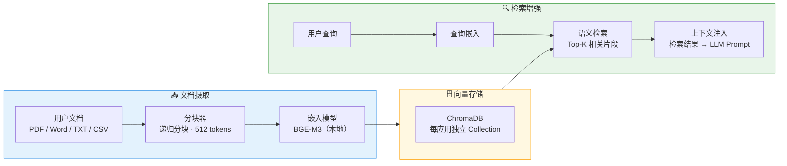

```yaml
rag_engine:
  # 嵌入模型（本地运行，不上传任何数据）
  embedding:
    model: bge-m3                    # 568M 参数，MIT 协议，MTEB 63.0 分
    runtime: ollama                  # 通过 Ollama 统一管理
    dimension: 1024
    fallback: nomic-embed-text       # 更轻量的备选（274M 参数）
  
  # 向量存储
  vector_store:
    engine: chromadb                 # 轻量本地，零配置，纯 Python
    storage: platform/vectors/       # 平台统一管理
    upgrade_path: pgvector           # 未来升级到 PostgreSQL 扩展
  
  # 文档处理
  ingestion:
    supported_formats:
      - pdf                          # PyMuPDF 解析
      - docx                         # python-docx 解析
      - txt, csv, md                 # 原生文本
    chunking:
      strategy: recursive            # 递归分块，保持语义完整
      chunk_size: 512                # tokens
      overlap: 50                    # 跨块重叠，避免截断关键信息
  
  # 安全隔离
  security:
    isolation: per_app               # 每个应用独立 Collection，互不可见
    encryption: aes-256-gcm          # 向量存储加密
    embedding_local_only: true       # 嵌入模型强制本地运行，永不上传文档
  
  # MCP 暴露
  mcp_tools:
    - rag/ingest                     # 摄取文档到应用的知识库
    - rag/query                      # 语义检索
    - rag/list_documents             # 列出已摄取的文档
    - rag/delete                     # 删除知识库内容
```

每个应用自动获得一个隔离的向量 Collection，应用间无法交叉访问。RAG 查询通过 MCP 暴露，外部 AI 工具（如 Claude Desktop）也能搜索 BitEngine 中的私有知识。

### 3.5 协议与集成层

> v7 重写：从"四协议栈"升级为**七层行业标准协议栈**。经 2026 年 3 月技术审查，确认 Agentic 协议生态已形成完整行业标准——Google A2A 成为 Linux Foundation 标准（150+ 企业支持），MCP 新增 Elicitation 能力，OTel GenAI 成为 CNCF 可观测性标准，MQTT 5.0 明确为数据面协议。核心原则：**对外每一层通信都用行业标准协议，自定义实现只存在于内部编排逻辑**。

七层标准协议栈覆盖了从"拿数据"到"看健康"的完整链路。BitEngine 不重复造轮子，零自定义协议。

**协议栈全景（v7）**：

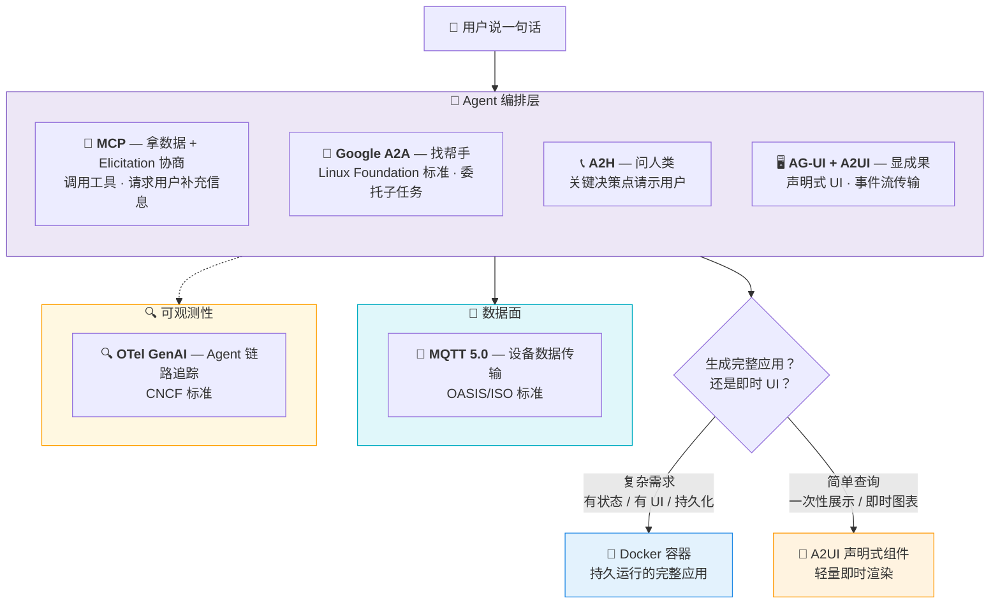

---

**① MCP（Model Context Protocol）— 拿数据的"手"**

> 角色：Agent 的工具调用标准接口。
> 优先级：★★★★★ MVP 必备

MCP 已成为 AI 工具集成的事实标准。BitEngine 同时作为 MCP Client 和 MCP Server 运行：

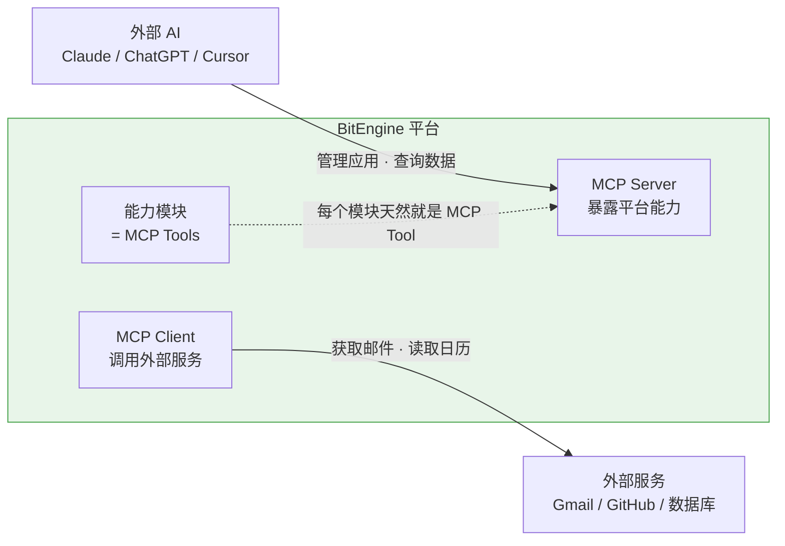

**作为 MCP Server**（暴露平台能力给外部 AI）：

```yaml
mcp_server:
  tools:
    - apps/list              # 列出所有应用
    - apps/{id}/query        # 查询应用数据
    - apps/{id}/action       # 触发应用操作
    - modules/invoke         # 调用能力模块
    - system/status          # 系统状态
  # 每个安装的能力模块自动注册为 MCP Tool
  # 用户装了「图表引擎」→ 外部 AI 也能调用它
  auto_register_modules: true
```

**作为 MCP Client**（让应用调用外部数据源）：

```yaml
mcp_client:
  connections:
    - url: "mcp://gmail.googleapis.com"
      auth: oauth2
    - url: "mcp://github.com"
      auth: pat
    - url: "mcp://local-ollama"
      auth: none
```

核心价值：能力模块 = MCP Tools。用户安装一个"图表引擎"模块，平台上的所有应用能用它，外部的 Claude/ChatGPT 也能调用它。一次安装，全生态可用。

**MCP Elicitation — 标准化的意图协商（v7 新增）**

MCP 2025-06-18 规范新增了 Elicitation 能力——MCP Server 可在工具执行中暂停，通过 Client 向用户请求结构化输入。BitEngine 用 Elicitation 实现意图协商，**无需自建协商协议**：

```yaml
mcp_elicitation:
  # 意图信息不足时，通过 Elicitation 请求补充
  form_mode:                          # 结构化表单
    use_cases:
      - intent_negotiation            # "做电商网站" → 请求补充商品数量、支付需求
      - device_control_confirm        # 高风险设备操作确认
      - workflow_parameters           # 工作流参数收集
    rendering: native_mcp_client      # 任何 MCP 客户端原生渲染，无需自定义 UI
  
  url_mode:                           # 外部 URL 流程
    use_cases:
      - oauth_authorization           # HA/EdgeX 等外部平台 OAuth 授权
      - api_key_collection            # 引导用户在安全页面输入 API Key
    security: url_whitelist           # URL 白名单防钓鱼
```

核心优势：任何 MCP 兼容客户端（Open WebUI、Claude Desktop、移动 App）自动获得意图协商能力，零自定义前端组件。

**MCP 无状态设计前瞻（v7 新增）**

MCP 协议正在向"应用有状态、协议无状态"方向演进（计划 2026-06 新规范）。BitEngine 的 MCP Server 从设计上考虑无状态兼容——业务状态存 PostgreSQL/Redis 不依赖 MCP session，Elicitation 请求-响应设计为可重建状态模式，为 .well-known URL 元数据发现做准备。

---

**② A2H（Agent-to-Human Protocol）— 问人类的"回传"**

> 角色：Agent 在关键决策点回传人类获取审批、收集信息、升级处理。
> 优先级：★★★★★ MVP 必备
> 来源：Twilio 2026年2月发布的开源协议

A2H 定义了五种原子意图，覆盖所有 Agent→人类的通信场景：

| 意图 | 用途 | BitEngine 典型场景 |
|------|------|-------------------|
| `INFORM` | 发通知（即发即忘） | 银行监控发现异常支出，推送告警 |
| `COLLECT` | 收集数据（阻塞等待） | 生成应用时询问"数据源是 CSV 还是 API？" |
| `AUTHORIZE` | 请求授权（带加密证据） | 部署新应用前确认、执行危险操作前审批 |
| `ESCALATE` | 升级处理 | AI 无法理解需求时转交人类 |
| `RESULT` | 返回执行结果 | 应用生成完毕的成功/失败报告 |

**A2H 网关架构**（集成到 BitEngine 的通知中心）：

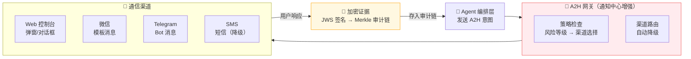

**关键设计：AUTHORIZE 意图与 Merkle 审计链的配合**

```yaml
a2h:
  gateway:
    # 风险等级 → 认证方式
    assurance_levels:
      HIGH:                        # 如：删除应用、部署新应用
        auth: passkey              # WebAuthn / Face ID
        evidence: jws_signed       # JWS 加密签名
        audit: merkle_chain        # 写入审计链
      MEDIUM:                      # 如：修改应用配置
        auth: pin                  # PIN 码确认
        evidence: jws_signed
      LOW:                         # 如：日常通知
        auth: none
        evidence: logged_only
    
    # 渠道降级策略
    channel_fallback:
      primary: web_console         # 优先 Web 控制台
      secondary: wechat            # 然后微信
      tertiary: telegram           # 然后 Telegram
      last_resort: sms             # 最后短信
      timeout: 300s                # 5 分钟无响应自动降级
```

核心价值：每个敏感操作都有加密证据链——谁批准的、什么时候批准的、批准了什么，不可否认、不可篡改。这直接对接我们的 10 层安全模型中的 Merkle 审计链。

---

**③ AG-UI + A2UI — 显成果的"脸面"**

> 角色：AG-UI 是 Agent↔前端的双向运行时协议；A2UI 是声明式 UI 规范。两者互补。
> 优先级：★★★★☆ v1.1 引入
> 来源：AG-UI 由 CopilotKit 开发；A2UI 由 Google 2025年12月发布

BitEngine 当前的设计是 AI 生成完整应用代码（Docker 部署）。引入 AG-UI + A2UI 后，增加一条更轻量的路径——**不是所有需求都需要生成完整应用**。

**三层 Generative UI 模型**：

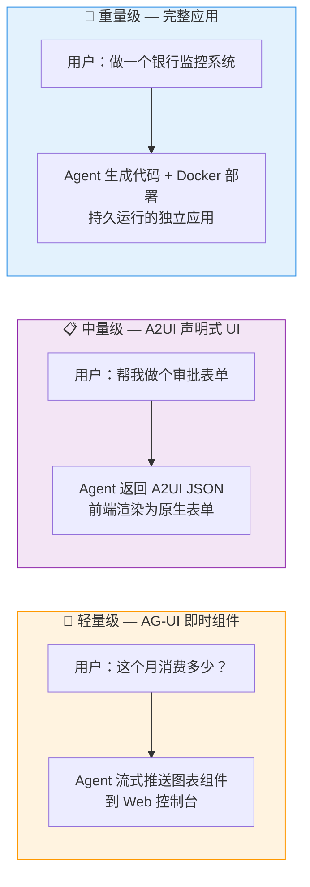

| 模式 | 技术 | 适用场景 | 启动时间 | 持久性 |
|------|------|---------|---------|--------|
| **即时组件** | AG-UI 事件流 | 简单查询、临时图表、状态展示 | 即时 | 不持久 |
| **声明式 UI** | A2UI JSON | 表单、审批界面、配置面板 | 秒级 | 会话内 |
| **完整应用** | Docker 容器 | 复杂系统、有状态、多页面 | 分钟级 | 永久运行 |

**AG-UI 事件类型在 BitEngine 中的应用**：

```yaml
ag_ui:
  events:
    TEXT_MESSAGE_STREAM:           # 流式文本（AI 对话）
      use: agent_chat              # Web 控制台的对话框
    
    TOOL_CALL:                     # 工具调用
      use: show_progress           # 展示 Agent 正在调用哪些模块
      stream_args: true            # 流式展示参数（用户看到 AI 在做什么）
    
    STATE_DELTA:                   # 状态差异更新
      use: live_dashboard          # 应用状态实时更新到桌面
      format: json_patch           # RFC 6902 增量更新
    
    INTERRUPT:                     # 中断等待人类
      use: a2h_bridge              # 转交 A2H 协议处理审批
    
    GENERATIVE_UI:                 # 声明式 UI
      format: a2ui                 # 使用 A2UI JSON 规范
      render: native_components    # 前端用原生组件渲染
      security: declarative_only   # 只接受声明式数据，不执行代码
```

**A2UI 安全优势**：A2UI 是纯声明式 JSON，不是可执行代码。Agent 描述"我想展示一个折线图"，前端决定怎么渲染。这天然就是安全的——即使 Agent 被注入恶意指令，也无法通过 A2UI 执行任意代码。

核心价值："说出需求"→不一定非要等几分钟生成完整应用。简单的查询和展示通过 AG-UI 即时响应，复杂需求再走完整的应用生成流程。用户体验从"等几分钟"变成"大部分即时、少数等几分钟"。

---

**④ A2A（Agent-to-Agent Protocol）— 找帮手的"社交"**

> 角色：Agent 之间的任务委托和协作。
> 优先级：★★★★☆ v1.5 引入（v7 提前：从 v2.0 调整为 v1.5）
> 来源：Google 2025年4月发布，2025年6月捐赠给 Linux Foundation，v0.3 版本已发布
> 生态：150+ 企业支持（AWS、Salesforce、SAP、Atlassian、IBM、Cisco 等）

**v7 关键变更**：A2A 已从"Google 的实验协议"升级为 **Linux Foundation 行业标准**，获得 150+ 企业背书，v0.3 新增 gRPC 支持和安全卡签名。BitEngine 必须对齐——不对齐意味着我们的 Agent 无法与任何外部 A2A 兼容 Agent 互操作。

**核心原则：编排逻辑是我们的护城河，通信协议是标准的。**

A2A 在 BitEngine 中有两个层面的应用：

**层面一：平台内部的多 Agent 协作**

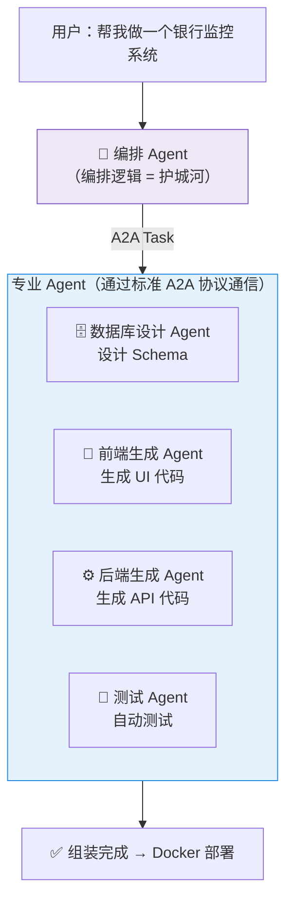

**层面二：与外部 A2A Agent 互操作（v7 新增重点）**

每个 BitEngine Agent 同时发布 A2A Agent Card（`.well-known/agent.json`），使外部 A2A 生态能发现和调用我们的能力：

```yaml
a2a:
  # 平台内部：编排 Agent 委托子任务
  internal:
    enabled: true
    protocol: "google_a2a_v0.3"       # v7: 标准 Google A2A 协议
    agents:
      - db_designer              # 数据库设计
      - frontend_generator       # 前端生成
      - backend_generator        # 后端生成
      - test_runner              # 自动测试
    task_lifecycle:                    # v7: A2A 标准任务生命周期
      states: [submitted, working, input-required, completed, failed, canceled]
      human_in_loop: input-required    # 需要人工输入时挂起任务，转 A2H

  # 对外暴露：A2A Agent Card
  agent_card:
    enabled: true                      # v7: 发布 Agent Card
    endpoint: "/.well-known/agent.json"
    skills:
      - id: app_generation
        description: "Generate, build, and deploy containerized applications"
      - id: data_query
        description: "Query and analyze data with natural language"
      - id: device_control
        description: "Control IoT devices through MCP"
    authentication:
      schemes: ["oauth2"]              # 对齐 A2A v0.3 安全要求
      card_signing: true               # v7: Agent Card 签名验证

  # 跨设备：多 BitEngine 实例协作
  federation:
    enabled: false                     # v2.0 启用
    discovery: mdns + tailscale + a2a_card  # v7: 增加 A2A Agent Card 发现
    auth: "a2a_security_card"          # v7: 使用 A2A 标准安全卡
    capabilities:
      - app_sync                 # 应用配置同步
      - data_backup              # 跨设备备份
      - module_share             # 模块共享
      - task_delegate            # 任务委托
```

核心价值：对齐 A2A 后，BitEngine 的 Agent 不再是孤岛。外部 Salesforce Agent 可以调用我们的代码生成能力，我们的 Orchestrator 可以委派任务给任何 A2A 兼容 Agent，形成开放的 Agent 协作网络。

---

**协议栈总结与优先级（v7 升级：七层标准协议栈）**：

| 层次 | 协议 | 角色比喻 | BitEngine 中的用途 | 标准组织 | 阶段 |
|------|------|---------|-------------------|---------|------|
| Agent ↔ Tool | **MCP** | 🤚 手——拿数据 | 能力模块 = MCP Tools；Elicitation 意图协商；暴露平台给外部 AI | Anthropic | MVP |
| Agent ↔ Human | **A2H** | 📞 回传——问人类 | 应用生成审批、运行时告警、危险操作授权 + Merkle 审计链 | Twilio | MVP |
| Agent ↔ Frontend | **AG-UI + A2UI** | 🖥 脸面——显成果 | 声明式 UI、事件流传输、A2H 确认弹窗渲染 | CopilotKit + Google | v1.1 |
| Agent ↔ Agent | **Google A2A** | 🤝 社交——找帮手 | 内部多 Agent 协作、Agent Card 对外暴露、跨设备联邦 | **Linux Foundation** | **v1.5** |
| Device ↔ Platform | **MQTT 5.0** | 📡 触觉——感知设备 | IoT 设备数据面传输、MCP↔MQTT Bridge | OASIS / ISO | v1.0 |
| 可观测性 | **OTel GenAI** | 🔍 体检——看健康 | Agent 链路追踪、LLM 调用监控、性能指标 | **CNCF** | v1.5 |
| 身份认证 | **OAuth 2.1** | 🔑 身份——证明你 | 统一认证框架、MCP/A2A 授权 | IETF | MVP |

**v7 变更说明**：从 v6 的四协议（MCP + A2H + AG-UI/A2UI + A2A）扩展为七层标准栈。新增三层——MQTT 5.0（数据面）、OTel GenAI（可观测性）、OAuth 2.1（独立为一层）。A2A 从 v2.0 提前到 v1.5（Linux Foundation 标准化加速了采纳时间线）。

---

**⑤ MQTT 5.0 — 设备数据面标准协议（v7 新增）**

> 角色：IoT 设备与平台之间的数据传输标准。
> 优先级：★★★★☆ v1.0 引入
> 来源：OASIS / ISO 标准

MQTT 5.0 作为 BitEngine 的设备数据面协议，与 MCP 控制面形成双协议架构：MCP 负责"调用设备做什么"（控制面），MQTT 5.0 负责"设备报告了什么"（数据面）。

**必须使用 MQTT 5.0 而非 3.1.1**，关键特性价值：

| MQTT 5.0 特性 | 对 BitEngine 的价值 |
|--------------|-------------------|
| User Properties | 消息附加元数据（device_id、provider、priority），媒体管道标记 MIME 类型 |
| Shared Subscriptions | 规则引擎多实例负载均衡，HA 场景必需 |
| Message Expiry | 设备事件自动过期清理，避免处理过时遥测数据 |
| Request/Response | MCP ↔ MQTT Bridge 中控制面操作的标准请求-响应模式 |
| Content Type | 标记 payload 格式（JSON/Protobuf/媒体流），入库管道自动识别 |
| Reason Code | 设备断连原因上报，改善诊断和自愈 |

---

**⑥ OTel GenAI — Agent 可观测性标准（v7 新增）**

> 角色：Agent 执行链路的追踪、指标和日志标准。
> 优先级：★★★☆☆ v1.5 引入
> 来源：CNCF OpenTelemetry GenAI Semantic Conventions

BitEngine 的 Agent 编排涉及多步 LLM 调用、MCP 工具调用、A2A 任务委托。OTel GenAI 提供标准语义规范，让这些操作的追踪数据可被任何 OTel 兼容后端消费（Jaeger、Grafana、Datadog）。

```yaml
observability:
  standard: opentelemetry_genai        # CNCF 标准
  semantic_conventions:
    - gen_ai.request.model             # 使用哪个模型
    - gen_ai.usage.input_tokens        # Token 用量
    - gen_ai.operation.name            # 操作类型（intent_classify / code_gen / ...)
    - agent.step                       # Agent 执行步骤
    - tool.invocation                  # 工具调用详情
  backend:
    v1.0: built_in_dashboard           # 内置简易追踪 UI
    v1.5: otel_collector               # 标准 OTel Collector + 可选外部后端
  value:
    - intent_trace_waterfall           # 意图执行瀑布图
    - llm_cost_monitoring              # 模型调用成本监控
    - agent_performance_metrics        # Agent 性能指标
```

**OpenAI 兼容 API**（保留）：

提供标准的 OpenAI Chat Completions 格式 API，让第三方应用可以接入 BitEngine 的 AI 能力：

```
POST /v1/chat/completions
{
  "model": "bitengine-local",    // 使用本地 Ollama 模型
  "messages": [...]
}
```

### 3.6 Agent 编排层

这是平台的"大脑"，负责理解用户需求并转化为可运行的应用。

**自主应用包（Autonomous App Packs）**（借鉴 OpenFang Hands 概念）

OpenFang 引入了 Hands 概念：不是等用户下指令才行动，而是按计划自主运行、构建知识图谱、定时汇报结果。BitEngine 将这一理念应用到**应用模板**上——不仅是静态代码模板，而是带有运行策略的自主应用包：

```yaml
# 自主应用包定义（APP_PACK.toml）
[pack]
name = "competitor-monitor"
description = "竞品价格监控：每日自动采集、比价分析、异常告警"
category = "business-intelligence"

[schedule]
collect = "0 8 * * *"          # 每天 8:00 采集竞品数据
analyze = "0 9 * * *"          # 每天 9:00 分析价格变动
report  = "0 9 * * 1"          # 每周一 9:00 生成周报

[sop]                           # 标准操作流程（类似 Hands 的 playbook）
phases = [
  "data_collection",            # 阶段1: 从目标网站采集价格
  "data_cleaning",              # 阶段2: 清洗和标准化
  "trend_analysis",             # 阶段3: 趋势分析和异常检测
  "report_generation",          # 阶段4: 生成可视化报告
  "alert_dispatch"              # 阶段5: 触发告警（如果有异常）
]

[alerts]
price_drop_threshold = 10       # 降价超过 10% 触发告警
channel = ["wechat", "email"]

[modules]                       # 依赖的能力模块
required = ["web-scraper", "chart-engine", "notification-hub"]
```

平台内置 5-10 个高质量自主应用包（竞品监控、财务汇总、社媒管理等），用户激活后即开始自主运行。

**Structured Output 约束解码**（v5 新增）

> Agent 编排层的所有 LLM 调用统一使用 JSON Schema 约束输出，将流水线可靠性从 ~85% 提升到 100%。这是 2026 年 LLM 应用的生产标准。

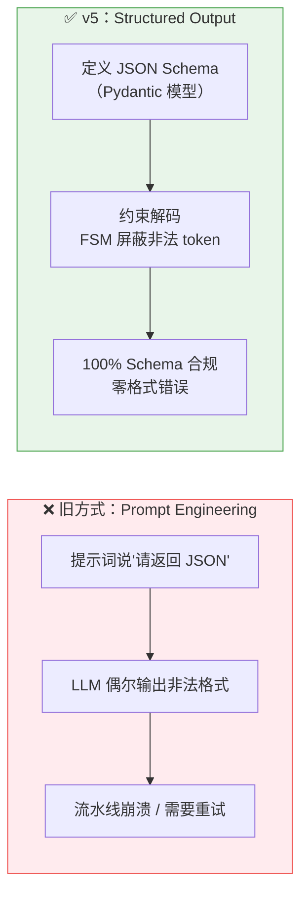

三个关键环节的 Schema 定义：

```yaml
structured_output:
  # 环节 1：意图理解 → 结构化需求
  intent_schema:
    type: json_schema
    fields:
      intent: enum[create_app, modify_app, query_data, delete_app, system_cmd]
      app_name: string
      requirements:
        data_sources: array[{type: string, format: string, description: string}]
        processing: array[{type: string, fields: array, condition: string}]
        display: array[{type: string, charts: array}]
        automation: array[{trigger: string, action: string}]
      response_strategy: enum[full_app, instant_ui, direct_answer]
      confidence: number             # 模型自评信心度
  
  # 环节 2：模块选择 → 模块清单
  module_selection_schema:
    type: json_schema
    fields:
      modules: array[{name: string, version: string, config: object, source: enum[local, edgehub, clawhub, fanghub]}]
      estimated_resources: {cpu_percent: number, memory_mb: number, storage_mb: number}
      deployment_strategy: enum[docker, wasm, hybrid]
      missing_capabilities: array[string]  # AI 无法匹配的需求
  
  # 环节 3：代码审查 → 安全报告（本地 Phi-4-mini 执行）
  code_review_schema:
    type: json_schema
    fields:
      passed: boolean
      issues: array[{severity: enum[critical, warning, info], file: string, line: number, description: string}]
      security_score: number         # 0-100 安全评分
      suggestions: array[string]

  # 工具链
  toolchain:
    python: pydantic                 # Schema 定义和验证
    typescript: zod                  # Web 控制台端 Schema
    local_llm: grammar_decoding      # Ollama / llama.cpp 的 grammar-based 约束
    cloud_llm: native_structured     # OpenAI / Anthropic 的原生 Structured Output
    adapter: litellm                 # 多模型统一接口 + structured output 适配
```

**核心流程**（v5 更新：Structured Output + RAG + 多模型路由）：

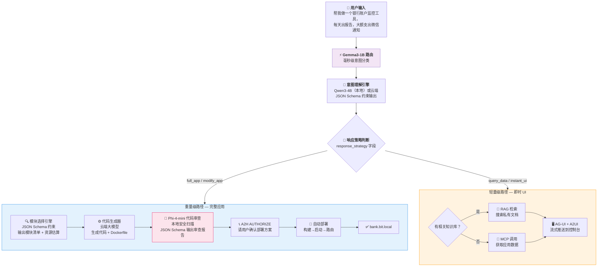

> **v5 核心变更**：
> - 新增 Gemma3-1B 前置路由，毫秒级分流（替代原来由 7B 模型做的分类）
> - 意图理解和模块选择全部使用 JSON Schema 约束输出，零格式错误
> - 重量级路径新增 Phi-4-mini 本地代码审查步骤（部署前自动安全扫描）
> - 轻量级路径新增 RAG 检索分支（可搜索用户私有文档回答问题）

**意图理解引擎的工作方式**（v5 更新：三级模型分工）：

用户的自然语言输入经过三级模型处理：

1. **Gemma3-1B（本地，毫秒级）**：快速分类意图类型（create_app / modify_app / query_data / delete_app / system_cmd），决定响应策略（full_app / instant_ui / direct_answer）
2. **Qwen3-4B（本地，秒级）或云端大模型**：深度理解需求，输出 JSON Schema 约束的结构化描述。32GB 设备上 Qwen3-4B 常驻内存，无需等待加载
3. **所有输出强制 JSON Schema 约束**：无论本地还是云端模型，都使用 Structured Output 确保格式 100% 合规

```json
{
  "intent": "create_app",
  "app_name": "bank-monitor",
  "requirements": {
    "data_sources": [
      {"type": "manual_import", "format": "csv/ofx", "description": "银行账单文件"}
    ],
    "processing": [
      {"type": "aggregation", "fields": ["amount", "category", "date"]},
      {"type": "anomaly_detection", "condition": "amount > 5000"}
    ],
    "display": [
      {"type": "dashboard", "charts": ["monthly_trend", "category_pie", "daily_bar"]},
      {"type": "transaction_table", "sortable": true, "filterable": true}
    ],
    "automation": [
      {"type": "scheduled_report", "frequency": "daily", "time": "08:00"},
      {"type": "alert", "condition": "single_expense > 5000", "channel": "wechat"}
    ]
  }
}
```

**模块选择引擎**：

根据结构化需求，从能力市场匹配合适的模块。匹配算法基于：
1. 模块的功能描述（语义匹配）
2. 模块的输入输出接口（类型兼容性）
3. 模块的评分和使用量（质量信号）
4. 模块间的兼容性记录（历史组合成功率）

如果找不到完全匹配的模块，代码生成器会用 AI 生成缺失的部分。

**迭代更新流程**：

用户说"把月度趋势图改成面积图，再加一个按商户分类的排行榜"：
1. Agent 理解这是对 `bank-monitor` 应用的修改请求
2. 读取当前应用的代码和配置
3. 将修改需求 + 现有代码发送给云端大模型
4. 大模型返回修改后的代码
5. 自动构建新版本的容器镜像
6. 蓝绿部署：先启动新版本，验证正常后切换流量，保留旧版本可回滚

### 3.7 能力市场层

**能力模块规范 (EdgeModule Spec v2)**

> v3 更新：新增 WASM 模块类型、自主运行策略（SOP）、Ed25519 签名、OpenFang HAND.toml 兼容。

每个模块是一个目录，包含以下文件：

```
my-module/
├── MODULE.md              # 模块描述（兼容 SKILL.md + HAND.toml）
├── Dockerfile             # Docker 模块的容器定义
├── module.wasm            # 或：WASM 模块的编译产物（v3 新增）
├── api.yaml               # 接口定义（OpenAPI 3.0 格式）
├── meta.yaml              # 元数据（分类、标签、依赖、权限、签名）
├── sop.yaml               # 可选：自主运行策略（v3 新增，借鉴 Hands）
├── src/                   # 源代码
│   └── ...
├── tests/                 # 测试用例
│   └── ...
└── examples/              # 使用示例
    └── ...
```

**MODULE.md 格式**（同时兼容 OpenClaw SKILL.md 和 OpenFang HAND.toml）：

```markdown
---
name: chart-engine
version: 1.2.0
description: 通用数据可视化引擎，支持折线图、柱状图、饼图、面积图等
author: bitengine-team
license: MIT
tags: [visualization, chart, dashboard]
category: display
signature: "ed25519:abc123..."    # v3 新增：Ed25519 清单签名

# BitEngine 扩展字段
bitengine:
  type: module                    # module | app-template | autonomous-pack
  isolation: wasm                 # v3 新增：docker | wasm
  wasm_fuel: 500_000              # v3 新增：WASM 燃料限制
  resources:
    memory: 10m                   # WASM 模块内存更小
    cpu: 0.1
  ports:
    - 3000/http
  permissions:
    network: internal-only
    filesystem: none              # WASM 模块默认无文件系统
  sop:                            # v3 新增：自主运行策略（借鉴 Hands）
    schedule: "0 */6 * * *"
    phases: [collect, process, report]
    guardrails:
      require_approval: [purchase, delete]
    
# OpenClaw 兼容字段
metadata:
  clawdbot:
    nix: null

# OpenFang 兼容字段（v3 新增）
hand:
  schedule: "0 */6 * * *"
  skills: [web_search, file_read]
---

# Chart Engine

将结构化数据渲染为交互式图表的能力模块。

## 输入

接收 JSON 格式的数据，通过 REST API：

POST /api/render
{
  "type": "line",
  "data": [...],
  "options": {...}
}

## 输出

返回可嵌入的 HTML 图表组件或 PNG/SVG 图片。
```

**api.yaml 接口定义**：

```yaml
openapi: 3.0.0
info:
  title: Chart Engine API
  version: 1.2.0

paths:
  /api/render:
    post:
      summary: 渲染图表
      requestBody:
        content:
          application/json:
            schema:
              type: object
              required: [type, data]
              properties:
                type:
                  type: string
                  enum: [line, bar, pie, area, scatter, heatmap]
                data:
                  type: array
                  items:
                    type: object
                options:
                  type: object
                  properties:
                    title: { type: string }
                    width: { type: integer, default: 800 }
                    height: { type: integer, default: 400 }
      responses:
        '200':
          content:
            text/html:
              description: 可嵌入的交互式图表 HTML
            image/png:
              description: 静态图表图片

  /api/embed/{chart_id}:
    get:
      summary: 获取已渲染图表的嵌入代码
```

**meta.yaml 权限声明**：

```yaml
# 安全沙箱配置
sandbox:
  # 网络权限
  network:
    outbound: none                # none | internal | restricted | full
    allowed_hosts: []             # outbound=restricted 时的白名单
  
  # 文件系统权限
  filesystem:
    data_volume: readwrite        # 自己的数据卷
    shared_volumes: []            # 声明需要访问的共享卷
    host_mount: never             # never | readonly（需要审批）
  
  # 系统权限
  capabilities:
    drop: [ALL]                   # 丢弃所有 Linux capabilities
    add: []                       # 不需要任何额外权限
  
  # 资源限制
  limits:
    memory: 128m
    cpu: 0.25
    pids: 100
    storage: 500m

# 依赖声明
dependencies:
  platform_services:
    - database: optional          # 如果应用需要，平台会注入数据库连接
    - notification: optional      # 如果应用需要通知功能
  modules: []                     # 依赖的其他模块
```

### 3.8 生态适配层

> v3 更新：从仅支持 OpenClaw 扩展为同时支持 OpenClaw + OpenFang 两个生态。

BitEngine 通过统一适配器同时兼容两个主流 Agent 生态，最大化冷启动模块数量。

**双生态适配架构**：

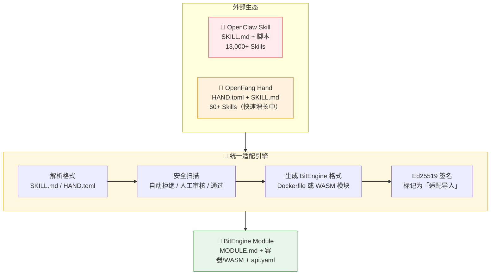

**OpenClaw vs OpenFang 适配差异**：

| 维度 | OpenClaw 适配 | OpenFang 适配 |
|------|-------------|---------------|
| 源格式 | SKILL.md + 脚本 | HAND.toml + SKILL.md + 多阶段 SOP |
| 安全风险 | 高（共享宿主环境执行） | 中（已有 WASM 沙箱设计） |
| 转换目标 | Docker 容器（多数需容器化） | WASM 模块（部分可直接复用沙箱逻辑） |
| 生态规模 | 13,000+ Skills | 60+，快速增长 |
| 附加价值 | 量大，覆盖面广 | 质高，带自主运行策略（SOP） |

**OpenFang HAND.toml 适配**：

OpenFang 的 Hands 不仅包含功能代码，还包含**多阶段运行策略（SOP）**。适配时保留这些策略，转换为 BitEngine 的自主应用包格式：

```yaml
# OpenFang HAND.toml 关键字段 → BitEngine 映射
hand:
  name: researcher              # → MODULE.md name
  description: "..."            # → MODULE.md description
  schedule: "0 6 * * *"         # → BitEngine cron 调度配置
  system_prompt: "..."          # → 运行策略文件 sop.yaml
  skills: [web_search, ...]     # → 依赖模块列表
  settings:                     # → 应用配置 config.yaml
    max_sources: 10
    output_format: markdown
  guardrails:                   # → 权限声明 meta.yaml
    require_approval: [purchase]
```

**安全转换策略**（适用于两个生态）：

| 原始操作 | BitEngine 安全替代 |
|---------|-------------------|
| 执行 shell 命令 | 容器内执行，不暴露宿主 |
| 直接读写文件系统 | 限制在数据卷内 |
| 访问用户凭证 | 通过平台密钥保险库 API（用后零化） |
| 发送网络请求 | 通过平台网络代理，域名白名单 |
| 安装系统包 | Dockerfile 预安装 或 WASM 无需安装 |
| 自主运行（Hands） | 转换为 BitEngine cron + SOP 配置 |

**适配器的安全扫描规则**：

```yaml
security_scan:
  # 自动拒绝
  auto_reject:
    - pattern: "curl.*|.*>>.*\\.ssh"         # SSH 密钥操纵
    - pattern: "nc\\s+-l|ncat|socat"         # 反向 shell
    - pattern: "base64.*decode.*\\|.*sh"      # 编码后的命令执行
    - pattern: "/etc/passwd|/etc/shadow"      # 系统文件访问
    - pattern: "eval\\(.*fetch\\("           # 远程代码加载
  
  # 需要人工审核
  manual_review:
    - pattern: "requests\\.post|fetch\\("    # 外部网络请求
    - pattern: "os\\.system|subprocess"       # 系统命令调用
    - pattern: "open\\(.*,'w'\\)"            # 文件写入
  
  # 自动通过
  auto_approve:
    - pure_markdown: true                     # 纯 Markdown 说明
    - api_only: true                          # 只定义 API 接口
    - wasm_sandboxed: true                    # 已经是 WASM 沙箱格式
```

**批量导入工具**：

```bash
# 从 ClawHub 导入（OpenClaw 生态）
bitengine import clawhub --category "productivity" --min-stars 10

# 从 FangHub 导入（OpenFang 生态）
bitengine import fanghub --category "research" --include-sop

# 导入特定模块
bitengine import clawhub --skill "notion-integration"
bitengine import fanghub --hand "researcher"

# 导入时自动安全扫描，分为三类：
# ✅ auto-approved: 直接可用
# ⚠️ needs-review: 需要人工检查后才能发布
# ❌ rejected: 自动拒绝（检测到危险操作）
```

---

## 四、安全模型

### 4.1 十层纵深防御架构

> v3 更新：从 7 层扩展到 10 层，整合 OpenFang 的污点追踪、清单签名、Merkle 审计、提示注入扫描等理念。

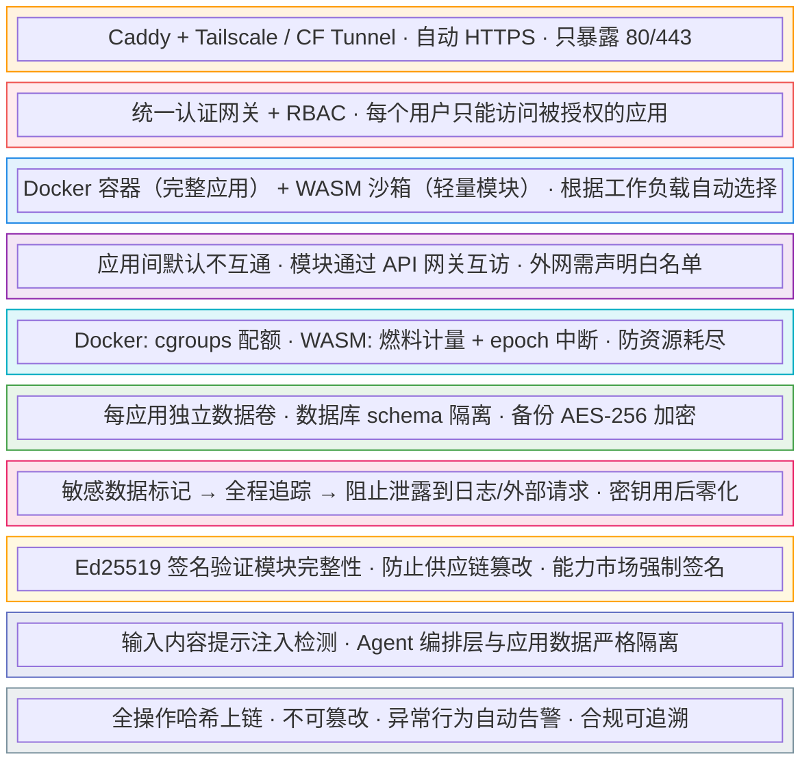

> ★ 标记为 v3 新增层，借鉴 OpenFang 的安全架构。

**新增安全机制详解**：

**污点追踪（Taint Tracking）**

```yaml
taint_tracking:
  # 被标记为敏感的数据类型
  sensitive_types:
    - api_keys            # API 密钥
    - credentials         # 用户凭证
    - financial_data      # 金融交易数据
    - pii                 # 个人身份信息
  
  # 追踪策略
  policy:
    log_output: block     # 禁止敏感数据写入日志
    network_output: block # 禁止敏感数据发送到外部
    cross_app: block      # 禁止敏感数据跨应用流动
    cloud_api: sanitize   # 发往云端 AI 前自动脱敏
  
  # 密钥零化
  secret_zeroization:
    on_expiry: immediate          # 过期后立即擦除
    on_process_exit: immediate    # 进程退出时擦除
    memory_overwrite: 3_passes    # 内存覆写三次
```

**清单签名（Manifest Signing）**

```yaml
manifest_signing:
  algorithm: Ed25519
  
  # 发布到 EdgeHub 的模块必须签名
  publish:
    required: true
    key_source: developer_keypair
    
  # 安装时验证签名
  install:
    verify: always
    trusted_keys:
      - bitengine-official     # 官方模块的公钥
      - community-verified     # 社区审核通过的公钥
    untrusted_policy: warn_and_confirm  # 未签名模块需用户确认
```

**Merkle 审计链**

```yaml
audit_chain:
  storage: sqlite           # 审计链本地存储
  hash: sha256
  
  # 记录的事件类型
  events:
    - app_created           # 应用创建
    - app_modified          # 应用修改
    - module_installed      # 模块安装
    - module_executed       # 模块执行
    - config_changed        # 配置变更
    - auth_event            # 认证事件
    - network_access        # 外部网络访问
  
  # 防篡改：每条记录包含前一条的哈希
  chain:
    type: merkle_tree
    tamper_detection: true
    alert_on_break: true    # 链条断裂时告警
```

### 4.2 AI 相关的特殊安全考虑

**提示注入防护**：
- Agent 编排层和应用运行层严格分离
- 应用内的数据不会流入 Agent 的 prompt
- Agent 只处理用户直接输入的需求描述
- 云端 API 调用只传递脱敏后的需求描述，不传递业务数据
- 专用提示注入扫描器检测用户输入中的恶意指令（借鉴 OpenFang）

**AI 生成代码的安全审查**（v5 新增）：
- 云端大模型生成的代码，在部署前由本地 Phi-4-mini 自动进行安全审查
- 审查结果通过 JSON Schema 约束输出，包含 security_score（0-100）和分级 issues
- critical 级别 issue 自动阻断部署，warning 级别需用户通过 A2H AUTHORIZE 确认
- 审查项包括：硬编码密钥检测、SQL 注入风险、XSS 漏洞、未授权网络访问、危险系统调用
- 本地模型执行审查，生成代码不上传到任何外部服务

**RAG 知识库隔离**（v5 新增）：
- 每个应用的向量 Collection 严格隔离，应用 A 无法检索应用 B 的文档
- 嵌入模型（BGE-M3）强制本地运行，用户文档永不离开设备
- 向量存储加密（AES-256-GCM），防止文件系统级别的泄露
- RAG 查询结果经过脱敏过滤后才注入 LLM prompt，防止敏感信息通过 AI 回答泄露

**Structured Output 安全收益**（v5 新增）：
- JSON Schema 约束消除了 LLM 输出解析失败导致的异常路径（常见的提示注入攻击向量）
- 模型无法在结构化输出中"夹带"非预期字段，降低间接提示注入风险

**模块供应链安全**：
- 所有模块发布前经过自动安全扫描
- Ed25519 清单签名验证模块完整性
- 模块的行为被容器/WASM 沙箱约束
- 模块的网络访问被监控和限制
- 模块更新需要安全扫描通过后才会部署

**新协议攻击面防护（v7 新增）**：

v7 新增的三个协议层（A2A、AG-UI/A2UI、MCP Elicitation）带来新的攻击面，安全架构必须覆盖：

| 新协议面 | 威胁模型 | 防护措施 |
|---------|---------|---------|
| Google A2A | 外部 Agent 伪造身份；恶意任务注入；Agent Card 欺骗 | A2A Agent Card 签名验证（v0.3 安全卡）；外部 Agent 信任等级分层（可信/半可信/不可信）；A2A 任务纳入 Merkle 审计链 |
| A2UI 声明式 UI | 恶意组件类型注入；通过 UI 描述诱导用户操作 | **可信组件目录**（Trusted Component Catalog）——只允许渲染目录中已注册的组件类型；A2UI JSON Schema 强制校验 |
| MCP Elicitation | 钓鱼式 Elicitation（精心构造表单诱导敏感信息）；恶意 URL mode 重定向 | Elicitation 请求来源验证（只允许已授权 MCP Server 发起）；URL mode 白名单机制；敏感字段标记与审计 |
| AG-UI 事件流 | 事件注入/篡改；伪造 Agent 状态更新 | AG-UI 事件流完整性校验；与 OAuth 2.1 token 绑定 |
| **跨协议攻击** | 外部 A2A Agent 试图绕过 A2H 审批 | **核心规则：所有外部来源的执行请求，无论通过 MCP、A2A 还是 REST API 进入，都必须经过 Governance Agent 的风险评估和 A2H 审批** |

这不是修改安全护城河，而是把护城河的防线延伸到新的协议边界。A2UI 的声明式设计本身就是安全优势——Agent 只能引用可信组件目录中的组件类型，不能注入可执行代码。

---

## 五、用户体验流程

### 5.1 首次安装（目标：15 分钟内完成）

```bash
# 一行命令安装
curl -fsSL https://bitengine.io/install.sh | bash

# 安装脚本自动完成：
# 1. 检测系统环境（CPU架构、内存、存储、Docker是否已安装）
# 2. 安装 Docker（如果没有）
# 3. 拉取 BitEngine 核心镜像
# 4. 启动平台服务（Caddy + Auth + Console）
# 5. 生成管理员账户和初始密码
# 6. 输出访问地址

# ✅ 安装完成
# 访问控制台: http://192.168.1.100:8080
# 管理员账号: admin
# 初始密码: xxxx-xxxx-xxxx
```

### 5.2 日常使用场景

> v4 更新：所有场景标注协议交互，展示四协议在实际使用中如何协同。

**场景 A：通过 Web 控制台创建应用（重量级路径 — v5 更新）**

```
用户打开 console.bit.local
  → 看到应用桌面（已安装的应用图标 + "创建新应用"按钮）
  → 点击"创建新应用"
  → 出现 AI 对话框
  → 输入："我需要一个员工请假审批系统，支持提交请假、主管审批、余额查看"

  [Gemma3-1B 路由]              毫秒级分类 → create_app, response_strategy: full_app
  [Qwen3-4B 意图理解]           JSON Schema 约束输出结构化需求
  [AG-UI TEXT_MESSAGE_STREAM]   AI 流式回复分析结果
  [AG-UI TOOL_CALL stream]      实时展示 Agent 在做什么（选模块、生成代码...）

  → AI 展示部署方案：3 个模块 + 预计资源消耗（JSON Schema 约束）

  [A2H AUTHORIZE · HIGH]        弹出确认对话框，需用户明确批准部署
  → 用户点击"确认部署"（WebAuthn / 指纹）
  [A2H 加密证据 → Merkle 审计链]  记录谁批准了什么

  [云端大模型生成代码]
  [Phi-4-mini 代码安全审查]     → security_score: 95/100, 0 issues
  [AG-UI STATE_DELTA]           部署进度实时更新到控制台
  → 2-3 分钟后，新应用图标出现在桌面上（安全评分 95/100）
  → 点击进入应用，开始使用
```

**场景 B：简单查询（轻量级路径 — v4 新增）**

```
用户在控制台 AI 对话框中：
  "这个月消费了多少钱？按分类看看"

  [MCP Client]                Agent 调用银行监控应用的 MCP 接口拉取数据
  [AG-UI GENERATIVE_UI]       Agent 返回 A2UI 声明式图表（饼图 + 数据表格）
  → 图表直接渲染在对话框下方，无需等待、无需启动新容器

  "和上个月相比呢？"

  [MCP Client]                拉取上月数据
  [AG-UI STATE_DELTA]         增量更新图表，叠加对比柱状图
  → 图表平滑过渡，增加对比视图

  整个过程 < 3 秒，没有启动任何新容器。
```

**场景 B2：搜索私有文档（RAG 路径 — v5 新增）**

```
用户在控制台 AI 对话框中：
  "去年在教育上总共花了多少钱？合同里有没有提到退款条款？"

  [Gemma3-1B 路由]            判断为 query_data 意图，需要 RAG
  [BGE-M3 嵌入]               将查询向量化
  [ChromaDB 检索]             在银行监控应用的向量 Collection 中搜索
                              命中：银行对账单 PDF (3 个片段) + 教育合同 Word (2 个片段)
  [Qwen3-4B 推理]             本地模型综合检索结果生成回答
  [AG-UI GENERATIVE_UI]       流式输出结构化回答 + 来源引用

  AI 回复：
  "根据您的银行对账单，去年教育类支出共计 ¥45,280：
   · 培训课程: ¥28,000（3 月、9 月各一笔）
   · 书籍教材: ¥3,280（分 6 笔）
   · 考试报名: ¥14,000（5 月、11 月）

   关于退款条款：在您上传的教育服务合同中，第 7.3 条
   规定 '开课前 15 日可全额退款，开课后按剩余课时比例退还'。
   📎 来源：教育服务合同.docx (第 12 页)"

  整个过程 < 5 秒，数据完全未离开设备。
```

**场景 C：通过聊天桥接管理（A2H 多渠道）**

```
[A2H INFORM · 定时触发]
银行监控应用每天 8:00 通过 A2H 网关推送日报：

A2H 网关渠道路由：
  → 尝试 Web 控制台推送 → 用户未在线
  → 降级到微信模板消息 → 送达成功 ✅

微信消息：
  "📊 银行监控日报 (3/2)
   昨日支出: ¥2,380
   异常: 无
   月度累计: ¥18,500 (预算 75%)
   → 点击查看详情"

用户在微信中回复：
  "最近有没有大额支出？"

Bot 回复（通过 MCP 查询应用数据）：
  "过去 7 天有 3 笔超过 ¥5,000：
   · 3/1 京东 ¥6,280（电子产品）
   · 2/28 携程 ¥8,500（机票）
   · 2/26 物业 ¥5,200（季度物业费）
   详情: bank.bit.local"
```

**场景 D：危险操作审批（A2H AUTHORIZE）**

```
用户在控制台中：
  "删除 CRM 系统应用"

  [A2H AUTHORIZE · HIGH]
  → 控制台弹出安全确认框：
    ⚠️ 即将永久删除应用「CRM 系统」
    · 包含 1,247 条客户记录
    · 最后备份: 2 小时前
    [取消] [确认删除 — 需验证身份]

  → 用户点击确认 → WebAuthn 指纹验证
  [A2H JWS 签名证据]
    who: admin@bit.local
    what: delete_app(crm-system)
    when: 2026-03-02T15:30:00Z
    evidence: JWS(Ed25519, payload_hash)
  [→ Merkle 审计链 #4571]

  → 应用删除完成，审计记录永久保留
```

**场景 E：修改已有应用（含代码安全审查 — v5 更新）**

```
用户在控制台的 AI 对话框中：
  "给请假系统加一个功能：如果请假超过 3 天，需要总监二次审批"
  
  [Gemma3-1B 路由]            → modify_app 意图
  [AG-UI TEXT_MESSAGE_STREAM]
  AI 流式回复（Structured Output 约束）：
    "我理解你需要添加多级审批逻辑。修改计划：
     1. 在审批流中添加天数判断条件
     2. 超过 3 天的申请自动转给总监
     3. 总监审批界面增加'请假天数>3天'的标签
     预计修改 3 个文件，需要约 1 分钟。"

  [A2H AUTHORIZE · MEDIUM]  确认修改方案（PIN 码）
  用户："继续"
  
  [云端模型生成代码修改]
  [Phi-4-mini 本地代码审查]   → security_score: 92, issues: 0 critical, 1 info
                              → info: "建议对'天数'参数添加输入验证"
  
  [AG-UI STATE_DELTA]  实时展示修改进度
  AI：
    "✅ 修改已完成并部署（安全评分 92/100）。
     旧版本已保留，如需回滚请说'回滚请假系统'。"
```

### 5.3 应用桌面界面概念

> v5 更新：新增知识库面板、模型状态指示器，轻量查询支持 RAG 文档搜索。

| | 🏦 银行监控 | 📋 项目看板 | 💰 记账工具 | 👥 CRM 系统 | 📊 数据看板 |
|---|:---:|:---:|:---:|:---:|:---:|
| **状态** | 🟢 运行中 | 🟢 运行中 | 🟢 运行中 | ⚪ 已停止 | 🟢 运行中 |
| **知识库** | 📄 12 文档 | 📄 3 文档 | — | — | 📄 7 文档 |

> **➕ 创建应用** &nbsp;&nbsp;|&nbsp;&nbsp; 💬 *有什么需要？输入你的想法...* &nbsp;&nbsp;|&nbsp;&nbsp; 📎 *上传文档到知识库*

| 📊 即时面板（AG-UI） | |
|---|---|
| 今日消费 | ¥2,380 · 环比 -12% · 📈 [即时趋势图] |
| 项目进度 | Sprint 3: 72% · 🔴 2个阻塞 |

| 系统状态 | |
|---|---|
| CPU / 内存 / 存储 | 23% · 14.2/32GB · 28/128GB |
| 运行中 | 4 个应用 · 6 个模块 · 上次备份: 今天 03:00 |
| 本地模型 | Gemma3-1B ✅ · BGE-M3 ✅ · Qwen3-4B ✅ · Phi4-mini ✅ · Qwen2.5-7B ✅ |
| 协议状态 | MCP ✅ · A2H ✅ · AG-UI ✅ · A2A ⚪（未启用） |
| RAG 引擎 | ChromaDB ✅ · 22 文档 · 1,847 向量 |

---

## 六、技术选型

| 组件 | 选型 | 理由 |
|------|------|------|
| 平台核心 | Go | 单二进制分发、低资源占用、跨平台编译 |
| Web 管理桌面 | React + Vite | 生态成熟、组件丰富 |
| 容器运行时 | Docker (API) | 完整应用隔离，最广泛部署的容器运行时 |
| WASM 运行时 | Wazero (Go 原生) | 轻量模块沙箱，纯 Go 实现、无 CGo 依赖、燃料计量支持 |
| 反向代理 | Caddy | 自动 HTTPS、配置简洁、API 驱动 |
| 默认数据库 | SQLite + PostgreSQL | SQLite 零配置适合小应用，PG 适合复杂场景 + 跨应用数据统一 |
| 事件总线 | Redis (Pub/Sub) | 跨中心事件通信、轻量高效（v6 新增） |
| MQTT Broker | Mosquitto（**MQTT 5.0**） | IoT 设备数据面代理，v7 明确 5.0 版本（User Properties / Shared Subscriptions / Message Expiry）|
| Zigbee 桥接 | zigbee2mqtt | Zigbee 设备转 MQTT，社区生态丰富（v6 新增） |
| 本地 AI 运行时 | Ollama（多模型并行） | 最成熟的本地 LLM 运行时，支持同时加载多模型 |
| 本地路由模型 | Gemma 3 1B | 529MB 极速分类，32GB 设备常驻 |
| 本地推理模型 | Qwen3-4B | 推理能力匹敌 72B，32GB 设备常驻 |
| 本地代码审查 | Phi-4-mini (3.8B) | 微软出品代码能力强，生成代码本地安全扫描 |
| 本地嵌入模型 | BGE-M3 (568M) | MIT 协议，MTEB 63.0 分，RAG 检索用 |
| 向量数据库 | ChromaDB → pgvector | ChromaDB 零配置起步，后续升级 pgvector |
| 结构化输出 | Pydantic + Zod + liteLLM | Schema 定义→约束解码→多模型适配 |
| 浏览器端 AI | WebLLM + WebGPU | 浏览器内运行 SLM，零延迟即时组件（v1.1） |
| 远程访问 | Tailscale / CF Tunnel | 零配置、安全的内网穿透（v6：升级为 v1.0 必须） |
| 备份引擎 | 自建 (Go + tar + AES-256-GCM) | 加密备份 + 快照 + 定时调度（v6 新增） |
| 系统监控 | 自建 (Go + Docker stats API) | 资源仪表盘 + 健康检查 + 智能告警（v6 新增） |
| 模块注册表 | 自建 (Go API + SQLite) | 轻量、可自托管 |
| 密钥保险库 | AES-256-GCM + 内存零化 | 凭证加密存储，用后从内存擦除 |
| 审计存储 | SQLite + Merkle 哈希链 | 本地不可篡改审计日志 |
| 清单签名 | Ed25519 | 模块完整性验证，轻量高速 |
| 协议支持 | MCP + A2H + AG-UI/A2UI + A2A + MQTT 5.0 + OTel GenAI + OAuth 2.1 | 七层标准协议栈，零自定义协议（v7 升级） |
| Agent→人类通信 | A2H（Twilio 开源） | 渠道无关、加密证据、与 Merkle 审计链集成 |
| Agent→前端渲染 | AG-UI + A2UI | AG-UI 事件流传输 + A2UI 声明式 UI（安全，非可执行代码） |
| Agent→Agent 协作 | A2A（Google → **Linux Foundation** 标准） | v7 升级：v0.3 + 150+ 企业，Agent Card 对外暴露 + 跨设备联邦 |
| Agent 可观测性 | **OTel GenAI**（CNCF 标准） | v7 新增：Agent 链路追踪 + LLM 调用监控，兼容 Jaeger/Grafana |
| 数据面协议 | **MQTT 5.0**（OASIS / ISO 标准） | v7 明确：设备数据传输标准，与 MCP 控制面形成双协议架构 |
| AI 生成的应用默认技术栈 | Python (Flask) + SQLite + HTML/JS | AI 生成质量最高的组合 |
| 数据中心：时序存储 | SQLite timeseries → TimescaleDB | 轻量起步，可升级到专业时序库（v6 新增） |
| 数据中心：数据管道 | 内置 ETL（Go 实现） | 应用数据自动同步到数据湖（v6 新增） |
| IoT 中心：设备接入核心 | MCP Client（原生） | MCP-first 架构，设备提供 MCP Server 即零配置接入（v6.1 新增） |
| IoT 中心：MQTT 桥接 | Mosquitto（**MQTT 5.0**）+ MCP over MQTT | 传统 MQTT 设备通过桥接器接入 MCP 统一模型，v7 明确 5.0（v6 新增） |
| IoT 中心：Zigbee 桥接 | Zigbee2MQTT → MCP 桥接 | 社区最成熟的 Zigbee 方案 + MCP 适配（v6 新增） |
| IoT 中心：规则引擎 | 内置（Go 实现） | YAML 规则定义，AI 可自动生成（v6 新增） |
| 平台底座：备份 | zstd 压缩 + 增量快照 | 应用数据 + 配置 + 知识库全量覆盖（v6 新增） |
| 平台底座：监控 | 内置资源采集器（Go） | CPU / 内存 / 磁盘 / 网络 + 应用健康检查（v6 新增） |

---

## 七、MVP 范围定义

> v6 更新：从"单一应用平台"重新划定为"三中心 + 底座"的分阶段交付计划。

### MVP 必须有（首次发布）

> MVP 聚焦：**应用中心完整体验 + 平台底座基础 + 数据中心精简版**

**应用中心（核心）**：

1. ✅ 一行命令安装脚本（单二进制 + Docker）
2. ✅ Web 管理桌面（应用桌面 + 系统状态 + AI 对话）
3. ✅ AI 对话生成应用（连接云端大模型）
4. ✅ 应用自动 Docker 容器化部署
5. ✅ 5 个内置应用模板（项目看板、记账、CRM、表单、数据看板）
6. ✅ 应用启停/删除/日志查看
7. ✅ Ed25519 模块签名验证
8. ✅ MCP 协议集成（平台作为 MCP Server + Client）
9. ✅ MCP Elicitation 意图协商（v7 新增：复杂意图通过 MCP 标准机制请求补充信息）
10. ✅ A2H 基础集成（AUTHORIZE + INFORM 意图，Web 控制台渠道）
10. ✅ Structured Output 约束解码（所有 LLM 调用使用 JSON Schema）
11. ✅ 全量本地模型组合（Gemma3-1B + BGE-M3 + Qwen3-4B + Phi-4-mini + Qwen2.5-7B，32GB 设备常驻）
12. ✅ 云端代码生成多模型支持（Claude Sonnet / DeepSeek / GPT-4.1，用户自选）

**数据中心（精简版）**：

13. ✅ 文件管理器（浏览和管理本地文件，上传/下载）

**平台底座（基础保障）**：

14. ✅ 自动 HTTPS（Caddy 反向代理，所有应用默认加密）
15. ✅ 自动定时备份（每日备份 + 应用快照）
16. ✅ 资源监控仪表盘 + 应用健康检查 + 自动重启
17. ✅ 容器沙箱隔离（Docker namespace + cgroups）
18. ✅ 引导式首次上手流程（Step-by-step 安装向导）

### v1.0 应该有（MVP 后 1-2 个版本）

> v1.0 补全：**数据中心完整版 + IoT 中心基础版 + 底座扩展**

**数据中心完整版**：

1. 本地 RAG 引擎（ChromaDB + BGE-M3，每应用隔离 + 全局共享向量 Collection）
2. Phi-4-mini 本地代码安全审查（生成代码部署前自动扫描）
3. 跨应用数据统一查询和可视化
4. 自然语言数据查询（"上季度花销最高的三个类目？"）
5. 数据管道（定时采集 + 清洗 + 归档）
6. 数据导出（CSV / JSON / API）

**IoT 中心基础版（MCP-first）**：

7. MCP 设备自动发现与即插即用接入（IoT 中心核心能力）
8. MQTT 5.0 → MCP 桥接器（Mosquitto Broker + MCP over MQTT 5.0）（v7：明确 5.0 版本）
9. Zigbee → MCP 桥接器（zigbee2mqtt + MCP 适配）
10. 统一设备注册表（所有设备归一化为 MCP tools/resources 模型）
11. AI 自动化规则引擎（自然语言创建规则，直接调用设备 MCP tools）
12. 传感器数据自动流入数据中心
13. 设备告警 → A2H 多渠道通知

**平台底座扩展**：

13. 内网穿透 / 远程访问（Tailscale 集成）
14. 多用户 + RBAC 权限控制
15. 通知中心（A2H 多渠道：微信 / Telegram / 邮件 / Webhook）
16. 应用级共享（公开链接、密码保护）
17. 审计日志强化（IoT + 数据中心事件纳入审计链）

**应用中心扩展**：

18. 应用迭代更新（AI 修改已有应用）
19. OpenClaw Skills 适配导入
20. OpenFang HAND.toml 适配导入
21. 定时任务和自动化
22. WASM 沙箱轻量模块支持
23. AG-UI 事件流（流式对话 + 进度展示）
24. A2UI 声明式即时 UI（轻量查询无需生成完整应用）

**移动端**：

25. 移动端 App（至少 PWA）— 远程查看应用/数据/设备状态，接收告警

### v1.5 协议对齐（v7 新增阶段）

> v1.5 聚焦：**七层标准协议栈完整落地**

**协议标准化**：

1. Google A2A 协议采纳（Agent Card 发布 + A2A Task 生命周期 + 标准通信）
2. A2A 内部多 Agent 协作（编排 Agent 委托子任务，标准 A2A 协议通信）
3. OTel GenAI 可观测性基础（Agent 链路标准 span + 内置追踪 UI）
4. MCP 无状态设计对齐（为 2026-06 新规范做准备）

### v2.0 可以后做（生态建设阶段）

**平台扩展**：

1. 能力模块规范和市场（EdgeHub）
2. 第三方模块发布 + 开发者分成
3. SSO 单点登录（OIDC / SAML）
4. 异地备份（S3 兼容 / 另一台 BitEngine / NAS）
5. Anti-DDoS / Anti-Bot（Cosmos Cloud Smart-Shield 参考）
6. 多网络模式（Wi-Fi / 有线 / 4G Cellular 自动切换）

**IoT 扩展**：

7. 计算机视觉模块（摄像头接入 + 本地物体检测）
8. MCP 桥接器市场（社区贡献的传统设备→MCP 桥接器，一键安装）
9. 工业协议 MCP 桥接（Modbus / BACnet → MCP）
10. 设备固件 OTA 更新（通过 MCP tool 触发）

**AI 扩展**：

10. A2A 跨设备联邦（多 BitEngine 实例组网，基于 v1.5 的 A2A 基础）
11. OTel GenAI 深化（OTel Collector + 外部后端集成 + 仪表盘模板）
12. Agentic RAG（LLM 主动规划多步检索策略）
13. Governance Agent（用 AI 监控 AI 行为合规）
14. WebLLM 浏览器端推理（Gemma3-1B in browser + AG-UI 即时组件）

**生态扩展**：

15. 多设备同步（跨 BitEngine 实例数据同步）
16. 聊天桥接（WhatsApp / Telegram / 微信 Bot）
**企业版功能（DD-09）**：

17. 多租户隔离（Organization → Workspace 部门级隔离，数据/应用/IoT 按 Workspace 互不可见）
18. 分离部署拓扑（Platform + Data + AI + Worker 多节点部署，deploy.yaml 控制）
19. Worker 节点调度（远程 Docker Host，最少负载/装箱/亲和三种策略）
20. 高可用（Active-Standby 双 Platform 节点，PostgreSQL 主从，Redis Sentinel，RTO < 30s）
21. GPU 推理节点（Ollama 卸载到独立 GPU 服务器，路由模型留 Platform 本机）
22. 合规增强（数据驻留策略、GDPR 数据删除权、合规报告导出）
23. 企业版授权管理（Ed25519 签名 License，功能门控，社区版/团队版/企业版三级）

---

## 八、与前序分析的整合

本文档是以下讨论的技术落地方案：

1. **AI 生成软件的形态**：BitEngine 将 AI 生成的 Web 应用部署为本地容器化服务，解决了"生成之后如何部署和管理"的问题。

2. **个人 PaaS 的终极形态**：BitEngine 就是个人 PaaS 的一个具体实现路径——应用桌面 + 容器运行时 + AI 生成引擎 + 能力市场。

3. **本地智能网关**：BitEngine 的软件架构可以跑在任何 Linux 设备上，包括家庭网关。当硬件准备好时，这套软件就是网关上的"操作系统"。

4. **数据安全**：Docker + WASM 双层隔离 + 10 层纵深防御 + 污点追踪 + Merkle 审计链 + A2H 加密证据 + 本地代码安全审查（v5），从架构层面解决数据安全和合规问题。

5. **OpenClaw 生态融合**：通过 Skills 适配层兼容 OpenClaw 的 13,000+ Skills 生态，获取冷启动的社区杠杆，但用更安全的架构重新实现运行时。

6. **OpenFang 架构借鉴**：吸收 OpenFang 的 WASM 沙箱隔离、Hands 自主运行理念、16 层安全体系设计，同时兼容其 HAND.toml 格式以扩大生态覆盖。BitEngine 不与 OpenFang 竞争（它是 Agent 平台），而是在"应用平台"赛道上整合两个生态的优势。

7. **AI Agent 协议栈（v4 → v7 升级）**：从四协议标准栈升级为**七层行业标准协议栈**——MCP（拿数据 + Elicitation 协商）+ A2H（问人类）+ AG-UI/A2UI（显成果）+ A2A（找帮手，Linux Foundation 标准）+ MQTT 5.0（设备数据面）+ OTel GenAI（可观测性）+ OAuth 2.1（身份认证）。核心原则：**对外每一层通信都用行业标准协议，自定义实现只存在于内部编排逻辑**。零自定义协议——竞争壁垒在于编排逻辑的深度（意图分解、方案优选、质量评估），而非协议的私有性。

8. **AI 技术调研整合（v5）**：基于 2026 年 AI 领域六大技术方向的系统调研，引入 Structured Output 约束解码、本地 RAG 引擎、SLM 多模型矩阵、竞争定位验证等关键优化。

9. **三中心 + 底座架构（v6 新增）**：基于边缘智能平台功能全景分析，产品从"AI 应用平台"升级为"私人边缘智能平台"。核心变更：

   - **三中心架构**：应用中心（AI 造工具）+ 数据中心（管信息）+ 物联网中心（控设备），在统一管理桌面上深度打通。三者之间数据流动——IoT 传感器数据自动流入数据中心，数据异常触发应用中心告警，用户一句话可同时创建应用、连接数据源、配置 IoT 规则。

   - **平台底座层**：安全 / 网络 / 备份 / 监控 / 身份 / 通知六大基础设施模块，补齐了 v5 在安全（自动 HTTPS、审计）、网络（远程访问）、备份（自动快照）、监控（健康检查）、身份（多用户 RBAC）五个维度的缺口。这些不是差异化功能，但是目标用户（律所、诊所、SOHO、中型企业）愿意使用的基本门槛。v2.0 企业版进一步支持多租户 Workspace 隔离、多节点分离部署、高可用和合规审计，将目标规模从 50 人扩展到 200 人。

   - **竞品覆盖分析**：对比 CasaOS、Cosmos Cloud、Coolify、Home Assistant、Nextcloud 发现——BitEngine 在"AI 生成 + 数据 + IoT"三合一上无人能及，但在平台基础设施层有明显缺口。v6 补齐了这些缺口，使 BitEngine 不仅有独特差异化，还具备用户可接受的基础平台完整度。

   - **市场叙事升级**：从"AI 帮你做应用"（单一价值点）升级为"掌控你的数字生活"（平台级价值），差异化定位从"Bolt.new + CasaOS"升级为"Home Assistant + Notion + AI 应用工厂的本地融合体"。

10. **MCP-first IoT 架构（v6.1 新增）**：基于 IoT 行业 MCP 采纳趋势分析，IoT 中心从传统协议优先升级为 MCP-first 架构。核心判断：

   - **行业趋势验证**：Digi International（NASDAQ 上市公司，2026 年 2 月）、ThingsBoard（2025 年 10 月）、Litmus（工业 IoT）等已发布 MCP Server；EMQX 提出 MCP over MQTT 方案让资源受限设备也能接入；Home Assistant 自 2025.2 版本起内置 MCP Server 集成。IoT 设备厂商正在从"为每个平台写私有 API"转向"提供标准 MCP Server"。

   - **瓦解 HA 护城河**：Home Assistant 的 2000+ 手写集成是其最深的护城河，但当设备自带 MCP Server 时，这些集成从"护城河"变为"历史包袱"。MCP 将 IoT 集成复杂度从 M×N（设备×平台）降低到 M+N。BitEngine 以 MCP-native Client 身份押注后发优势——不复制 HA 的手写集成模式，而是等 MCP 生态成熟后自动获得设备覆盖。

   - **架构决策**：IoT 中心内部只有一种设备抽象——MCP tools + resources。传统协议（MQTT/Zigbee/HTTP）的设备通过桥接器转化为 MCP 语义。这大幅简化了规则引擎（规则动作 = 调用设备 MCP tool）和 AI 理解（MCP tool schema 让 AI 自动理解设备能力，无需手动映射）。

   - **竞争策略调整**：从"不要在 IoT 设备覆盖上和 HA 正面竞争"调整为"以 MCP-first + AI 原生的差异化与 HA 展开正面竞争"。短期用 MQTT/Zigbee 桥接兜底覆盖传统设备，中长期随 MCP 成为行业标准而自动扩大设备覆盖。

11. **全标准协议栈对齐（v7 新增）**：基于 2026 年 3 月技术审查，确认 Agentic 协议生态已形成完整行业标准栈。核心发现和变更：

   - **三个关键盲点**：A2A 已成为 Linux Foundation 标准（150+ 企业），MCP 新增 Elicitation 能力可替代自建意图协商，OTel GenAI 已成为 CNCF Agent 可观测性标准。这三个领域在 2025 下半年到 2026 年初才形成行业标准，是本次审查发现的最大盲点。

   - **协议栈从四层扩展为七层**：新增 MQTT 5.0（设备数据面）、OTel GenAI（可观测性）、OAuth 2.1（独立为一层）。A2A 从 v2.0 提前到 v1.5。

   - **护城河重新定义**：壁垒在于编排逻辑深度（意图分解、方案优选、质量评估、多级审批），而非协议的私有性。通信层全部对齐行业标准，确保与外部生态互操作。

   - **安全架构扩展**：三个新协议层带来新的攻击面（A2A Agent 伪造、A2UI 组件注入、MCP Elicitation 钓鱼、跨协议攻击），安全模型相应扩展覆盖。

   - **DD 文档编号重新对齐修订计划**：统一为修订计划的 10 个 DD 编号体系。

### 竞争格局定位

> v6 更新：加入三中心定位和自托管平台全景对比。

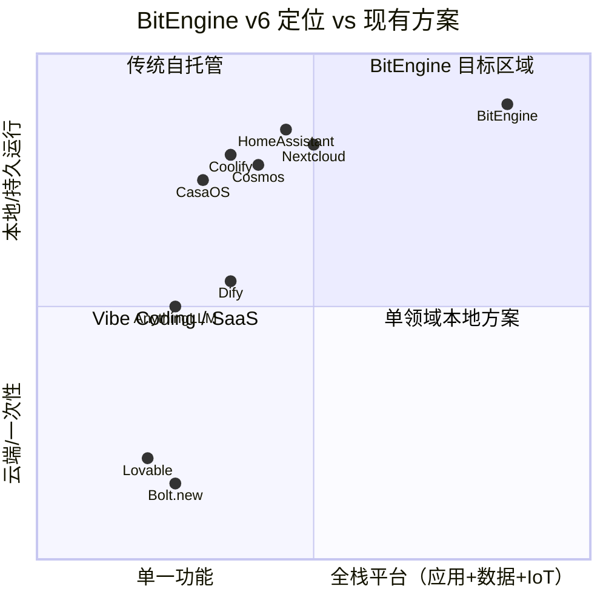

**BitEngine v6 与竞品全景对比**：

| 功能层 | CasaOS | Cosmos Cloud | Coolify | Home Assistant | Nextcloud | **BitEngine** |
|--------|:------:|:----------:|:------:|:-------------:|:---------:|:----------:|
| **AI 应用生成** | ❌ | ❌ | ❌ | ❌ | ❌ | ✅ |
| **应用商店/部署** | ✅ | ✅ | ✅ | ✅ | ✅ | ✅ |
| **数据统一管理** | ❌ | ❌ | ❌ | ❌ | ✅（文件） | ✅ |
| **AI 知识库搜索** | ❌ | ❌ | ❌ | ❌ | 🔶 | ✅ |
| **IoT 设备管理** | ❌ | ❌ | ❌ | ✅ | ❌ | ✅ |
| **IoT MCP 即插即用** | ❌ | ❌ | ❌ | 🔶（MCP 作补充） | ❌ | ✅（MCP-first） |
| **IoT AI 自动化** | ❌ | ❌ | ❌ | 🔶（规则） | ❌ | ✅ |
| **三中心联动** | ❌ | ❌ | ❌ | ❌ | ❌ | ✅ |
| **自动 HTTPS** | ❌ | ✅ | ✅ | ❌ | 需手动 | ✅ |
| **防火墙/安全** | ❌ | ✅ | ❌ | ❌ | ❌ | ✅ |
| **VPN/远程访问** | ❌ | ✅ | ❌ | 🔶 | ❌ | ✅（v1.0） |
| **自动备份** | ❌ | 🔶 | ❌ | ✅ | ✅ | ✅ |
| **多用户/RBAC** | ❌ | ✅ | ✅ | ✅ | ✅ | ✅（v1.0） |
| **多租户/Workspace** | ❌ | ❌ | ❌ | ❌ | ❌ | ✅（v2.0 企业版） |
| **多节点/高可用** | ❌ | ❌ | ❌ | ❌ | ❌ | ✅（v2.0 企业版） |
| **本地 AI 模型管理** | ❌ | ❌ | ❌ | ❌ | ❌ | ✅ |
| **移动端** | 🔶 | ❌ | ❌ | ✅ | ✅ | 🔶（v1.0 PWA） |

---

## 附录：命名说明

BitEngine 只是工作代号，最终产品名称待定。命名方向建议：
- 突出"本地/边缘"概念：Edge___
- 突出"锻造/生成"概念：___Forge, ___Smith
- 突出"个人拥有"概念：My___, Own___
- 中文市场也需要一个好记的名字

---

## 附录：详细设计文档索引

> v7 更新：DD 编号重新对齐架构修订计划。安全架构独立为 DD-06，协议层拆分为 DD-03（A2H + A2A）和 DD-07（MCP Server），新增 DD-10 生态集成架构。

| 编号 | 文档 | 覆盖范围 | 改动幅度 | 阶段 |
|------|------|---------|---------|------|
| DD-01 | bitengine-dd01-core-platform.md | 核心平台：MQTT 5.0 Broker、MCP Server Registry、Docker/WASM 运行时、Redis、媒体存储 | 小改 | MVP~v2.0 |
| DD-02 | bitengine-dd02-ai-engine.md | AI 引擎：Model Router 多模型路由、Intent Engine、Structured Output、意图链路强化（S 系列） | **中大改** | MVP~v2.0 |
| DD-03 | bitengine-dd03-a2h-a2a.md | A2H 人机协作 + A2A 多 Agent 编排：A2H 网关、A2A 通信层对齐 Google A2A、编排逻辑、A2UI 确认 UI | **中改** | MVP~v2.0 |
| DD-04 | bitengine-dd04-datahub.md | 数据中心：文件管理、RAG 知识库、媒体入库管道（视频/音频/图片）、自然语言查询 | **中改** | MVP~v2.0 |
| DD-05 | bitengine-dd05-iot-bridge.md | IoT 桥接：MCP-based 设备提供者架构、MQTT 5.0 数据面、双模直连+桥接、MCP↔MQTT Bridge | **重写** | v1.0~v2.0 |
| DD-06 | bitengine-dd06-security.md | 安全架构：十层纵深防御、Merkle 审计链、污点追踪、新协议攻击面防护、可信组件目录 | **小改** | MVP~v2.0 |
| DD-07 | bitengine-dd07-mcp-server.md | MCP Server：统一控制面、设备聚合路由、MCP Elicitation、无状态设计、A2A Agent Card 暴露 | 中改 | MVP~v2.0 |
| DD-08 | bitengine-dd08-frontend.md | 前端架构：React SPA、AG-UI + A2UI 标准渲染、AI Panel、IoT 页面、媒体库、PWA | 中改 | MVP~v2.0 |
| DD-09 | bitengine-dd09-enterprise.md | 企业部署：多租户、Worker 调度、高可用、MQTT 5.0 Shared Subscriptions HA、GPU 节点 | 微调 | v2.0 |
| DD-10 | bitengine-dd10-ecosystem.md | **生态集成架构（新文档）**：七层标准协议栈集成总纲、对上/对下/双向集成场景、认证安全 | **新写** | v1.0~v2.0 |

**编号映射说明**（v6 → v7）：

| v6 编号 | v6 内容 | v7 编号 | v7 内容 |
|---------|---------|---------|---------|
| DD-01 平台底座 | 认证/网络/备份/监控 | DD-01 核心平台 | 基础设施 + 运行时合并 |
| DD-02 应用运行层 | Docker/WASM | 并入 DD-01 | 运行时是核心平台的一部分 |
| DD-03 应用中心 | AI 生成流水线 | 并入 DD-02 | AI 生成是 AI 引擎的核心流程 |
| DD-04 数据中心 | 同 | DD-04 数据中心 | 不变，扩展媒体管道 |
| DD-05 IoT中心 | 同 | DD-05 IoT 桥接 | 不变，重写为 MCP+MQTT 5.0 架构 |
| DD-06 AI引擎 | 多模型路由/Ollama | DD-02 AI 引擎 | 重编号 + 中大改 |
| DD-07 协议层 | MCP/A2H/AG-UI/A2A | DD-03 + DD-07 | 拆分：A2H+A2A → DD-03，MCP → DD-07 |
| DD-08 前端与市场 | React SPA/市场 | DD-08 前端架构 | 不变，增加 AG-UI/A2UI 标准 |
| DD-09 企业部署 | 同 | DD-09 企业部署 | 不变，微调 HA |
| — | — | DD-06 安全架构 | **新独立**：从 DD-01 抽出 + 新协议安全面 |
| — | — | DD-10 生态集成 | **新增**：七层协议栈对外集成总纲 |

## 附录：版本矩阵

| 功能 | 社区版 (免费) | 团队版 | 企业版 |
|------|-------------|--------|-------|
| 用户数 | ≤ 5 | ≤ 50 | ≤ 200 (可扩展) |
| 部署节点 | 1 台 (单机) | 1 台 | ≤ 5 台 |
| Workspace 隔离 | 1 个 | ≤ 3 个 | 不限 |
| SSO (OIDC/SAML) | ❌ | ❌ | ✅ |
| GPU 推理节点 | ❌ | ❌ | ✅ |
| 高可用 (Active-Standby) | ❌ | ❌ | ✅ |
| 合规报告导出 | ❌ | 基础 | 完整 |
| 数据驻留策略 | ❌ | ❌ | ✅ |
| 三中心 + AI 全功能 | ✅ | ✅ | ✅ |
| MCP / A2H / AG-UI / A2A / MQTT 5.0 / OTel | ✅ | ✅ | ✅ |
| IoT + 能力市场 | ✅ | ✅ | ✅ |
