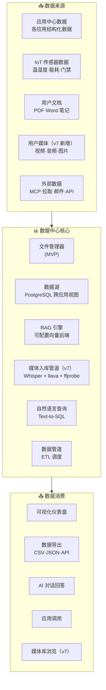
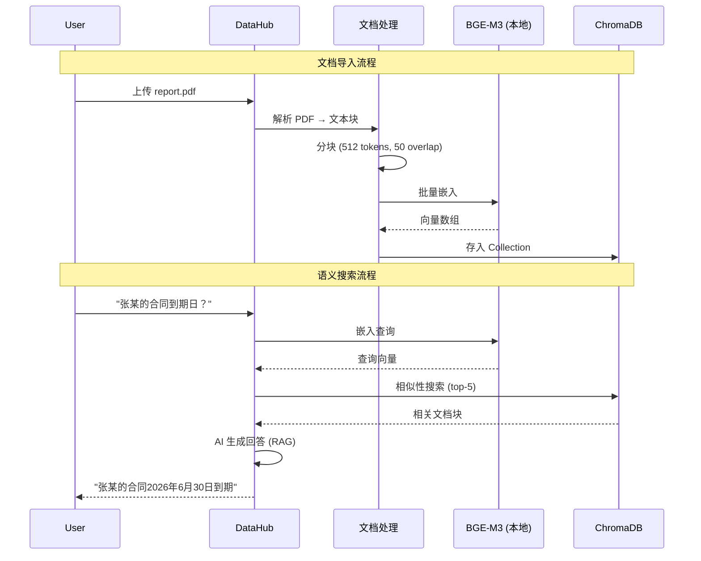
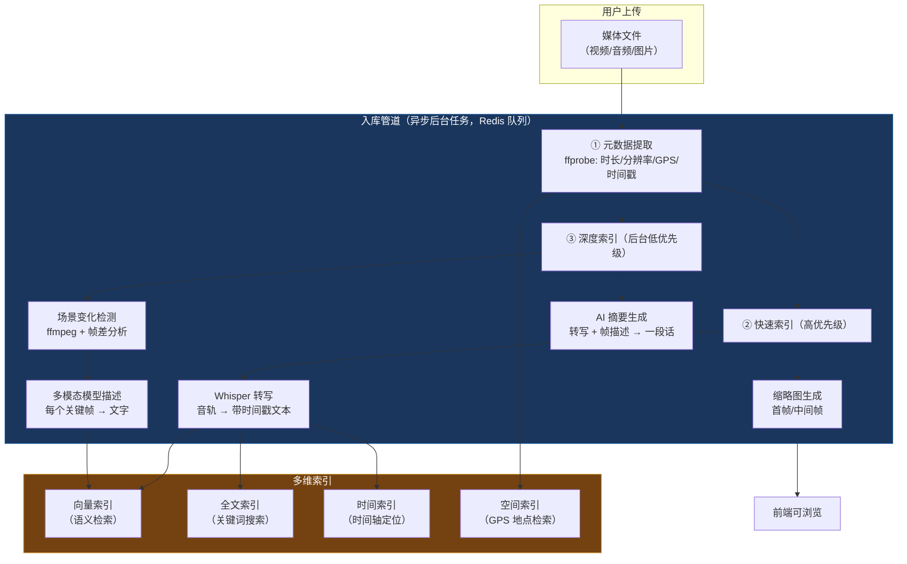
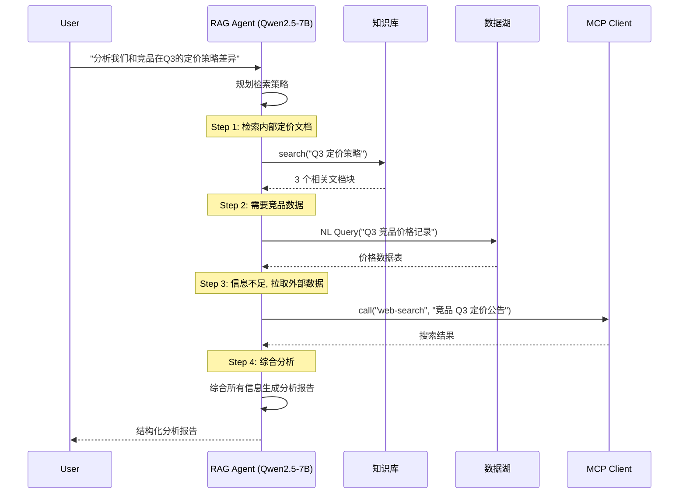

# DD-04：数据中心详细设计

> 模块路径：`internal/datahub/` | 完整覆盖 MVP · v1.0 · v2.0
>
> **v7 变更（中改）**：新增媒体资产支持（视频/音频/图片）——统一 Media Asset 抽象、媒体入库管道（Whisper 转写 + llava 关键帧描述）、媒体感知 RAG 查询。向量数据库从硬编码 ChromaDB 改为可配置（ChromaDB / pgvector / Qdrant）。新增外部知识库对接接口。

---

## 1 模块职责

数据中心是平台的"记忆"，负责文件管理、跨应用数据统一、私有知识库、AI 数据分析、数据管道和**媒体资产管理**。

不只是文档问答 RAG，而是支撑意图执行的**完整数据基础设施**，覆盖六种数据类型：文本/文档（知识检索）、结构化数据（SQL 查询）、IoT 时序数据（传感器分析）、图片（视觉内容理解）、**视频**（语音转写 + 视觉内容 + 时间轴定位）、**音频**（语音转写 + 语义检索）。

| 子系统 | 职责 | 阶段 |
|--------|------|------|
| filemanager | 文件浏览器 (上传/下载/目录管理) | MVP |
| datalake | 跨应用结构化数据统一视图 | v1.0 |
| rag | RAG 知识库引擎（可配置向量后端：ChromaDB / pgvector / Qdrant） | v1.0 |
| **media** | **媒体资产管理（视频/音频/图片统一 Media Asset）（v7 新增）** | **v1.0** |
| **media/ingest** | **媒体入库管道（Whisper 转写 + llava 帧描述 + AI 摘要）（v7 新增）** | **v1.0** |
| nlquery | 自然语言数据查询 (Text-to-SQL) | v1.0 |
| pipeline | 数据管道 (采集/清洗/ETL) | v1.0 |
| viz | 数据可视化仪表盘 | v1.0 |
| export | 数据导出 (CSV/JSON/API) | v1.0 |
| agentic_rag | Agentic RAG (LLM 多步推理检索) | v2.0 |

---

## 2 整体架构



---

## 3 文件管理器 (MVP)

```go
// internal/datahub/filemanager/fm.go

type FileManager struct {
    rootDir string // /data/bitengine/user-files
}

const MaxFileSize = 100 * 1024 * 1024 // 100MB

func (f *FileManager) List(ctx context.Context, dir string) ([]FileInfo, error) {
    safePath := f.safePath(dir)
    entries, err := os.ReadDir(safePath)
    if err != nil {
        return nil, fmt.Errorf("datahub/fm: list failed: %w", err)
    }
    var result []FileInfo
    for _, e := range entries {
        info, _ := e.Info()
        result = append(result, FileInfo{
            Name:    e.Name(),
            IsDir:   e.IsDir(),
            Size:    info.Size(),
            ModTime: info.ModTime(),
        })
    }
    return result, nil
}

func (f *FileManager) Upload(ctx context.Context, dir, filename string, content io.Reader) error {
    safePath := f.safePath(filepath.Join(dir, filename))
    // 大小限制
    limited := io.LimitReader(content, MaxFileSize+1)
    data, _ := io.ReadAll(limited)
    if len(data) > MaxFileSize {
        return ErrFileTooLarge
    }
    return os.WriteFile(safePath, data, 0644)
}

func (f *FileManager) Download(ctx context.Context, path string) (io.ReadCloser, error) {
    safePath := f.safePath(path)
    return os.Open(safePath)
}

func (f *FileManager) Delete(ctx context.Context, path string) error {
    safePath := f.safePath(path)
    return os.Remove(safePath)
}

func (f *FileManager) CreateDir(ctx context.Context, path string) error {
    safePath := f.safePath(path)
    return os.MkdirAll(safePath, 0755)
}

// 路径安全: 防止目录穿越
func (f *FileManager) safePath(path string) string {
    cleaned := filepath.Clean(path)
    joined := filepath.Join(f.rootDir, cleaned)
    if !strings.HasPrefix(joined, f.rootDir) {
        return f.rootDir // 穿越尝试 → 返回根目录
    }
    return joined
}
```

---

## 4 数据湖 (v1.0)

### 4.1 跨应用数据统一

每个应用的数据存储在独立 schema (`app_{id}`) 中。数据湖提供跨 schema 的统一视图。

```go
// internal/datahub/datalake/lake.go

type DataLake struct {
    pool     *pgxpool.Pool
    aiEngine AIEngine
}

// 注册应用数据源：将 app schema 中的指定表映射到数据湖
type DataSource struct {
    ID        string          `json:"id"`
    AppID     string          `json:"app_id"`
    TableName string          `json:"table_name"`
    Columns   []ColumnMapping `json:"columns"` // 源列 → 标准列
    SyncMode  string          `json:"sync_mode"` // realtime | batch_5min | daily
    Status    string          `json:"status"`
}

type ColumnMapping struct {
    Source string `json:"source"` // 源表列名
    Target string `json:"target"` // 数据湖标准列名
    Type   string `json:"type"`   // text | number | timestamp | boolean
}

func (l *DataLake) RegisterSource(ctx context.Context, src DataSource) error {
    // 1. 验证源表存在
    exists, _ := l.tableExists(ctx, fmt.Sprintf("app_%s.%s", src.AppID, src.TableName))
    if !exists {
        return ErrSourceTableNotFound
    }
    
    // 2. 创建跨 schema 视图
    viewSQL := l.buildCrossSchemaView(src)
    _, err := l.pool.Exec(ctx, viewSQL)
    if err != nil {
        return fmt.Errorf("datahub/lake: create view failed: %w", err)
    }
    
    // 3. 注册到元数据表
    return l.saveSource(ctx, src)
}

func (l *DataLake) buildCrossSchemaView(src DataSource) string {
    cols := make([]string, len(src.Columns))
    for i, c := range src.Columns {
        cols[i] = fmt.Sprintf("%s AS %s", c.Source, c.Target)
    }
    return fmt.Sprintf("CREATE OR REPLACE VIEW datalake.v_%s_%s AS SELECT %s FROM app_%s.%s",
        src.AppID[:8], src.TableName, strings.Join(cols, ", "), src.AppID, src.TableName)
}
```

### 4.2 IoT 传感器数据归档

```go
func (l *DataLake) IngestSensorData(ctx context.Context, data SensorReading) error {
    _, err := l.pool.Exec(ctx,
        `INSERT INTO datalake.sensor_archive (device_id, metric, value, unit, timestamp, metadata)
         VALUES ($1, $2, $3, $4, $5, $6)`,
        data.DeviceID, data.Metric, data.Value, data.Unit, data.Timestamp, data.Metadata,
    )
    return err
}

type SensorReading struct {
    DeviceID  string                 `json:"device_id"`
    Metric    string                 `json:"metric"`    // temperature, humidity, power
    Value     float64                `json:"value"`
    Unit      string                 `json:"unit"`
    Timestamp time.Time              `json:"timestamp"`
    Metadata  map[string]interface{} `json:"metadata,omitempty"`
}
```

---

## 5 自然语言查询 (v1.0)

### 5.1 Text-to-SQL

```go
// internal/datahub/nlquery/engine.go

type NLQueryEngine struct {
    lake       *DataLake
    aiEngine   AIEngine
    structured *StructuredOutput
}

type QueryResult struct {
    SQL     string          `json:"sql"`
    Columns []string        `json:"columns"`
    Rows    [][]interface{} `json:"rows"`
    Summary string          `json:"summary"` // AI 生成的自然语言摘要
}

var TextToSQLSchema = map[string]interface{}{
    "type": "object",
    "properties": map[string]interface{}{
        "sql":         map[string]interface{}{"type": "string"},
        "explanation": map[string]interface{}{"type": "string"},
    },
    "required": []string{"sql"},
}

func (e *NLQueryEngine) Query(ctx context.Context, question string) (*QueryResult, error) {
    // 1. 获取当前数据湖 schema 信息
    schemaInfo := e.lake.GetSchemaInfo(ctx)
    
    // 2. AI 将自然语言转为 SQL (Qwen3-4B 本地)
    prompt := fmt.Sprintf(`Convert the following natural language question to a PostgreSQL SELECT query.

Available tables and columns:
%s

Question: %s

Rules:
- Only generate SELECT statements
- Use appropriate aggregations and GROUP BY
- Add LIMIT 100 if no limit specified
- Use proper date/time functions for temporal queries`, schemaInfo, question)
    
    result, err := e.structured.Generate(ctx, "qwen3:4b", prompt, TextToSQLSchema)
    if err != nil {
        return nil, fmt.Errorf("datahub/nlquery: text-to-sql failed: %w", err)
    }
    
    var parsed struct {
        SQL         string `json:"sql"`
        Explanation string `json:"explanation"`
    }
    json.Unmarshal(result, &parsed)
    
    // 3. 安全验证: 只允许 SELECT
    if !isSelectOnly(parsed.SQL) {
        return nil, ErrNonSelectQuery
    }
    
    // 4. 执行查询
    rows, cols, err := e.lake.ExecuteQuery(ctx, parsed.SQL)
    if err != nil {
        return nil, fmt.Errorf("datahub/nlquery: query execution failed: %w", err)
    }
    
    // 5. AI 生成自然语言摘要
    summary := e.generateSummary(ctx, question, cols, rows)
    
    return &QueryResult{
        SQL:     parsed.SQL,
        Columns: cols,
        Rows:    rows,
        Summary: summary,
    }, nil
}

func isSelectOnly(sql string) bool {
    normalized := strings.TrimSpace(strings.ToUpper(sql))
    forbidden := []string{"INSERT", "UPDATE", "DELETE", "DROP", "ALTER", "CREATE", "TRUNCATE", "GRANT", "REVOKE"}
    for _, kw := range forbidden {
        if strings.Contains(normalized, kw) {
            return false
        }
    }
    return strings.HasPrefix(normalized, "SELECT") || strings.HasPrefix(normalized, "WITH")
}
```

---

## 6 RAG 知识库引擎 (v1.0)

### 6.1 架构

> v7 变更：向量数据库从硬编码 ChromaDB 改为可配置后端。新增外部知识库对接。RAG 查询扩展为媒体感知（命中视频/音频内容时返回时间轴定位）。



### 6.2 Collection 隔离策略

```go
// internal/datahub/rag/engine.go

type RAGEngine struct {
    chromaClient chromago.Client
    aiEngine     AIEngine
    embedder     *Embedder
}

// 两级 Collection 设计
// 1. 每应用隔离 Collection: app_{id}_docs
// 2. 全局共享 Collection: global_docs (跨应用搜索，用户授权后)
func (r *RAGEngine) collectionName(scope, appID string) string {
    if scope == "global" {
        return "global_docs"
    }
    return fmt.Sprintf("app_%s_docs", appID)
}

func (r *RAGEngine) Search(ctx context.Context, query, collection string, topK int) ([]SearchHit, error) {
    // 1. 嵌入查询
    queryVec, _ := r.embedder.Embed(ctx, []string{query})
    
    // 2. ChromaDB 相似性搜索
    coll, _ := r.chromaClient.GetCollection(ctx, collection)
    results, _ := coll.Query(ctx, queryVec[0], topK, nil)
    
    // 3. 构建结果
    hits := make([]SearchHit, len(results.Documents))
    for i, doc := range results.Documents {
        hits[i] = SearchHit{
            Content:   doc,
            Score:     results.Distances[i],
            Metadata:  results.Metadatas[i],
            Source:    results.Metadatas[i]["source"].(string),
            ChunkIdx:  int(results.Metadatas[i]["chunk_idx"].(float64)),
        }
    }
    return hits, nil
}

// RAG 完整问答
func (r *RAGEngine) RAGQuery(ctx context.Context, question, collection string) (string, []SearchHit, error) {
    // 1. 检索
    hits, _ := r.Search(ctx, question, collection, 5)
    
    // 2. 构建上下文
    context_parts := make([]string, len(hits))
    for i, h := range hits {
        context_parts[i] = fmt.Sprintf("[来源: %s]\n%s", h.Source, h.Content)
    }
    
    // 3. AI 回答 (本地 Qwen3-4B)
    prompt := fmt.Sprintf(`基于以下文档片段回答用户问题。如果文档中没有相关信息，请说明。

文档片段:
%s

问题: %s`, strings.Join(context_parts, "\n---\n"), question)
    
    answer, _ := r.aiEngine.Generate(ctx, "qwen3:4b", prompt)
    return answer, hits, nil
}
```

### 6.3 文档处理管线

```go
// internal/datahub/rag/ingest.go

type DocumentProcessor struct {
    parsers  map[string]Parser // pdf, docx, txt, csv, md, html
    chunker  *TextChunker
    embedder *Embedder
}

type Parser interface {
    Parse(content []byte) (string, error)
    SupportedTypes() []string
}

type TextChunker struct {
    ChunkSize    int // 512 tokens
    ChunkOverlap int // 50 tokens
}

func (c *TextChunker) Split(text string) []Chunk {
    // 递归分块: 段落 → 句子 → 固定长度
    // 每块保留 50 tokens 与前后块重叠
    var chunks []Chunk
    // ... 分块逻辑
    return chunks
}

type Embedder struct {
    ollama *OllamaManager
    model  string // "bge-m3"
}

func (e *Embedder) Embed(ctx context.Context, texts []string) ([][]float32, error) {
    return e.ollama.Embed(ctx, e.model, texts)
}

func (p *DocumentProcessor) Ingest(ctx context.Context, doc Document, collection string) (*IngestResult, error) {
    // 1. 解析文档
    parser, ok := p.parsers[doc.MimeType]
    if !ok {
        return nil, fmt.Errorf("datahub/rag: unsupported type %s", doc.MimeType)
    }
    text, _ := parser.Parse(doc.Content)
    
    // 2. 分块
    chunks := p.chunker.Split(text)
    
    // 3. 批量嵌入 (每批 32 个)
    batchSize := 32
    var allVectors [][]float32
    for i := 0; i < len(chunks); i += batchSize {
        end := min(i+batchSize, len(chunks))
        batch := make([]string, end-i)
        for j, c := range chunks[i:end] {
            batch[j] = c.Text
        }
        vecs, _ := p.embedder.Embed(ctx, batch)
        allVectors = append(allVectors, vecs...)
    }
    
    // 4. 存入 ChromaDB
    return p.store(ctx, collection, chunks, allVectors, doc.Metadata)
}
```

### 6.4 安全约束

- 嵌入模型 (BGE-M3) 强制本地运行，文档永不离开设备
- 向量存储文件由 Foundation 层统一 AES-256-GCM 加密
- RAG 查询结果注入 LLM prompt 前，经过污点检查 (如含 PII → 标记)
- 每应用 Collection 严格隔离，跨应用搜索需用户在 global 授权

### 6.5 向量数据库可配置化（v7 新增）

当前硬编码 ChromaDB。改为可配置后端，默认 ChromaDB，支持切换：

```yaml
# config.yaml
rag:
  vector_db:
    provider: chromadb           # 默认，零配置
    # provider: pgvector         # 复用 PostgreSQL，减少组件数
    # provider: qdrant           # 高性能场景
    connection:
      host: localhost
      port: 8000
```

```go
// internal/datahub/rag/vectordb.go

type VectorDB interface {
    Store(ctx context.Context, collection string, chunks []Chunk, vectors [][]float32) error
    Query(ctx context.Context, collection string, queryVec []float32, topK int) ([]SearchHit, error)
    DeleteCollection(ctx context.Context, collection string) error
}

func NewVectorDB(config VectorDBConfig) VectorDB {
    switch config.Provider {
    case "chromadb":
        return NewChromaDB(config.Connection)
    case "pgvector":
        return NewPGVector(config.Connection)
    case "qdrant":
        return NewQdrant(config.Connection)
    default:
        return NewChromaDB(config.Connection) // 默认
    }
}
```

### 6.6 外部知识库对接（v7 新增）

如果用户已在 Open WebUI 中建好知识库，RAG 模块可直接查询其向量数据库实例，避免用户重复上传文档：

```yaml
rag:
  external_sources:
    - type: chromadb_remote
      name: "Open WebUI Knowledge Base"
      endpoint: http://localhost:8000
      collections: ["*"]       # 或指定 Collection 列表
    - type: qdrant_remote
      name: "External Qdrant"
      endpoint: http://qdrant:6333
      collections: ["company_docs"]
```

```go
// internal/datahub/rag/external.go

type ExternalKBSource struct {
    Name       string   `json:"name"`
    Type       string   `json:"type"`       // chromadb_remote | qdrant_remote
    Endpoint   string   `json:"endpoint"`
    Collections []string `json:"collections"`
}

func (r *RAGEngine) SearchWithExternal(ctx context.Context, query, collection string, topK int) ([]SearchHit, error) {
    // 1. 搜索本地 Collection
    localHits, _ := r.Search(ctx, query, collection, topK)
    
    // 2. 搜索外部知识库
    var externalHits []SearchHit
    for _, src := range r.externalSources {
        hits, _ := r.searchExternal(ctx, src, query, topK)
        externalHits = append(externalHits, hits...)
    }
    
    // 3. 合并排序
    allHits := append(localHits, externalHits...)
    sort.Slice(allHits, func(i, j int) bool { return allHits[i].Score > allHits[j].Score })
    if len(allHits) > topK {
        allHits = allHits[:topK]
    }
    return allHits, nil
}
```

---

## 6.7 媒体资产管理（v7 新增）

### 6.7.1 统一 Media Asset 抽象

将图片、视频、音频统一为 Media Asset 数据类型，共享存储和索引基础设施：

```go
// internal/datahub/media/asset.go

type MediaAsset struct {
    ID          string            `json:"id"`
    Type        MediaType         `json:"type"`         // video | audio | image
    SourceFile  SourceFile        `json:"source_file"`
    Metadata    MediaMetadata     `json:"metadata"`
    Derived     DerivedContent    `json:"derived"`
    IndexStatus IndexStatus       `json:"index_status"`
    CreatedAt   time.Time         `json:"created_at"`
}

type MediaType string
const (
    MediaVideo MediaType = "video"
    MediaAudio MediaType = "audio"
    MediaImage MediaType = "image"
)

type SourceFile struct {
    Path       string  `json:"path"`       // /data/bitengine/media/2025/04/{hash}.mp4
    Size       int64   `json:"size"`
    Format     string  `json:"format"`     // mp4 | mp3 | wav | jpg | png
    Duration   float64 `json:"duration"`   // 秒（视频/音频）
    Resolution string  `json:"resolution"` // "1920x1080"（视频/图片）
}

type MediaMetadata struct {
    CapturedAt  *time.Time `json:"captured_at,omitempty"`
    GPS         *GPSCoord  `json:"gps,omitempty"`
    Device      string     `json:"device,omitempty"`
    Tags        []string   `json:"tags"`
}

type DerivedContent struct {
    Transcript        string             `json:"transcript,omitempty"`         // Whisper 转写
    FrameDescriptions []FrameDescription `json:"frame_descriptions,omitempty"` // llava 关键帧描述
    Summary           string             `json:"summary,omitempty"`            // AI 摘要
}

type FrameDescription struct {
    Timestamp   float64 `json:"timestamp"`   // 秒
    Description string  `json:"description"` // "蓝天下的富士山全景，山顶覆雪"
}

type IndexStatus struct {
    Metadata      string `json:"metadata"`       // pending | complete
    Transcript    string `json:"transcript"`      // pending | processing | complete | skipped
    FrameAnalysis string `json:"frame_analysis"`  // pending | processing | complete | skipped
}
```

### 6.7.2 媒体入库管道



**渐进式索引策略**：快速索引（元数据 + 转写 + 缩略图）在分钟级完成，深度索引（关键帧分析 + 摘要）后台慢慢处理。

```go
// internal/datahub/media/ingest.go

type MediaIngestPipeline struct {
    storage     *MediaStorage   // DD-01 媒体文件存储
    registry    *MediaRegistry
    whisper     *WhisperService
    llava       *LlavaService
    aiEngine    AIEngine
    vectorDB    VectorDB
    taskQueue   *redis.Client   // Redis 任务队列
}

func (p *MediaIngestPipeline) Ingest(ctx context.Context, file io.Reader, filename string) (*MediaAsset, error) {
    // 1. 存储原始文件（DD-01 MediaStorage）
    stored, _ := p.storage.Store(ctx, file, filename)
    
    // 2. 元数据提取（ffprobe，同步，秒级）
    meta := p.extractMetadata(stored.Path)
    
    asset := &MediaAsset{
        ID:         stored.ID,
        Type:       detectMediaType(filename),
        SourceFile: SourceFile{Path: stored.Path, Size: stored.Size, Format: filepath.Ext(filename)},
        Metadata:   meta,
        IndexStatus: IndexStatus{Metadata: "complete", Transcript: "pending", FrameAnalysis: "pending"},
    }
    p.registry.Save(ctx, asset)
    
    // 3. 异步入库任务（Redis 队列）
    p.taskQueue.RPush(ctx, "media:ingest:fast", asset.ID)   // 高优先级：转写+缩略图
    p.taskQueue.RPush(ctx, "media:ingest:deep", asset.ID)   // 低优先级：帧分析+摘要
    
    return asset, nil
}

// 快速索引 Worker
func (p *MediaIngestPipeline) ProcessFastIndex(ctx context.Context, assetID string) error {
    asset, _ := p.registry.Get(ctx, assetID)
    
    // Whisper 转写（视频/音频）
    if asset.Type == MediaVideo || asset.Type == MediaAudio {
        transcript, _ := p.whisper.Transcribe(ctx, asset.SourceFile.Path)
        asset.Derived.Transcript = transcript
        
        // 转写文本向量化入库
        chunks := chunkTranscript(transcript, 512)
        vecs, _ := p.vectorDB.Embed(ctx, chunks)
        p.vectorDB.Store(ctx, "media_"+assetID, chunks, vecs)
        
        asset.IndexStatus.Transcript = "complete"
    }
    
    // 缩略图
    generateThumbnail(asset.SourceFile.Path, asset.ID)
    
    return p.registry.Save(ctx, asset)
}

// 深度索引 Worker
func (p *MediaIngestPipeline) ProcessDeepIndex(ctx context.Context, assetID string) error {
    asset, _ := p.registry.Get(ctx, assetID)
    
    if asset.Type == MediaVideo || asset.Type == MediaImage {
        // 场景变化检测 → 关键帧提取
        keyframes := extractKeyframes(asset.SourceFile.Path)
        
        // llava 多模态描述每个关键帧
        for _, kf := range keyframes {
            desc, _ := p.llava.Describe(ctx, kf.ImagePath)
            asset.Derived.FrameDescriptions = append(asset.Derived.FrameDescriptions, 
                FrameDescription{Timestamp: kf.Timestamp, Description: desc})
        }
        
        // 帧描述向量化入库
        descs := make([]string, len(asset.Derived.FrameDescriptions))
        for i, fd := range asset.Derived.FrameDescriptions {
            descs[i] = fd.Description
        }
        vecs, _ := p.vectorDB.Embed(ctx, descs)
        p.vectorDB.Store(ctx, "media_frames_"+assetID, descs, vecs)
        
        asset.IndexStatus.FrameAnalysis = "complete"
    }
    
    // AI 摘要
    if asset.Derived.Transcript != "" || len(asset.Derived.FrameDescriptions) > 0 {
        summary, _ := p.aiEngine.Generate(ctx, "qwen3:4b", buildSummaryPrompt(asset))
        asset.Derived.Summary = summary
    }
    
    return p.registry.Save(ctx, asset)
}
```

**设备自适应处理**（联动 E-14 设备画像）：

| 设备能力 | 处理策略 |
|---------|---------|
| 有 GPU（NUC/游戏 PC） | 全量处理：Whisper large + llava 全帧 |
| 仅 CPU（树莓派 5） | 轻量模式：Whisper tiny + 仅首帧/尾帧描述 |
| 低配设备（RPi 4） | 最小模式：仅元数据 + 缩略图，转写等到空闲时 |

### 6.7.3 媒体感知 RAG 查询

RAG 查询接口扩展，统一返回格式——无论命中文档、视频还是音频：

```go
// internal/datahub/rag/media_rag.go

type RAGResult struct {
    Content    string    `json:"content"`     // 命中的文本内容
    Source     string    `json:"source"`      // 来源文件名
    Score      float64   `json:"score"`       // 相似度
    MediaType  string    `json:"media_type"`  // document | video | audio | image
    TimeRange  *TimeRange `json:"time_range,omitempty"` // 视频/音频的时间点定位
    Thumbnail  string    `json:"thumbnail,omitempty"`   // 缩略图路径
    AssetID    string    `json:"asset_id,omitempty"`    // 关联 Media Asset
}

type TimeRange struct {
    StartSec float64 `json:"start_sec"`
    EndSec   float64 `json:"end_sec"`
}
```

查询示例：

```
"找去年在日本拍的视频"
  → GPS 空间索引（日本范围）+ 时间索引（去年）
  → 返回视频列表 + 缩略图 + 时长

"上周会议里谁提到了预算超支？"
  → 转写文本向量检索："预算超支"
  → 返回具体视频 + 时间点定位（14:32 - 15:10）+ 上下文转写

"把这个会议录像整理成会议纪要"
  → 完整转写 → AI 摘要 + 议题提取 + 待办事项提取
```

前端根据 `media_type` 选择展示方式：文档→文本预览，视频→缩略图+时间轴定位，音频→波形+时间点。

---

## 7 数据管道 (v1.0)

### 7.1 管道定义

```go
// internal/datahub/pipeline/pipeline.go

type Pipeline struct {
    ID        string            `json:"id"`
    Name      string            `json:"name"`
    Type      PipelineType      `json:"type"`
    Source    PipelineSource    `json:"source"`
    Transform []TransformStep   `json:"transforms"`
    Sink      PipelineSink      `json:"sink"`
    Schedule  string            `json:"schedule"` // Cron 表达式
    Enabled   bool              `json:"enabled"`
    LastRun   *PipelineRunInfo  `json:"last_run,omitempty"`
}

type PipelineType string
const (
    PipeCSVImport    PipelineType = "csv_import"      // CSV → 结构化表
    PipePDFIngest    PipelineType = "pdf_ingest"       // PDF → 向量知识库
    PipeAPIFetch     PipelineType = "api_fetch"        // 外部 API → 本地
    PipeIoTAggregate PipelineType = "iot_aggregate"    // IoT 传感器 → 聚合统计
    PipeAppSync      PipelineType = "app_sync"         // 应用数据 → 数据湖
    PipeMCPPull      PipelineType = "mcp_pull"         // MCP Server → 本地 (邮件/日历)
)

type PipelineSource struct {
    Type   string                 `json:"type"` // file | url | mcp | app_schema | iot
    Config map[string]interface{} `json:"config"`
}

type TransformStep struct {
    Type   string                 `json:"type"` // filter | map | aggregate | deduplicate | rename
    Config map[string]interface{} `json:"config"`
}

type PipelineSink struct {
    Type   string                 `json:"type"` // datalake_table | chromadb | file
    Config map[string]interface{} `json:"config"`
}
```

### 7.2 管道调度

```go
// internal/datahub/pipeline/scheduler.go

type PipelineScheduler struct {
    cron      *CronScheduler // 复用 DD-02 Cron 调度器
    pipelines map[string]*Pipeline
    eventBus  EventBus
}

func (s *PipelineScheduler) Register(ctx context.Context, pipe Pipeline) error {
    s.pipelines[pipe.ID] = &pipe
    
    // 注册到 Cron
    return s.cron.Schedule(ctx, CronTask{
        ID:       "pipeline:" + pipe.ID,
        Schedule: pipe.Schedule,
        Action:   "event",
        Config:   map[string]interface{}{"topic": "pipeline.trigger", "pipeline_id": pipe.ID},
    })
}

func (s *PipelineScheduler) Execute(ctx context.Context, pipeID string) (*PipelineRunInfo, error) {
    pipe := s.pipelines[pipeID]
    run := &PipelineRunInfo{PipelineID: pipeID, StartedAt: time.Now(), Status: "running"}
    
    // 1. 拉取数据
    data, err := s.fetchSource(ctx, pipe.Source)
    if err != nil {
        run.Status = "failed"
        run.Error = err.Error()
        return run, err
    }
    
    // 2. 执行转换步骤
    for _, step := range pipe.Transform {
        data, err = s.applyTransform(ctx, data, step)
        if err != nil {
            run.Status = "failed"
            return run, err
        }
    }
    
    // 3. 写入目标
    rowCount, err := s.writeSink(ctx, pipe.Sink, data)
    run.RowsProcessed = rowCount
    run.CompletedAt = time.Now()
    run.Status = "completed"
    
    // 4. 发布事件
    s.eventBus.Publish(ctx, "data.pipeline.completed", map[string]interface{}{
        "pipeline_id": pipeID, "rows": rowCount,
    })
    
    return run, err
}
```

---

## 8 数据可视化仪表盘 (v1.0)

### 8.1 仪表盘定义

```go
// internal/datahub/viz/dashboard.go

type Dashboard struct {
    ID      string   `json:"id"`
    Name    string   `json:"name"`
    Layout  []Widget `json:"layout"`
}

type Widget struct {
    ID         string                 `json:"id"`
    Type       string                 `json:"type"` // chart | metric | table | text
    Title      string                 `json:"title"`
    DataSource WidgetDataSource       `json:"data_source"`
    Config     map[string]interface{} `json:"config"`
    Position   WidgetPosition         `json:"position"` // x, y, w, h (grid 布局)
}

type WidgetDataSource struct {
    Type  string `json:"type"`  // sql | sensor | pipeline
    Query string `json:"query"` // SQL 或 sensor metric name
}

type WidgetPosition struct {
    X int `json:"x"`
    Y int `json:"y"`
    W int `json:"w"` // 宽度 (grid units, max 12)
    H int `json:"h"` // 高度
}

func (d *DashboardService) GetWidgetData(ctx context.Context, widget Widget) (interface{}, error) {
    switch widget.DataSource.Type {
    case "sql":
        if !isSelectOnly(widget.DataSource.Query) {
            return nil, ErrNonSelectQuery
        }
        rows, cols, _ := d.lake.ExecuteQuery(ctx, widget.DataSource.Query)
        return map[string]interface{}{"columns": cols, "rows": rows}, nil
    case "sensor":
        return d.lake.QuerySensorTimeseries(ctx, widget.DataSource.Query, widget.Config)
    default:
        return nil, fmt.Errorf("datahub/viz: unknown data source type %s", widget.DataSource.Type)
    }
}
```

### 8.2 AI 自动建议仪表盘

```go
func (d *DashboardService) SuggestDashboard(ctx context.Context, description string) (*Dashboard, error) {
    schemaInfo := d.lake.GetSchemaInfo(ctx)
    
    prompt := fmt.Sprintf(`Based on the available data sources, suggest a dashboard layout.

Data sources:
%s

User description: %s

Generate a JSON dashboard with widgets (chart, metric, table).
Each widget needs a SQL query for its data source.`, schemaInfo, description)
    
    result, _ := d.structured.Generate(ctx, "qwen3:4b", prompt, DashboardSchema)
    
    var dashboard Dashboard
    json.Unmarshal(result, &dashboard)
    return &dashboard, nil
}
```

---

## 9 数据导出 (v1.0)

```go
// internal/datahub/export/exporter.go

type ExportFormat string
const (
    ExportCSV  ExportFormat = "csv"
    ExportJSON ExportFormat = "json"
    ExportExcel ExportFormat = "xlsx"
)

type ExportRequest struct {
    Source  string       `json:"source"` // SQL 查询 或 collection 名
    Format ExportFormat `json:"format"`
    Filters map[string]interface{} `json:"filters,omitempty"`
}

type Exporter struct {
    lake    *DataLake
    rag     *RAGEngine
    fileDir string // /data/bitengine/exports
}

func (e *Exporter) Export(ctx context.Context, req ExportRequest) (string, error) {
    // 1. 获取数据
    var data interface{}
    if isSelectOnly(req.Source) {
        rows, cols, _ := e.lake.ExecuteQuery(ctx, req.Source)
        data = map[string]interface{}{"columns": cols, "rows": rows}
    } else {
        // Collection 导出
        docs, _ := e.rag.ExportCollection(ctx, req.Source)
        data = docs
    }
    
    // 2. 格式化
    filename := fmt.Sprintf("export_%s.%s", time.Now().Format("20060102_150405"), req.Format)
    filepath := filepath.Join(e.fileDir, filename)
    
    switch req.Format {
    case ExportCSV:
        return filepath, e.writeCSV(filepath, data)
    case ExportJSON:
        return filepath, e.writeJSON(filepath, data)
    case ExportExcel:
        return filepath, e.writeExcel(filepath, data)
    }
    return "", ErrUnsupportedFormat
}
```

---

## 10 Agentic RAG (v2.0)

传统 RAG: 单次检索 → 生成。Agentic RAG: LLM 主动规划多步检索策略，自主决定何时需要更多信息。

### 10.1 架构



### 10.2 实现

```go
// internal/datahub/agentic_rag/agent.go

type AgenticRAGAgent struct {
    rag         *RAGEngine
    lake        *DataLake
    mcp         *MCPClientManager
    aiEngine    AIEngine
    structured  *StructuredOutput
    maxSteps    int // 默认 5, 防止无限循环
}

type RAGPlan struct {
    Steps []RAGStep `json:"steps"`
}

type RAGStep struct {
    Action     string                 `json:"action"`  // search_kb | query_lake | call_mcp | synthesize
    Parameters map[string]interface{} `json:"parameters"`
    Reasoning  string                 `json:"reasoning"`
}

func (a *AgenticRAGAgent) Query(ctx context.Context, question string) (*AgenticRAGResult, error) {
    var collectedContext []ContextPiece
    
    for step := 0; step < a.maxSteps; step++ {
        // 1. LLM 决定下一步行动
        plan, _ := a.planNextStep(ctx, question, collectedContext)
        
        if plan.Steps[0].Action == "synthesize" {
            // 收集够了, 生成最终回答
            return a.synthesize(ctx, question, collectedContext)
        }
        
        // 2. 执行检索步骤
        for _, s := range plan.Steps {
            result, _ := a.executeStep(ctx, s)
            collectedContext = append(collectedContext, ContextPiece{
                Source: s.Action,
                Data:   result,
            })
        }
    }
    
    // 达到最大步骤, 用已有信息生成回答
    return a.synthesize(ctx, question, collectedContext)
}

func (a *AgenticRAGAgent) planNextStep(ctx context.Context, question string, context []ContextPiece) (*RAGPlan, error) {
    prompt := fmt.Sprintf(`You are a research agent. Plan the next retrieval step.

Question: %s
Information collected so far: %v

Available actions:
- search_kb: Search knowledge base (params: query, collection)
- query_lake: Natural language query on structured data (params: question)
- call_mcp: Call external MCP tool (params: connection, tool, args)
- synthesize: Enough info collected, generate final answer

Decide what to do next. If you have enough info, use "synthesize".`, question, context)
    
    result, _ := a.structured.Generate(ctx, "qwen2.5:7b", prompt, RAGPlanSchema)
    
    var plan RAGPlan
    json.Unmarshal(result, &plan)
    return &plan, nil
}

func (a *AgenticRAGAgent) executeStep(ctx context.Context, step RAGStep) (interface{}, error) {
    switch step.Action {
    case "search_kb":
        return a.rag.Search(ctx, step.Parameters["query"].(string), step.Parameters["collection"].(string), 5)
    case "query_lake":
        return a.lake.NaturalQuery(ctx, step.Parameters["question"].(string))
    case "call_mcp":
        return a.mcp.CallTool(ctx, step.Parameters["connection"].(string), step.Parameters["tool"].(string), step.Parameters["args"].(map[string]interface{}))
    }
    return nil, fmt.Errorf("datahub/agentic_rag: unknown action %s", step.Action)
}
```

---

## 11 DataHub 接口实现

```go
// 实现 HLD 中定义的 DataHub 接口

type dataHub struct {
    fm       *FileManager
    lake     *DataLake
    rag      *RAGEngine
    nlquery  *NLQueryEngine
    pipeline *PipelineScheduler
    viz      *DashboardService
    export   *Exporter
    agentic  *AgenticRAGAgent  // v2.0
}

func (d *dataHub) Query(ctx context.Context, naturalLang string) (QueryResult, error) {
    return d.nlquery.Query(ctx, naturalLang)
}

func (d *dataHub) IngestDoc(ctx context.Context, doc Document) error {
    return d.rag.processor.Ingest(ctx, doc, "global_docs")
}

func (d *dataHub) Search(ctx context.Context, query string, opts SearchOpts) ([]SearchHit, error) {
    return d.rag.Search(ctx, query, opts.Collection, opts.TopK)
}

func (d *dataHub) IngestSensorData(ctx context.Context, data SensorReading) error {
    return d.lake.IngestSensorData(ctx, data)
}

// v2.0
func (d *dataHub) AgenticQuery(ctx context.Context, question string) (*AgenticRAGResult, error) {
    return d.agentic.Query(ctx, question)
}
```

---

## 12 数据库 Schema

```sql
-- === datalake schema ===

-- 数据源注册
CREATE TABLE datalake.data_sources (
    id          TEXT PRIMARY KEY DEFAULT gen_ulid(),
    app_id      TEXT NOT NULL,
    table_name  VARCHAR(100) NOT NULL,
    columns     JSONB NOT NULL,
    sync_mode   VARCHAR(20) NOT NULL DEFAULT 'batch_5min',
    last_sync   TIMESTAMPTZ,
    status      VARCHAR(20) DEFAULT 'active',
    created_at  TIMESTAMPTZ NOT NULL DEFAULT now(),
    UNIQUE(app_id, table_name)
);

-- IoT 传感器数据归档
CREATE TABLE datalake.sensor_archive (
    id          TEXT PRIMARY KEY DEFAULT gen_ulid(),
    device_id   VARCHAR(100) NOT NULL,
    metric      VARCHAR(100) NOT NULL,
    value       DOUBLE PRECISION NOT NULL,
    unit        VARCHAR(20),
    timestamp   TIMESTAMPTZ NOT NULL,
    metadata    JSONB
);
CREATE INDEX idx_sensor_device_time ON datalake.sensor_archive(device_id, timestamp);
CREATE INDEX idx_sensor_metric_time ON datalake.sensor_archive(metric, timestamp);

-- 数据管道
CREATE TABLE datalake.pipelines (
    id          TEXT PRIMARY KEY DEFAULT gen_ulid(),
    name        VARCHAR(200) NOT NULL,
    type        VARCHAR(50) NOT NULL,
    source      JSONB NOT NULL,
    transforms  JSONB NOT NULL DEFAULT '[]',
    sink        JSONB NOT NULL,
    schedule    VARCHAR(100),
    enabled     BOOLEAN NOT NULL DEFAULT true,
    created_at  TIMESTAMPTZ NOT NULL DEFAULT now()
);

-- 管道运行记录
CREATE TABLE datalake.pipeline_runs (
    id             TEXT PRIMARY KEY DEFAULT gen_ulid(),
    pipeline_id    TEXT NOT NULL REFERENCES datalake.pipelines(id),
    status         VARCHAR(20) NOT NULL,           -- running | completed | failed
    rows_processed INTEGER DEFAULT 0,
    error          TEXT,
    started_at     TIMESTAMPTZ NOT NULL,
    completed_at   TIMESTAMPTZ
);

-- 知识库文档记录
CREATE TABLE datalake.kb_documents (
    id           TEXT PRIMARY KEY DEFAULT gen_ulid(),
    collection   VARCHAR(100) NOT NULL,             -- global_docs | app_{id}_docs
    filename     VARCHAR(500) NOT NULL,
    mime_type    VARCHAR(100) NOT NULL,
    chunk_count  INTEGER NOT NULL,
    file_size    BIGINT NOT NULL,
    metadata     JSONB,
    ingested_at  TIMESTAMPTZ NOT NULL DEFAULT now()
);

-- 仪表盘
CREATE TABLE datalake.dashboards (
    id          TEXT PRIMARY KEY DEFAULT gen_ulid(),
    name        VARCHAR(200) NOT NULL,
    layout      JSONB NOT NULL,                    -- Widget 数组
    created_at  TIMESTAMPTZ NOT NULL DEFAULT now(),
    updated_at  TIMESTAMPTZ NOT NULL DEFAULT now()
);

-- 导出记录
CREATE TABLE datalake.exports (
    id          TEXT PRIMARY KEY DEFAULT gen_ulid(),
    source      TEXT NOT NULL,
    format      VARCHAR(10) NOT NULL,
    filepath    TEXT NOT NULL,
    file_size   BIGINT,
    created_at  TIMESTAMPTZ NOT NULL DEFAULT now(),
    expires_at  TIMESTAMPTZ                        -- 自动清理过期导出
);

-- === v7 新增: 媒体资产 ===

-- 媒体资产主表
CREATE TABLE datalake.media_assets (
    id             TEXT PRIMARY KEY DEFAULT gen_ulid(),
    type           VARCHAR(10) NOT NULL,            -- video | audio | image
    source_path    TEXT NOT NULL,                    -- 原始文件路径（DD-01 MediaStorage）
    file_size      BIGINT NOT NULL,
    format         VARCHAR(20) NOT NULL,
    duration_sec   REAL,                            -- 视频/音频时长
    resolution     VARCHAR(20),                     -- "1920x1080"
    captured_at    TIMESTAMPTZ,
    gps_lat        DOUBLE PRECISION,
    gps_lng        DOUBLE PRECISION,
    device         VARCHAR(100),
    tags           TEXT[],
    transcript     TEXT,                            -- Whisper 转写全文
    summary        TEXT,                            -- AI 生成摘要
    thumbnail_path TEXT,                            -- 缩略图路径
    index_status   JSONB NOT NULL DEFAULT '{"metadata":"pending","transcript":"pending","frame_analysis":"pending"}',
    metadata       JSONB,
    created_at     TIMESTAMPTZ NOT NULL DEFAULT now()
);
CREATE INDEX idx_media_type ON datalake.media_assets(type);
CREATE INDEX idx_media_captured ON datalake.media_assets(captured_at);
CREATE INDEX idx_media_gps ON datalake.media_assets(gps_lat, gps_lng) WHERE gps_lat IS NOT NULL;

-- 关键帧描述
CREATE TABLE datalake.media_frame_descriptions (
    id          TEXT PRIMARY KEY DEFAULT gen_ulid(),
    asset_id    TEXT NOT NULL REFERENCES datalake.media_assets(id) ON DELETE CASCADE,
    timestamp_sec REAL NOT NULL,
    description TEXT NOT NULL,
    image_path  TEXT                                -- 关键帧截图路径
);
CREATE INDEX idx_frame_asset ON datalake.media_frame_descriptions(asset_id, timestamp_sec);

-- 媒体入库任务队列状态（备选：也可用 Redis 纯内存管理）
CREATE TABLE datalake.media_ingest_jobs (
    id          TEXT PRIMARY KEY DEFAULT gen_ulid(),
    asset_id    TEXT NOT NULL REFERENCES datalake.media_assets(id) ON DELETE CASCADE,
    phase       VARCHAR(20) NOT NULL,              -- fast | deep
    status      VARCHAR(20) NOT NULL DEFAULT 'pending', -- pending | processing | completed | failed
    error       TEXT,
    started_at  TIMESTAMPTZ,
    completed_at TIMESTAMPTZ,
    created_at  TIMESTAMPTZ NOT NULL DEFAULT now()
);

-- 外部知识库配置（v7 新增）
CREATE TABLE datalake.external_kb_sources (
    id          TEXT PRIMARY KEY DEFAULT gen_ulid(),
    name        VARCHAR(200) NOT NULL,
    type        VARCHAR(50) NOT NULL,              -- chromadb_remote | qdrant_remote
    endpoint    TEXT NOT NULL,
    collections TEXT[],
    enabled     BOOLEAN NOT NULL DEFAULT true,
    created_at  TIMESTAMPTZ NOT NULL DEFAULT now()
);
```

---

## 13 API 端点

| 方法 | 端点 | 说明 | 阶段 |
|------|------|------|------|
| GET | `/api/v1/files` | 文件列表 | MVP |
| POST | `/api/v1/files/upload` | 上传文件 | MVP |
| GET | `/api/v1/files/download/:path` | 下载文件 | MVP |
| DELETE | `/api/v1/files/:path` | 删除文件 | MVP |
| POST | `/api/v1/files/mkdir` | 创建目录 | MVP |
| POST | `/api/v1/data/query` | 自然语言查询 | v1.0 |
| GET | `/api/v1/data/sources` | 数据源列表 | v1.0 |
| POST | `/api/v1/data/sources` | 注册数据源 | v1.0 |
| DELETE | `/api/v1/data/sources/:id` | 删除数据源 | v1.0 |
| POST | `/api/v1/kb/ingest` | 上传文档到知识库 | v1.0 |
| GET | `/api/v1/kb/collections` | 知识库集合列表 | v1.0 |
| POST | `/api/v1/kb/search` | 语义搜索 | v1.0 |
| POST | `/api/v1/kb/ask` | RAG 问答 | v1.0 |
| DELETE | `/api/v1/kb/documents/:id` | 删除知识库文档 | v1.0 |
| GET | `/api/v1/pipelines` | 管道列表 | v1.0 |
| POST | `/api/v1/pipelines` | 创建管道 | v1.0 |
| POST | `/api/v1/pipelines/:id/run` | 手动执行管道 | v1.0 |
| DELETE | `/api/v1/pipelines/:id` | 删除管道 | v1.0 |
| GET | `/api/v1/pipelines/:id/runs` | 管道执行历史 | v1.0 |
| GET | `/api/v1/dashboards` | 仪表盘列表 | v1.0 |
| POST | `/api/v1/dashboards` | 创建仪表盘 | v1.0 |
| GET | `/api/v1/dashboards/:id` | 仪表盘详情 | v1.0 |
| PUT | `/api/v1/dashboards/:id` | 更新仪表盘 | v1.0 |
| POST | `/api/v1/dashboards/suggest` | AI 建议仪表盘 | v1.0 |
| GET | `/api/v1/dashboards/:id/widgets/:wid/data` | 获取 Widget 数据 | v1.0 |
| POST | `/api/v1/data/export` | 导出数据 | v1.0 |
| GET | `/api/v1/data/exports/:id/download` | 下载导出文件 | v1.0 |
| POST | `/api/v1/data/agentic-query` | Agentic RAG 查询 | v2.0 |
| POST | `/api/v1/media/upload` | 上传媒体文件（视频/音频/图片）（v7 新增） | v1.0 |
| GET | `/api/v1/media` | 媒体资产列表（支持类型/时间/GPS 筛选）（v7 新增） | v1.0 |
| GET | `/api/v1/media/:id` | 媒体资产详情（含衍生内容和索引状态）（v7 新增） | v1.0 |
| GET | `/api/v1/media/:id/thumbnail` | 获取缩略图（v7 新增） | v1.0 |
| GET | `/api/v1/media/:id/transcript` | 获取转写文本（带时间戳）（v7 新增） | v1.0 |
| DELETE | `/api/v1/media/:id` | 删除媒体资产（v7 新增） | v1.0 |
| GET | `/api/v1/media/ingest/status` | 入库管道队列状态（v7 新增） | v1.0 |
| GET | `/api/v1/kb/external` | 外部知识库列表（v7 新增） | v1.0 |
| POST | `/api/v1/kb/external` | 添加外部知识库（v7 新增） | v1.0 |
| DELETE | `/api/v1/kb/external/:id` | 删除外部知识库（v7 新增） | v1.0 |

---

## 14 错误码

| 错误码 | 说明 | 阶段 |
|--------|------|------|
| `DATA_FILE_TOO_LARGE` | 文件超过 100MB 限制 | MVP |
| `DATA_FILE_NOT_FOUND` | 文件不存在 | MVP |
| `DATA_PATH_TRAVERSAL` | 路径穿越攻击 | MVP |
| `DATA_SOURCE_NOT_FOUND` | 数据源不存在 | v1.0 |
| `DATA_NON_SELECT_QUERY` | SQL 非 SELECT (拒绝) | v1.0 |
| `DATA_QUERY_TIMEOUT` | 查询超时 | v1.0 |
| `DATA_KB_UNSUPPORTED_TYPE` | 不支持的文档类型 | v1.0 |
| `DATA_KB_INGEST_FAILED` | 文档导入失败 | v1.0 |
| `DATA_KB_COLLECTION_NOT_FOUND` | 知识库集合不存在 | v1.0 |
| `DATA_PIPELINE_FAILED` | 管道执行失败 | v1.0 |
| `DATA_PIPELINE_SOURCE_ERROR` | 管道数据源错误 | v1.0 |
| `DATA_EXPORT_FORMAT_UNSUPPORTED` | 不支持的导出格式 | v1.0 |
| `DATA_AGENTIC_MAX_STEPS` | Agentic RAG 达到最大步骤 | v2.0 |
| `DATA_MEDIA_UNSUPPORTED_FORMAT` | 不支持的媒体格式（v7 新增） | v1.0 |
| `DATA_MEDIA_INGEST_FAILED` | 媒体入库管道失败（v7 新增） | v1.0 |
| `DATA_MEDIA_TRANSCRIBE_FAILED` | Whisper 转写失败（v7 新增） | v1.0 |
| `DATA_MEDIA_FRAME_ANALYSIS_FAILED` | 关键帧分析失败（v7 新增） | v1.0 |
| `DATA_MEDIA_NOT_FOUND` | 媒体资产不存在（v7 新增） | v1.0 |
| `DATA_MEDIA_STORAGE_FULL` | 媒体存储空间已满（v7 新增） | v1.0 |
| `DATA_EXTERNAL_KB_UNREACHABLE` | 外部知识库不可达（v7 新增） | v1.0 |
| `DATA_VECTORDB_CONFIG_INVALID` | 向量数据库配置无效（v7 新增） | v1.0 |

---

## 15 测试策略

| 类型 | 覆盖 | 工具 |
|------|------|------|
| 单元测试 | 文本分块算法、路径安全校验、SQL 安全检查、媒体类型检测 | `testing` + `testify` |
| 集成测试 | PDF 上传→解析→分块→嵌入→搜索完整链路 | `testcontainers-go` (ChromaDB) |
| 集成测试 | IoT 数据归档→自然语言查询 | `testcontainers-go` (PostgreSQL) |
| 集成测试 | 管道 CSV 导入→数据湖→查询 | PostgreSQL + mock source |
| 集成测试 | 向量数据库后端切换：ChromaDB → pgvector → Qdrant（v7 新增） | 多后端测试 |
| 集成测试 | 媒体上传→元数据提取→Whisper 转写→向量化→语义搜索→时间轴定位（v7 新增） | Mock Whisper + ChromaDB |
| 集成测试 | 外部知识库对接：本地搜索 + 远程搜索合并排序（v7 新增） | Mock remote ChromaDB |
| 安全测试 | Collection 隔离 (app A 无法搜索 app B 文档) | 隔离测试用例 |
| 安全测试 | SQL 注入防护 (isSelectOnly 边界用例) | 恶意 SQL 样本库 |
