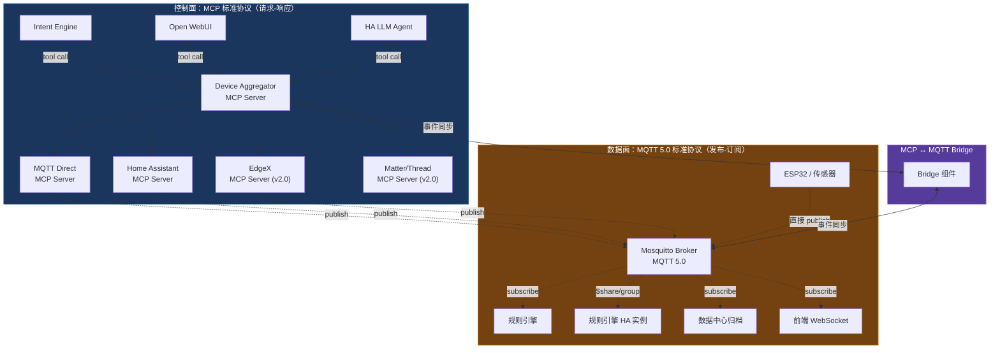

# DD-05：IoT 桥接详细设计

> 模块路径：`internal/iot/` | 完整覆盖 v1.0 · v1.5 · v2.0
>
> **v7 重写**：从 "MCP Client 发现设备" 架构重写为 **MCP 控制面 + MQTT 5.0 数据面** 双协议架构。核心变更：设备提供者 = MCP Server，设备事件 = MQTT 5.0 发布-订阅，两者通过 Bridge 桥接。

---

## 1 模块职责与核心架构决策

IoT 桥接是平台的"触手"——统一管理智能家居和工业传感器设备。

**核心架构决策：控制面 MCP，数据面 MQTT 5.0，零自定义协议。**

- **控制面（MCP）**：Intent Engine / 外部 AI 通过标准 MCP tool call 控制设备——"开灯"、"设温度 26°"、"列出所有设备"
- **数据面（MQTT 5.0）**：设备遥测、状态变更、告警通过 MQTT 5.0 发布-订阅流动——传感器每 5 秒报一次温度，门锁状态变更实时推送
- **Bridge**：两个协议面之间的胶水层——MCP 订阅请求转为 MQTT 订阅，MQTT 事件未来可转为 MCP Notification

| 子系统 | 职责 | 阶段 |
|--------|------|------|
| aggregator | Device Aggregator MCP Server（设备控制聚合路由） | v1.0 |
| provider/mqtt | MQTT Direct MCP Server（内置 MQTT/HTTP 设备直连） | v1.0 |
| provider/ha | Home Assistant MCP Server（HA 设备桥接） | v1.0 |
| bridge | MCP ↔ MQTT 5.0 Bridge（双协议桥接） | v1.0 |
| broker | 内嵌 Mosquitto Broker（MQTT 5.0） | v1.0 |
| registry | 统一设备注册表（MCP 语义模型） | v1.0 |
| rules | AI 规则引擎（自然语言创建 / MCP tool 执行） | v1.0 |
| health | 设备健康检查 + 离线告警 | v1.0 |
| provider/edgex | EdgeX Foundry MCP Server（工业设备桥接） | v2.0 |
| provider/matter | Matter/Thread MCP Server | v2.0 |
| vision | 计算机视觉模块（摄像头 + 本地检测） | v2.0 |
| driver_market | MCP 桥接器市场（社区贡献） | v2.0 |
| ota | 设备固件 OTA 更新 | v2.0 |

---

## 2 整体架构



**与旧架构的核心区别**：

| 维度 | 旧架构（v6 DD-05） | 新架构（v7 DD-05） |
|------|-------------------|-------------------|
| 设备接入 | IoT Hub 作为 MCP Client 发现设备 | 每种接入方式是一个 **MCP Server**（设备提供者） |
| 控制路径 | Intent Engine → MCP Client → 设备 MCP Server | Intent Engine → **Aggregator MCP Server** → Provider MCP Server |
| 事件传输 | Redis eventBus 内部通信 | **MQTT 5.0** 标准发布-订阅 |
| 上层透明 | Intent Engine 需要知道 MCP Client | Intent Engine 只知道 Aggregator 的标准 MCP tools |
| 外部兼容 | Open WebUI 无法直接控制设备 | Open WebUI 通过同一个 Aggregator MCP Server 控制设备 |
| HA 扩展 | 无 | HA MCP Server → MQTT 5.0 Shared Subscriptions HA |

---

## 3 Device Aggregator MCP Server (v1.0)

Aggregator 是 IoT 桥接层面向上层的**唯一入口**。它读取 DD-01 的 MCP Server Registry，将 tool call 路由到对应的下游设备提供者 MCP Server。

### 3.1 MCP Tool 统一规范

每个设备提供者 MCP Server 实现相同的 tool 集合，Aggregator 透传：

```yaml
devices/list:
  params: { provider?: string, protocol?: string, type?: string, location?: string }
  returns: [{ id, name, type, state, provider, capabilities }]

devices/get_state:
  params: { device_id: string }
  returns: { device_id, state: object, last_updated: timestamp }

devices/set_state:
  params: { device_id: string, command: string, args?: object }
  returns: { success: bool, new_state?: object }

devices/capabilities:
  params: { device_id: string }
  returns: { commands: [...], sensors: [...], events: [...] }

devices/batch:
  params: { operations: [{ device_id, command, args }] }
  returns: [{ device_id, success, new_state }]

devices/subscribe:
  params: { device_id: string, events: [string] }
  returns: { subscription_id: string }
  note: "Bridge 将此请求转为 MQTT 订阅"
```

Intent Engine 全程只和 Aggregator 的 MCP tools 交互，不知道底层协议。Open WebUI / HA LLM Agent 也通过同一组 tools 控制设备。

### 3.2 路由逻辑

```go
// internal/iot/aggregator/aggregator.go

type DeviceAggregator struct {
    registry   *DeviceRegistry
    providers  map[string]DeviceProvider  // provider_id → MCP Server client
    mcpServer  *mcp.Server               // 暴露给上层的 MCP Server
}

// DeviceProvider 是每个设备提供者 MCP Server 的客户端接口
type DeviceProvider interface {
    ListDevices(ctx context.Context, filter DeviceFilter) ([]Device, error)
    GetState(ctx context.Context, deviceID string) (*DeviceState, error)
    SetState(ctx context.Context, deviceID, command string, args map[string]any) (*CommandResult, error)
    GetCapabilities(ctx context.Context, deviceID string) (*DeviceCapabilities, error)
    ProviderID() string
}

// devices/list → 并行查询所有已注册提供者，合并结果
func (a *DeviceAggregator) HandleListDevices(ctx context.Context, params ListParams) ([]Device, error) {
    var mu sync.Mutex
    var allDevices []Device

    g, gCtx := errgroup.WithContext(ctx)
    for _, provider := range a.providers {
        p := provider
        g.Go(func() error {
            devices, err := p.ListDevices(gCtx, DeviceFilter{
                Provider: params.Provider,
                Protocol: params.Protocol,
                Type:     params.Type,
            })
            if err != nil {
                slog.Warn("provider query failed", "provider", p.ProviderID(), "err", err)
                return nil  // 不因单个提供者失败阻塞全部
            }
            mu.Lock()
            allDevices = append(allDevices, devices...)
            mu.Unlock()
            return nil
        })
    }
    g.Wait()

    return allDevices, nil
}

// devices/set_state → 根据 device_id 路由到对应提供者
func (a *DeviceAggregator) HandleSetState(ctx context.Context, deviceID, command string, args map[string]any) (*CommandResult, error) {
    device, err := a.registry.Get(ctx, deviceID)
    if err != nil {
        return nil, fmt.Errorf("device not found: %s", deviceID)
    }
    
    provider, ok := a.providers[device.ProviderID]
    if !ok {
        return nil, fmt.Errorf("provider not found: %s", device.ProviderID)
    }

    return provider.SetState(ctx, deviceID, command, args)
}
```

### 3.3 提供者注册

```go
// 启动时从 MCP Server Registry 加载已注册的设备提供者
func (a *DeviceAggregator) LoadProviders(ctx context.Context) error {
    providers, err := a.registry.ListProviders(ctx)
    if err != nil {
        return err
    }
    
    for _, p := range providers {
        switch p.Type {
        case "mqtt_direct":
            a.providers[p.ID] = NewMQTTDirectProvider(p.Config)
        case "home_assistant":
            a.providers[p.ID] = NewHAProvider(p.Config)
        case "edgex":
            a.providers[p.ID] = NewEdgeXProvider(p.Config)
        }
    }
    return nil
}
```

---

## 4 设备提供者 MCP Server

每种设备接入方式是一个独立的 MCP Server 实现。上层完全透明。

### 4.1 MQTT Direct MCP Server (v1.0)

处理直接通过 MQTT 5.0 / HTTP 接入的设备（ESP32、WiFi 灯泡、传感器等）。

```go
// internal/iot/provider/mqtt_direct.go

type MQTTDirectProvider struct {
    broker     mqtt.Client   // 连接内嵌 Mosquitto（MQTT 5.0）
    registry   *DeviceRegistry
    topicMap   map[string]BridgeMapping
}

type BridgeMapping struct {
    MQTTTopic    string `json:"mqtt_topic"`    // "home/sensor/temperature"
    DeviceID     string `json:"device_id"`
    MCPResource  string `json:"mcp_resource"`  // "resource://sensor-001/temperature"
    ValuePath    string `json:"value_path"`    // JSON path: "$.value"
    Unit         string `json:"unit"`          // "°C"
}

func (p *MQTTDirectProvider) ProviderID() string { return "mqtt_direct" }

// MQTT 5.0 消息 → 更新设备状态 + 发布到标准 MQTT topic
func (p *MQTTDirectProvider) onMessage(topic string, payload []byte, props *mqtt.PublishProperties) {
    mapping := p.topicMap[topic]
    value := extractValue(payload, mapping.ValuePath)
    
    // MQTT 5.0: 从 User Properties 提取元数据
    var contentType string
    if props != nil {
        contentType = props.ContentType
        // User Properties 可携带 device_id、priority 等
    }
    
    // 更新设备注册表
    p.registry.UpdateResource(mapping.DeviceID, mapping.MCPResource, value)
    
    // 重新发布到标准 MQTT 5.0 topic（带 User Properties）
    p.broker.Publish(
        fmt.Sprintf("bitengine/devices/mqtt_direct/%s/telemetry", mapping.DeviceID),
        1, false, payload,
        &mqtt.PublishProperties{
            UserProperties: map[string]string{
                "device_id":    mapping.DeviceID,
                "provider":     "mqtt_direct",
                "content_type": contentType,
                "unit":         mapping.Unit,
            },
            ContentType:    "application/json",
            MessageExpiry:  ptr(uint32(3600)), // MQTT 5.0: 1 小时过期
        },
    )
}

// MCP tool call → MQTT 5.0 publish 控制设备
func (p *MQTTDirectProvider) SetState(ctx context.Context, deviceID, command string, args map[string]any) (*CommandResult, error) {
    topic := fmt.Sprintf("bitengine/%s/command/%s", deviceID, command)
    payload, _ := json.Marshal(args)
    
    // MQTT 5.0: Request/Response 模式等待设备确认
    respTopic := fmt.Sprintf("bitengine/%s/response/%s", deviceID, uuid.New().String())
    token := p.broker.PublishWithProperties(topic, 1, false, payload, &mqtt.PublishProperties{
        ResponseTopic:   respTopic,
        CorrelationData: []byte(uuid.New().String()),
    })
    
    if err := token.Error(); err != nil {
        return &CommandResult{Success: false}, err
    }
    return &CommandResult{Success: true}, nil
}
```

**Zigbee 设备接入**：通过 Zigbee2MQTT → MQTT Broker 链路，由 MQTT Direct Provider 统一处理。Zigbee2MQTT 将 Zigbee 设备映射为 MQTT topic。

```go
// Zigbee2MQTT 设备自动发现
func (p *MQTTDirectProvider) startZigbeeDiscovery(ctx context.Context) {
    // 监听 zigbee2mqtt/bridge/devices topic 获取设备列表
    p.broker.Subscribe("zigbee2mqtt/bridge/devices", func(msg mqtt.Message) {
        var devices []ZigbeeDevice
        json.Unmarshal(msg.Payload(), &devices)
        for _, d := range devices {
            device := &Device{
                Name:         d.FriendlyName,
                Manufacturer: d.Definition.Vendor,
                Model:        d.Definition.Model,
                Protocol:     "zigbee",
                ProviderID:   "mqtt_direct",
                Tools:        exposeToTools(d.Definition.Exposes),
                Resources:    exposeToResources(d.Definition.Exposes),
            }
            p.registry.Register(ctx, device)
        }
    })
    
    // 状态更新：zigbee2mqtt/+ → 标准处理
    p.broker.Subscribe("zigbee2mqtt/+", func(msg mqtt.Message) {
        p.onMessage(msg.Topic(), msg.Payload(), nil)
    })
}
```

### 4.2 Home Assistant MCP Server (v1.0)

桥接 Home Assistant 已接入的数千种消费设备。

```go
// internal/iot/provider/homeassistant.go

type HAProvider struct {
    baseURL   string        // http://homeassistant.local:8123
    token     string        // HA Long-Lived Access Token
    client    *http.Client
    wsConn    *websocket.Conn
    registry  *DeviceRegistry
    broker    mqtt.Client   // 将 HA 事件转发到 MQTT 5.0
}

func (h *HAProvider) ProviderID() string { return "home_assistant" }

// 通过 HA REST API 列出设备
func (h *HAProvider) ListDevices(ctx context.Context, filter DeviceFilter) ([]Device, error) {
    resp, err := h.doHA(ctx, "GET", "/api/states", nil)
    if err != nil {
        return nil, err
    }
    
    var states []HAState
    json.NewDecoder(resp.Body).Decode(&states)
    
    var devices []Device
    for _, s := range states {
        devices = append(devices, h.mapToDevice(s))
    }
    return devices, nil
}

// 通过 HA REST API 控制设备
func (h *HAProvider) SetState(ctx context.Context, deviceID, command string, args map[string]any) (*CommandResult, error) {
    // HA API: POST /api/services/{domain}/{service}
    domain, service := parseHACommand(command) // "light.turn_on" → domain="light", service="turn_on"
    body := map[string]any{"entity_id": deviceID}
    for k, v := range args {
        body[k] = v
    }
    
    _, err := h.doHA(ctx, "POST", fmt.Sprintf("/api/services/%s/%s", domain, service), body)
    if err != nil {
        return &CommandResult{Success: false}, err
    }
    return &CommandResult{Success: true}, nil
}

// HA WebSocket 事件 → 发布到 MQTT 5.0 标准 topic
func (h *HAProvider) startEventForwarding(ctx context.Context) {
    h.wsConn.Subscribe("state_changed", func(event HAEvent) {
        payload, _ := json.Marshal(event.Data.NewState)
        h.broker.Publish(
            fmt.Sprintf("bitengine/devices/home_assistant/%s/state", event.Data.EntityID),
            1, false, payload,
            &mqtt.PublishProperties{
                UserProperties: map[string]string{
                    "device_id": event.Data.EntityID,
                    "provider":  "home_assistant",
                },
                ContentType: "application/json",
            },
        )
    })
}
```

### 4.3 双模设备接入总结

| 模式 | 实现 | 适用场景 | 阶段 |
|------|------|---------|------|
| 内置直连 | MQTT Direct MCP Server | ESP32、WiFi 灯泡、HTTP API 设备、Zigbee（via Zigbee2MQTT） | v1.0 |
| HA 桥接 | Home Assistant MCP Server（调用 HA REST/WebSocket API） | HA 已接入的数千种消费设备 | v1.0 |
| EdgeX 桥接 | EdgeX MCP Server（调用 EdgeX API） | 工业场景（Modbus、BACnet） | v2.0 |
| 未来直连扩展 | Matter/Thread MCP Server | 新一代标准协议设备 | v2.0 |

每种接入方式都是一个 MCP Server 实现（实现 `DeviceProvider` 接口），上层完全透明。新增设备类型只需实现一个新 Provider。

---

## 5 MQTT 5.0 Broker 与数据面 (v1.0)

### 5.1 内嵌 Mosquitto（MQTT 5.0）

```yaml
mosquitto:
  protocol_version: 5               # 必须 MQTT 5.0
  listener: 1883                     # 内部通信
  listener_tls: 8883                 # 外部设备 TLS 接入
  websocket: 9001                    # 前端 WebSocket 直连
  persistence: true
  acl_file: /etc/mosquitto/acl      # ACL 权限控制
```

### 5.2 MQTT 5.0 特性启用

| MQTT 5.0 特性 | 配置 | 对 BitEngine 的价值 |
|--------------|------|-------------------|
| User Properties | 每条消息携带 `device_id`, `provider`, `content_type`, `unit` | Aggregator 和 Bridge 根据元数据路由和处理 |
| Shared Subscriptions | 规则引擎使用 `$share/rules/bitengine/devices/#` | 多实例负载均衡（DD-09 HA 场景必需） |
| Message Expiry | 遥测数据默认 3600s 过期 | 避免处理过时传感器数据 |
| Request/Response | 设备控制命令带 ResponseTopic + CorrelationData | MCP tool call → MQTT publish 后等待设备确认 |
| Content Type | 标记 `application/json` / `application/octet-stream` | 数据中心入库管道自动识别 payload 格式 |
| Reason Code | 设备断连时携带原因码 | 健康检查精确诊断离线原因 |

### 5.3 MQTT Topic 层级规范

```
bitengine/devices/{provider}/{device_id}/state          # 状态变更
bitengine/devices/{provider}/{device_id}/telemetry       # 遥测数据
bitengine/devices/{provider}/{device_id}/alert           # 告警
bitengine/devices/{provider}/+/state                     # 通配符：某提供者所有设备
bitengine/devices/#                                       # 通配符：全部事件
bitengine/{device_id}/command/{tool_name}                # 控制命令（下行）
bitengine/{device_id}/response/{correlation_id}          # 控制响应（MQTT 5.0 Request/Response）
```

---

## 6 MCP ↔ MQTT Bridge (v1.0)

Bridge 是控制面（MCP）和数据面（MQTT 5.0）之间的胶水层。

```go
// internal/iot/bridge/bridge.go

type MCPMQTTBridge struct {
    broker      mqtt.Client
    aggregator  *DeviceAggregator
    subscriptions map[string]*MQTTSubscription  // subscription_id → MQTT sub
}

// MCP subscribe tool call → 创建 MQTT 订阅
func (b *MCPMQTTBridge) HandleSubscribe(ctx context.Context, deviceID string, events []string) (string, error) {
    subID := uuid.New().String()
    
    for _, event := range events {
        topic := fmt.Sprintf("bitengine/devices/+/%s/%s", deviceID, event)
        b.broker.Subscribe(topic, func(msg mqtt.Message) {
            // 将 MQTT 事件转发给 MCP 订阅者
            b.aggregator.NotifySubscriber(subID, msg)
        })
    }
    
    b.subscriptions[subID] = &MQTTSubscription{
        DeviceID: deviceID,
        Events:   events,
    }
    return subID, nil
}

// MQTT 事件 → MCP Notification（渐进迁移）
func (b *MCPMQTTBridge) startNotificationForwarding(ctx context.Context) {
    // 当 MCP Notification 生态成熟后启用
    // 将 MQTT 事件转为 MCP Notification 推给支持的客户端
    // 渐进演进：随 MCP 事件能力成熟，Bridge 逐步变薄
}
```

**Bridge 职责**：

- `devices/subscribe` tool call → 在 MQTT broker 上创建对应订阅
- MQTT 事件 → 未来转为 MCP Notification（当生态成熟）
- 渐进演进：随 MCP 事件能力成熟，Bridge 逐步变薄

**演进路径**：

| 阶段 | Bridge 角色 |
|------|-----------|
| v1.0 | 完整桥接：MCP subscribe ↔ MQTT 订阅 |
| v1.5 | 增加 MQTT 事件 → MCP Notification 转发 |
| v2.0+ | Bridge 逐步变薄，低频事件走 MCP Notification |
| 长期 | MCP 处理 AI 相关通信，MQTT 处理设备原生遥测 |

---

## 7 统一设备注册表 (v1.0)

### 7.1 数据模型

所有设备无论原始协议和提供者，统一归一化为 MCP 语义模型。

```sql
CREATE TABLE iot.devices (
    id             TEXT PRIMARY KEY DEFAULT gen_ulid(),
    name           VARCHAR(200) NOT NULL,
    manufacturer   VARCHAR(100),
    model          VARCHAR(100),
    firmware       VARCHAR(50),
    protocol       VARCHAR(20) NOT NULL,    -- mcp_native | mqtt | zigbee | http | modbus | bacnet
    provider_id    VARCHAR(50) NOT NULL,    -- v7: mqtt_direct | home_assistant | edgex
    mcp_endpoint   TEXT,                    -- 原生 MCP 或桥接后虚拟端点
    online         BOOLEAN DEFAULT false,
    last_seen      TIMESTAMPTZ,
    heartbeat_sec  INT DEFAULT 60,
    metadata       JSONB,
    created_at     TIMESTAMPTZ NOT NULL DEFAULT now()
);
CREATE INDEX idx_devices_provider ON iot.devices(provider_id);

CREATE TABLE iot.device_tools (
    id          TEXT PRIMARY KEY DEFAULT gen_ulid(),
    device_id   TEXT NOT NULL REFERENCES iot.devices(id) ON DELETE CASCADE,
    tool_name   VARCHAR(100) NOT NULL,
    description TEXT,
    schema      JSONB NOT NULL,
    UNIQUE(device_id, tool_name)
);

CREATE TABLE iot.device_resources (
    id            TEXT PRIMARY KEY DEFAULT gen_ulid(),
    device_id     TEXT NOT NULL REFERENCES iot.devices(id) ON DELETE CASCADE,
    resource_uri  VARCHAR(200) NOT NULL,
    description   TEXT,
    current_value JSONB,
    last_updated  TIMESTAMPTZ,
    UNIQUE(device_id, resource_uri)
);

CREATE TABLE iot.automation_rules (
    id           TEXT PRIMARY KEY DEFAULT gen_ulid(),
    name         VARCHAR(200) NOT NULL,
    trigger_expr TEXT NOT NULL,
    actions      JSONB NOT NULL,
    notify       JSONB,
    enabled      BOOLEAN DEFAULT true,
    last_fired   TIMESTAMPTZ,
    created_by   TEXT,
    created_at   TIMESTAMPTZ NOT NULL DEFAULT now()
);
```

**v7 变更**：`devices` 表新增 `provider_id` 字段，标识设备来自哪个提供者（mqtt_direct / home_assistant / edgex），用于 Aggregator 路由。

### 7.2 设备注册与管理

```go
// internal/iot/registry/registry.go

type DeviceRegistry struct {
    pool     *pgxpool.Pool
    broker   mqtt.Client   // v7: 状态变更发布到 MQTT 5.0
}

func (r *DeviceRegistry) Register(ctx context.Context, device *Device) error {
    _, err := r.pool.Exec(ctx,
        `INSERT INTO iot.devices (id, name, manufacturer, model, firmware, protocol, provider_id, mcp_endpoint, online, last_seen, metadata)
         VALUES ($1, $2, $3, $4, $5, $6, $7, $8, true, now(), $9)
         ON CONFLICT (id) DO UPDATE SET online=true, last_seen=now(), firmware=$5`,
        device.ID, device.Name, device.Manufacturer, device.Model, device.Firmware,
        device.Protocol, device.ProviderID, device.MCPEndpoint, device.Metadata,
    )
    if err != nil {
        return err
    }
    
    // 注册 tools & resources (同原设计)
    for _, tool := range device.Tools {
        r.pool.Exec(ctx,
            `INSERT INTO iot.device_tools (device_id, tool_name, description, schema) VALUES ($1, $2, $3, $4)
             ON CONFLICT (device_id, tool_name) DO UPDATE SET schema=$4`,
            device.ID, tool.Name, tool.Description, tool.InputSchema)
    }
    for _, res := range device.Resources {
        r.pool.Exec(ctx,
            `INSERT INTO iot.device_resources (device_id, resource_uri, description) VALUES ($1, $2, $3)
             ON CONFLICT (device_id, resource_uri) DO NOTHING`,
            device.ID, res.URI, res.Description)
    }
    
    // v7: 设备发现事件发布到 MQTT 5.0（替代 Redis eventBus）
    r.broker.Publish(
        fmt.Sprintf("bitengine/devices/%s/%s/state", device.ProviderID, device.ID),
        1, false, mustMarshal(map[string]any{"event": "discovered", "device": device}),
    )
    return nil
}
```

### 7.3 健康检查

```go
// internal/iot/registry/health.go

type DeviceHealthChecker struct {
    registry         *DeviceRegistry
    broker           mqtt.Client  // v7: MQTT 5.0 Reason Code 诊断
    interval         time.Duration // 60s
    offlineThreshold time.Duration // 300s
    a2h              *A2HGateway
}

func (h *DeviceHealthChecker) Run(ctx context.Context) {
    ticker := time.NewTicker(h.interval)
    for range ticker.C {
        devices, _ := h.registry.ListAll(ctx)
        for _, d := range devices {
            if time.Since(d.LastSeen) > h.offlineThreshold && d.Online {
                h.registry.SetOffline(ctx, d.ID)
                
                // v7: 离线事件发布到 MQTT 5.0
                h.broker.Publish(
                    fmt.Sprintf("bitengine/devices/%s/%s/alert", d.ProviderID, d.ID),
                    1, false, mustMarshal(map[string]any{
                        "event": "offline", "device_id": d.ID, "last_seen": d.LastSeen,
                    }),
                )
                
                // A2H 通知
                h.a2h.Send(ctx, A2HMessage{
                    Intent: A2HInform,
                    Title:  fmt.Sprintf("设备离线: %s", d.Name),
                    Body:   fmt.Sprintf("设备 %s (%s) 已离线超过 %v", d.Name, d.Model, h.offlineThreshold),
                    Risk:   "low",
                })
            }
        }
    }
}
```

---

## 8 AI 规则引擎 (v1.0)

### 8.1 规则格式

规则动作直接调用设备 MCP tool。规则引擎通过 MQTT 5.0 订阅设备事件（支持 Shared Subscriptions 实现 HA 负载均衡）。

```go
// internal/iot/rules/engine.go

type AutomationRule struct {
    ID          string          `json:"id"`
    Name        string          `json:"name"`
    TriggerExpr string          `json:"trigger_expr"`  // "resource://sensor-hub/temperature > 35"
    Actions     []RuleAction    `json:"actions"`
    Notify      *NotifyConfig   `json:"notify,omitempty"`
    Enabled     bool            `json:"enabled"`
}

type RuleAction struct {
    ToolURI string                 `json:"tool_uri"`  // "tool://ac/set_temperature"
    Args    map[string]interface{} `json:"args"`      // {"temp": 26}
}
```

### 8.2 MQTT 5.0 事件驱动（v7 变更）

```go
// v7: 规则引擎通过 MQTT 5.0 订阅设备事件（替代 Redis eventBus）

type RuleEvaluator struct {
    rules      []AutomationRule
    aggregator *DeviceAggregator  // 通过 Aggregator 执行 MCP tool call
    broker     mqtt.Client
    a2h        *A2HGateway
}

func (e *RuleEvaluator) Start(ctx context.Context) {
    // MQTT 5.0 Shared Subscription: 多实例负载均衡
    e.broker.Subscribe("$share/rules/bitengine/devices/#", func(msg mqtt.Message) {
        // 从 MQTT 5.0 User Properties 提取元数据
        deviceID := msg.Properties.UserProperties["device_id"]
        provider := msg.Properties.UserProperties["provider"]
        
        // 评估所有匹配规则
        for _, rule := range e.rules {
            if e.matchesTrigger(rule.TriggerExpr, deviceID, msg.Payload()) {
                e.executeActions(ctx, rule)
            }
        }
    })
}

func (e *RuleEvaluator) executeActions(ctx context.Context, rule AutomationRule) {
    for _, action := range rule.Actions {
        deviceID, toolName := parseToolURI(action.ToolURI)
        _, err := e.aggregator.HandleSetState(ctx, deviceID, toolName, action.Args)
        if err != nil {
            slog.Error("rule action failed", "rule", rule.Name, "tool", action.ToolURI, "err", err)
        }
    }
    
    if rule.Notify != nil {
        e.a2h.Send(ctx, A2HMessage{
            Intent: A2HInform,
            Title:  rule.Notify.Title,
            Body:   rule.Notify.Body,
        })
    }
}
```

### 8.3 自然语言创建规则

```go
// internal/iot/rules/generator.go

type RuleGenerator struct {
    aiEngine AIEngine  // 调用 DD-02 AI 引擎
}

// "温度超过35度就开空调并通知我" → 结构化规则
func (g *RuleGenerator) Generate(ctx context.Context, naturalLang string, availableDevices []Device) (*AutomationRule, error) {
    schema := RuleSchema{
        Type: "json_schema",
        Properties: map[string]any{
            "trigger_expr": map[string]any{"type": "string", "description": "resource://... 条件表达式"},
            "actions":      map[string]any{"type": "array", "items": actionSchema},
            "notify":       map[string]any{"type": "object"},
        },
    }
    
    prompt := fmt.Sprintf(
        "可用设备: %s\n用户需求: %s\n生成规则 JSON:",
        formatDeviceList(availableDevices), naturalLang,
    )
    
    result, err := g.aiEngine.StructuredOutput(ctx, prompt, schema)
    if err != nil {
        return nil, err
    }
    
    var rule AutomationRule
    json.Unmarshal(result, &rule)
    return &rule, nil
}
```

---

## 9 跨中心联动

### 9.1 传感器数据 → 数据中心

```go
// v7: 通过 MQTT 5.0 订阅传感器数据，批量写入数据中心
func startDataExport(ctx context.Context, broker mqtt.Client, dataHub *DataHub) {
    var mu sync.Mutex
    var buffer []SensorReading
    
    broker.Subscribe("bitengine/devices/+/+/telemetry", func(msg mqtt.Message) {
        reading := parseSensorReading(msg)
        mu.Lock()
        buffer = append(buffer, reading)
        mu.Unlock()
    })
    
    // 5 分钟聚合一次批量写入
    ticker := time.NewTicker(5 * time.Minute)
    go func() {
        for range ticker.C {
            mu.Lock()
            batch := make([]SensorReading, len(buffer))
            copy(batch, buffer)
            buffer = buffer[:0]
            mu.Unlock()
            
            if len(batch) > 0 {
                dataHub.IngestSensorBatch(ctx, batch)
            }
        }
    }()
}
```

### 9.2 设备告警 → A2H 多渠道通知

告警事件通过 MQTT 5.0 `bitengine/devices/+/+/alert` topic 流转，由 A2H 网关订阅并路由到用户配置的渠道。

---

## 10 设备直连演进路径

| 阶段 | 直连能力 | 桥接能力 |
|------|---------|---------|
| v1.0 | MQTT 5.0 + HTTP 直连 + Zigbee（via Zigbee2MQTT） | Home Assistant |
| v1.5 | MCP 原生设备即插即用（mDNS 发现） | 不变 |
| v2.0 | 增加 Matter/Thread、BLE | EdgeX Foundry（工业） |
| v2.0+ | Device Provider 完全透明 | 新桥接只需实现一个 MCP Server |

---

## 11 计算机视觉模块 (v2.0)

架构与原设计一致（摄像头作为 MCP 设备，通过 YOLO 本地检测），事件通路变更为 MQTT 5.0：

- 视觉检测事件发布到 `bitengine/devices/vision/{camera_id}/alert`
- 规则引擎通过 MQTT 订阅自动处理
- 快照存储路径发布到 MQTT 5.0 User Properties

---

## 12 工业协议桥接 (v2.0)

### 12.1 EdgeX Foundry MCP Server

```go
// internal/iot/provider/edgex.go

type EdgeXProvider struct {
    coreDataURL     string  // EdgeX Core Data Service
    commandURL      string  // EdgeX Command Service
    metadataURL     string  // EdgeX Core Metadata
    broker          mqtt.Client
}

func (e *EdgeXProvider) ProviderID() string { return "edgex" }

func (e *EdgeXProvider) ListDevices(ctx context.Context, filter DeviceFilter) ([]Device, error) {
    // EdgeX Core Metadata API: GET /api/v3/device/all
    resp, _ := http.Get(e.metadataURL + "/api/v3/device/all")
    var edgexDevices []EdgeXDevice
    json.NewDecoder(resp.Body).Decode(&edgexDevices)
    
    var devices []Device
    for _, d := range edgexDevices {
        devices = append(devices, mapEdgeXToDevice(d))
    }
    return devices, nil
}

func (e *EdgeXProvider) SetState(ctx context.Context, deviceID, command string, args map[string]any) (*CommandResult, error) {
    // EdgeX Command Service: PUT /api/v3/device/name/{name}/{command}
    body, _ := json.Marshal(args)
    req, _ := http.NewRequest("PUT",
        fmt.Sprintf("%s/api/v3/device/name/%s/%s", e.commandURL, deviceID, command), 
        bytes.NewReader(body))
    _, err := http.DefaultClient.Do(req)
    return &CommandResult{Success: err == nil}, err
}
```

### 12.2 Modbus / BACnet

通过 EdgeX 的 Device Service 接入，BitEngine 不直接实现 Modbus/BACnet 协议栈。

---

## 13 数据库 Schema (补充 v2.0)

```sql
-- v2.0: 摄像头配置
CREATE TABLE iot.cameras (
    id            TEXT PRIMARY KEY DEFAULT gen_ulid(),
    device_id     TEXT NOT NULL REFERENCES iot.devices(id) ON DELETE CASCADE,
    camera_url    TEXT NOT NULL,
    model         VARCHAR(50) NOT NULL DEFAULT 'yolov8n',
    detect_classes JSONB NOT NULL DEFAULT '["person"]',
    interval_sec  INTEGER NOT NULL DEFAULT 5,
    confidence    REAL NOT NULL DEFAULT 0.6,
    enabled       BOOLEAN NOT NULL DEFAULT true,
    created_at    TIMESTAMPTZ NOT NULL DEFAULT now()
);

-- v2.0: 视觉检测事件
CREATE TABLE iot.vision_events (
    id          TEXT PRIMARY KEY DEFAULT gen_ulid(),
    camera_id   TEXT NOT NULL,
    class       VARCHAR(50) NOT NULL,
    confidence  REAL NOT NULL,
    bbox        JSONB,
    snapshot_path TEXT,
    detected_at TIMESTAMPTZ NOT NULL DEFAULT now()
);
CREATE INDEX idx_vision_camera_time ON iot.vision_events(camera_id, detected_at);

-- v2.0: 桥接器驱动安装记录
CREATE TABLE iot.installed_drivers (
    id          TEXT PRIMARY KEY DEFAULT gen_ulid(),
    driver_id   TEXT NOT NULL,
    name        VARCHAR(200) NOT NULL,
    version     VARCHAR(50) NOT NULL,
    protocol    VARCHAR(50) NOT NULL,
    container_id TEXT,
    status      VARCHAR(20) NOT NULL DEFAULT 'active',
    installed_at TIMESTAMPTZ NOT NULL DEFAULT now()
);

-- v2.0: 固件更新记录
CREATE TABLE iot.firmware_updates (
    id             TEXT PRIMARY KEY DEFAULT gen_ulid(),
    device_id      TEXT NOT NULL REFERENCES iot.devices(id),
    from_version   VARCHAR(50),
    to_version     VARCHAR(50) NOT NULL,
    firmware_url   TEXT NOT NULL,
    status         VARCHAR(20) NOT NULL DEFAULT 'pending',
    evidence       JSONB,
    started_at     TIMESTAMPTZ NOT NULL DEFAULT now(),
    completed_at   TIMESTAMPTZ
);
```

---

## 14 API 端点

| 方法 | 端点 | 说明 | 阶段 |
|------|------|------|------|
| GET | `/api/v1/iot/devices` | 设备列表（通过 Aggregator 聚合所有提供者） | v1.0 |
| GET | `/api/v1/iot/devices/:id` | 设备详情 + tools + resources | v1.0 |
| POST | `/api/v1/iot/devices/:id/tools/:tool` | 调用设备 MCP tool（通过 Aggregator 路由） | v1.0 |
| GET | `/api/v1/iot/devices/:id/resources/:uri` | 读取设备 resource | v1.0 |
| POST | `/api/v1/iot/discover` | 手动触发设备发现 | v1.0 |
| POST | `/api/v1/iot/devices/manual` | 手动添加设备 | v1.0 |
| DELETE | `/api/v1/iot/devices/:id` | 删除设备 | v1.0 |
| GET | `/api/v1/iot/providers` | 已注册提供者列表（v7 新增） | v1.0 |
| POST | `/api/v1/iot/providers` | 添加设备提供者（v7 新增） | v1.0 |
| GET | `/api/v1/iot/rules` | 规则列表 | v1.0 |
| POST | `/api/v1/iot/rules` | 创建规则 | v1.0 |
| POST | `/api/v1/iot/rules/generate` | 自然语言创建规则 | v1.0 |
| PUT | `/api/v1/iot/rules/:id` | 更新规则 | v1.0 |
| DELETE | `/api/v1/iot/rules/:id` | 删除规则 | v1.0 |
| GET | `/api/v1/iot/bridges` | 桥接器列表 | v1.0 |
| POST | `/api/v1/iot/bridges/mqtt` | 配置 MQTT 桥接 | v1.0 |
| POST | `/api/v1/iot/bridges/zigbee` | 配置 Zigbee 桥接 | v1.0 |
| GET | `/api/v1/iot/cameras` | 摄像头列表 | v2.0 |
| POST | `/api/v1/iot/cameras` | 添加摄像头 | v2.0 |
| GET | `/api/v1/iot/drivers` | 桥接器市场搜索 | v2.0 |
| POST | `/api/v1/iot/drivers/:id/install` | 安装桥接器驱动 | v2.0 |
| POST | `/api/v1/iot/firmware/check` | 检查固件更新 | v2.0 |
| POST | `/api/v1/iot/firmware/update` | 执行固件更新 | v2.0 |

---

## 15 错误码

| 错误码 | 说明 | 阶段 |
|--------|------|------|
| `IOT_DEVICE_NOT_FOUND` | 设备不存在 | v1.0 |
| `IOT_DEVICE_OFFLINE` | 设备离线 | v1.0 |
| `IOT_TOOL_NOT_FOUND` | 设备无此 MCP tool | v1.0 |
| `IOT_TOOL_CALL_FAILED` | MCP tool 调用失败 | v1.0 |
| `IOT_RESOURCE_NOT_FOUND` | 设备无此 resource | v1.0 |
| `IOT_PROVIDER_NOT_FOUND` | 设备提供者不存在（v7 新增） | v1.0 |
| `IOT_PROVIDER_UNAVAILABLE` | 设备提供者不可用（v7 新增） | v1.0 |
| `IOT_DISCOVERY_FAILED` | 设备发现失败 | v1.0 |
| `IOT_BRIDGE_CONFIG_INVALID` | 桥接器配置无效 | v1.0 |
| `IOT_MQTT_BROKER_UNAVAILABLE` | MQTT 5.0 Broker 不可用（v7 新增） | v1.0 |
| `IOT_RULE_TRIGGER_INVALID` | 规则触发条件无效 | v1.0 |
| `IOT_RULE_ACTION_FAILED` | 规则动作执行失败 | v1.0 |
| `IOT_VISION_CAMERA_UNREACHABLE` | 摄像头不可达 | v2.0 |
| `IOT_VISION_MODEL_LOAD_FAILED` | 检测模型加载失败 | v2.0 |
| `IOT_DRIVER_SIGNATURE_INVALID` | 桥接器驱动签名无效 | v2.0 |
| `IOT_OTA_NOT_APPROVED` | 固件更新未获授权 | v2.0 |

---

## 16 测试策略

| 类型 | 覆盖 | 工具 |
|------|------|------|
| 单元测试 | Aggregator 路由逻辑、规则触发评估、tool URI 解析 | `testing` + `testify` |
| 集成测试 | Mock Provider MCP Server → Aggregator → tool 调用路由 | 自建 Mock MCP Server |
| 集成测试 | MQTT 5.0 消息（含 User Properties）→ Provider → 设备注册 → 规则触发 | `testcontainers-go` (Mosquitto 2.0+) |
| 集成测试 | MQTT 5.0 Shared Subscriptions → 多规则引擎实例负载均衡 | 双消费者并行测试 |
| 集成测试 | MCP ↔ MQTT Bridge → subscribe 请求 → MQTT 订阅创建 | Bridge + Mosquitto |
| E2E 测试 | 传感器数据 → MQTT 5.0 → 规则触发 → Aggregator → 设备控制 → A2H 通知 → 数据中心归档 | 全栈集成 |
| 安全测试 | 桥接器驱动签名验证（篡改 → 拒绝安装） | 签名测试用例 |
