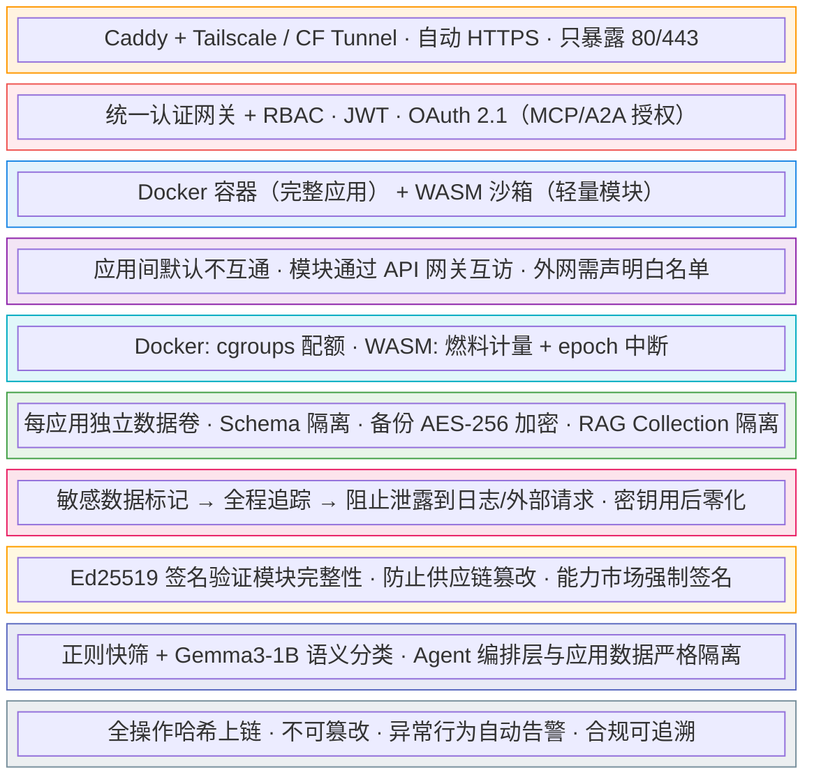

# DD-06：安全架构详细设计

> 模块路径：跨模块（安全能力分布在 DD-01 / DD-03 / DD-07 / DD-08 中） | 完整覆盖 MVP · v1.0 · v2.0
>
> **v7 新建文档**：从 DD-01 抽出安全架构总纲，独立为安全架构文档。核心安全机制（Merkle 审计链、密钥保险库、污点追踪）的实现仍在 DD-01，本文档定义安全架构全景、威胁模型和防护策略。v7 重点：新增三个协议层（A2A、AG-UI/A2UI、MCP Elicitation）的攻击面覆盖。

---

## 1 安全架构定位

安全架构是 BitEngine 的两大护城河之一（另一个是意图编排）。Merkle 审计链 + 污点追踪是竞品完全无覆盖的独有能力。

本文档的职责：
- 定义十层纵深防御架构（全局安全框架）
- 定义各协议层的威胁模型和防护策略
- 规定安全实现在各 DD 中的分布
- v7 新增：覆盖新协议（A2A、AG-UI/A2UI、MCP Elicitation）的攻击面

---

## 2 十层纵深防御架构



**安全实现分布**：

| 层次 | 实现位置 | DD 文档 |
|------|---------|---------|
| 第 1 层：网络边界 | Caddy 反向代理 + Tailscale | DD-01 §3 |
| 第 2 层：认证授权 | JWT + RBAC + OAuth 2.1 | DD-01 §2 |
| 第 3 层：双层隔离 | Docker + WASM | DD-01 §16-20 |
| 第 4 层：网络隔离 | Docker network | DD-01 §17 |
| 第 5 层：资源计量 | cgroups + Wazero fuel | DD-01 §18/§20 |
| 第 6 层：数据隔离 | PG Schema + AES-256 | DD-01 §6 / DD-04 §6.4 |
| 第 7 层：污点追踪 | 数据标记 + 零化 | DD-01 §9 |
| 第 8 层：清单签名 | Ed25519 | DD-08 §12 |
| 第 9 层：提示注入扫描 | 正则 + LLM 分类 | DD-02 §16 |
| 第 10 层：Merkle 审计链 | SQLite append-only | DD-01 §7 |

---

## 3 新协议攻击面防护（v7 新增）

v7 新增的协议层（A2A、AG-UI/A2UI、MCP Elicitation）带来新的攻击面。**把护城河的防线延伸到新的协议边界。**

### 3.1 威胁模型总表

| 新协议面 | 威胁模型 | 攻击示例 | 防护措施 | 实现位置 |
|---------|---------|---------|---------|---------|
| **Google A2A** | 外部 Agent 伪造身份 | 伪造 Agent Card 声称是"Salesforce Agent" | A2A Agent Card 签名验证（v0.3 安全卡） | DD-03 §4 |
| | 恶意任务注入 | 外部 Agent 发送"删除所有应用"任务 | 外部 Agent 信任等级分层 + A2H 审批 | DD-03 §5 |
| | Agent Card 欺骗 | 发布虚假技能列表诱导调用 | Agent Card 签名 + 能力验证 | DD-03 §4 |
| **A2UI** | 恶意组件类型注入 | Agent 尝试渲染 `<script>` 组件 | 可信组件目录白名单 | DD-08 §8 |
| | UI 诱导攻击 | 伪装审批按钮诱导用户点击 | A2UI JSON Schema 强制校验 | DD-08 §8 |
| **MCP Elicitation** | 钓鱼式 Elicitation | 构造仿冒登录表单收集密码 | Elicitation 来源验证（仅授权 MCP Server） | DD-07 §4 |
| | 恶意 URL 重定向 | URL mode 引导到仿冒页面 | URL 白名单机制 | DD-07 §4 |
| | 敏感信息滥采 | 频繁请求银行卡号等信息 | 敏感字段标记 + 审计 | DD-07 §4 |
| **AG-UI** | 事件注入/篡改 | 伪造 Agent 状态更新事件 | AG-UI 事件流完整性校验 | DD-08 §7 |
| | 伪造 Agent 身份 | 冒充 Intent Engine 发送事件 | OAuth 2.1 token 绑定 | DD-01 §2 |
| **跨协议攻击** | 绕过 A2H 审批 | 外部 A2A Agent 试图直接执行高危操作 | **核心规则：所有外部来源的执行请求必须过 Governance Agent + A2H 审批** | DD-03 §4/§7 |

### 3.2 核心安全规则

**规则 1：外部请求统一审批**

所有外部来源的执行请求，无论通过 MCP、A2A 还是 REST API 进入，都必须经过 Governance Agent 的风险评估和 A2H 审批——不因来源是"Agent"就跳过人机确认。

```
外部 A2A Agent → A2A Server → Governance Agent 风险评估
  → high risk → A2H AUTHORIZE（人工审批）
  → medium risk → A2H INFORM（通知 + 自动放行）
  → low risk → 直接执行（审计记录）
```

**规则 2：A2UI 声明式安全**

A2UI 是纯声明式 JSON，不是可执行代码。前端维护可信组件目录（Trusted Component Catalog），Agent 只能引用目录中已注册的组件类型。

```
Agent 输出: {"type": "chart", "chartType": "line", ...}  → ✅ 渲染
Agent 输出: {"type": "script", "code": "alert('xss')"}   → ❌ 拒绝（不在目录中）
Agent 输出: {"type": "iframe", "src": "evil.com"}        → ❌ 拒绝（不在目录中）
```

**规则 3：Elicitation 最小权限**

MCP Elicitation 请求只允许已授权 MCP Server 发起。URL mode 目标必须在白名单内。敏感字段（password、token、secret）自动标记并审计。

### 3.3 外部 Agent 信任等级

| 信任等级 | 来源 | 权限 | 审批要求 |
|---------|------|------|---------|
| **可信** | 平台内部 Agent | 全部 | 按 A2H 策略（高危仍需审批） |
| **半可信** | 已注册的外部 A2A Agent（Agent Card 签名验证通过） | 读取 + 受限执行 | 所有写操作需 A2H 审批 |
| **不可信** | 未注册的外部请求 | 仅读取 | 所有操作需 A2H 审批 |

---

## 4 AI 相关安全

### 4.1 提示注入防护

- Agent 编排层和应用运行层严格分离：应用内数据不流入 Agent prompt
- 云端 API 调用只传脱敏后的需求描述，不传业务数据
- 专用提示注入扫描器（DD-02 §16）：正则快筛 + Gemma3-1B 语义分类
- Structured Output 约束消除格式解析异常路径

### 4.2 AI 生成代码安全审查

- 云端生成代码 → 本地 Phi-4-mini 自动审查（DD-02 §6）
- security_score 0-100 + 分级 issues
- critical 阻断部署，warning 需 A2H AUTHORIZE 确认
- 审查项：硬编码密钥、SQL 注入、XSS、未授权网络访问、危险系统调用

### 4.3 RAG 知识库隔离

- 每应用 Collection 严格隔离（DD-04 §6.4）
- 嵌入模型强制本地运行，文档永不离开设备
- 向量存储 AES-256-GCM 加密
- RAG 查询结果经脱敏后才注入 LLM prompt

### 4.4 模块供应链安全

- Ed25519 清单签名验证模块完整性（DD-08 §12）
- 模块行为受容器/WASM 沙箱约束
- 网络访问监控和限制
- 生态导入自动安全扫描（DD-02 §13.3）

---

## 5 审计事件覆盖

v7 新增的协议操作必须纳入 Merkle 审计链：

| 事件类型 | 说明 | v7 状态 |
|---------|------|--------|
| `a2a.task.received` | 收到外部 A2A 任务 | **v7 新增** |
| `a2a.task.completed` | A2A 任务完成 | **v7 新增** |
| `a2a.task.rejected` | A2A 任务被拒绝（Governance 或人工） | **v7 新增** |
| `a2a.agent_card.verified` | Agent Card 签名验证 | **v7 新增** |
| `mcp.elicitation.sent` | MCP Elicitation 请求发出 | **v7 新增** |
| `mcp.elicitation.responded` | 用户响应 Elicitation | **v7 新增** |
| `a2ui.component.blocked` | A2UI 组件类型被可信目录拒绝 | **v7 新增** |
| `governance.review` | Governance Agent 审查记录 | **v7 新增** |
| `a2h.authorize` | A2H 授权（已有） | 不变 |
| `auth.login` / `app.created` / etc. | 平台核心事件（已有） | 不变 |

---

## 6 测试策略

| 类型 | 覆盖 | 工具 |
|------|------|------|
| 安全测试 | 伪造 A2A Agent Card → 签名验证拒绝 | 攻击模拟 |
| 安全测试 | A2UI 未注册组件类型 → 渲染拒绝 | DD-08 组件测试 |
| 安全测试 | MCP Elicitation URL 非白名单 → 拒绝 | DD-07 白名单测试 |
| 安全测试 | 外部 A2A 任务试图跳过 A2H 审批 → 拒绝 | DD-03 E2E 测试 |
| 安全测试 | 跨协议攻击：A2A → MCP → 绕过 Governance → 被拦截 | 全栈攻击模拟 |
| 渗透测试 | 十层纵深防御完整穿透测试 | 外部安全审计 |
| 合规测试 | Merkle 审计链完整性 + v7 新增事件覆盖 | 链校验 + 事件审计 |
