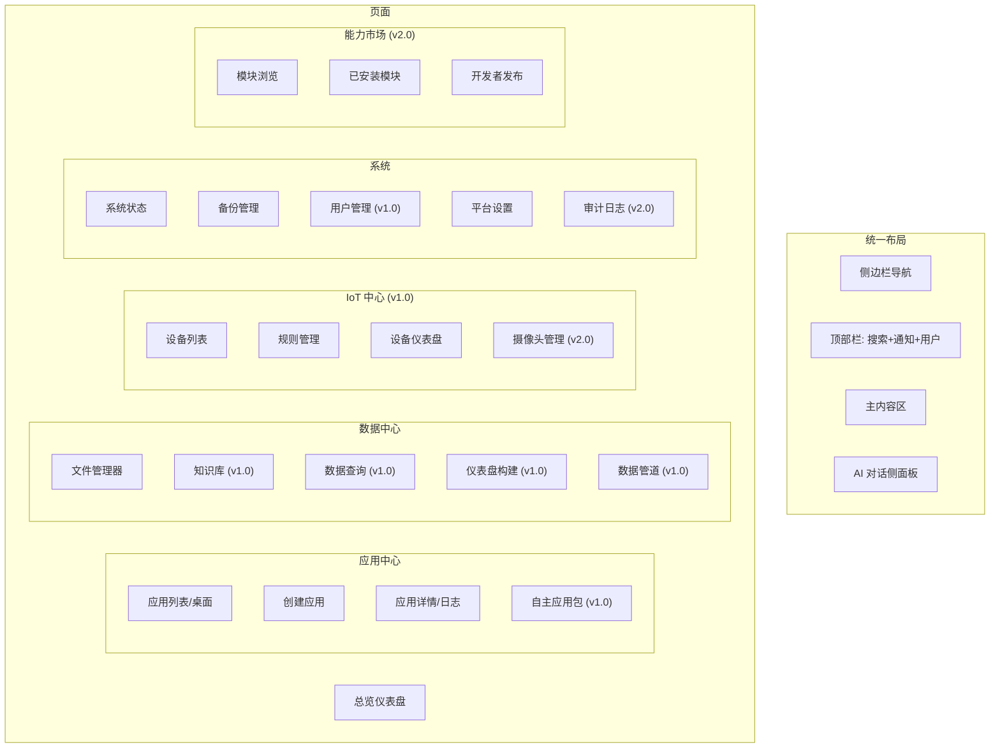
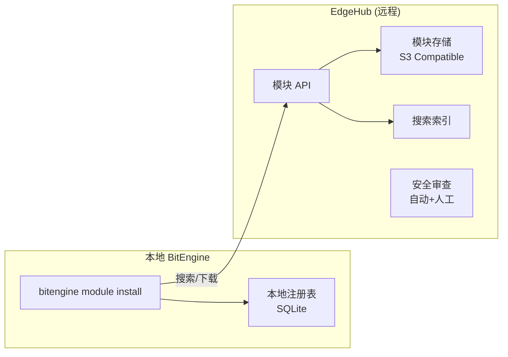

# DD-08：前端架构详细设计

> 模块路径：`web/console/` + `internal/market/` | 完整覆盖 MVP · v1.0 · v2.0
>
> **v7 变更（中改）**：前端交互层对齐 AG-UI + A2UI 行业标准协议栈。A2UI Renderer 增加可信组件目录安全机制。新增语音输入按钮（Web Speech API）、图片/视频上传→意图识别、媒体库浏览与检索组件。IoT 实时数据推送从 Redis→WebSocket 改为 MQTT 5.0→WebSocket。功能归属表增加渲染方式列。

---

## 1 模块职责

前端是用户与 BitEngine 交互的唯一入口。能力市场是平台生态扩展的基础设施。

**v7 核心原则**：做薄不是做残——内置 UI 必须独立完成所有核心操作，Open WebUI 是可选增强。前端交互层对齐 AG-UI + A2UI 行业标准，独有组件通过 A2UI 声明式渲染，任何兼容客户端都能展示。

| 子系统 | 职责 | 阶段 |
|--------|------|------|
| console | Web 管理桌面 (React SPA) | MVP |
| ai_panel | AI 对话侧面板 + SSE 进度 | MVP |
| app_pages | 应用中心页面 (桌面/创建/详情) | MVP |
| data_pages | 数据中心页面 (文件管理) | MVP |
| sys_pages | 系统页面 (状态/备份/设置) | MVP |
| **voice_input** | **语音输入按钮（Web Speech API）（v7 新增）** | **v1.0** |
| **media_pages** | **媒体库浏览与检索（视频/音频/图片）（v7 新增）** | **v1.0** |
| iot_pages | IoT 中心页面 (设备/规则/仪表盘) | v1.0 |
| data_pages_v2 | 数据中心扩展 (知识库/查询/管道/可视化) | v1.0 |
| agui_renderer | AG-UI 事件流渲染器（v7：对齐 CopilotKit 标准） | v1.0 |
| a2ui_renderer | A2UI 声明式 UI 渲染器（v7：对齐 Google 标准 + 可信组件目录） | v1.0 |
| pwa | PWA 离线支持 + 移动端适配 | v1.0 |
| user_mgmt | 多用户管理页面 | v1.0 |
| market_registry | 本地模块注册表 | v2.0 |
| market_hub | EdgeHub 远程市场 | v2.0 |
| market_publish | 开发者发布工具 | v2.0 |
| enterprise | 企业版功能 (合规审计/多租户) | v2.0 |
| **webllm** | **WebLLM 浏览器端推理（WebGPU + Gemma3-1B）（从 DD-06 迁入）** | **v2.0** |
| **chatbridge** | **聊天桥接 UI（微信/Telegram/WhatsApp Bot 配置）（从 DD-07 迁入）** | **v2.0** |

**各功能归属明细（v7 新增）**：

| 功能 | 内置 UI | Open WebUI（可选） | 渲染方式 |
|------|---------|-------------------|---------|
| 意图输入（文本+语音+图片+视频） | ✅ 完整 | 更丰富的对话体验 | 原生组件 |
| AI 对话（流式+历史） | ✅ 完整 | 多模型切换、分支、搜索 | AG-UI 事件流 |
| 应用生成进度卡片 | ✅ **独有** | — | A2UI 声明式 |
| A2H 确认弹窗 | ✅ **独有** | — | A2UI 声明式 |
| 意图协商表单 | ✅ **独有** | MCP Elicitation 原生 | A2UI / MCP Elicitation |
| 设备控制面板 | ✅ **独有** | — | A2UI 声明式 |
| 媒体库浏览与检索 | ✅ **独有** | — | 原生组件 |
| Workflow 可视化 | ✅ **独有** | — | A2UI 声明式 |
| Intent Trace 瀑布图 | ✅ **独有** | — | 原生组件 |
| 知识库管理 | ✅ 基本 | 更完善的 RAG 管理 | 原生组件 |
| 模型管理 | ✅ 基本配置 | 多模型路由、细粒度权限 | 原生组件 |
| 系统设置 | ✅ 完整 | — | 原生组件 |

---

## 2 技术栈

| 组件 | 选型 | 说明 |
|------|------|------|
| 框架 | React 19 + TypeScript | 生态成熟、组件丰富 |
| 构建 | Vite 6 | 极速 HMR、ESM 原生 |
| 状态 | Zustand | 轻量、不过度抽象 |
| 样式 | Tailwind CSS | 原子化 CSS、快速开发 |
| 路由 | React Router v7 | 标准方案 |
| 图表 | ECharts / Recharts | 仪表盘可视化 |
| 实时通信 | WebSocket (原生) | AG-UI + A2H + 系统通知 |
| UI 组件 | shadcn/ui | 可定制、不黑盒 |
| 表格 | TanStack Table | 虚拟滚动、排序、过滤 |
| 表单 | React Hook Form + Zod | 表单验证 |

---

## 3 页面结构



### 3.1 路由表

```typescript
// web/console/src/router.tsx

const routes = [
  { path: "/",              element: <Dashboard /> },

  // 应用中心
  { path: "/apps",          element: <AppList /> },
  { path: "/apps/new",      element: <AppCreate /> },
  { path: "/apps/:id",      element: <AppDetail /> },
  { path: "/apps/packs",    element: <AutonomousPacks /> },      // v1.0

  // 数据中心
  { path: "/data/files",    element: <FileManager /> },           // MVP
  { path: "/data/kb",       element: <KnowledgeBase /> },         // v1.0
  { path: "/data/query",    element: <DataQuery /> },             // v1.0
  { path: "/data/dashboards", element: <DashboardList /> },       // v1.0
  { path: "/data/dashboards/:id", element: <DashboardBuilder /> }, // v1.0
  { path: "/data/pipelines", element: <PipelineManager /> },      // v1.0

  // IoT 中心
  { path: "/iot/devices",   element: <DeviceList /> },            // v1.0
  { path: "/iot/devices/:id", element: <DeviceDetail /> },        // v1.0
  { path: "/iot/rules",     element: <RuleList /> },              // v1.0
  { path: "/iot/dash",      element: <IoTDashboard /> },          // v1.0
  { path: "/iot/cameras",   element: <CameraManager /> },         // v2.0

  // 系统
  { path: "/system",        element: <SystemStatus /> },
  { path: "/system/backup", element: <BackupManager /> },
  { path: "/system/users",  element: <UserManager /> },           // v1.0
  { path: "/system/audit",  element: <AuditViewer /> },           // v2.0
  { path: "/settings",      element: <Settings /> },

  // 能力市场 (v2.0)
  { path: "/market",        element: <MarketBrowse /> },
  { path: "/market/installed", element: <MarketInstalled /> },
  { path: "/market/publish", element: <MarketPublish /> },

  // 登录
  { path: "/login",         element: <Login /> },
];
```

---

## 4 核心 UI 组件 (MVP)

### 4.1 AI 对话面板

全局可展开的侧面板，随时与 AI 对话。

```typescript
// web/console/src/components/AIPanel.tsx

interface AIPanelProps {
  isOpen: boolean;
  onClose: () => void;
}

// SSE 事件流处理
function useAIStream() {
  const [messages, setMessages] = useState<Message[]>([]);
  const [isStreaming, setIsStreaming] = useState(false);

  const sendMessage = async (text: string) => {
    setIsStreaming(true);
    setMessages(prev => [...prev, { role: "user", content: text }]);

    const response = await fetch("/api/v1/ai/chat", {
      method: "POST",
      headers: { "Content-Type": "application/json" },
      body: JSON.stringify({ message: text }),
    });

    const reader = response.body!.getReader();
    const decoder = new TextDecoder();
    let assistantMsg = "";

    while (true) {
      const { done, value } = await reader.read();
      if (done) break;

      const chunk = decoder.decode(value);
      const lines = chunk.split("\n");
      for (const line of lines) {
        if (!line.startsWith("data: ")) continue;
        const event = JSON.parse(line.slice(6));

        switch (event.type) {
          case "TEXT_MESSAGE_STREAM":
            assistantMsg += event.data.content;
            setMessages(prev => {
              const updated = [...prev];
              const last = updated[updated.length - 1];
              if (last?.role === "assistant") {
                last.content = assistantMsg;
              } else {
                updated.push({ role: "assistant", content: assistantMsg });
              }
              return updated;
            });
            break;
          case "TOOL_CALL":
            // 展示工具调用进度
            break;
          case "GENERATIVE_UI":
            // 渲染 A2UI 组件 (v1.0)
            break;
        }
      }
    }
    setIsStreaming(false);
  };

  return { messages, isStreaming, sendMessage };
}
```

### 4.2 应用生成进度条

```typescript
// web/console/src/components/AppGenProgress.tsx

interface GenerationPhase {
  phase: string;
  status: "pending" | "running" | "done" | "error";
  display: string;
}

const PHASES: GenerationPhase[] = [
  { phase: "intent",    status: "pending", display: "理解需求" },
  { phase: "codegen",   status: "pending", display: "生成代码" },
  { phase: "review",    status: "pending", display: "安全审查" },
  { phase: "authorize", status: "pending", display: "等待确认" },
  { phase: "deploy",    status: "pending", display: "部署应用" },
];

function AppGenProgress({ appId }: { appId: string }) {
  const [phases, setPhases] = useState(PHASES);

  useEffect(() => {
    // SSE: /api/v1/apps/{appId}/progress
    const es = new EventSource(`/api/v1/apps/${appId}/progress`);
    es.onmessage = (event) => {
      const data = JSON.parse(event.data);
      setPhases(prev => prev.map(p =>
        p.phase === data.phase ? { ...p, status: data.status } : p
      ));
    };
    return () => es.close();
  }, [appId]);

  return (
    <div className="space-y-3">
      {phases.map(p => (
        <div key={p.phase} className="flex items-center gap-3">
          <StatusIcon status={p.status} />
          <span>{p.display}</span>
        </div>
      ))}
    </div>
  );
}
```

### 4.3 A2H 确认弹窗

```typescript
// web/console/src/components/A2HDialog.tsx

interface A2HMessage {
  id: string;
  intent: "INFORM" | "COLLECT" | "AUTHORIZE" | "ESCALATE" | "RESULT";
  title: string;
  body: string;
  risk: "low" | "medium" | "high";
  options?: { label: string; value: string; style: string }[];
}

function A2HDialog({ message, onRespond }: {
  message: A2HMessage;
  onRespond: (value: string) => void;
}) {
  const riskStyles = {
    low: "border-blue-200",
    medium: "border-yellow-400",
    high: "border-red-500 bg-red-50",
  };

  return (
    <Dialog open>
      <DialogContent className={`${riskStyles[message.risk]}`}>
        <DialogTitle>{message.title}</DialogTitle>
        <DialogDescription>{message.body}</DialogDescription>
        {message.options && (
          <div className="flex gap-2 mt-4">
            {message.options.map(opt => (
              <Button
                key={opt.value}
                variant={opt.style === "danger" ? "destructive" : "default"}
                onClick={() => onRespond(opt.value)}
              >
                {opt.label}
              </Button>
            ))}
          </div>
        )}
      </DialogContent>
    </Dialog>
  );
}
```

### 4.4 应用卡片

```typescript
// web/console/src/components/AppCard.tsx

interface AppInfo {
  id: string;
  name: string;
  description: string;
  status: "running" | "stopped" | "building" | "error";
  cpu_percent: number;
  memory_mb: number;
  url: string;
}

function AppCard({ app }: { app: AppInfo }) {
  const statusColor = {
    running: "bg-green-500",
    stopped: "bg-gray-400",
    building: "bg-yellow-500",
    error: "bg-red-500",
  };

  return (
    <Card className="hover:shadow-md transition-shadow cursor-pointer">
      <CardHeader className="pb-2">
        <div className="flex items-center justify-between">
          <CardTitle className="text-base">{app.name}</CardTitle>
          <span className={`w-2 h-2 rounded-full ${statusColor[app.status]}`} />
        </div>
        <CardDescription className="text-sm line-clamp-2">
          {app.description}
        </CardDescription>
      </CardHeader>
      <CardContent className="text-xs text-muted-foreground">
        <span>CPU {app.cpu_percent}% · RAM {app.memory_mb}MB</span>
      </CardContent>
    </Card>
  );
}
```

---

## 5 WebSocket 实时通信层

```typescript
// web/console/src/lib/ws.ts

type WSEventType = "a2h" | "agui" | "notification" | "app_status" | "iot_state";

interface WSEvent {
  type: WSEventType;
  data: any;
}

class BitEngineWS {
  private ws: WebSocket | null = null;
  private handlers: Map<WSEventType, ((data: any) => void)[]> = new Map();
  private reconnectTimer: number | null = null;

  connect(sessionID: string) {
    const url = `${location.protocol === "https:" ? "wss:" : "ws:"}//${location.host}/ws?session=${sessionID}`;
    this.ws = new WebSocket(url);

    this.ws.onmessage = (event) => {
      const msg: WSEvent = JSON.parse(event.data);
      const fns = this.handlers.get(msg.type) || [];
      fns.forEach(fn => fn(msg.data));
    };

    this.ws.onclose = () => {
      this.reconnectTimer = window.setTimeout(() => this.connect(sessionID), 3000);
    };
  }

  on(type: WSEventType, handler: (data: any) => void) {
    const list = this.handlers.get(type) || [];
    list.push(handler);
    this.handlers.set(type, list);
  }

  send(data: any) {
    this.ws?.send(JSON.stringify(data));
  }
}

export const ws = new BitEngineWS();
```

**v7 变更：IoT 实时数据推送**

IoT 设备状态实时更新从 Redis→WebSocket 改为 **MQTT 5.0→WebSocket**（Mosquitto 内嵌 WebSocket 端口 9001）。前端可直接通过 MQTT over WebSocket 订阅设备事件，也可通过现有 WebSocket Hub 间接接收（Bridge 转发）。

```typescript
// web/console/src/lib/mqtt-ws.ts (v7 新增)
// 可选：前端直接订阅 MQTT over WebSocket（端口 9001）
import mqtt from "mqtt";

const mqttClient = mqtt.connect("ws://bitengine.local:9001");
mqttClient.subscribe("bitengine/devices/#");
mqttClient.on("message", (topic, payload) => {
  const deviceEvent = JSON.parse(payload.toString());
  useStore.getState().updateDeviceState(deviceEvent.device_id, deviceEvent);
});
```

---

## 6 状态管理

```typescript
// web/console/src/store/index.ts

import { create } from "zustand";

interface AppState {
  // 应用列表
  apps: AppInfo[];
  setApps: (apps: AppInfo[]) => void;
  updateAppStatus: (id: string, status: string) => void;

  // AI 面板
  aiPanelOpen: boolean;
  toggleAIPanel: () => void;

  // A2H 消息队列
  a2hMessages: A2HMessage[];
  pushA2H: (msg: A2HMessage) => void;
  removeA2H: (id: string) => void;

  // IoT 设备 (v1.0)
  devices: Device[];
  setDevices: (devices: Device[]) => void;

  // 系统状态
  systemMetrics: SystemMetrics | null;
  setSystemMetrics: (m: SystemMetrics) => void;

  // 当前用户
  user: User | null;
  setUser: (u: User) => void;
}

export const useStore = create<AppState>((set) => ({
  apps: [],
  setApps: (apps) => set({ apps }),
  updateAppStatus: (id, status) =>
    set((s) => ({
      apps: s.apps.map((a) => (a.id === id ? { ...a, status } : a)),
    })),

  aiPanelOpen: false,
  toggleAIPanel: () => set((s) => ({ aiPanelOpen: !s.aiPanelOpen })),

  a2hMessages: [],
  pushA2H: (msg) => set((s) => ({ a2hMessages: [...s.a2hMessages, msg] })),
  removeA2H: (id) => set((s) => ({ a2hMessages: s.a2hMessages.filter((m) => m.id !== id) })),

  devices: [],
  setDevices: (devices) => set({ devices }),

  systemMetrics: null,
  setSystemMetrics: (m) => set({ systemMetrics: m }),

  user: null,
  setUser: (u) => set({ user: u }),
}));
```

---

## 7 AG-UI 事件流渲染器 (v1.0)

> v7 变更：AG-UI 从"我们的实时通信实现"升级为"对齐 CopilotKit 开放协议标准"。所有 Agent→Frontend 的运行时通信通过 AG-UI 事件流传输，包括 token streaming、工具调用状态、A2UI 声明式 UI、INTERRUPT→A2H 桥接。

```typescript
// web/console/src/components/agui/AGUIRenderer.tsx

interface AGUIEvent {
  type: string;
  data: any;
  run_id: string;
}

function AGUIRenderer({ events }: { events: AGUIEvent[] }) {
  return (
    <div className="space-y-2">
      {events.map((event, i) => {
        switch (event.type) {
          case "TEXT_MESSAGE_STREAM":
            return <TextStream key={i} content={event.data.content} done={event.data.done} />;
          case "TOOL_CALL":
            return <ToolCallIndicator key={i} tool={event.data.tool_name} status={event.data.status} />;
          case "TOOL_CALL_RESULT":
            return <ToolResult key={i} tool={event.data.tool_name} result={event.data.result} />;
          case "STATE_DELTA":
            return null; // State deltas are applied silently
          case "INTERRUPT":
            return <InterruptBanner key={i} messageId={event.data.message_id} />;
          case "GENERATIVE_UI":
            return <A2UIRenderer key={i} spec={event.data} />;
          case "RUN_STARTED":
            return <RunIndicator key={i} status="running" />;
          case "RUN_FINISHED":
            return <RunIndicator key={i} status="done" />;
          default:
            return null;
        }
      })}
    </div>
  );
}

function ToolCallIndicator({ tool, status }: { tool: string; status: string }) {
  return (
    <div className="flex items-center gap-2 text-sm text-muted-foreground py-1">
      {status === "running" ? <Spinner className="w-3 h-3" /> : <CheckIcon className="w-3 h-3 text-green-500" />}
      <span>调用工具: {tool}</span>
    </div>
  );
}
```

---

## 8 A2UI 声明式 UI 渲染器 (v1.0)

> v7 变更：A2UI 从"我们的声明式 UI 实现"升级为"对齐 Google A2UI 开放规范"。新增可信组件目录（Trusted Component Catalog）安全机制——Agent 只能引用目录中已注册的组件类型，不能注入任意代码。

纯声明式 JSON → 原生 React 组件。Agent 无法注入任意代码。

```typescript
// web/console/src/components/a2ui/A2UIRenderer.tsx

interface A2UISpec {
  type: string;
  properties: Record<string, any>;
  children?: A2UISpec[];
  data?: any;
  actions?: { label: string; action_id: string; style: string }[];
}

const COMPONENT_MAP: Record<string, React.FC<any>> = {
  layout:  A2UILayout,
  chart:   A2UIChart,
  table:   A2UITable,
  form:    A2UIForm,
  card:    A2UICard,
  metric:  A2UIMetric,
  text:    A2UIText,
};

// v7: 可信组件目录（Trusted Component Catalog）
// Agent 只能引用此目录中的组件类型。未注册的类型会被拒绝渲染。
// 这是 A2UI 安全模型的核心——声明式数据格式 + 可信组件白名单 = 零代码注入风险。
const TRUSTED_COMPONENT_TYPES = new Set(Object.keys(COMPONENT_MAP));

function A2UIRenderer({ spec, onAction }: { spec: A2UISpec; onAction?: (actionId: string) => void }) {
  // v7: 可信组件目录校验
  if (!TRUSTED_COMPONENT_TYPES.has(spec.type)) {
    console.warn(`A2UI: component type "${spec.type}" not in Trusted Component Catalog, rendering blocked`);
    return <div className="text-sm text-red-500">不支持的组件类型: {spec.type}</div>;
  }
  
  const Component = COMPONENT_MAP[spec.type];

  return (
    <Component {...spec.properties} data={spec.data}>
      {spec.children?.map((child, i) => (
        <A2UIRenderer key={i} spec={child} onAction={onAction} />
      ))}
      {spec.actions?.map(action => (
        <Button
          key={action.action_id}
          variant={action.style === "danger" ? "destructive" : "default"}
          onClick={() => onAction?.(action.action_id)}
          size="sm"
        >
          {action.label}
        </Button>
      ))}
    </Component>
  );
}

// 图表组件
function A2UIChart({ chartType, title, data, ...props }: any) {
  switch (chartType) {
    case "line":   return <LineChart data={data} {...props}><Line /><XAxis /><YAxis /></LineChart>;
    case "bar":    return <BarChart data={data} {...props}><Bar /><XAxis /><YAxis /></BarChart>;
    case "pie":    return <PieChart data={data} {...props}><Pie data={data} /></PieChart>;
    default:       return <div>不支持的图表类型: {chartType}</div>;
  }
}

// 表格组件
function A2UITable({ columns, sortable, data }: any) {
  return (
    <Table>
      <TableHeader>
        <TableRow>
          {columns.map((col: string) => <TableHead key={col}>{col}</TableHead>)}
        </TableRow>
      </TableHeader>
      <TableBody>
        {data?.map((row: any[], i: number) => (
          <TableRow key={i}>
            {row.map((cell, j) => <TableCell key={j}>{String(cell)}</TableCell>)}
          </TableRow>
        ))}
      </TableBody>
    </Table>
  );
}

// 指标组件
function A2UIMetric({ label, value, unit, trend, trendDirection }: any) {
  return (
    <div className="p-4 border rounded-lg">
      <p className="text-sm text-muted-foreground">{label}</p>
      <p className="text-2xl font-bold">{value}{unit && <span className="text-sm ml-1">{unit}</span>}</p>
      {trend && (
        <p className={`text-xs ${trendDirection === "up" ? "text-green-600" : "text-red-600"}`}>
          {trendDirection === "up" ? "↑" : "↓"} {trend}
        </p>
      )}
    </div>
  );
}
```

---

## 8.5 语音输入按钮（v7 新增）

前端集成浏览器 Web Speech API，实现麦克风按钮→实时转写→发送到 Intent Engine。v1.0 即可实现，零后端依赖，中文支持良好。

```typescript
// web/console/src/components/voice/VoiceButton.tsx

function VoiceButton({ onTranscript }: { onTranscript: (text: string) => void }) {
  const [listening, setListening] = useState(false);
  const recognitionRef = useRef<SpeechRecognition | null>(null);

  const toggle = () => {
    if (listening) {
      recognitionRef.current?.stop();
      setListening(false);
      return;
    }

    const SpeechRecognition = window.SpeechRecognition || window.webkitSpeechRecognition;
    if (!SpeechRecognition) {
      toast.error("浏览器不支持语音输入，请使用 Chrome/Edge/Safari");
      return;
    }

    const recognition = new SpeechRecognition();
    recognition.lang = navigator.language || "zh-CN";
    recognition.continuous = true;
    recognition.interimResults = true;

    recognition.onresult = (event) => {
      const last = event.results[event.results.length - 1];
      if (last.isFinal) {
        onTranscript(last[0].transcript);  // → Intent Input Adapter (audio_transcription)
      }
    };

    recognition.onerror = (event) => {
      console.error("Speech recognition error:", event.error);
      setListening(false);
    };

    recognitionRef.current = recognition;
    recognition.start();
    setListening(true);
  };

  return (
    <Button variant="ghost" size="icon" onClick={toggle} className={listening ? "text-red-500 animate-pulse" : ""}>
      <MicIcon className="w-5 h-5" />
    </Button>
  );
}
```

---

## 8.6 图片/视频上传→意图识别（v7 新增）

```typescript
// web/console/src/components/media/MediaUploader.tsx

function MediaUploader({ onIntentInput }: { onIntentInput: (input: IntentInput) => void }) {
  const handleUpload = async (file: File) => {
    const isImage = file.type.startsWith("image/");
    const isVideo = file.type.startsWith("video/");
    const isAudio = file.type.startsWith("audio/");

    if (isImage) {
      // 图片 → Ollama llava 多模态模型 → 描述文本 → image_description
      const description = await api.post("/api/v1/ai/describe-image", { file });
      onIntentInput({ type: "image_description", content: description, source: "web_ui" });
    } else if (isVideo || isAudio) {
      // 视频/音频 → DD-04 媒体入库管道（异步）
      const asset = await api.post("/api/v1/media/upload", { file });
      toast.info("媒体文件正在后台处理...");
      // 入库完成后，衍生内容可作为 video_analysis / audio_file 类型进入 Intent Engine
      onIntentInput({ type: isVideo ? "video_analysis" : "audio_file", content: asset.id, source: "web_ui", metadata: { media_ref: asset.id } });
    }
  };

  return (
    <DropZone accept="image/*,video/*,audio/*" onDrop={handleUpload}>
      <ImageIcon className="w-5 h-5" />
    </DropZone>
  );
}
```

---

## 8.7 媒体库浏览与检索（v7 新增）

用户的视频、音频、图片统一呈现在媒体库界面中。这是 Open WebUI 完全没有的能力——Open WebUI 的 RAG 只处理文档，不处理媒体文件。

```typescript
// web/console/src/pages/MediaLibrary.tsx

function MediaLibrary() {
  const [assets, setAssets] = useState<MediaAsset[]>([]);
  const [searchQuery, setSearchQuery] = useState("");
  const [filter, setFilter] = useState<{ type?: string; dateRange?: [Date, Date] }>({});

  // 语义搜索："找去年在日本拍的视频"
  const handleSearch = async () => {
    const results = await api.get("/api/v1/media", { params: { q: searchQuery, ...filter } });
    setAssets(results);
  };

  return (
    <PageLayout title="媒体库">
      {/* 搜索栏 */}
      <div className="flex gap-2 mb-4">
        <Input placeholder="语义搜索：找去年在日本拍的视频..." value={searchQuery} onChange={e => setSearchQuery(e.target.value)} />
        <FilterDropdown filter={filter} onChange={setFilter} />
        <Button onClick={handleSearch}>搜索</Button>
      </div>

      {/* 媒体网格 */}
      <div className="grid grid-cols-2 md:grid-cols-4 gap-4">
        {assets.map(asset => (
          <MediaCard key={asset.id} asset={asset} />
        ))}
      </div>
    </PageLayout>
  );
}

// 媒体卡片
function MediaCard({ asset }: { asset: MediaAsset }) {
  return (
    <Card className="cursor-pointer hover:ring-2 ring-primary">
      
      <CardContent className="p-2">
        <p className="text-sm font-medium truncate">{asset.source_file.path.split("/").pop()}</p>
        <div className="flex items-center gap-1 text-xs text-muted-foreground">
          <Badge variant="outline">{asset.type}</Badge>
          {asset.source_file.duration && <span>{formatDuration(asset.source_file.duration)}</span>}
          <IndexStatusBadge status={asset.index_status} />
        </div>
      </CardContent>
    </Card>
  );
}

// 视频播放器（带转写时间轴）
function MediaPlayer({ asset }: { asset: MediaAsset }) {
  const [currentTime, setCurrentTime] = useState(0);

  return (
    <div className="grid grid-cols-3 gap-4">
      {/* 视频/音频播放器 */}
      <div className="col-span-2">
        {asset.type === "video" ? (
          <video src={asset.source_file.path} controls onTimeUpdate={e => setCurrentTime(e.currentTarget.currentTime)} />
        ) : (
          <audio src={asset.source_file.path} controls onTimeUpdate={e => setCurrentTime(e.currentTarget.currentTime)} />
        )}
      </div>
      {/* 转写时间轴：点击文字跳转到对应时间点 */}
      <TranscriptTimeline transcript={asset.derived.transcript} currentTime={currentTime}
        onSeek={(time) => { /* 跳转播放器到指定时间 */ }} />
    </div>
  );
}

// 入库进度面板
function IngestStatusPanel() {
  const { data } = useSWR("/api/v1/media/ingest/status");
  return (
    <Card>
      <CardHeader><CardTitle>入库进度</CardTitle></CardHeader>
      <CardContent>
        {data?.jobs?.map((job: any) => (
          <div key={job.id} className="flex items-center gap-2 py-1">
            <span className="text-sm">{job.filename}</span>
            <Badge variant={job.phase === "fast" ? "default" : "secondary"}>{job.phase}</Badge>
            <Badge variant={job.status === "completed" ? "success" : "outline"}>{job.status}</Badge>
          </div>
        ))}
      </CardContent>
    </Card>
  );
}
```

| 子组件 | 功能 |
|-------|------|
| 媒体网格/列表视图 | 缩略图浏览，按类型/时间/地点/标签筛选 |
| 语义搜索框 | "找去年在日本拍的视频"→ 命中元数据+转写+帧描述 |
| 视频播放器 | 内置播放，支持跳转到特定时间点（RAG 命中片段定位） |
| 转写时间轴 | 视频/音频播放时同步显示转写文本，点击文字跳转 |
| 入库进度面板 | 显示后台媒体处理队列状态（快速索引 ✅ / 深度索引进行中） |

---

## 9 IoT 中心页面 (v1.0)

### 9.1 设备列表

```typescript
// web/console/src/pages/iot/DeviceList.tsx

function DeviceList() {
  const { devices, setDevices } = useStore();

  useEffect(() => {
    fetch("/api/v1/iot/devices").then(r => r.json()).then(setDevices);
  }, []);

  // 实时状态更新
  useEffect(() => {
    ws.on("iot_state", (data) => {
      setDevices(devices.map(d =>
        d.id === data.device_id
          ? { ...d, resources: { ...d.resources, [data.resource]: data.value } }
          : d
      ));
    });
  }, [devices]);

  return (
    <div className="grid grid-cols-1 md:grid-cols-2 lg:grid-cols-3 gap-4">
      {devices.map(device => (
        <DeviceCard key={device.id} device={device} />
      ))}
      <DiscoverButton onDiscover={() => fetch("/api/v1/iot/discover", { method: "POST" })} />
    </div>
  );
}
```

### 9.2 设备详情 (Tools + Resources)

```typescript
function DeviceDetail({ deviceId }: { deviceId: string }) {
  const [device, setDevice] = useState<DeviceDetail | null>(null);

  return (
    <div className="space-y-6">
      <DeviceHeader device={device} />

      {/* Resources: 实时状态 */}
      <section>
        <h3 className="text-lg font-semibold mb-3">设备状态</h3>
        <div className="grid grid-cols-2 md:grid-cols-4 gap-3">
          {device?.resources.map(res => (
            <MetricCard
              key={res.uri}
              label={res.description}
              value={res.current_value}
              lastUpdated={res.last_updated}
            />
          ))}
        </div>
      </section>

      {/* Tools: 设备控制 */}
      <section>
        <h3 className="text-lg font-semibold mb-3">设备控制</h3>
        <div className="space-y-2">
          {device?.tools.map(tool => (
            <ToolCallButton
              key={tool.name}
              tool={tool}
              onCall={(args) => fetch(`/api/v1/iot/devices/${deviceId}/tools/${tool.name}`, {
                method: "POST",
                body: JSON.stringify(args),
              })}
            />
          ))}
        </div>
      </section>
    </div>
  );
}
```

### 9.3 规则管理 (含自然语言创建)

```typescript
function RuleCreator() {
  const [nlInput, setNlInput] = useState("");
  const [generatedRule, setGeneratedRule] = useState<AutomationRule | null>(null);

  const generateRule = async () => {
    const resp = await fetch("/api/v1/iot/rules/generate", {
      method: "POST",
      body: JSON.stringify({ description: nlInput }),
    });
    setGeneratedRule(await resp.json());
  };

  return (
    <div className="space-y-4">
      <Textarea
        placeholder="用自然语言描述规则，例如：温度超过35度时开空调并通知我"
        value={nlInput}
        onChange={(e) => setNlInput(e.target.value)}
      />
      <Button onClick={generateRule}>AI 生成规则</Button>

      {generatedRule && (
        <RulePreview
          rule={generatedRule}
          onConfirm={() => fetch("/api/v1/iot/rules", {
            method: "POST",
            body: JSON.stringify(generatedRule),
          })}
          onEdit={(edited) => setGeneratedRule(edited)}
        />
      )}
    </div>
  );
}
```

---

## 10 数据中心扩展页面 (v1.0)

### 10.1 知识库管理

```typescript
function KnowledgeBase() {
  const [collections, setCollections] = useState<Collection[]>([]);
  const [searchQuery, setSearchQuery] = useState("");
  const [searchResults, setSearchResults] = useState<SearchHit[]>([]);

  const handleUpload = async (files: File[]) => {
    const formData = new FormData();
    files.forEach(f => formData.append("files", f));
    await fetch("/api/v1/kb/ingest", { method: "POST", body: formData });
    // 刷新集合列表
  };

  const handleSearch = async () => {
    const resp = await fetch("/api/v1/kb/search", {
      method: "POST",
      body: JSON.stringify({ query: searchQuery, top_k: 5 }),
    });
    setSearchResults(await resp.json());
  };

  return (
    <div className="grid grid-cols-3 gap-6">
      <div className="col-span-1">
        <CollectionList collections={collections} />
        <UploadZone onUpload={handleUpload} accept=".pdf,.docx,.txt,.md,.csv" />
      </div>
      <div className="col-span-2">
        <SearchBar value={searchQuery} onChange={setSearchQuery} onSearch={handleSearch} />
        <SearchResultList results={searchResults} />
      </div>
    </div>
  );
}
```

### 10.2 自然语言数据查询

```typescript
function DataQuery() {
  const [question, setQuestion] = useState("");
  const [result, setResult] = useState<QueryResult | null>(null);

  const handleQuery = async () => {
    const resp = await fetch("/api/v1/data/query", {
      method: "POST",
      body: JSON.stringify({ question }),
    });
    setResult(await resp.json());
  };

  return (
    <div className="space-y-4">
      <div className="flex gap-2">
        <Input
          placeholder="用自然语言提问，例如：上季度花销最高的三个类目"
          value={question}
          onChange={(e) => setQuestion(e.target.value)}
          className="flex-1"
        />
        <Button onClick={handleQuery}>查询</Button>
      </div>

      {result && (
        <>
          <div className="bg-muted p-3 rounded text-sm">
            <p className="font-medium">{result.summary}</p>
            <details className="mt-2 text-xs">
              <summary>查看 SQL</summary>
              <pre>{result.sql}</pre>
            </details>
          </div>
          <DataTable columns={result.columns} rows={result.rows} />
        </>
      )}
    </div>
  );
}
```

### 10.3 仪表盘构建器

```typescript
function DashboardBuilder({ dashboardId }: { dashboardId: string }) {
  const [dashboard, setDashboard] = useState<Dashboard | null>(null);
  const [editing, setEditing] = useState(false);

  // 拖拽网格布局
  return (
    <div>
      <DashboardToolbar
        onAddWidget={() => setEditing(true)}
        onAISuggest={async () => {
          const resp = await fetch("/api/v1/dashboards/suggest", {
            method: "POST",
            body: JSON.stringify({ description: "概览所有应用数据" }),
          });
          setDashboard(await resp.json());
        }}
      />

      <GridLayout cols={12} rowHeight={100}>
        {dashboard?.layout.map(widget => (
          <div key={widget.id} data-grid={{ x: widget.position.x, y: widget.position.y, w: widget.position.w, h: widget.position.h }}>
            <WidgetRenderer widget={widget} />
          </div>
        ))}
      </GridLayout>
    </div>
  );
}
```

---

## 11 PWA 离线支持 (v1.0)

```typescript
// web/console/vite.config.ts (PWA 配置)

import { VitePWA } from "vite-plugin-pwa";

export default defineConfig({
  plugins: [
    react(),
    VitePWA({
      registerType: "autoUpdate",
      manifest: {
        name: "BitEngine Manager",
        short_name: "BitEngine",
        description: "AI-Native Personal Application Platform",
        theme_color: "#4F46E5",
        display: "standalone",
        icons: [
          { src: "/icon-192.png", sizes: "192x192", type: "image/png" },
          { src: "/icon-512.png", sizes: "512x512", type: "image/png" },
        ],
      },
      workbox: {
        runtimeCaching: [
          {
            urlPattern: /^\/api\/v1\/apps$/,
            handler: "NetworkFirst",        // 应用列表: 优先网络, 离线用缓存
            options: { cacheName: "api-apps" },
          },
          {
            urlPattern: /^\/api\/v1\/iot\/devices$/,
            handler: "NetworkFirst",
            options: { cacheName: "api-iot" },
          },
        ],
      },
    }),
  ],
});
```

### 11.1 移动端适配

```typescript
// 响应式布局断点
// - sm (640px): 手机横屏
// - md (768px): 平板竖屏
// - lg (1024px): 平板横屏 / 小笔记本
// - xl (1280px): 桌面

// 移动端侧边栏: 底部 Tab 导航
function MobileNavigation() {
  return (
    <nav className="fixed bottom-0 left-0 right-0 bg-white border-t md:hidden">
      <div className="flex justify-around py-2">
        <NavTab icon={<HomeIcon />} label="首页" to="/" />
        <NavTab icon={<GridIcon />} label="应用" to="/apps" />
        <NavTab icon={<DatabaseIcon />} label="数据" to="/data/files" />
        <NavTab icon={<CpuIcon />} label="IoT" to="/iot/devices" />
        <NavTab icon={<MessageIcon />} label="AI" onClick={toggleAIPanel} />
      </div>
    </nav>
  );
}
```

---

## 12 能力市场 (v2.0)

### 12.1 模块规范 (EdgeModule Spec v2)

```
module-name/
├── MODULE.md          # 人类可读说明 + AI 可解析的能力描述
├── manifest.toml      # 机器可读清单
├── signature.sig      # Ed25519 签名
├── src/
├── Dockerfile         # Docker 模块
├── module.wasm        # 或 WASM 模块
└── tests/
```

```toml
# manifest.toml
[module]
name = "chart-engine"
version = "1.2.0"
type = "WasmModule"           # App | WasmModule | DockerModule
description = "通用图表渲染引擎"
author = "bitengine-team"
license = "MIT"

[capabilities]
tools = [
  { name = "render_chart", description = "渲染图表为 PNG/SVG", input_schema = "..." },
]

[resources]
memory_mb = 8
cpu_percent = 5

[compatibility]
bitengine_min = "0.1.0"
```

### 12.2 EdgeHub 架构



### 12.3 模块生命周期

```go
// internal/market/registry/lifecycle.go

type ModuleLifecycle interface {
    Search(ctx context.Context, query string) ([]ModuleSummary, error)
    Install(ctx context.Context, moduleRef string) error       // "chart-engine@1.2.0"
    Uninstall(ctx context.Context, moduleName string) error
    Update(ctx context.Context, moduleName string) error
    List(ctx context.Context) ([]InstalledModule, error)
}

func (l *lifecycle) Install(ctx context.Context, ref string) error {
    // 1. 从 EdgeHub 下载模块包
    pkg, _ := l.hub.Download(ctx, ref)
    // 2. 验证 Ed25519 签名
    if !l.verifySignature(pkg) {
        return ErrModuleSignatureInvalid
    }
    // 3. 安全扫描 (与 DD-03 生态导入相同的 SecurityScanner)
    scanResult, _ := l.scanner.Scan(pkg)
    if scanResult.Verdict == "reject" {
        return ErrModuleSecurityRejected
    }
    // 4. 根据 type 部署
    switch pkg.Manifest.Type {
    case "WasmModule":
        l.wasmRuntime.Deploy(ctx, pkg)
    case "DockerModule":
        l.dockerRuntime.Deploy(ctx, pkg)
    }
    // 5. 注册到本地注册表
    l.registry.Add(ctx, pkg.Manifest)
    // 6. 自动注册为 MCP Tool (如有 tools 声明)
    for _, tool := range pkg.Manifest.Capabilities.Tools {
        l.mcpServer.RegisterTool(tool)
    }
    // 7. 发布事件
    l.eventBus.Publish(ctx, "module.installed", pkg.Manifest)
    return nil
}
```

### 12.4 生态适配器

```go
// 适配 OpenClaw Skills (13000+ 生态)
type ClawHubAdapter struct {
    registryURL string
}

func (a *ClawHubAdapter) Convert(skill ClawSkill) EdgeModule {
    // SKILL.md → MODULE.md
    // script → Docker 容器 (安全沙箱)
}

// 适配 OpenFang Hands
type FangHubAdapter struct {
    registryURL string
}

func (a *FangHubAdapter) Convert(hand FangHand) EdgeModule {
    // HAND.toml → manifest.toml
    // SOP → Cron 任务
}
```

### 12.5 开发者发布工具 (v2.0)

```go
// internal/market/publish/publisher.go

type PublishRequest struct {
    ModulePath string `json:"module_path"` // 本地模块目录
    Readme     string `json:"readme"`
}

type Publisher struct {
    hub      *EdgeHubClient
    signer   *Ed25519Signer
    scanner  *SecurityScanner
}

func (p *Publisher) Publish(ctx context.Context, req PublishRequest) error {
    // 1. 验证 manifest.toml 完整性
    manifest, _ := parseManifest(filepath.Join(req.ModulePath, "manifest.toml"))
    if err := validateManifest(manifest); err != nil {
        return err
    }
    
    // 2. 本地安全扫描
    scanResult, _ := p.scanner.Scan(req.ModulePath)
    if scanResult.Verdict == "reject" {
        return fmt.Errorf("security scan failed: %v", scanResult.Issues)
    }
    
    // 3. 签名
    signature, _ := p.signer.Sign(req.ModulePath)
    
    // 4. 打包上传到 EdgeHub
    tarball, _ := createTarball(req.ModulePath)
    return p.hub.Upload(ctx, manifest, tarball, signature)
}
```

### 12.6 市场浏览页面

```typescript
// web/console/src/pages/market/MarketBrowse.tsx

function MarketBrowse() {
  const [modules, setModules] = useState<ModuleSummary[]>([]);
  const [query, setQuery] = useState("");
  const [category, setCategory] = useState("all");

  const categories = ["all", "data", "iot", "ai", "visualization", "automation", "integration"];

  const search = async () => {
    const resp = await fetch(`/api/v1/market/search?q=${query}&category=${category}`);
    setModules(await resp.json());
  };

  return (
    <div className="space-y-6">
      <div className="flex gap-2">
        <Input placeholder="搜索模块..." value={query} onChange={e => setQuery(e.target.value)} />
        <Select value={category} onValueChange={setCategory}>
          {categories.map(c => <SelectItem key={c} value={c}>{c}</SelectItem>)}
        </Select>
        <Button onClick={search}>搜索</Button>
      </div>

      <div className="grid grid-cols-1 md:grid-cols-2 lg:grid-cols-3 gap-4">
        {modules.map(mod => (
          <ModuleCard
            key={mod.name}
            module={mod}
            onInstall={() => fetch(`/api/v1/market/install`, {
              method: "POST",
              body: JSON.stringify({ ref: `${mod.name}@${mod.version}` }),
            })}
          />
        ))}
      </div>
    </div>
  );
}
```

---

## 13 企业版功能 (v2.0)

### 13.1 合规审计查看器

```typescript
function AuditViewer() {
  const [entries, setEntries] = useState<AuditEntry[]>([]);
  const [filters, setFilters] = useState({ eventType: "", dateFrom: "", dateTo: "" });

  return (
    <div className="space-y-4">
      <AuditFilters filters={filters} onChange={setFilters} />
      <AuditTimeline entries={entries} />
      {/* 每个条目显示: 时间、事件类型、详情、Merkle 哈希、JWS 证据 (如有) */}
    </div>
  );
}
```

### 13.2 多租户隔离 (企业版)

```typescript
// 企业版路由: /admin 下的租户管理
const enterpriseRoutes = [
  { path: "/admin/tenants",     element: <TenantList /> },
  { path: "/admin/tenants/:id", element: <TenantDetail /> },
  { path: "/admin/compliance",  element: <ComplianceDashboard /> },
  { path: "/admin/sso",        element: <SSOConfig /> },
];
```

---

## 14 前端构建与部署

```bash
# 开发模式
cd web/console && npm run dev  # Vite dev server :5173

# 生产构建
npm run build  # → dist/

# 嵌入到 Go 二进制
# bitengined 使用 embed.FS 静态嵌入前端构建产物
```

```go
// cmd/bitengined/main.go

//go:embed web/console/dist/*
var frontendFS embed.FS

func main() {
    // 静态文件服务: / → frontendFS
    // API 路由: /api/v1/* → API handlers
    // MCP Server: /mcp → MCP handler
    // WebSocket: /ws → WebSocket Hub
    // OpenAI API: /v1/chat/completions → OpenAI compat (v1.0)
}
```

---

## 15 数据库 Schema (市场)

```sql
-- market schema

CREATE TABLE market.installed_modules (
    id          TEXT PRIMARY KEY DEFAULT gen_ulid(),
    name        VARCHAR(200) NOT NULL UNIQUE,
    version     VARCHAR(50) NOT NULL,
    type        VARCHAR(20) NOT NULL,            -- App | WasmModule | DockerModule
    description TEXT,
    author      VARCHAR(100),
    manifest    JSONB NOT NULL,
    signature   TEXT NOT NULL,
    container_id TEXT,                           -- Docker 模块的容器 ID
    wasm_path   TEXT,                           -- WASM 模块的文件路径
    status      VARCHAR(20) NOT NULL DEFAULT 'active',
    installed_at TIMESTAMPTZ NOT NULL DEFAULT now(),
    updated_at  TIMESTAMPTZ NOT NULL DEFAULT now()
);

-- 模块评价 (从 EdgeHub 同步)
CREATE TABLE market.module_reviews (
    id          TEXT PRIMARY KEY DEFAULT gen_ulid(),
    module_name VARCHAR(200) NOT NULL,
    rating      INTEGER NOT NULL CHECK (rating >= 1 AND rating <= 5),
    comment     TEXT,
    author      VARCHAR(100),
    created_at  TIMESTAMPTZ NOT NULL DEFAULT now()
);
```

---

## 16 API 端点 (市场)

| 方法 | 端点 | 说明 | 阶段 |
|------|------|------|------|
| GET | `/api/v1/market/search` | EdgeHub 搜索模块 | v2.0 |
| GET | `/api/v1/market/installed` | 已安装模块列表 | v2.0 |
| POST | `/api/v1/market/install` | 安装模块 | v2.0 |
| DELETE | `/api/v1/market/modules/:name` | 卸载模块 | v2.0 |
| POST | `/api/v1/market/modules/:name/update` | 更新模块 | v2.0 |
| POST | `/api/v1/market/publish` | 发布模块到 EdgeHub | v2.0 |
| GET | `/api/v1/market/modules/:name` | 模块详情 | v2.0 |

---

## 17 错误码

| 错误码 | 说明 | 阶段 |
|--------|------|------|
| `FE_WS_CONNECTION_FAILED` | WebSocket 连接失败 | MVP |
| `FE_SSE_STREAM_ERROR` | SSE 流中断 | MVP |
| `FE_AUTH_EXPIRED` | JWT 过期, 需重新登录 | MVP |
| `MARKET_MODULE_NOT_FOUND` | 模块在 EdgeHub 中不存在 | v2.0 |
| `MARKET_SIGNATURE_INVALID` | 模块签名验证失败 | v2.0 |
| `MARKET_SECURITY_REJECTED` | 模块安全扫描不通过 | v2.0 |
| `MARKET_INSTALL_FAILED` | 模块安装失败 | v2.0 |
| `MARKET_DEPENDENCY_MISSING` | 模块依赖缺失 | v2.0 |
| `MARKET_PUBLISH_INVALID` | 发布包 manifest 不合规 | v2.0 |
| `MARKET_HUB_UNREACHABLE` | EdgeHub 不可达 | v2.0 |
| `FE_A2UI_COMPONENT_BLOCKED` | A2UI 组件类型不在可信目录中（v7 新增） | v1.0 |
| `FE_VOICE_NOT_SUPPORTED` | 浏览器不支持 Web Speech API（v7 新增） | v1.0 |
| `FE_MEDIA_UPLOAD_FAILED` | 媒体文件上传失败（v7 新增） | v1.0 |
| `FE_MQTT_WS_FAILED` | MQTT over WebSocket 连接失败（v7 新增） | v1.0 |

---

## 18 测试策略

| 类型 | 覆盖 | 工具 |
|------|------|------|
| 组件测试 | AppCard、A2HDialog、A2UIRenderer（含可信目录校验）、AGUIRenderer | Vitest + Testing Library |
| 组件测试 | VoiceButton、MediaUploader、MediaCard、TranscriptTimeline（v7 新增） | Vitest + Testing Library |
| E2E 测试 | 登录→创建应用→AI 对话→查看应用→A2H 确认 | Playwright |
| E2E 测试 | IoT: 设备列表→设备控制→规则创建→自然语言规则 | Playwright |
| E2E 测试 | 数据: 文件上传→知识库搜索→自然语言查询 | Playwright |
| E2E 测试 | 媒体: 视频上传→入库进度→语义搜索→播放器+转写时间轴（v7 新增） | Playwright |
| 安全测试 | A2UI 可信组件目录：未注册组件类型→渲染拒绝（v7 新增） | Vitest |
| 模块测试 | 模块安装→签名验证→部署→MCP 注册 | Go testing |
| 快照测试 | 关键页面 UI 快照 | Vitest snapshot |
| PWA 测试 | 离线可用性、Service Worker 缓存策略 | Playwright offline mode |
| 响应式测试 | 移动端/平板/桌面布局 | Playwright viewport presets |
