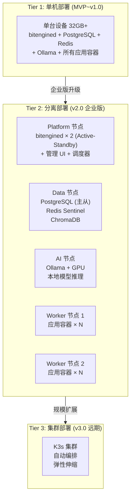
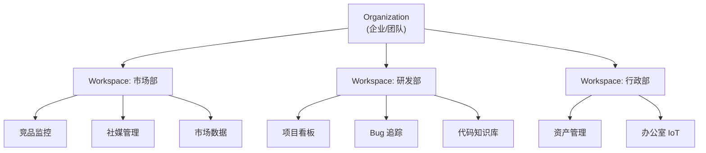
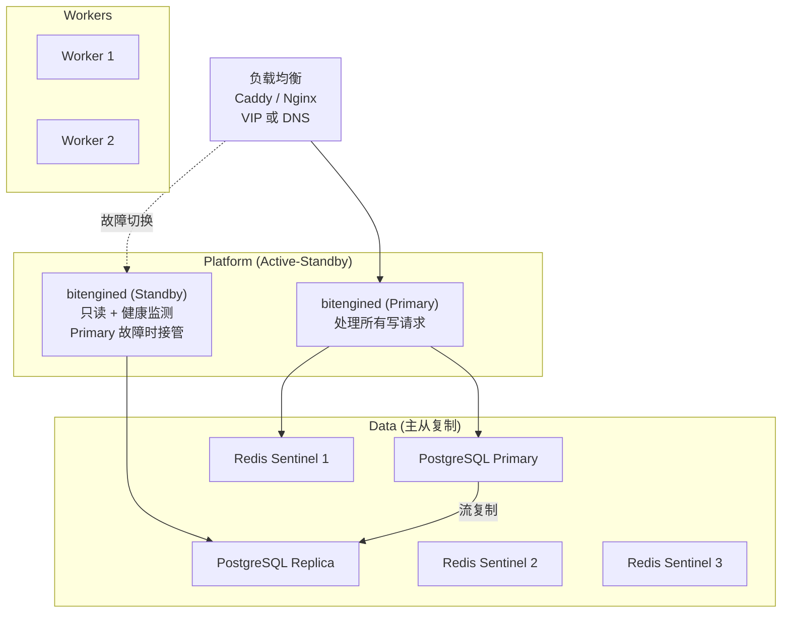

# DD-09：企业部署与多租户详细设计

> 模块路径：`internal/enterprise/` + `cmd/bitengined/deploy/` | 覆盖 v2.0 企业版 + v3.0 规模化
> 目标规模：50-200 人中型企业，可扩展至 500 人
>
> **v7 微调**：HA 章节补充 MQTT 5.0 Shared Subscriptions 负载均衡机制和 A2A Agent Card HA 暴露策略。

---

## 1 模块职责与设计目标

本文档覆盖 BitEngine 从"单机个人/小团队"向"多节点中型企业"演进所需的全部架构扩展。核心原则：**不重写，只扩展**——现有 DD-01~DD-08 的接口设计保持不变，通过部署拓扑升级和租户隔离层实现规模化。

| 子系统 | 职责 | 阶段 |
|--------|------|------|
| tenant | 多租户模型 (Organization + Workspace) | v2.0 |
| deploy/topology | 部署拓扑管理 (单机→分离→集群) | v2.0 |
| worker | Worker 节点调度 (远程 Docker Host) | v2.0 |
| ha | 高可用 (主从/故障转移) | v2.0 |
| gpu_node | GPU 推理节点 (AI 卸载) | v2.0 |
| compliance | 合规增强 (数据驻留/GDPR/审计导出) | v2.0 |
| license | 企业版授权管理 | v2.0 |

### 1.1 规模矩阵

| 维度 | 个人/小团队 (现有) | 中型企业 (本文档) | 大型 (v3.0 远期) |
|------|-------------------|------------------|----------------|
| 用户数 | 1-50 | 50-200 | 200-500+ |
| 并发用户 | 1-10 | 20-60 | 60-150 |
| 应用容器 | 5-15 | 20-80 | 80-200 |
| IoT 设备 | 10-50 | 50-500 | 500+ |
| 部署节点 | 1 台 | 2-5 台 | 5-15 台 |
| 数据库 | 内嵌 PostgreSQL | 外置 PostgreSQL (主从) | 托管数据库 |
| AI 推理 | 本机 Ollama | 独立 GPU 节点 | GPU 集群 |
| 可用性 | 单点 | Active-Standby | Active-Active |

---

## 2 部署拓扑演进

### 2.1 三级部署模型



### 2.2 部署配置文件

```yaml
# /data/bitengine/config/deploy.yaml

deployment:
  topology: separated              # standalone | separated | cluster

  # Platform 节点 (运行 bitengined 主进程)
  platform:
    nodes:
      - host: "platform-01.internal"
        role: primary
      - host: "platform-02.internal"
        role: standby

  # 外置数据库
  database:
    mode: external                 # embedded | external
    postgresql:
      primary: "postgres://admin@db-01.internal:5432/bitengine"
      replica: "postgres://reader@db-02.internal:5432/bitengine"
      pool_size: 50
    redis:
      sentinels:
        - "redis-01.internal:26379"
        - "redis-02.internal:26379"
        - "redis-03.internal:26379"
      master_name: "bitengine"

  # AI 推理节点
  ai:
    mode: remote                   # local | remote
    ollama_url: "http://gpu-01.internal:11434"
    gpu_type: "nvidia-t4"          # 用于模型调度决策

  # Worker 节点 (运行应用容器)
  workers:
    - host: "worker-01.internal"
      docker_url: "tcp://worker-01.internal:2376"
      tls_cert: "/etc/bitengine/certs/worker-01.pem"
      capacity:
        max_containers: 30
        memory_gb: 32
        cpu_cores: 8
    - host: "worker-02.internal"
      docker_url: "tcp://worker-02.internal:2376"
      tls_cert: "/etc/bitengine/certs/worker-02.pem"
      capacity:
        max_containers: 30
        memory_gb: 32
        cpu_cores: 8
```

### 2.3 部署拓扑管理器

```go
// internal/enterprise/deploy/topology.go

type Topology string

const (
    TopoStandalone Topology = "standalone"  // 单机, 现有行为
    TopoSeparated  Topology = "separated"   // 分离部署
    TopoCluster    Topology = "cluster"     // K3s 集群 (v3.0)
)

type DeployConfig struct {
    Topology   Topology        `yaml:"topology"`
    Platform   PlatformConfig  `yaml:"platform"`
    Database   DatabaseConfig  `yaml:"database"`
    AI         AINodeConfig    `yaml:"ai"`
    Workers    []WorkerConfig  `yaml:"workers"`
}

type TopologyManager struct {
    config     *DeployConfig
    workerPool *WorkerPool
    dbPool     *pgxpool.Pool   // 可能是本地也可能是远程
    redisPool  *redis.Client   // 可能是本地也可能是 Sentinel
}

func NewTopologyManager(configPath string) (*TopologyManager, error) {
    config := loadDeployConfig(configPath)

    var dbPool *pgxpool.Pool
    switch config.Database.Mode {
    case "embedded":
        dbPool = connectLocal()
    case "external":
        dbPool = connectExternal(config.Database.PostgreSQL)
    }

    var redisClient *redis.Client
    if len(config.Database.Redis.Sentinels) > 0 {
        redisClient = redis.NewFailoverClient(&redis.FailoverOptions{
            MasterName:    config.Database.Redis.MasterName,
            SentinelAddrs: config.Database.Redis.Sentinels,
        })
    } else {
        redisClient = redis.NewClient(&redis.Options{Addr: "localhost:6379"})
    }

    return &TopologyManager{
        config:    config,
        dbPool:    dbPool,
        redisPool: redisClient,
    }, nil
}
```

---

## 3 多租户模型 (v2.0)

### 3.1 租户层级



- **Organization**：顶层实体，对应一个企业。单个 BitEngine 部署支持 1 个 Organization（多 Org 是 SaaS 模式，不在当前范围）。
- **Workspace**：部门/团队级隔离单元。应用、数据、IoT 设备归属于 Workspace，Workspace 之间默认不可见。
- **跨 Workspace 共享**：通过显式授权，可将特定应用或数据源共享给其他 Workspace。

### 3.2 数据模型

```sql
-- enterprise schema

CREATE TABLE enterprise.organization (
    id          TEXT PRIMARY KEY DEFAULT gen_ulid(),
    name        VARCHAR(200) NOT NULL,
    slug        VARCHAR(100) NOT NULL UNIQUE,
    plan        VARCHAR(20) NOT NULL DEFAULT 'enterprise',  -- team | enterprise
    max_users   INTEGER NOT NULL DEFAULT 200,
    max_workers INTEGER NOT NULL DEFAULT 5,
    settings    JSONB NOT NULL DEFAULT '{}',
    created_at  TIMESTAMPTZ NOT NULL DEFAULT now()
);

CREATE TABLE enterprise.workspaces (
    id          TEXT PRIMARY KEY DEFAULT gen_ulid(),
    org_id      TEXT NOT NULL REFERENCES enterprise.organization(id),
    name        VARCHAR(200) NOT NULL,
    slug        VARCHAR(100) NOT NULL,
    icon        VARCHAR(10),                   -- emoji
    settings    JSONB NOT NULL DEFAULT '{}',
    created_at  TIMESTAMPTZ NOT NULL DEFAULT now(),
    UNIQUE(org_id, slug)
);

-- 用户归属 (一个用户可属于多个 Workspace)
CREATE TABLE enterprise.workspace_members (
    workspace_id TEXT NOT NULL REFERENCES enterprise.workspaces(id) ON DELETE CASCADE,
    user_id      TEXT NOT NULL REFERENCES foundation.users(id) ON DELETE CASCADE,
    role         VARCHAR(20) NOT NULL DEFAULT 'member',  -- ws_admin | member | viewer
    joined_at    TIMESTAMPTZ NOT NULL DEFAULT now(),
    PRIMARY KEY (workspace_id, user_id)
);

-- 跨 Workspace 资源共享
CREATE TABLE enterprise.shared_resources (
    id              TEXT PRIMARY KEY DEFAULT gen_ulid(),
    source_ws_id    TEXT NOT NULL REFERENCES enterprise.workspaces(id),
    target_ws_id    TEXT NOT NULL REFERENCES enterprise.workspaces(id),
    resource_type   VARCHAR(20) NOT NULL,    -- app | data_source | kb_collection | iot_device
    resource_id     TEXT NOT NULL,
    permissions     VARCHAR(20) NOT NULL DEFAULT 'read_only',
    shared_by       TEXT NOT NULL,
    created_at      TIMESTAMPTZ NOT NULL DEFAULT now()
);
```

### 3.3 租户隔离实现

```go
// internal/enterprise/tenant/context.go

type TenantContext struct {
    OrgID       string
    WorkspaceID string
    UserID      string
    Role        string
}

// 中间件: 每个请求注入 TenantContext
func TenantMiddleware() gin.HandlerFunc {
    return func(c *gin.Context) {
        claims := extractJWTClaims(c)

        // 从 Header 或 JWT 获取当前 Workspace
        wsID := c.GetHeader("X-Workspace-ID")
        if wsID == "" {
            wsID = claims.DefaultWorkspaceID
        }

        // 验证用户是否属于该 Workspace
        member, err := workspaceRepo.GetMember(c, wsID, claims.UserID)
        if err != nil {
            c.JSON(http.StatusForbidden, gin.H{"error": "TENANT_ACCESS_DENIED"})
            c.Abort()
            return
        }

        ctx := context.WithValue(c.Request.Context(), tenantKey, &TenantContext{
            OrgID:       claims.OrgID,
            WorkspaceID: wsID,
            UserID:      claims.UserID,
            Role:        member.Role,
        })
        c.Request = c.Request.WithContext(ctx)
        c.Next()
    }
}

// 获取当前租户上下文
func GetTenant(ctx context.Context) *TenantContext {
    return ctx.Value(tenantKey).(*TenantContext)
}
```

### 3.4 数据隔离策略

所有现有模块通过 TenantContext 实现数据隔离，不需要修改接口签名。

```go
// 应用中心: apps 表增加 workspace_id 列
// 改造前: SELECT * FROM apps WHERE id = $1
// 改造后: SELECT * FROM apps WHERE id = $1 AND workspace_id = $2

type TenantAwareAppRepo struct {
    pool *pgxpool.Pool
}

func (r *TenantAwareAppRepo) GetApp(ctx context.Context, appID string) (*AppInstance, error) {
    tc := GetTenant(ctx)
    var app AppInstance
    err := r.pool.QueryRow(ctx,
        `SELECT * FROM runtime.apps WHERE id = $1 AND workspace_id = $2`,
        appID, tc.WorkspaceID).Scan(&app)
    return &app, err
}

func (r *TenantAwareAppRepo) ListApps(ctx context.Context) ([]*AppInstance, error) {
    tc := GetTenant(ctx)
    rows, _ := r.pool.Query(ctx,
        `SELECT * FROM runtime.apps WHERE workspace_id = $1 ORDER BY created_at DESC`,
        tc.WorkspaceID)
    return scanApps(rows)
}
```

### 3.5 隔离清单

| 资源 | 隔离维度 | 实现方式 |
|------|---------|---------|
| 应用 (apps) | workspace_id | SQL WHERE 子句 |
| 文件 (files) | 目录 | `/data/bitengine/apps/{ws_slug}/{app}/` |
| 数据库 schema | PostgreSQL schema | `ws_{ws_id}_app_{app_id}` |
| 知识库 (ChromaDB) | Collection | `ws_{ws_id}_docs` + `ws_{ws_id}_app_{app_id}_docs` |
| IoT 设备 | workspace_id | `iot.devices` 增加 workspace_id |
| 自动化规则 | workspace_id | `iot.automation_rules` 增加 workspace_id |
| 数据管道 | workspace_id | `datalake.pipelines` 增加 workspace_id |
| 仪表盘 | workspace_id | `datalake.dashboards` 增加 workspace_id |
| 密钥 (vault) | workspace_id | Vault key namespace: `ws/{ws_id}/{secret_name}` |
| 审计日志 | workspace_id | 每条审计记录携带 workspace_id，查询时过滤 |

### 3.6 Schema 迁移方案

从单租户升级到多租户时，需要对现有表增加 workspace_id 列。

```go
// internal/enterprise/tenant/migration.go

func MigrateToMultiTenant(ctx context.Context, pool *pgxpool.Pool) error {
    // 1. 创建默认 Organization
    orgID := genULID()
    pool.Exec(ctx, `INSERT INTO enterprise.organization (id, name, slug) VALUES ($1, 'Default', 'default')`, orgID)

    // 2. 创建默认 Workspace
    wsID := genULID()
    pool.Exec(ctx, `INSERT INTO enterprise.workspaces (id, org_id, name, slug) VALUES ($1, $2, 'General', 'general')`, wsID, orgID)

    // 3. 给现有表添加 workspace_id 列
    tables := []string{
        "runtime.apps",
        "iot.devices",
        "iot.automation_rules",
        "datalake.data_sources",
        "datalake.pipelines",
        "datalake.dashboards",
        "datalake.kb_documents",
    }
    for _, table := range tables {
        pool.Exec(ctx, fmt.Sprintf(
            `ALTER TABLE %s ADD COLUMN IF NOT EXISTS workspace_id TEXT REFERENCES enterprise.workspaces(id) DEFAULT '%s'`,
            table, wsID))
    }

    // 4. 把所有现有用户加入默认 Workspace
    pool.Exec(ctx,
        `INSERT INTO enterprise.workspace_members (workspace_id, user_id, role)
         SELECT $1, id, CASE WHEN role='owner' THEN 'ws_admin' ELSE 'member' END FROM foundation.users`,
        wsID)

    return nil
}
```

---

## 4 Worker 节点调度 (v2.0)

### 4.1 Worker 注册与心跳

```go
// internal/enterprise/worker/pool.go

type WorkerNode struct {
    ID            string        `json:"id"`
    Host          string        `json:"host"`
    DockerURL     string        `json:"docker_url"`
    Status        string        `json:"status"`       // online | offline | draining
    Capacity      Capacity      `json:"capacity"`
    CurrentLoad   Load          `json:"current_load"`
    LastHeartbeat time.Time     `json:"last_heartbeat"`
    TLSCert       string        `json:"-"`
}

type Capacity struct {
    MaxContainers int `json:"max_containers"`
    MemoryGB      int `json:"memory_gb"`
    CPUCores      int `json:"cpu_cores"`
}

type Load struct {
    RunningContainers int     `json:"running_containers"`
    MemoryUsedGB      float64 `json:"memory_used_gb"`
    CPUUsedPercent    float64 `json:"cpu_used_percent"`
}

type WorkerPool struct {
    nodes    map[string]*WorkerNode
    mu       sync.RWMutex
    eventBus EventBus
}

func (p *WorkerPool) RegisterNode(ctx context.Context, config WorkerConfig) error {
    node := &WorkerNode{
        ID:        genULID(),
        Host:      config.Host,
        DockerURL: config.DockerURL,
        Status:    "online",
        Capacity:  config.Capacity,
        TLSCert:   config.TLSCert,
    }

    // 验证连接
    client, err := docker.NewClientWithOpts(
        docker.WithHost(config.DockerURL),
        docker.WithTLSClientConfig(config.TLSCert, "", ""),
    )
    if err != nil {
        return fmt.Errorf("worker: cannot connect to %s: %w", config.Host, err)
    }

    _, err = client.Ping(ctx)
    if err != nil {
        return fmt.Errorf("worker: ping failed for %s: %w", config.Host, err)
    }

    p.mu.Lock()
    p.nodes[node.ID] = node
    p.mu.Unlock()

    p.eventBus.Publish(ctx, "worker.registered", node)
    return nil
}

// 心跳检查 (每 30s)
func (p *WorkerPool) HealthCheck(ctx context.Context) {
    ticker := time.NewTicker(30 * time.Second)
    for range ticker.C {
        p.mu.RLock()
        for _, node := range p.nodes {
            load, err := p.queryLoad(ctx, node)
            if err != nil {
                if node.Status == "online" {
                    node.Status = "offline"
                    p.eventBus.Publish(ctx, "worker.offline", node)
                }
                continue
            }
            node.CurrentLoad = load
            node.LastHeartbeat = time.Now()
            node.Status = "online"
        }
        p.mu.RUnlock()
    }
}
```

### 4.2 调度策略

```go
// internal/enterprise/worker/scheduler.go

type ScheduleStrategy string

const (
    StrategyLeastLoad   ScheduleStrategy = "least_load"   // 最少负载
    StrategyBinPacking  ScheduleStrategy = "bin_packing"  // 装箱优化 (节省节点)
    StrategyAffinity    ScheduleStrategy = "affinity"     // 亲和性 (同 Workspace 尽量同节点)
)

type WorkerScheduler struct {
    pool     *WorkerPool
    strategy ScheduleStrategy
}

func (s *WorkerScheduler) SelectNode(ctx context.Context, req DeployRequest) (*WorkerNode, error) {
    tc := GetTenant(ctx)
    candidates := s.pool.OnlineNodes()

    if len(candidates) == 0 {
        return nil, ErrNoAvailableWorker
    }

    switch s.strategy {
    case StrategyLeastLoad:
        return s.leastLoad(candidates, req)
    case StrategyBinPacking:
        return s.binPacking(candidates, req)
    case StrategyAffinity:
        return s.affinityFirst(candidates, req, tc.WorkspaceID)
    }

    return candidates[0], nil
}

func (s *WorkerScheduler) leastLoad(nodes []*WorkerNode, req DeployRequest) (*WorkerNode, error) {
    var best *WorkerNode
    var bestScore float64 = 1.0

    for _, n := range nodes {
        if n.CurrentLoad.RunningContainers >= n.Capacity.MaxContainers {
            continue
        }
        // 综合评分: CPU 权重 0.4, 内存 0.4, 容器数 0.2
        score := n.CurrentLoad.CPUUsedPercent*0.4/100 +
            n.CurrentLoad.MemoryUsedGB/float64(n.Capacity.MemoryGB)*0.4 +
            float64(n.CurrentLoad.RunningContainers)/float64(n.Capacity.MaxContainers)*0.2

        if score < bestScore {
            bestScore = score
            best = n
        }
    }

    if best == nil {
        return nil, ErrAllWorkersAtCapacity
    }
    return best, nil
}

// 亲和调度: 同 Workspace 的应用优先放同一 Worker (降低网络延迟)
func (s *WorkerScheduler) affinityFirst(nodes []*WorkerNode, req DeployRequest, wsID string) (*WorkerNode, error) {
    // 查询该 Workspace 已有容器运行在哪些 Worker 上
    affinityNodes := s.pool.NodesForWorkspace(wsID)
    for _, n := range affinityNodes {
        if n.CurrentLoad.RunningContainers < n.Capacity.MaxContainers {
            return n, nil
        }
    }
    // 亲和节点都满了, 回退到 least_load
    return s.leastLoad(nodes, req)
}
```

### 4.3 远程容器管理

```go
// internal/enterprise/worker/remote_docker.go

type RemoteDockerManager struct {
    clients map[string]*docker.Client // workerID → Docker client
}

func (m *RemoteDockerManager) DeployToWorker(ctx context.Context, workerID string, spec ContainerSpec) (string, error) {
    client := m.clients[workerID]
    if client == nil {
        return "", ErrWorkerNotConnected
    }

    // 确保镜像在 Worker 上存在
    _, _, err := client.ImageInspectWithRaw(ctx, spec.Image)
    if err != nil {
        // 拉取或传输镜像
        out, _ := client.ImagePull(ctx, spec.Image, image.PullOptions{})
        io.Copy(io.Discard, out)
    }

    // 创建并启动容器 (复用 DD-02 的 ContainerSpec 格式)
    resp, _ := client.ContainerCreate(ctx, &container.Config{
        Image: spec.Image,
        Env:   spec.EnvVars,
    }, &container.HostConfig{
        Resources: container.Resources{
            Memory:   int64(spec.MemoryLimitMB) * 1024 * 1024,
            NanoCPUs: int64(spec.CPUQuota * 1e9),
        },
    }, nil, nil, spec.ContainerName)

    client.ContainerStart(ctx, resp.ID, container.StartOptions{})
    return resp.ID, nil
}
```

---

## 5 高可用方案 (v2.0)

### 5.1 架构



### 5.2 故障转移

```go
// internal/enterprise/ha/failover.go

type HAManager struct {
    role       string  // primary | standby
    peerURL    string  // 对端 bitengined 地址
    leaderLock *RedisLock
    eventBus   EventBus
}

func (h *HAManager) Start(ctx context.Context) {
    // 基于 Redis 分布式锁竞选 leader
    // SET bitengine:leader {nodeID} NX EX 15
    ticker := time.NewTicker(5 * time.Second)
    for range ticker.C {
        acquired, _ := h.leaderLock.TryAcquire(ctx, 15*time.Second)
        if acquired {
            if h.role != "primary" {
                h.role = "primary"
                h.eventBus.Publish(ctx, "ha.promoted", nil)
                log.Info("HA: promoted to primary")
            }
            // 续期锁
            h.leaderLock.Refresh(ctx, 15*time.Second)
        } else {
            if h.role != "standby" {
                h.role = "standby"
                log.Info("HA: demoted to standby")
            }
        }
    }
}

func (h *HAManager) IsPrimary() bool {
    return h.role == "primary"
}

// Standby 拒绝写操作中间件
func HAWriteGuard(ha *HAManager) gin.HandlerFunc {
    return func(c *gin.Context) {
        if c.Request.Method != "GET" && !ha.IsPrimary() {
            c.JSON(http.StatusServiceUnavailable, gin.H{
                "error":    "HA_STANDBY_READ_ONLY",
                "redirect": ha.peerURL,
            })
            c.Abort()
            return
        }
        c.Next()
    }
}
```

### 5.3 恢复时间目标

| 场景 | RTO | RPO | 实现 |
|------|-----|-----|------|
| Platform 节点故障 | < 30s | 0 (同步写入) | Redis leader 锁超时 → Standby 自动接管 |
| PostgreSQL Primary 故障 | < 60s | < 1s | Streaming Replication + 自动 pg_promote |
| Worker 节点故障 | < 5min | 0 | 调度器将容器迁移到其他 Worker |
| 全站停电 | < 15min | < 24h | 备份恢复，手动操作 |

### 5.4 MQTT 5.0 Shared Subscriptions HA（v7 新增）

DD-01 已明确采用 MQTT 5.0，其 Shared Subscriptions 特性是规则引擎多实例负载均衡的标准机制。

```
# 规则引擎集群通过 $share 模式自动负载均衡设备事件处理
# 无需额外的消息分发层

规则引擎实例 1 ──┐
                  ├── $share/rules/bitengine/devices/#
规则引擎实例 2 ──┘

# Mosquitto Broker 自动将每条设备事件只投递给一个实例
# 实例故障 → 剩余实例自动接管，零配置
```

```yaml
# HA 部署时规则引擎配置
rules_engine:
  ha:
    enabled: true
    subscribe_pattern: "$share/rules/bitengine/devices/#"  # MQTT 5.0 Shared Subscription
    instances: 2                                            # 与 Worker 节点数对齐
    # 无需额外的负载均衡器或消息路由层
    # Mosquitto 5.0 原生支持，单条消息只投递给组内一个消费者
```

### 5.5 A2A Agent Card HA 暴露（v7 新增）

多实例部署时，A2A Agent Card 需要通过负载均衡器统一暴露。Agent Card 的 `endpoint` 字段应指向 HA 入口而非单实例地址。

```yaml
# HA 部署时 Agent Card 配置
a2a:
  agent_card:
    # 单机部署: endpoint = http://bitengine.local:9100
    # HA 部署: endpoint 指向负载均衡器 VIP
    endpoint: "https://bitengine.company.com"  # LB VIP / DNS
    # 两个 bitengined 实例都注册同一个 Agent Card
    # LB 将 A2A 请求路由到 Primary 实例
    # Standby 实例在 Primary 故障时自动接管
```

---

## 6 GPU 推理节点 (v2.0)

### 6.1 AI 卸载架构

企业部署中，AI 推理从 Platform 节点分离到独立 GPU 节点，释放 Platform 节点资源给管理任务。

```go
// internal/enterprise/gpu/remote_ollama.go

type RemoteOllamaConfig struct {
    URL        string `yaml:"url"`     // http://gpu-01.internal:11434
    GPUType    string `yaml:"gpu_type"` // nvidia-t4 | nvidia-a10 | amd-rx7900
    VRAM_GB    int    `yaml:"vram_gb"`
    MaxModels  int    `yaml:"max_models"`
}

type RemoteOllamaClient struct {
    config  RemoteOllamaConfig
    http    *http.Client
}

// 覆盖 DD-06 的 OllamaClient，接口完全相同
func (c *RemoteOllamaClient) Generate(ctx context.Context, model, prompt string, options *GenerateOptions) (string, error) {
    body, _ := json.Marshal(map[string]interface{}{
        "model":  model,
        "prompt": prompt,
        "stream": false,
    })
    resp, err := c.http.Post(c.config.URL+"/api/generate", "application/json", bytes.NewReader(body))
    if err != nil {
        return "", fmt.Errorf("gpu: remote ollama unreachable: %w", err)
    }
    defer resp.Body.Close()
    var result struct{ Response string }
    json.NewDecoder(resp.Body).Decode(&result)
    return result.Response, nil
}

// 工厂: 根据 deploy.yaml 选择本地或远程 Ollama
func NewOllamaClient(deployConfig *DeployConfig) OllamaClient {
    if deployConfig.AI.Mode == "remote" {
        return &RemoteOllamaClient{config: deployConfig.AI.RemoteOllama}
    }
    return &LocalOllamaClient{} // DD-06 现有实现
}
```

### 6.2 模型分布策略

| 模型 | 单机部署 | 企业分离部署 |
|------|---------|-------------|
| Gemma3-1B (路由) | Platform 本机 | **Platform 本机** (需要极低延迟) |
| BGE-M3 (嵌入) | Platform 本机 | GPU 节点 (批量嵌入) |
| Qwen3-4B (意图) | Platform 本机 | GPU 节点 |
| Phi-4-mini (审查) | Platform 本机 | GPU 节点 |
| Qwen2.5-7B (推理) | Platform 本机 | GPU 节点 |

路由模型 (Gemma3-1B) 始终留在 Platform 节点，因为每次请求都需要经过路由，网络延迟不可接受。其他模型全部卸载到 GPU 节点。

---

## 7 合规增强 (v2.0)

### 7.1 数据驻留

```go
// internal/enterprise/compliance/residency.go

type DataResidencyConfig struct {
    Enabled      bool     `yaml:"enabled"`
    Region       string   `yaml:"region"`         // cn | eu | us
    CloudAllowed bool     `yaml:"cloud_allowed"`  // 是否允许云端 AI
    ExportPolicy string   `yaml:"export_policy"`  // none | approved_only | free
}

// 在 AI 引擎中强制执行
func (c *DataResidencyConfig) ValidateCloudCall(ctx context.Context, data string) error {
    if !c.CloudAllowed {
        return ErrCloudAINotAllowed
    }
    // 检查数据中是否有 PII
    if containsPII(data) {
        return ErrPIICannotLeaveDevice
    }
    return nil
}
```

### 7.2 审计导出与合规报告

```go
// internal/enterprise/compliance/report.go

type ComplianceReporter struct {
    auditChain *MerkleAuditChain
    pool       *pgxpool.Pool
}

type ComplianceReport struct {
    Period        string              `json:"period"`         // "2026-Q1"
    TotalEvents   int                 `json:"total_events"`
    ByCategory    map[string]int      `json:"by_category"`   // app.created: 15, iot.tool_call: 230
    SecurityEvents int                `json:"security_events"`
    DataExports   int                 `json:"data_exports"`
    ChainIntegrity bool              `json:"chain_integrity"` // Merkle 链完整性
    UserActivity  []UserActivitySummary `json:"user_activity"`
}

func (r *ComplianceReporter) GenerateReport(ctx context.Context, period string) (*ComplianceReport, error) {
    tc := GetTenant(ctx)

    // 1. 统计审计事件
    // 2. 验证 Merkle 链完整性
    // 3. 汇总用户活动
    // 4. 生成 PDF 报告 (调用 DD-01 文件服务)

    return &ComplianceReport{
        Period:         period,
        ChainIntegrity: r.auditChain.VerifyIntegrity(ctx),
        // ...
    }, nil
}

// 导出格式: JSON (机器可读) + PDF (人类可读)
func (r *ComplianceReporter) ExportAuditLog(ctx context.Context, from, to time.Time, format string) ([]byte, error) {
    tc := GetTenant(ctx)
    entries, _ := r.auditChain.Query(ctx, AuditQuery{
        WorkspaceID: tc.WorkspaceID,
        From:        from,
        To:          to,
    })

    switch format {
    case "json":
        return json.Marshal(entries)
    case "csv":
        return marshalAuditCSV(entries)
    }
    return nil, ErrUnsupportedFormat
}
```

### 7.3 GDPR 数据处理

```go
// 用户数据删除权 (Right to be Forgotten)
func (s *ComplianceService) DeleteUserData(ctx context.Context, userID string) error {
    // 1. 删除用户创建的应用
    // 2. 删除用户上传的文件和知识库文档
    // 3. 匿名化审计日志中的用户标识 (保留事件但替换 user_id 为 "DELETED")
    // 4. 删除用户账户
    // 5. 记录删除操作到审计链

    return nil
}
```

---

## 8 企业版授权管理

```go
// internal/enterprise/license/license.go

type License struct {
    ID          string    `json:"id"`
    OrgName     string    `json:"org_name"`
    Plan        string    `json:"plan"`         // team | enterprise
    MaxUsers    int       `json:"max_users"`    // 50 | 200 | unlimited
    MaxWorkers  int       `json:"max_workers"`  // 1 | 5 | unlimited
    Features    []string  `json:"features"`     // sso | multi_tenant | compliance | gpu_node
    IssuedAt    time.Time `json:"issued_at"`
    ExpiresAt   time.Time `json:"expires_at"`
    Signature   string    `json:"signature"`    // Ed25519 签名
}

type LicenseManager struct {
    publicKey ed25519.PublicKey
    current   *License
}

func (m *LicenseManager) Validate(licenseData []byte) (*License, error) {
    var lic License
    json.Unmarshal(licenseData, &lic)

    // 验证签名
    payload, _ := json.Marshal(struct {
        ID, OrgName, Plan string
        MaxUsers, MaxWorkers int
        Features []string
        IssuedAt, ExpiresAt time.Time
    }{lic.ID, lic.OrgName, lic.Plan, lic.MaxUsers, lic.MaxWorkers, lic.Features, lic.IssuedAt, lic.ExpiresAt})

    sig, _ := base64.StdEncoding.DecodeString(lic.Signature)
    if !ed25519.Verify(m.publicKey, payload, sig) {
        return nil, ErrLicenseInvalid
    }

    if time.Now().After(lic.ExpiresAt) {
        return nil, ErrLicenseExpired
    }

    return &lic, nil
}

// 功能门控
func (m *LicenseManager) HasFeature(feature string) bool {
    for _, f := range m.current.Features {
        if f == feature {
            return true
        }
    }
    return false
}

// 中间件: 企业功能门控
func LicenseGuard(feature string) gin.HandlerFunc {
    return func(c *gin.Context) {
        if !licenseManager.HasFeature(feature) {
            c.JSON(http.StatusPaymentRequired, gin.H{
                "error":   "LICENSE_FEATURE_REQUIRED",
                "feature": feature,
                "message": fmt.Sprintf("此功能需要企业版授权: %s", feature),
            })
            c.Abort()
            return
        }
        c.Next()
    }
}
```

### 8.1 版本矩阵

| 功能 | 社区版 (免费) | 团队版 | 企业版 |
|------|-------------|--------|-------|
| 用户数 | ≤ 5 | ≤ 50 | ≤ 200 (可扩展) |
| Worker 节点 | 1 (单机) | 1 | ≤ 5 |
| 多租户 (Workspace) | 1 | ≤ 3 | 不限 |
| SSO (OIDC/SAML) | ❌ | ❌ | ✅ |
| GPU 推理节点 | ❌ | ❌ | ✅ |
| 高可用 (Active-Standby) | ❌ | ❌ | ✅ |
| 合规报告导出 | ❌ | 基础 | 完整 |
| 数据驻留策略 | ❌ | ❌ | ✅ |
| GDPR 数据删除 | ❌ | ❌ | ✅ |
| 优先支持 | 社区 | 邮件 | 专属 |
| AI 模型全量常驻 | ✅ | ✅ | ✅ |
| MCP / A2H / AG-UI | ✅ | ✅ | ✅ |
| IoT 中心 | ✅ | ✅ | ✅ |
| 能力市场 | ✅ | ✅ | ✅ |

---

## 9 企业版安装与升级

### 9.1 企业版安装脚本

```bash
# 企业版安装 (多节点)
curl -fsSL https://bitengine.io/install-enterprise.sh | bash -s -- \
  --role platform \
  --license /path/to/license.json \
  --db-url "postgres://admin@db-01:5432/bitengine" \
  --redis-sentinels "redis-01:26379,redis-02:26379,redis-03:26379"

# Worker 节点安装
curl -fsSL https://bitengine.io/install-enterprise.sh | bash -s -- \
  --role worker \
  --platform-url "https://platform-01.internal:8080" \
  --join-token "eyJ..."
```

### 9.2 从社区版升级

```go
// internal/enterprise/upgrade/upgrade.go

type UpgradeService struct {
    license *LicenseManager
    pool    *pgxpool.Pool
}

func (u *UpgradeService) UpgradeToEnterprise(ctx context.Context, licenseData []byte) error {
    // 1. 验证企业版授权
    lic, err := u.license.Validate(licenseData)
    if err != nil {
        return err
    }

    // 2. 创建 enterprise schema
    u.pool.Exec(ctx, `CREATE SCHEMA IF NOT EXISTS enterprise`)

    // 3. 运行多租户迁移
    MigrateToMultiTenant(ctx, u.pool)

    // 4. 启用企业版功能
    u.pool.Exec(ctx, `INSERT INTO enterprise.organization (id, name, slug, plan, max_users, max_workers) VALUES ($1, $2, $3, $4, $5, $6)`,
        genULID(), lic.OrgName, slugify(lic.OrgName), lic.Plan, lic.MaxUsers, lic.MaxWorkers)

    // 5. 记录升级事件
    auditChain.Append(ctx, AuditEntry{
        EventType: "enterprise.upgrade",
        Detail:    fmt.Sprintf("plan=%s max_users=%d", lic.Plan, lic.MaxUsers),
    })

    return nil
}
```

---

## 10 与现有 DD 的集成点

本文档不修改现有 DD-01~DD-08 的接口，而是通过以下方式注入企业能力。

| 现有模块 | 集成方式 | 影响范围 |
|---------|---------|---------|
| DD-01 底座 (数据库) | `deploy.yaml` 切换内嵌/外置 PostgreSQL + Redis | 连接池初始化 |
| DD-01 底座 (认证) | 注入 TenantMiddleware，JWT 增加 org_id + workspace_id | 中间件链 |
| DD-01 底座 (共享链接) | SharedLink 增加 workspace_id 校验 | SQL WHERE |
| DD-02 运行层 (Docker) | WorkerScheduler 替换本地 DockerManager | DeployToWorker 接口 |
| DD-03 应用中心 | 应用创建/列表增加 workspace_id 过滤 | Repository 层 |
| DD-04 数据中心 | KB Collection 命名增加 ws_ 前缀 | Collection 创建逻辑 |
| DD-05 IoT | 设备注册表增加 workspace_id | SQL WHERE |
| DD-06 AI 引擎 | OllamaClient 工厂支持远程 GPU 节点 | 初始化配置 |
| DD-07 协议 | MCP Server 响应增加 workspace 上下文 | 请求处理 |
| DD-08 前端 | 增加 Workspace 切换器 + /admin 路由 | 导航 + 路由 |

---

## 11 前端扩展

### 11.1 Workspace 切换器

```typescript
// web/console/src/components/WorkspaceSwitcher.tsx

function WorkspaceSwitcher() {
  const [workspaces, setWorkspaces] = useState<Workspace[]>([]);
  const [current, setCurrent] = useState<string>("");

  const switchWorkspace = (wsId: string) => {
    setCurrent(wsId);
    // 设置请求头, 后续所有 API 自动携带
    api.defaults.headers["X-Workspace-ID"] = wsId;
    // 刷新数据
    window.location.reload();
  };

  return (
    <Select value={current} onValueChange={switchWorkspace}>
      {workspaces.map(ws => (
        <SelectItem key={ws.id} value={ws.id}>
          {ws.icon} {ws.name}
        </SelectItem>
      ))}
    </Select>
  );
}
```

### 11.2 管理后台页面

```typescript
const enterpriseRoutes = [
  { path: "/admin/org",             element: <OrgSettings /> },
  { path: "/admin/workspaces",      element: <WorkspaceList /> },
  { path: "/admin/workspaces/:id",  element: <WorkspaceDetail /> },
  { path: "/admin/workers",         element: <WorkerNodes /> },
  { path: "/admin/ha",              element: <HAStatus /> },
  { path: "/admin/license",         element: <LicenseManager /> },
  { path: "/admin/compliance",      element: <ComplianceDashboard /> },
  { path: "/admin/sso",             element: <SSOConfig /> },
  { path: "/admin/audit",           element: <AuditViewer /> },
];
```

---

## 12 API 端点

| 方法 | 端点 | 说明 | 门控 |
|------|------|------|------|
| GET | `/api/v1/org` | 组织信息 | enterprise |
| PUT | `/api/v1/org` | 更新组织设置 | enterprise |
| GET | `/api/v1/workspaces` | Workspace 列表 | enterprise |
| POST | `/api/v1/workspaces` | 创建 Workspace | enterprise |
| PUT | `/api/v1/workspaces/:id` | 更新 Workspace | enterprise |
| DELETE | `/api/v1/workspaces/:id` | 删除 Workspace | enterprise |
| GET | `/api/v1/workspaces/:id/members` | 成员列表 | enterprise |
| POST | `/api/v1/workspaces/:id/members` | 添加成员 | enterprise |
| DELETE | `/api/v1/workspaces/:id/members/:uid` | 移除成员 | enterprise |
| POST | `/api/v1/workspaces/:id/share` | 跨 Workspace 共享资源 | enterprise |
| GET | `/api/v1/admin/workers` | Worker 节点列表 | enterprise |
| POST | `/api/v1/admin/workers` | 注册 Worker 节点 | enterprise |
| DELETE | `/api/v1/admin/workers/:id` | 移除 Worker 节点 | enterprise |
| POST | `/api/v1/admin/workers/:id/drain` | Worker 排水 (迁出容器) | enterprise |
| GET | `/api/v1/admin/ha/status` | HA 状态 | enterprise |
| POST | `/api/v1/admin/ha/failover` | 手动故障转移 | enterprise |
| POST | `/api/v1/admin/license` | 上传/更新授权 | — |
| GET | `/api/v1/admin/license` | 授权信息 | — |
| GET | `/api/v1/compliance/report` | 生成合规报告 | enterprise |
| POST | `/api/v1/compliance/audit/export` | 导出审计日志 | enterprise |
| POST | `/api/v1/compliance/gdpr/delete` | GDPR 数据删除 | enterprise |
| GET | `/api/v1/compliance/residency` | 数据驻留策略 | enterprise |
| PUT | `/api/v1/compliance/residency` | 更新数据驻留 | enterprise |

---

## 13 错误码

| 错误码 | 说明 |
|--------|------|
| `TENANT_ACCESS_DENIED` | 用户不属于目标 Workspace |
| `TENANT_WS_NOT_FOUND` | Workspace 不存在 |
| `TENANT_WS_LIMIT_REACHED` | Workspace 数量达到版本上限 |
| `TENANT_USER_LIMIT_REACHED` | 用户数达到授权上限 |
| `WORKER_NOT_CONNECTED` | Worker 节点不可达 |
| `WORKER_AT_CAPACITY` | Worker 资源已满 |
| `WORKER_DRAIN_IN_PROGRESS` | Worker 正在排水中 |
| `HA_STANDBY_READ_ONLY` | Standby 节点拒绝写请求 |
| `HA_FAILOVER_FAILED` | 故障转移失败 |
| `LICENSE_INVALID` | 授权签名无效 |
| `LICENSE_EXPIRED` | 授权已过期 |
| `LICENSE_FEATURE_REQUIRED` | 功能需要更高版本授权 |
| `COMPLIANCE_CLOUD_NOT_ALLOWED` | 数据驻留策略禁止云端调用 |
| `COMPLIANCE_PII_BLOCKED` | PII 数据不允许离开设备 |
| `COMPLIANCE_EXPORT_FAILED` | 合规报告导出失败 |

---

## 14 测试策略

| 类型 | 覆盖 | 工具 |
|------|------|------|
| 单元测试 | TenantMiddleware 隔离、调度策略评分、License 签名验证 | `testing` + `testify` |
| 集成测试 | 多 Workspace 数据隔离 (A 看不到 B 的应用/数据) | `testcontainers-go` (PostgreSQL) |
| 集成测试 | Worker 注册→调度→远程容器部署→健康检查 | Mock Docker API |
| 集成测试 | HA 故障转移: 停止 Primary → Standby 自动接管 | Redis + 双进程 |
| 集成测试 | 社区版→企业版升级迁移 (数据完整性) | 迁移脚本测试 |
| E2E 测试 | 创建 Org→Workspace→添加成员→各 Workspace 独立操作 | Playwright |
| 安全测试 | 跨 Workspace 越权访问尝试 (应全部被拦截) | 渗透测试脚本 |
| 性能测试 | 50 并发用户 + 40 容器 + 200 IoT 设备 | k6 / Locust |
