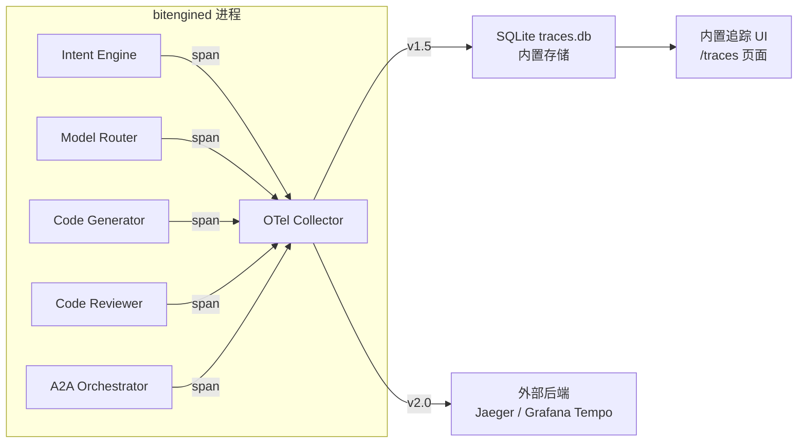

# DD-10：生态集成架构详细设计

> 模块路径：跨模块（集成接口分布在 DD-01 / DD-03 / DD-05 / DD-07 / DD-08 中） | 完整覆盖 v1.0 · v1.5 · v2.0
>
> **v7 新建文档**："两端做轻"策略意味着 BitEngine 的价值很大程度上通过与外部平台的集成来放大。DD-01 到 DD-09 都是"内部怎么设计"的视角，本文档系统性回答：**BitEngine 和外部世界怎么连接？**

---

## 1 集成哲学

**七层标准协议栈，零自定义协议。**

| 层次 | 协议 | 标准组织 | 集成方向 |
|------|------|---------|---------|
| Agent ↔ Tool | MCP（Streamable HTTP） | Anthropic | 双向：暴露平台能力 + 调用外部服务 |
| Agent ↔ Agent | Google A2A（v0.3） | Linux Foundation | 双向：接收外部 Agent 任务 + 委派子任务 |
| Agent ↔ Frontend | AG-UI | CopilotKit | 出向：事件流推送到任何兼容前端 |
| Agent → UI 描述 | A2UI | Google | 出向：声明式 UI 在任何客户端渲染 |
| Device ↔ Platform | MQTT 5.0 | OASIS / ISO | 入向：设备遥测 + 出向：控制命令 |
| 可观测性 | OTel GenAI | CNCF | 出向：追踪数据到任何 OTel 后端 |
| 身份认证 | OAuth 2.1 | IETF | 双向：统一认证框架 |

核心原则：**对外每一层通信都用行业标准协议**。自定义实现只存在于内部编排逻辑（Intent Engine、Plan Selector、Quality Gate）。这确保 BitEngine 能与任何标准兼容的外部系统互操作。

---

## 2 对上集成：BitEngine 作为服务提供者

外部 AI / 客户端 / Agent 调用 BitEngine 的能力。

### 2.1 OpenAI 兼容 API → Open WebUI / 任意客户端

```yaml
endpoint: POST /v1/chat/completions
format: OpenAI Chat Completions 标准格式
models:
  - bitengine-local    # 本地最强模型
  - bitengine-fast     # 本地快速模型
  - bitengine-cloud    # 云端大模型
streaming: true        # SSE 流式响应
implementation: DD-07 §8
```

**典型场景**：用户在 Open WebUI 中添加 BitEngine 作为模型提供者，获得 BitEngine 的全部 AI 能力。

### 2.2 MCP Server 暴露 → 任意 MCP 客户端

```yaml
endpoint: POST /mcp
format: JSON-RPC 2.0 over Streamable HTTP
tools:
  - apps/*          # 应用管理
  - data/*          # 数据查询 + RAG
  - iot/devices/*   # 设备控制（通过 Aggregator）
  - system/*        # 系统管理
capabilities:
  - elicitation     # v7: 意图协商 + 操作确认
  - resources       # 平台数据暴露
implementation: DD-07 §2-3
```

**典型场景**：
- Open WebUI 添加 BitEngine MCP Server → 获得设备控制和应用管理能力
- Claude Desktop 配置 BitEngine MCP → 通过对话管理平台
- Cursor / VS Code 配置 → 开发者通过 IDE 管理 BitEngine

### 2.3 A2A Agent Card 暴露 → 外部 A2A Agent

```yaml
endpoint: GET /.well-known/agent.json
format: Google A2A v0.3 Agent Card
skills:
  - app_generation     # 代码生成 + 容器部署
  - data_query         # 数据查询 + RAG
  - device_control     # IoT 设备控制
  - system_management  # 系统管理
authentication: oauth2 + card_signing
implementation: DD-07 §6, DD-03 §4
```

**典型场景**：Salesforce Agent 发现 BitEngine 的代码生成能力，委派"生成客户数据看板"任务。

### 2.4 A2UI 界面描述 → 外部客户端渲染

BitEngine 的 Agent 输出 A2UI JSON 描述，任何支持 A2UI 的客户端都能渲染——不限于我们的前端。

**典型场景**：外部 A2A Agent 协作时，远程 Agent 通过 A2UI 在我们的 UI 上呈现结果；或者反过来，我们的 Agent 在外部客户端上展示进度卡片。

### 2.5 MQTT 5.0 Topic 暴露 → 任意 MQTT 客户端

```yaml
broker: mqtt://bitengine.local:1883 (内部) / :8883 (TLS) / :9001 (WebSocket)
topic_prefix: bitengine/devices/
format: JSON + MQTT 5.0 User Properties
subscribe: bitengine/devices/# (全部设备事件)
implementation: DD-05 §5
```

**典型场景**：Node-RED / n8n 直接订阅 BitEngine 的 MQTT topic，构建自定义自动化流程。

---

## 3 对下集成：BitEngine 作为服务消费者

BitEngine 调用外部平台的能力。

### 3.1 Ollama API → 模型推理

```yaml
endpoint: http://localhost:11434 (本地) / 远程 Ollama 实例
format: Ollama REST API
routing: DD-02 Model Router 按 task type 路由
fallback: 本地 → 远程 Ollama → 云端 API
```

### 3.2 Home Assistant REST/WebSocket API → 设备桥接

```yaml
endpoint: http://homeassistant.local:8123
auth: Long-Lived Access Token
bridge: DD-05 HA MCP Server
capabilities: 设备发现 / 状态查询 / 控制指令 / 事件订阅
event_forwarding: HA WebSocket 事件 → MQTT 5.0 标准 topic
```

### 3.3 EdgeX Foundry API → 工业设备桥接

```yaml
endpoint: EdgeX Core Metadata + Command Service
bridge: DD-05 EdgeX MCP Server (v2.0)
capabilities: Modbus / BACnet / OPC UA 设备
```

### 3.4 外部 A2A Agent → 委派子任务

```yaml
protocol: Google A2A v0.3
discovery: 外部 Agent Card URL
auth: OAuth 2.1 + Agent Card 签名
routing: DD-03 Orchestrator 按 skill 匹配
```

**典型场景**：Orchestrator 分解"做银行监控系统"任务时，将"数据库设计"子任务委派给外部专业 DBA Agent。

### 3.5 云端 AI API → Model Router fallback

```yaml
providers:
  - Anthropic (Claude Sonnet)
  - DeepSeek
  - OpenAI (GPT-4.1)
routing: DD-02 Model Router
security: API Key 从 Vault 获取，用后零化
```

---

## 4 双向集成场景

| 场景 | 方向 | 协议 | 实现 |
|------|------|------|------|
| Open WebUI 用户通过对话控制 IoT 设备 | 入向 | MCP | DD-07 → DD-05 Aggregator |
| HA 自动化触发 BitEngine 生成应用 | 入向 | MCP | DD-07 App Manager |
| n8n 工作流调用 BitEngine 数据查询 | 入向 | MCP | DD-07 Data & RAG |
| 外部 A2A Agent 调用代码生成 | 入向 | A2A | DD-03 A2A Server |
| BitEngine Orchestrator 委派任务给外部 Agent | 出向 | A2A | DD-03 Orchestrator |
| 远程 Agent 在我们 UI 展示结果 | 入向 | A2UI + AG-UI | DD-08 A2UI Renderer |
| Node-RED 订阅设备事件 | 出向 | MQTT 5.0 | DD-05 Broker |
| Grafana 消费 Agent 追踪数据 | 出向 | OTel GenAI | DD-01 (E-21) |

---

## 5 认证与安全

### 5.1 OAuth 2.1 统一认证框架

所有对外接口统一使用 OAuth 2.1：
- MCP Server：Bearer token 认证
- A2A Server：OAuth 2.1 + Agent Card 签名双重认证
- OpenAI 兼容 API：Bearer token
- MQTT 5.0：用户名密码 + ACL

### 5.2 外部平台 Token 管理

| 外部平台 | Token 类型 | 存储位置 |
|---------|-----------|---------|
| Home Assistant | Long-Lived Access Token | DD-01 Vault（AES-256-GCM 加密） |
| EdgeX Foundry | API Key | DD-01 Vault |
| Ollama（远程） | Bearer Token（可选） | DD-01 Vault |
| 云端 AI（Anthropic/DeepSeek/OpenAI） | API Key | DD-01 Vault（用后零化） |

### 5.3 信任链

```
外部 MCP 客户端 → OAuth 2.1 token 验证 → MCP Server → 内部能力
外部 A2A Agent → Agent Card 签名验证 → 信任等级分层 → Governance Agent → A2H 审批（如需） → 内部能力
MQTT 客户端 → 用户名/密码 + ACL → 只能访问授权 topic
```

安全策略详见 DD-06。

---

## 6 集成优先级

| 阶段 | 集成能力 | 价值 |
|------|---------|------|
| **v1.0** | OpenAI 兼容 API + MQTT 5.0 直连 + Ollama + MCP Server 暴露 | 打通 Open WebUI 对接 + IoT 数据面 |
| **v1.5** | Home Assistant Adapter + MCP Elicitation + A2A 基础 + **OTel GenAI 基础** | "化敌为友"HA 集成 + 意图协商 + Agent 可观测性 |
| **v2.0** | A2A Agent Card 对外暴露 + AG-UI/A2UI 标准渲染 + OTel Collector + 外部后端 | Agent 互操作 + 前端标准化 + 可观测性深化 |
| **v2.0+** | EdgeX Adapter + n8n 节点 + 完整 A2A 互操作 | 工业场景 + 工作流生态 |
| **v3.0** | Matter/Thread 直连 + 跨组织 Agent Mesh | 新一代 IoT + Agent 网络 |

---

## 7 协议演进路径

| 阶段 | 协议组合 | 说明 |
|------|---------|------|
| v1.0 | MCP 控制面 + MQTT 5.0 数据面 + Bridge 桥接 | 双协议基础架构 |
| v1.5 | + A2A Agent 互操作 + MCP Elicitation + **OTel GenAI 基础** | Agent 协作 + 标准化意图协商 + Agent 可观测性 |
| v2.0 | + AG-UI/A2UI 前端标准化 + OTel Collector + 外部后端集成 | 前端去绑定 + 可观测性深化 |
| v2.0+ | MCP 无状态传输（2026-06 新规范） | MCP Server 无需重写 |
| 长期 | MCP 处理 AI 通信 · MQTT 处理设备遥测 · A2A 处理 Agent 协作 | 三面各司其职 |

---

## 8 OTel GenAI 可观测性（v1.5）

> 对齐 CNCF OpenTelemetry GenAI Semantic Conventions。BitEngine 的 Agent 编排涉及多步 LLM 调用、MCP 工具调用、A2A 任务委托——OTel GenAI 提供标准语义规范，让追踪数据可被任何 OTel 兼容后端消费。

### 8.1 架构



### 8.2 OTel Collector 实现

```go
// internal/otel/collector.go

type OTelGenAICollector struct {
    db       *sql.DB          // SQLite traces storage
    buffer   []*Span          // 批量写入缓冲
    flushInterval time.Duration
    mu       sync.Mutex
}

type Span struct {
    TraceID      string            `json:"trace_id" db:"trace_id"`
    SpanID       string            `json:"span_id" db:"span_id"`
    ParentSpanID string            `json:"parent_span_id" db:"parent_span_id"`
    OperationName string           `json:"operation_name" db:"operation_name"` // gen_ai.operation.name
    StartTime    time.Time         `json:"start_time" db:"start_time"`
    EndTime      time.Time         `json:"end_time" db:"end_time"`
    Status       SpanStatus        `json:"status" db:"status"`
    Attributes   map[string]string `json:"attributes" db:"attributes"` // OTel semantic conventions
}

type SpanHandle struct {
    TraceID string
    SpanID  string
}

type SpanStatus string

const (
    SpanStatusOK    SpanStatus = "ok"
    SpanStatusError SpanStatus = "error"
)

// StartSpan 创建追踪 span（OTel GenAI semantic conventions）
func (c *OTelGenAICollector) StartSpan(ctx context.Context, operation string, attrs map[string]string) (context.Context, SpanHandle, error) {
    span := &Span{
        TraceID:       extractTraceID(ctx),
        SpanID:        generateSpanID(),
        ParentSpanID:  extractParentSpanID(ctx),
        OperationName: operation,
        StartTime:     time.Now(),
        Attributes:    attrs,
    }
    handle := SpanHandle{TraceID: span.TraceID, SpanID: span.SpanID}
    newCtx := context.WithValue(ctx, spanKey, handle)
    c.mu.Lock()
    c.buffer = append(c.buffer, span)
    c.mu.Unlock()
    return newCtx, handle, nil
}

// EndSpan 结束 span
func (c *OTelGenAICollector) EndSpan(ctx context.Context, handle SpanHandle, status SpanStatus) error {
    c.mu.Lock()
    defer c.mu.Unlock()
    for _, s := range c.buffer {
        if s.SpanID == handle.SpanID {
            s.EndTime = time.Now()
            s.Status = status
            return nil
        }
    }
    return fmt.Errorf("otel: span %s not found", handle.SpanID)
}

// RecordLLMCall 记录 LLM 调用指标（OTel GenAI 标准属性）
func (c *OTelGenAICollector) RecordLLMCall(ctx context.Context, model string, inputTokens, outputTokens int, latencyMs int64) error {
    attrs := map[string]string{
        "gen_ai.request.model":        model,
        "gen_ai.usage.input_tokens":   strconv.Itoa(inputTokens),
        "gen_ai.usage.output_tokens":  strconv.Itoa(outputTokens),
        "gen_ai.response.latency_ms":  strconv.FormatInt(latencyMs, 10),
        "gen_ai.operation.name":       "chat",
    }
    _, handle, _ := c.StartSpan(ctx, "gen_ai.chat", attrs)
    return c.EndSpan(ctx, handle, SpanStatusOK)
}

// RecordToolInvocation 记录工具调用指标
func (c *OTelGenAICollector) RecordToolInvocation(ctx context.Context, toolName string, latencyMs int64, success bool) error {
    status := SpanStatusOK
    if !success {
        status = SpanStatusError
    }
    attrs := map[string]string{
        "tool.name":       toolName,
        "tool.latency_ms": strconv.FormatInt(latencyMs, 10),
    }
    _, handle, _ := c.StartSpan(ctx, "tool.invocation", attrs)
    return c.EndSpan(ctx, handle, status)
}

// GetTraces 查询追踪记录
func (c *OTelGenAICollector) GetTraces(ctx context.Context, filter TraceFilter) ([]*Trace, error) {
    query := "SELECT * FROM spans WHERE 1=1"
    if filter.TraceID != "" {
        query += fmt.Sprintf(" AND trace_id = '%s'", filter.TraceID)
    }
    if !filter.Since.IsZero() {
        query += fmt.Sprintf(" AND start_time >= '%s'", filter.Since.Format(time.RFC3339))
    }
    if filter.Operation != "" {
        query += fmt.Sprintf(" AND operation_name = '%s'", filter.Operation)
    }
    query += " ORDER BY start_time DESC LIMIT 100"
    // execute and return
    return c.querySpans(ctx, query)
}

// GetGenAIMetrics 聚合 GenAI 指标
func (c *OTelGenAICollector) GetGenAIMetrics(ctx context.Context, period string) (*GenAIMetrics, error) {
    since := parsePeriod(period) // "24h" | "7d" | "30d"
    rows, _ := c.db.QueryContext(ctx, `
        SELECT 
            COUNT(*) as total_calls,
            SUM(CAST(json_extract(attributes, '$.gen_ai.usage.input_tokens') AS INTEGER)) as input_tokens,
            SUM(CAST(json_extract(attributes, '$.gen_ai.usage.output_tokens') AS INTEGER)) as output_tokens,
            AVG(CAST(json_extract(attributes, '$.gen_ai.response.latency_ms') AS REAL)) as avg_latency,
            json_extract(attributes, '$.gen_ai.request.model') as model
        FROM spans 
        WHERE operation_name LIKE 'gen_ai.%' AND start_time >= ?
        GROUP BY model`, since)
    // aggregate into GenAIMetrics
    return buildMetrics(rows)
}

type TraceFilter struct {
    TraceID   string    `json:"trace_id"`
    Operation string    `json:"operation"`
    Since     time.Time `json:"since"`
}

type Trace struct {
    TraceID string  `json:"trace_id"`
    Spans   []*Span `json:"spans"`
}

type GenAIMetrics struct {
    TotalLLMCalls     int64                    `json:"total_llm_calls"`
    TotalInputTokens  int64                    `json:"total_input_tokens"`
    TotalOutputTokens int64                    `json:"total_output_tokens"`
    AvgLatencyMs      float64                  `json:"avg_latency_ms"`
    ModelBreakdown    map[string]ModelMetrics  `json:"model_breakdown"`
}

type ModelMetrics struct {
    Calls        int64   `json:"calls"`
    InputTokens  int64   `json:"input_tokens"`
    OutputTokens int64   `json:"output_tokens"`
    AvgLatencyMs float64 `json:"avg_latency_ms"`
}
```

### 8.3 OTel GenAI 语义规范对齐

BitEngine 使用的 OTel GenAI 标准属性：

| 属性 | 说明 | 示例 |
|------|------|------|
| `gen_ai.request.model` | 使用的模型 | `qwen3:4b` / `claude-sonnet-4-5-20250929` |
| `gen_ai.usage.input_tokens` | 输入 token 数 | `1024` |
| `gen_ai.usage.output_tokens` | 输出 token 数 | `2048` |
| `gen_ai.response.latency_ms` | 响应延迟 | `3200` |
| `gen_ai.operation.name` | 操作类型 | `chat` / `embedding` / `structured_output` |
| `agent.step` | Agent 执行步骤 | `intent_classify` / `code_gen` / `code_review` |
| `tool.name` | 工具调用名 | `apps/list` / `iot/devices/set_state` |
| `tool.invocation` | 工具调用详情 | 含 latency + success |

### 8.4 数据库 Schema

```sql
-- OTel traces 存储（SQLite，v1.5）
CREATE TABLE otel_spans (
    trace_id       TEXT NOT NULL,
    span_id        TEXT NOT NULL PRIMARY KEY,
    parent_span_id TEXT,
    operation_name TEXT NOT NULL,
    start_time     TEXT NOT NULL,      -- ISO 8601
    end_time       TEXT,
    status         TEXT DEFAULT 'ok',  -- ok | error
    attributes     TEXT,               -- JSON
    created_at     TEXT NOT NULL DEFAULT (datetime('now'))
);

CREATE INDEX idx_spans_trace ON otel_spans(trace_id);
CREATE INDEX idx_spans_time ON otel_spans(start_time);
CREATE INDEX idx_spans_operation ON otel_spans(operation_name);

-- 保留策略：30 天自动清理
-- DELETE FROM otel_spans WHERE start_time < datetime('now', '-30 days');
```

### 8.5 集成点

Agent 编排链路中的埋点位置：

| 步骤 | 埋点方法 | 记录内容 |
|------|---------|---------|
| 意图分类（Gemma3-1B） | `RecordLLMCall` | model=gemma3:1b, tokens, latency |
| 意图理解（Qwen3-4B） | `RecordLLMCall` | model=qwen3:4b, tokens, latency |
| MCP 工具调用 | `RecordToolInvocation` | tool name, latency, success |
| 代码生成（云端） | `RecordLLMCall` | model=claude-sonnet, tokens, latency |
| 代码审查（Phi-4-mini） | `RecordLLMCall` | model=phi4-mini, tokens, latency |
| A2A 任务委托 | `StartSpan` / `EndSpan` | a2a.task.delegated, latency |

**v2.0 增强**：OTel Collector 标准导出——支持 OTLP gRPC/HTTP 协议导出到 Jaeger、Grafana Tempo、Datadog 等外部后端。内置 SQLite 存储保留为零依赖默认方案。

---

## 9 API 端点

| 方法 | 端点 | 说明 | 阶段 |
|------|------|------|------|
| GET | `/api/v1/otel/traces` | 查询追踪记录（支持 trace_id / operation / since 筛选） | v1.5 |
| GET | `/api/v1/otel/traces/:trace_id` | 获取单条追踪详情（含全部 spans 瀑布图数据） | v1.5 |
| GET | `/api/v1/otel/metrics/genai` | GenAI 聚合指标（按模型分组，支持 period 参数） | v1.5 |
| GET | `/api/v1/otel/metrics/tools` | 工具调用指标（调用次数、成功率、平均延迟） | v1.5 |
| DELETE | `/api/v1/otel/traces` | 清理指定时间范围前的追踪数据 | v1.5 |

---

## 10 错误码

| 错误码 | 说明 | 阶段 |
|--------|------|------|
| `OTEL_SPAN_NOT_FOUND` | 指定 span ID 不存在 | v1.5 |
| `OTEL_TRACE_NOT_FOUND` | 指定 trace ID 不存在 | v1.5 |
| `OTEL_STORAGE_FULL` | OTel 存储空间不足（触发自动清理） | v1.5 |
| `OTEL_EXPORT_FAILED` | 导出到外部后端失败（v2.0） | v2.0 |
| `ECO_AUTH_FAILED` | 外部平台认证失败 | v1.0 |
| `ECO_AGENT_CARD_INVALID` | A2A Agent Card 签名验证失败 | v1.5 |
| `ECO_MQTT_ACL_DENIED` | MQTT ACL 拒绝访问 | v1.0 |

---

## 11 测试策略

| 类型 | 覆盖 | 工具 |
|------|------|------|
| 单元测试 | OTel Collector span 创建/结束/查询、GenAI 指标聚合 | `testing` + `testify` |
| 单元测试 | OTel 语义属性格式校验（gen_ai.* 命名规范） | `testing` |
| 集成测试 | Intent Engine → Model Router → Code Gen 全链路追踪（5+ spans 瀑布图） | `testcontainers-go` |
| 集成测试 | A2A 任务委托 span 跨 Agent 关联（parent_span_id 传递） | Mock A2A Agent |
| 集成测试 | MQTT 5.0 客户端 → Broker → 事件转发（DD-05 配合） | `testcontainers-go` (Mosquitto) |
| 集成测试 | 外部 MCP 客户端 → MCP Server → 工具调用（DD-07 配合） | Mock MCP Client |
| 性能测试 | OTel Collector 批量写入性能（1000 spans/s 目标） | benchmark |
| 安全测试 | OAuth 2.1 token 过期/伪造/越权拒绝 | 攻击模拟 |
