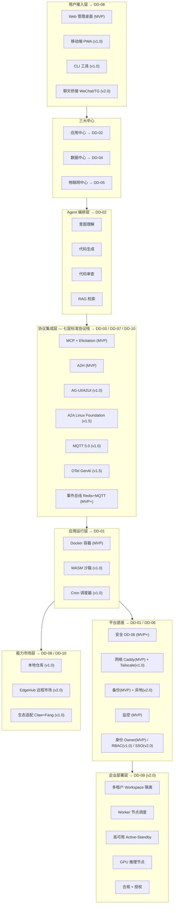
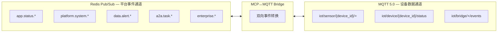
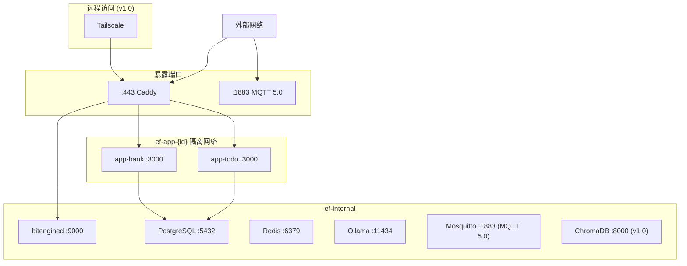
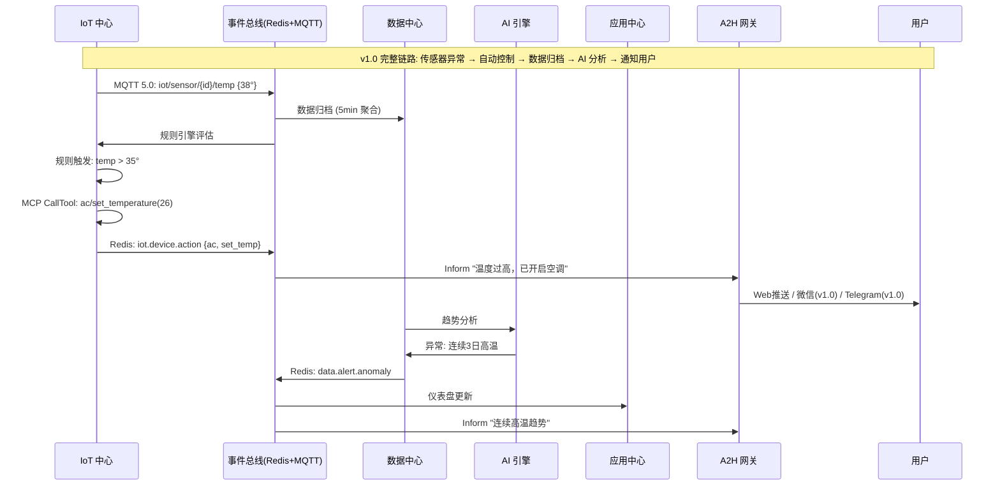

# BitEngine 总体设计文档（HLD）

> 版本：v7.0 | 基于架构文档 v7 | 完整覆盖 MVP · v1.0 · v1.5 · v2.0 四阶段 + 企业版

---

## 1 文档体系

本文档是 BitEngine 详细设计的入口。总体设计定义系统级约定、模块边界和接口契约；各详细设计文档覆盖单一模块的完整实现。

> **v7 变更**：DD 编号重新对齐架构修订计划。安全架构独立为 DD-06，协议层拆分为 DD-03（A2H + A2A）和 DD-07（MCP Server），新增 DD-10 生态集成架构。原 DD-02 应用运行层并入 DD-01，原 DD-03 应用中心并入 DD-02 AI 引擎。新增 v1.5 阶段聚焦七层标准协议栈完整落地。

| 编号 | 文档名 | 覆盖范围 | 改动幅度 | 各阶段关键交付 |
|------|--------|----------|---------|--------------|
| HLD | 总体设计（本文档） | 系统全景、模块接口、部署模型、开发规范 | — | — |
| DD-01 | 核心平台 | MQTT 5.0 Broker、MCP Server Registry、Docker/WASM 运行时、Redis、媒体存储、安装向导、应用共享 | 小改 | MVP:基础认证+Caddy+备份+监控+安装向导+Docker运行时 / v1.0:RBAC+Tailscale+WASM+Cron+多渠道通知+应用共享 / v2.0:SSO+异地备份+Anti-DDoS |
| DD-02 | AI 引擎 | Model Router 多模型路由、Intent Engine、Structured Output、代码生成管线、应用中心生成/迭代/导入/安全扫描 | **中大改** | MVP:全模型+代码生成+AI生成应用+模板+部署 / v1.0:AG-UI流+A2UI+迭代+注入扫描+批量导入CLI / v2.0:Governance+WebLLM |
| DD-03 | A2H + A2A 协作 | A2H 人机协作网关、A2A 多 Agent 编排（对齐 Google A2A v0.3 Linux Foundation）、编排逻辑、A2UI 确认 UI | **中改** | MVP:A2H(Web控制台) / v1.0:A2H多渠道(微信/TG/邮件/钉钉/Webhook) / v1.5:A2A内部协作+Agent Card / v2.0:A2A联邦 |
| DD-04 | 数据中心 | 文件管理、RAG 知识库、媒体入库管道（视频/音频/图片）、自然语言查询、数据管道、可视化、导出 | **中改** | MVP:文件管理器 / v1.0:全部 / v2.0:Agentic RAG |
| DD-05 | IoT 桥接 | MCP-based 设备提供者架构、MQTT 5.0 数据面、双模直连+桥接、MCP↔MQTT Bridge | **重写** | v1.0:MCP完整+MQTT 5.0桥接+Zigbee+规则+仪表盘 / v2.0:CV+工业协议+驱动市场 |
| DD-06 | 安全架构 | 十层纵深防御、Merkle 审计链、污点追踪、新协议攻击面防护（A2A Agent伪造/A2UI组件注入/MCP Elicitation钓鱼/跨协议攻击）、可信组件目录 | **小改** | MVP:基础安全 / v1.0:污点追踪+扫描 / v2.0:合规 |
| DD-07 | MCP Server | 统一控制面、设备聚合路由、MCP Elicitation 意图协商、无状态设计、A2A Agent Card 暴露 | 中改 | MVP:MCP双角色+Elicitation / v1.0:设备聚合 / v2.0:市场 |
| DD-08 | 前端架构 | React SPA、AG-UI + A2UI 标准渲染、AI Panel、IoT 页面、媒体库、PWA | 中改 | MVP:应用桌面+Dashboard+AI面板 / v1.0:IoT/Data页面+PWA+AG-UI / v2.0:市场UI+企业管理 |
| DD-09 | 企业部署 | 多租户、Worker 调度、高可用、MQTT 5.0 Shared Subscriptions HA、GPU 节点、合规、授权 | 微调 | v2.0:全部（企业版功能，社区版→企业版升级路径） |
| DD-10 | 生态集成架构 | **新文档**：七层标准协议栈集成总纲、对上/对下/双向集成场景、认证安全 | **新写** | v1.0~v2.0 |

**DD 编号映射说明（v6 → v7）**：

| v6 编号 | v6 内容 | v7 编号 | v7 内容 |
|---------|---------|---------|---------|
| DD-01 平台底座 | 认证/网络/备份/监控 | DD-01 核心平台 | 基础设施 + 运行时合并 |
| DD-02 应用运行层 | Docker/WASM | 并入 DD-01 | 运行时是核心平台的一部分 |
| DD-03 应用中心 | AI 生成流水线 | 并入 DD-02 | AI 生成是 AI 引擎的核心流程 |
| DD-04 数据中心 | 同 | DD-04 数据中心 | 不变，扩展媒体管道 |
| DD-05 IoT中心 | 同 | DD-05 IoT 桥接 | 不变，重写为 MCP+MQTT 5.0 架构 |
| DD-06 AI引擎 | 多模型路由/Ollama | DD-02 AI 引擎 | 重编号 + 中大改 |
| DD-07 协议层 | MCP/A2H/AG-UI/A2A | DD-03 + DD-07 | 拆分：A2H+A2A → DD-03，MCP → DD-07 |
| DD-08 前端与市场 | React SPA/市场 | DD-08 前端架构 | 不变，增加 AG-UI/A2UI 标准 |
| DD-09 企业部署 | 同 | DD-09 企业部署 | 不变，微调 HA |
| — | — | DD-06 安全架构 | **新独立**：从 DD-01 抽出 + 新协议安全面 |
| — | — | DD-10 生态集成 | **新增**：七层协议栈对外集成总纲 |

---

## 2 系统全景

### 2.1 分层架构与模块映射



### 2.2 七层标准协议栈（v7 新增）

> 核心原则：**对外每一层通信都用行业标准协议，自定义实现只存在于内部编排逻辑**。零自定义协议——竞争壁垒在于编排逻辑的深度（意图分解、方案优选、质量评估），而非协议的私有性。

| 层次 | 协议 | 角色比喻 | BitEngine 中的用途 | 标准组织 | 阶段 |
|------|------|---------|-------------------|---------|------|
| Agent ↔ Tool | **MCP** | 🤚 手——拿数据 | 能力模块 = MCP Tools；Elicitation 意图协商；暴露平台给外部 AI | Anthropic | MVP |
| Agent ↔ Human | **A2H** | 📞 回传——问人类 | 应用生成审批、运行时告警、危险操作授权 + Merkle 审计链 | Twilio | MVP |
| Agent ↔ Frontend | **AG-UI + A2UI** | 🖥 脸面——显成果 | 声明式 UI、事件流传输、A2H 确认弹窗渲染 | CopilotKit + Google | v1.0 |
| Agent ↔ Agent | **Google A2A** | 🤝 社交——找帮手 | 内部多 Agent 协作、Agent Card 对外暴露、跨设备联邦 | **Linux Foundation** | **v1.5** |
| Device ↔ Platform | **MQTT 5.0** | 📡 触觉——感知设备 | IoT 设备数据面传输、MCP↔MQTT Bridge | OASIS / ISO | v1.0 |
| 可观测性 | **OTel GenAI** | 🔍 体检——看健康 | Agent 链路追踪、LLM 调用监控、性能指标 | **CNCF** | v1.5 |
| 身份认证 | **OAuth 2.1** | 🔑 身份——证明你 | 统一认证框架、MCP/A2A 授权 | IETF | MVP |

### 2.3 进程模型

`bitengined` 是唯一的 Go 守护进程，负责编排所有卫星容器。

```mermaid
graph LR
    subgraph main["bitengined (Go 单进程)"]
        API["HTTP API :9000"]
        WS["WebSocket Hub"]
        SCHED["Cron 调度器 (v1.0)"]
        EVENTLOOP["事件循环"]
        OTEL["OTel GenAI 采集 (v1.5)"]
    end

    subgraph satellites["Docker 卫星容器"]
        CADDY["Caddy :443"]
        PG["PostgreSQL :5432"]
        REDIS["Redis :6379"]
        MOSQUITTO["Mosquitto :1883 (MQTT 5.0)"]
        CHROMA["ChromaDB :8000 (v1.0)"]
        OLLAMA["Ollama :11434"]
        Z2M["Zigbee2MQTT (v1.0)"]
        APPS["用户应用容器群"]
    end

    main --> satellites
```



> **v7 变更**：Mosquitto 从 v1.0 提前纳入 MVP 卫星容器（事件总线双通道需要），明确 MQTT 5.0 版本。OTel GenAI 采集器在 v1.5 加入主进程。
>
> **企业部署（v2.0 DD-09）**：分离部署模式下，PostgreSQL/Redis 外置到 Data 节点，Ollama 外置到 GPU 节点，应用容器分散到 Worker 节点。bitengined 双实例 Active-Standby 运行。MQTT 5.0 Shared Subscriptions 支持 HA 场景规则引擎负载均衡。通过 `deploy.yaml` 切换拓扑，接口不变。

---

## 3 全局约定

### 3.1 API 风格

所有模块对外暴露 RESTful HTTP API，前缀 `/api/v1/`。内部服务间使用 HMAC-SHA256 签名的内部 Token 通信。OAuth 2.1 作为统一认证框架，MCP/A2A 等协议的授权均基于 OAuth 2.1。

### 3.2 外部 API 路由表（全版本）

| 前缀 | 模块 | 关键端点 | 阶段 |
|------|------|---------|------|
| `/api/v1/auth` | DD-01 | login, refresh, logout, users(v1.0), roles(v1.0), sso(v2.0) | MVP+ |
| `/api/v1/system` | DD-01 | status, metrics, backup, restore, config, firewall(v1.0), audit | MVP+ |
| `/api/v1/sharing` | DD-01 | links/create/revoke | v1.0 |
| `/api/v1/remote` | DD-01 | tailscale/status/connect/disconnect | v1.0 |
| `/api/v1/apps` | DD-02 | CRUD, start/stop/restart, logs, generate, iterate(v1.0), import(v1.0) | MVP+ |
| `/api/v1/runtime` | DD-01 | containers, wasm(v1.0), cron(v1.0), resources | MVP+ |
| `/api/v1/data/files` | DD-04 | browse, upload, download, mkdir, delete, preview | MVP |
| `/api/v1/data/lake` | DD-04 | sources, query, sync | v1.0 |
| `/api/v1/data/kb` | DD-04 | ingest, search, documents, collections | v1.0 |
| `/api/v1/data/pipeline` | DD-04 | CRUD, run, status, history | v1.0 |
| `/api/v1/data/export` | DD-04 | csv, json, api | v1.0 |
| `/api/v1/data/viz` | DD-04 | dashboards, charts, queries | v1.0 |
| `/api/v1/media` | DD-04 | **upload, list, detail, thumbnail, transcript, ingest/status**（v7 新增媒体资产） | v1.0 |
| `/api/v1/iot/devices` | DD-05 | list, detail, tools, resources, discover | MVP(discover) + v1.0 |
| `/api/v1/iot/rules` | DD-05 | CRUD, enable/disable, test, history | v1.0 |
| `/api/v1/iot/dashboard` | DD-05 | sensors, history, map | v1.0 |
| `/api/v1/iot/bridges` | DD-05 | mqtt, zigbee, http, modbus(v2.0), status | v1.0+ |
| `/api/v1/iot/vision` | DD-05 | cameras, detect, alerts | v2.0 |
| `/api/v1/iot/firmware` | DD-05 | ota/trigger, status | v2.0 |
| `/api/v1/ai` | DD-02 | chat(SSE), intent, models, config, route, governance(v2.0) | MVP+ |
| `/api/v1/ai/models` | DD-02 | **list, status, load, unload, route-config**（v7 新增 Model Router） | MVP+ |
| `/api/v1/mcp` | DD-07 | JSON-RPC via POST /mcp/v1, **elicitation callback**（v7 新增） | MVP |
| `/api/v1/mcp/servers` | DD-07 | **registry, discover, connect, disconnect**（v7 新增 MCP Server 注册表） | MVP+ |
| `/api/v1/a2h` | DD-03 | pending, respond, history, channels(v1.0) | MVP+ |
| `/api/v1/a2a` | DD-03 | **agents, agent-card, tasks, delegate**（v7：v1.5 引入，对齐 Google A2A v0.3） | v1.5+ |
| `/.well-known/agent.json` | DD-03 | **A2A Agent Card 发布端点**（v7 新增） | v1.5 |
| `/api/v1/a2a/federation` | DD-03 | peers, federate-task | v2.0 |
| `/api/v1/otel` | DD-10 | **traces, traces/:trace_id, metrics/genai, metrics/tools**（v7 新增 OTel GenAI） | v1.5 |
| `/api/v1/market` | DD-08/DD-10 | modules/search/install, publish(v2.0), ecosystems(v1.0) | v1.0+ |
| `/v1/chat/completions` | DD-07 | OpenAI 兼容 API | v1.0 |
| `/ws` | DD-03 | WebSocket (通知+A2H+实时数据+AG-UI事件流) | MVP |
| `/api/v1/setup` | DD-01 | status, step/:n (首次安装向导) | MVP |
| `/api/v1/org` | DD-09 | 组织信息, 设置 | v2.0 |
| `/api/v1/workspaces` | DD-09 | CRUD, members, share | v2.0 |
| `/api/v1/admin/workers` | DD-09 | 注册/移除/drain Worker 节点 | v2.0 |
| `/api/v1/admin/ha` | DD-09 | HA 状态, 手动故障转移 | v2.0 |
| `/api/v1/admin/license` | DD-09 | 上传/查看企业授权 | v2.0 |
| `/api/v1/compliance` | DD-09 | 合规报告, 审计导出, GDPR删除, 数据驻留 | v2.0 |

### 3.3 认证模型

| 阶段 | 认证方式 | 说明 |
|------|---------|------|
| MVP | OAuth 2.1 + JWT (单用户 owner) | 安装时创建，登录获取 access_token + refresh_token；MCP/API 授权基于 OAuth 2.1 |
| v1.0 | OAuth 2.1 + JWT + RBAC (多用户) | owner/admin/member/guest 四角色，应用级权限，邀请链接注册 |
| v1.5 | OAuth 2.1 + JWT + RBAC + A2A安全卡 | A2A Agent Card 签名验证，外部 Agent 信任等级分层 |
| v2.0 | OAuth 2.1 + JWT + RBAC + SSO | OIDC/SAML 单点登录，企业 IdP 集成 |
| v2.0 企业 | OAuth 2.1 + JWT + RBAC + SSO + Tenant | 请求携带 X-Workspace-ID，TenantMiddleware 注入上下文，所有数据按 workspace_id 隔离 |

内部服务间：HMAC-SHA256 签名。

### 3.4 通用约定

- 错误格式：`{"error":{"code":"MODULE_ERROR_CODE","message":"...","details":{},"trace_id":"UUIDv7"}}`
- HTTP 状态码：400/401/403/404/409/429/500/503
- 分页：`?page=1&size=20`，响应含 `total/page/size/pages`
- 时间：UTC ISO 8601 `2026-03-02T15:30:00Z`
- ID：UUIDv7（时间排序、无冲突）

---

## 4 事件总线

> **v7 变更**：事件总线从单一 Redis Pub/Sub 升级为**双通道架构**——Redis Pub/Sub 承载内部平台事件，MQTT 5.0 承载 IoT 设备数据面事件。两个通道通过 MCP↔MQTT Bridge 互通。

### 4.1 双通道架构



### 4.2 事件主题（全版本）

**Redis Pub/Sub 通道（平台事件）**：

| 主题 | 发布者 | 消费者 | 阶段 |
|------|--------|--------|------|
| `app.status.started` | Runtime | 监控, 前端 | MVP |
| `app.status.stopped` | Runtime | 监控, 前端 | MVP |
| `app.status.error` | Runtime | 监控, A2H | MVP |
| `app.generation.progress` | AI 引擎 | 前端 SSE | MVP |
| `app.iteration.done` | 迭代服务 | 前端, A2H | v1.0 |
| `data.alert.anomaly` | AI 分析 | 应用中心, A2H | v1.0 |
| `data.pipeline.done` | 数据管道 | 前端, 审计 | v1.0 |
| `data.export.ready` | 导出服务 | 前端, A2H | v1.0 |
| `platform.system.backup_done` | 备份 | 前端, A2H | MVP |
| `platform.system.backup_failed` | 备份 | A2H | MVP |
| `platform.system.low_disk` | 监控 | A2H | MVP |
| `platform.system.high_memory` | 监控 | A2H | MVP |
| `platform.user.login` | 认证 | 审计 | MVP |
| `platform.user.created` | 身份 | 审计 | v1.0 |
| `market.module.installed` | 市场 | 审计, MCP 注册 | v1.0 |
| `market.module.updated` | 市场 | 审计 | v1.0 |
| `a2a.task.delegated` | 编排 Agent | 子 Agent | v1.5 |
| `a2a.task.completed` | 子 Agent | 编排 Agent | v1.5 |
| `otel.trace.completed` | OTel 采集器 | 追踪 UI, 审计 | v1.5 |
| `enterprise.worker.online` | Worker 心跳 | 监控, 调度器 | v2.0 |
| `enterprise.worker.offline` | 健康检查 | 调度器, A2H | v2.0 |
| `enterprise.ha.promoted` | HA Manager | 审计, 前端 | v2.0 |
| `enterprise.ha.demoted` | HA Manager | 审计 | v2.0 |
| `enterprise.workspace.created` | 租户管理 | 审计 | v2.0 |
| `enterprise.license.updated` | License 管理 | 审计, 前端 | v2.0 |

**MQTT 5.0 通道（设备数据面）**：

| 主题模式 | 发布者 | 消费者 | MQTT 5.0 特性 | 阶段 |
|---------|--------|--------|-------------|------|
| `iot/sensor/{device_id}/{metric}` | IoT 设备/Bridge | 数据中心, 规则引擎 | User Properties (device_id, MIME type), Message Expiry | v1.0 |
| `iot/device/{device_id}/status` | 设备/健康检查 | 监控, A2H, 前端 | Reason Code (断连原因) | v1.0 |
| `iot/device/{device_id}/action` | 规则引擎 | A2H, 审计 | Content Type (JSON) | v1.0 |
| `iot/bridge/{bridge_type}/events` | MCP↔MQTT Bridge | 设备注册表 | Request/Response (控制面操作) | v1.0 |
| `iot/vision/{camera_id}/detect` | CV 模块 | 规则引擎, A2H | User Properties (confidence, class) | v2.0 |
| `$share/rules/iot/sensor/#` | — | 规则引擎多实例 | **Shared Subscriptions** (HA 负载均衡) | v2.0 |

### 4.3 事件结构

```go
type Event struct {
    ID        string                 `json:"id"`
    Topic     string                 `json:"topic"`
    Source    string                 `json:"source"`
    Channel   EventChannel           `json:"channel"`            // v7: redis | mqtt
    Timestamp time.Time              `json:"timestamp"`
    TraceID   string                 `json:"trace_id"`
    Data      map[string]interface{} `json:"data"`
}

type EventChannel string

const (
    ChannelRedis EventChannel = "redis"
    ChannelMQTT  EventChannel = "mqtt"
)
```

---

## 5 数据库 Schema 分配

| 数据库/Schema | 用途 | 引擎 | 阶段 |
|--------------|------|------|------|
| `bitengine` | 平台核心 (用户/配置/备份记录/共享链接) | PostgreSQL | MVP |
| `apps` | 应用元数据 + 生成记录 + 模板 + 应用包 | PostgreSQL | MVP |
| `app_{id}` | 每应用独立 schema (隔离) | PostgreSQL | MVP |
| `mcp_servers` | **MCP Server 注册表**（内部+外部 Server 元数据、连接配置、健康状态）（v7 新增） | PostgreSQL | MVP |
| `media_assets` | **媒体资产表**（视频/音频/图片元数据、缩略图路径、转码状态、MIME 类型）（v7 新增） | PostgreSQL | v1.0 |
| `datalake` | 跨应用数据视图 + 传感器归档 + 管道定义 | PostgreSQL | v1.0 |
| `iot` | 设备注册表 + 规则 + 桥接配置 + 传感器映射 | PostgreSQL | v1.0 |
| `market` | 模块注册表 + 安装记录 + 生态适配 | SQLite | v1.0 |
| `audit` | Merkle 审计链 (append-only) | SQLite | MVP |
| `vault` | 密钥保险库 (加密存储) | SQLite | MVP |
| `vectors` | 向量存储 (每应用隔离 + 全局共享 Collection) | ChromaDB | v1.0 |
| `enterprise` | 组织/Workspace/成员/共享资源/Worker 节点 | PostgreSQL | v2.0 |

> **mcp_servers 表结构（v7 新增）**：
> ```sql
> CREATE TABLE mcp_servers (
>     id            UUID PRIMARY KEY DEFAULT gen_random_uuid(),
>     name          TEXT NOT NULL,
>     url           TEXT NOT NULL,
>     transport     TEXT NOT NULL DEFAULT 'streamable_http',  -- streamable_http | sse
>     auth_type     TEXT,                                      -- none | oauth2 | pat | api_key
>     auth_config   JSONB,                                     -- 加密存储的认证配置
>     source        TEXT NOT NULL DEFAULT 'external',          -- internal | external | iot_bridge
>     capabilities  JSONB,                                     -- tools[], resources[] 缓存
>     health_status TEXT NOT NULL DEFAULT 'unknown',           -- healthy | degraded | offline | unknown
>     last_ping     TIMESTAMPTZ,
>     created_at    TIMESTAMPTZ NOT NULL DEFAULT NOW(),
>     updated_at    TIMESTAMPTZ NOT NULL DEFAULT NOW()
> );
> ```

> **media_assets 表结构（v7 新增）**：
> ```sql
> CREATE TABLE media_assets (
>     id            UUID PRIMARY KEY DEFAULT gen_random_uuid(),
>     app_id        UUID REFERENCES apps(id),
>     filename      TEXT NOT NULL,
>     mime_type     TEXT NOT NULL,                              -- video/mp4, audio/mpeg, image/jpeg
>     file_path     TEXT NOT NULL,
>     file_size     BIGINT NOT NULL,
>     thumbnail_path TEXT,
>     transcode_status TEXT DEFAULT 'pending',                 -- pending | processing | done | failed
>     metadata      JSONB,                                     -- duration, resolution, bitrate 等
>     source        TEXT DEFAULT 'upload',                     -- upload | iot_camera | pipeline
>     created_at    TIMESTAMPTZ NOT NULL DEFAULT NOW()
> );
> ```

> **多租户隔离（v2.0）**：启用企业版后，runtime.apps / iot.devices / datalake.* / mcp_servers / media_assets 等表增加 workspace_id 列。向量 Collection 命名规则 `ws_{ws_id}_app_{app_id}_docs`。密钥命名空间 `ws/{ws_id}/{secret_name}`。

---

## 6 安全基线（全版本）

### 6.1 十一层纵深防御

> **v7 变更**：新增第 L1 层 OAuth 2.1 统一认证框架覆盖、L11 新协议攻击面防护层。安全防线延伸到 A2A/A2UI/MCP Elicitation 新协议边界。

| 层 | 机制 | 阶段 |
|----|------|------|
| L1 网络边界 | Caddy 自动 HTTPS + 只暴露 80/443 | MVP |
| L1+ | nftables 防火墙 + 请求频率限制 + Tailscale VPN | v1.0 |
| L1++ | Anti-DDoS Smart Shield + Geo-blocking + 验证码降级 | v2.0 |
| L2 认证授权 | **OAuth 2.1** 统一框架 + JWT 单用户 | MVP |
| L2+ | 多用户 RBAC + 应用级共享 (公开链接/密码保护/过期时间) | v1.0 |
| L2++ | SSO (OIDC/SAML) + **A2A Agent Card 签名验证** | v1.5/v2.0 |
| L3 双层隔离 | Docker namespace + cgroups | MVP |
| L3+ | WASM 沙箱 (Wazero + 燃料计量 + epoch 中断 + 看门狗) | v1.0 |
| L4 网络隔离 | 每应用独立 Docker 网络，应用间不互通 | MVP |
| L5 资源计量 | Docker cgroups (CPU/Memory/Pids/ReadonlyRootfs) | MVP |
| L5+ | WASM 燃料 + 内存上限 + 宿主函数白名单 | v1.0 |
| L6 数据隔离 | 每应用独立 schema + 数据卷 + 备份加密 | MVP |
| L7 污点追踪 | 敏感数据标记 → 日志/网络/跨应用阻断 → 云端 API 脱敏 → 密钥零化 | v1.0 |
| L8 清单签名 | Ed25519 模块签名验证 + 市场强制签名 + 生态导入安全扫描（SecurityScanner） | MVP |
| L9 注入扫描 | 提示注入检测 + Agent/应用数据严格隔离 + Structured Output 收益 | MVP |
| L10 审计链 | Merkle SHA-256 哈希链 append-only + 异常告警 + 合规导出 | MVP |
| L10+ | 合规报告 + GDPR 数据删除 + 数据驻留策略 | v2.0 |
| **L11 新协议安全**（v7 新增） | **A2A Agent Card 签名验证 + A2UI 可信组件目录 + MCP Elicitation 来源验证/URL 白名单 + AG-UI 事件流完整性校验 + 跨协议 Governance Agent 审批** | v1.5 |
| L12 租户隔离 | Workspace 级数据隔离 (SQL WHERE + 目录 + Collection + Vault namespace) | v2.0 |

### 6.2 新协议攻击面防护（v7 新增）

| 新协议面 | 威胁模型 | 防护措施 |
|---------|---------|---------|
| Google A2A | 外部 Agent 伪造身份；恶意任务注入；Agent Card 欺骗 | A2A Agent Card 签名验证（v0.3 安全卡）；外部 Agent 信任等级分层（可信/半可信/不可信）；A2A 任务纳入 Merkle 审计链 |
| A2UI 声明式 UI | 恶意组件类型注入；通过 UI 描述诱导用户操作 | **可信组件目录**（Trusted Component Catalog）——只允许渲染目录中已注册的组件类型；A2UI JSON Schema 强制校验 |
| MCP Elicitation | 钓鱼式 Elicitation（诱导敏感信息）；恶意 URL 重定向 | Elicitation 来源验证（只允许已授权 MCP Server）；URL mode 白名单；敏感字段标记与审计 |
| AG-UI 事件流 | 事件注入/篡改；伪造 Agent 状态更新 | AG-UI 事件流完整性校验；与 OAuth 2.1 token 绑定 |
| **跨协议攻击** | 外部 A2A Agent 试图绕过 A2H 审批 | **核心规则：所有外部来源的执行请求，无论通过 MCP、A2A 还是 REST API 进入，都必须经过 Governance Agent 风险评估和 A2H 审批** |

### 6.3 安全原则

- 零信任：所有请求需认证（OAuth 2.1），内部服务间需签名
- 最小权限：应用只能访问声明的资源
- 敏感数据加密：备份 AES-256-GCM，密钥用后零化（3次内存覆写）
- 审计全覆盖：所有状态变更写入审计链
- 输入验证：所有用户输入 + AI 代码经验证/审查
- 云端隔离：业务数据不上传，只传脱敏后的需求描述

---

## 7 部署模型

### 7.1 Docker Compose 编排（全版本）

```yaml
services:
  # === MVP 服务 ===
  bitengined:
    image: bitengine/core:latest
    ports: ["9000:9000"]
    networks: [ef-internal]
    volumes: ["/bitengine:/bitengine"]

  caddy:
    image: caddy:2-alpine
    ports: ["80:80", "443:443"]
    networks: [ef-internal]

  postgresql:
    image: postgres:16-alpine
    networks: [ef-internal]
    volumes: ["pg_data:/var/lib/postgresql/data"]

  redis:
    image: redis:7-alpine
    networks: [ef-internal]

  mosquitto:                            # v7: 从 v1.0 提前到 MVP（事件总线双通道）
    image: eclipse-mosquitto:2
    ports: ["1883:1883", "8883:8883"]
    networks: [ef-internal]
    volumes: ["mosquitto_data:/mosquitto/data", "mosquitto_config:/mosquitto/config"]
    environment:
      - MQTT_VERSION=5.0                # v7: 强制 MQTT 5.0

  ollama:
    image: ollama/ollama:latest
    networks: [ef-internal]
    deploy:
      resources:
        reservations: { memory: 12G }

  # === v1.0 新增服务 ===
  chromadb:
    image: chromadb/chroma:latest
    networks: [ef-internal]
    profiles: ["v1"]

  zigbee2mqtt:
    image: koenkk/zigbee2mqtt:latest
    networks: [ef-internal]
    profiles: ["v1"]
    devices: ["/dev/ttyUSB0:/dev/ttyUSB0"]

networks:
  ef-internal:
    driver: bridge
    internal: true
```

### 7.2 网络拓扑

> 以下为单机拓扑（Tier 1），企业分离部署（Tier 2）详见 DD-09。



### 7.3 企业分离部署（v2.0 DD-09）

| 拓扑 | 适用规模 | 节点 | 说明 |
|------|---------|------|------|
| Tier 1: 单机 | 1-50 人 | 1 台 | 上述 Docker Compose，MVP~v1.0 默认 |
| Tier 2: 分离 | 50-200 人 | 2-5 台 | Platform × 2 (Active-Standby) + Data + AI(GPU) + Worker × N |
| Tier 3: 集群 | 200-500+ | 5-15 台 | K3s 编排，v3.0 远期 |

通过 `/data/bitengine/config/deploy.yaml` 的 `topology: standalone | separated | cluster` 字段切换。分离部署时 PostgreSQL/Redis 使用外部连接串，Ollama 指向远程 GPU 节点，MQTT 5.0 Shared Subscriptions 支持规则引擎多实例 HA，应用容器由 WorkerScheduler 分配到 Worker 节点（最少负载 / 装箱优化 / Workspace 亲和三种策略）。

**社区版安装命令**：

```bash
# 一行命令安装（目标 15 分钟内完成）
curl -fsSL https://bitengine.io/install.sh | bash

# 安装脚本自动完成：
# 1. 检测系统环境（CPU架构、内存、存储、Docker是否已安装）
# 2. 安装 Docker（如果没有）
# 3. 拉取 BitEngine 核心镜像
# 4. 启动平台服务（Caddy + Auth + Console + Mosquitto）
# 5. 生成管理员账户和初始密码
# 6. 输出访问地址
```

**企业版安装命令**：

```bash
# Platform 节点
curl -fsSL https://bitengine.io/install-enterprise.sh | bash -s -- \
  --role platform --license /path/to/license.json \
  --db-url "postgres://admin@db-01:5432/bitengine" \
  --redis-sentinels "redis-01:26379,redis-02:26379"

# Worker 节点
curl -fsSL https://bitengine.io/install-enterprise.sh | bash -s -- \
  --role worker --platform-url "https://platform-01:8080" --join-token "eyJ..."
```

### 7.4 数据持久化目录

```
/data/bitengine/
├── apps/{app-name}/          # 应用数据卷 (db/ uploads/ config.json)
├── data-hub/                 # 知识库向量 + 文档 + 管道 + 导出
│   └── media/                # v7: 媒体资产存储 (视频/音频/图片)
├── iot-hub/                  # 设备注册 + 规则 + 传感器数据(90天) + MQTT
├── modules/                  # 能力模块数据
├── platform/                 # PostgreSQL + Redis + vault.db + 审计链
├── mosquitto/                # v7: Mosquitto 持久化数据 + TLS 证书
├── backups/                  # daily/ weekly/ snapshots/
├── registry/                 # 本地模块缓存
└── config/                   # bitengine.yaml + deploy.yaml
```

---

## 8 Go 接口契约（全版本）

### 8.1 DD-01 核心平台

```go
// === 认证 ===
type AuthService interface {
    Login(ctx context.Context, username, password string) (*TokenPair, error)                    // MVP
    ValidateToken(ctx context.Context, token string) (*Claims, error)                            // MVP
    RefreshToken(ctx context.Context, refreshToken string) (*TokenPair, error)                   // MVP
    CreateUser(ctx context.Context, req CreateUserRequest) (*User, error)                        // v1.0
    ListUsers(ctx context.Context) ([]*User, error)                                              // v1.0
    UpdateUserRole(ctx context.Context, userID string, role Role) error                          // v1.0
    DeleteUser(ctx context.Context, userID string) error                                         // v1.0
    CreateShareLink(ctx context.Context, appID string, opts ShareOptions) (*ShareLink, error)    // v1.0
    ValidateShareLink(ctx context.Context, token string) (*ShareAccess, error)                   // v1.0
    InitSSO(ctx context.Context, provider SSOProvider) (*SSOConfig, error)                       // v2.0
    HandleSSOCallback(ctx context.Context, code string) (*TokenPair, error)                      // v2.0
}

// === 备份 ===
type BackupService interface {
    CreateBackup(ctx context.Context, scope BackupScope) (*Backup, error)                        // MVP
    ListBackups(ctx context.Context) ([]*Backup, error)                                          // MVP
    Restore(ctx context.Context, backupID string, opts RestoreOptions) error                     // MVP
    CreateSnapshot(ctx context.Context, appID string) (*Snapshot, error)                         // MVP
    Rollback(ctx context.Context, snapshotID string) error                                       // MVP
    ConfigureOffsite(ctx context.Context, target OffsiteTarget) error                            // v2.0
    SyncOffsite(ctx context.Context, backupID string) error                                      // v2.0
}

// === 网络 ===
type NetworkService interface {
    AddRoute(ctx context.Context, domain, upstream string) error                                 // MVP
    RemoveRoute(ctx context.Context, domain string) error                                        // MVP
    GetTailscaleStatus(ctx context.Context) (*TailscaleStatus, error)                            // v1.0
    ConnectTailscale(ctx context.Context, authKey string) error                                  // v1.0
    SetFirewallRules(ctx context.Context, rules []FirewallRule) error                             // v1.0
    SetCustomDomain(ctx context.Context, domain string) error                                    // v1.0
    ConfigureAntiDDoS(ctx context.Context, config AntiDDoSConfig) error                          // v2.0
}

// === 监控 ===
type MonitorService interface {
    GetSystemMetrics(ctx context.Context) (*SystemMetrics, error)                                 // MVP
    GetAppHealth(ctx context.Context, appID string) (*HealthStatus, error)                        // MVP
    GetAlerts(ctx context.Context) ([]*Alert, error)                                              // MVP
    ConfigureAlert(ctx context.Context, rule AlertRule) error                                     // MVP
}

// === 审计 ===
type AuditChain interface {
    Append(ctx context.Context, entry AuditEntry) error                                          // MVP
    Verify(ctx context.Context) (bool, error)                                                    // MVP
    Query(ctx context.Context, filter AuditFilter) ([]*AuditEntry, error)                        // MVP
    Export(ctx context.Context, format string) ([]byte, error)                                   // MVP
}

// === 应用运行层（原 DD-02，v7 并入 DD-01）===
type AppRuntime interface {
    Create(ctx context.Context, spec AppSpec) (*AppInstance, error)                               // MVP
    Start(ctx context.Context, appID string) error                                               // MVP
    Stop(ctx context.Context, appID string) error                                                // MVP
    Remove(ctx context.Context, appID string) error                                              // MVP
    Logs(ctx context.Context, appID string, opts LogOptions) (io.ReadCloser, error)              // MVP
    GetStatus(ctx context.Context, appID string) (*AppStatus, error)                             // MVP
    BlueGreenDeploy(ctx context.Context, appID string, newSpec AppSpec) error                    // v1.0
    RollbackDeploy(ctx context.Context, appID string) error                                      // v1.0
    ExecuteWasm(ctx context.Context, moduleID string, input []byte) ([]byte, error)              // v1.0
    LoadWasmModule(ctx context.Context, wasmPath string, config WasmConfig) (string, error)      // v1.0
    ScheduleTask(ctx context.Context, task CronTask) (string, error)                             // v1.0
    ListTasks(ctx context.Context) ([]*CronTask, error)                                          // v1.0
    CancelTask(ctx context.Context, taskID string) error                                         // v1.0
    ExecuteWasmAI(ctx context.Context, moduleID string, input []byte, model string) ([]byte, error) // v2.0
}

// === 安装向导 ===
type SetupWizard interface {
    GetStatus(ctx context.Context) (*SetupState, error)                                          // MVP
    CompleteStep(ctx context.Context, step int, data map[string]interface{}) error                // MVP
}

// === 应用共享 ===
type SharingService interface {
    CreateLink(ctx context.Context, req CreateLinkRequest) (*SharedLink, error)                   // v1.0
    ValidateAccess(ctx context.Context, token, password string) (*SharedLink, error)              // v1.0
    RevokeLink(ctx context.Context, linkID string) error                                          // v1.0
}
```

### 8.2 DD-02 AI 引擎（v7 重编号，原 DD-06 + 原 DD-03 应用中心）

```go
// === Model Router（v7 新增）===
type ModelRouter interface {
    Route(ctx context.Context, task TaskType, input string) (*RouteDecision, error)               // MVP
    ListModels(ctx context.Context) ([]*ModelInfo, error)                                         // MVP
    GetModelStatus(ctx context.Context, modelName string) (*ModelStatus, error)                   // MVP
    LoadModel(ctx context.Context, modelName string) error                                        // MVP
    UnloadModel(ctx context.Context, modelName string) error                                      // MVP
    ConfigureRouting(ctx context.Context, rules []RoutingRule) error                              // MVP
}

type RouteDecision struct {
    Model       string   `json:"model"`        // 选定模型
    Reason      string   `json:"reason"`       // 选择原因
    Fallback    string   `json:"fallback"`     // 备选模型
    IsLocal     bool     `json:"is_local"`     // 本地 vs 云端
    TaskType    TaskType `json:"task_type"`    // intent_routing | code_gen | embedding | ...
}

// === Intent Input Adapter（v7 新增）===
type IntentInputAdapter interface {
    Parse(ctx context.Context, rawInput string) (*IntentInput, error)                             // MVP
    NegotiateViaElicitation(ctx context.Context, partial *IntentResult, serverID string) (*IntentResult, error)  // MVP (MCP Elicitation)
    Validate(ctx context.Context, input *IntentInput) (*ValidationResult, error)                  // MVP
}

type IntentInput struct {
    RawText           string            `json:"raw_text"`
    DetectedLanguage  string            `json:"detected_language"`   // zh | en
    Channel           string            `json:"channel"`             // web | cli | chat_bridge | mcp_elicitation
    SessionID         string            `json:"session_id"`
    Context           map[string]any    `json:"context,omitempty"`   // 会话上下文
}

// === AI 引擎核心 ===
type AIEngine interface {
    Chat(ctx context.Context, messages []Message, events chan<- SSEEvent) error                   // MVP
    RouteIntent(ctx context.Context, input string) (*IntentResult, error)                        // MVP
    GenerateApp(ctx context.Context, intent IntentResult) (*GeneratedCode, error)                // MVP
    ReviewCode(ctx context.Context, code string) (*ReviewReport, error)                          // MVP
    Embed(ctx context.Context, texts []string) ([][]float32, error)                              // MVP
    GenerateAppUpdate(ctx context.Context, appID, prompt, currentCode string) (*GeneratedCode, error) // v1.0
    GenerateA2UI(ctx context.Context, intent IntentResult) (*A2UISpec, error)                    // v1.0
    StreamAGUI(ctx context.Context, sessionID string, events chan<- AGUIEvent) error              // v1.0
    DelegateA2A(ctx context.Context, task A2ATask) (<-chan A2AResult, error)                     // v1.5
    GovernanceCheck(ctx context.Context, action string, ctx2 map[string]interface{}) (*GovernanceResult, error) // v2.0
}

// === 应用中心（原 DD-03，v7 并入 DD-02）===
type AppCenter interface {
    GenerateApp(ctx context.Context, prompt string, events chan<- SSEEvent) (*AppInstance, error) // MVP
    DeployTemplate(ctx context.Context, templateSlug string) (*AppInstance, error)                // MVP
    ListApps(ctx context.Context) ([]*AppInstance, error)                                        // MVP
    GetApp(ctx context.Context, appID string) (*AppInstance, error)                              // MVP
    DeleteApp(ctx context.Context, appID string) error                                           // MVP
    IterateApp(ctx context.Context, appID string, prompt string, events chan<- SSEEvent) error    // v1.0
    ImportFromClaw(ctx context.Context, skillName string) (*AppInstance, error)                   // v1.0
    ImportFromFang(ctx context.Context, handName string) (*AppInstance, error)                    // v1.0
    BatchImport(ctx context.Context, source, category string, dryRun bool) (*ImportResult, error) // v1.0
    DeployAutonomousPack(ctx context.Context, packSlug string) (*AppInstance, error)              // v1.0
}

type SecurityScanner interface {
    Scan(ctx context.Context, code string) (*ScanResult, error)                                  // v1.0
}

type InjectionScanner interface {
    Scan(ctx context.Context, input string) (*ScanResult, error)                                  // v1.0
}
```

### 8.3 DD-03 A2H + A2A 协作（v7 拆分自原 DD-07）

```go
// === A2H 网关 ===
type A2HGateway interface {
    Inform(ctx context.Context, message string, opts ...A2HOption) error                         // MVP
    Authorize(ctx context.Context, action string, evidence interface{}, opts ...A2HOption) (bool, error) // MVP
    Collect(ctx context.Context, question string, opts ...A2HOption) (string, error)             // v1.0
    Escalate(ctx context.Context, context string, opts ...A2HOption) error                       // v1.0
    Result(ctx context.Context, taskID string, result interface{}) error                         // v1.0
    ConfigureChannel(ctx context.Context, channel ChannelConfig) error                           // v1.0
}

// === AG-UI 事件流 ===
type AGUIStream interface {
    SendText(ctx context.Context, sessionID string, text string) error                           // v1.0
    SendToolCall(ctx context.Context, sessionID string, tool ToolCallEvent) error                 // v1.0
    SendStateDelta(ctx context.Context, sessionID string, delta interface{}) error                // v1.0
    SendInterrupt(ctx context.Context, sessionID string, request A2HRequest) error               // v1.0
    SendGenerativeUI(ctx context.Context, sessionID string, a2ui A2UISpec) error                  // v1.0
}

// === A2A Server（v7 新增，对齐 Google A2A v0.3 Linux Foundation）===
type A2AServer interface {
    PublishAgentCard(ctx context.Context) (*A2AAgentCard, error)                                  // v1.5
    HandleTask(ctx context.Context, task A2ATask) (*A2ATaskStatus, error)                         // v1.5
    UpdateTaskStatus(ctx context.Context, taskID string, status A2ATaskState) error               // v1.5
    ListPublishedSkills(ctx context.Context) ([]A2ASkill, error)                                  // v1.5
}

type A2AAgentCard struct {
    Name           string      `json:"name"`
    Description    string      `json:"description"`
    URL            string      `json:"url"`
    Skills         []A2ASkill  `json:"skills"`
    Authentication A2AAuth     `json:"authentication"`
    Signature      string      `json:"signature"`       // v7: Agent Card 签名
}

type A2ATaskState string

const (
    A2ATaskSubmitted     A2ATaskState = "submitted"
    A2ATaskWorking       A2ATaskState = "working"
    A2ATaskInputRequired A2ATaskState = "input-required"
    A2ATaskCompleted     A2ATaskState = "completed"
    A2ATaskFailed        A2ATaskState = "failed"
    A2ATaskCanceled      A2ATaskState = "canceled"
)

// === A2A 编排协调（内部 + 联邦）===
type A2ACoordinator interface {
    CreateTask(ctx context.Context, task A2ATask) (string, error)                                // v1.5
    DelegateSubTask(ctx context.Context, parentID string, subTask A2ATask) (string, error)       // v1.5
    GetTaskStatus(ctx context.Context, taskID string) (*A2ATaskStatus, error)                     // v1.5
    ListAgents(ctx context.Context) ([]*A2AAgent, error)                                         // v1.5
    DiscoverPeers(ctx context.Context) ([]*BitEnginePeer, error)                                 // v2.0
    FederateTask(ctx context.Context, peerID string, task A2ATask) (string, error)               // v2.0
}
```

### 8.4 DD-04 数据中心

```go
type DataHub interface {
    // MVP - 文件管理
    ListFiles(ctx context.Context, path string) ([]*FileEntry, error)
    Upload(ctx context.Context, path string, file io.Reader) error
    Download(ctx context.Context, path string) (io.ReadCloser, error)
    MkDir(ctx context.Context, path string) error
    DeleteFile(ctx context.Context, path string) error
    PreviewFile(ctx context.Context, path string) (*Preview, error)
    // v1.0 - 数据湖
    RegisterSource(ctx context.Context, source DataSource) error
    NaturalQuery(ctx context.Context, question string) (*QueryResult, error)
    ListSources(ctx context.Context) ([]*DataSource, error)
    // v1.0 - RAG
    IngestDocument(ctx context.Context, appID string, doc io.Reader, meta DocMeta) error
    SemanticSearch(ctx context.Context, appID string, query string, topK int) ([]*SearchResult, error)
    ListDocuments(ctx context.Context, appID string) ([]*Document, error)
    DeleteDocument(ctx context.Context, appID string, docID string) error
    // v1.0 - 媒体资产（v7 新增）
    IngestMedia(ctx context.Context, appID string, file io.Reader, meta MediaMeta) (*MediaAsset, error)
    ListMediaAssets(ctx context.Context, appID string, filter MediaFilter) ([]*MediaAsset, error)
    GetMediaThumbnail(ctx context.Context, assetID string) (io.ReadCloser, error)
    // v1.0 - 管道 + 导出 + 可视化
    CreatePipeline(ctx context.Context, pipeline Pipeline) (string, error)
    RunPipeline(ctx context.Context, pipelineID string) error
    ExportData(ctx context.Context, query string, format ExportFormat) (io.ReadCloser, error)
    CreateDashboard(ctx context.Context, dash Dashboard) (string, error)
    // v2.0
    AgenticSearch(ctx context.Context, query string, strategy SearchStrategy) ([]*SearchResult, error)
}
```

### 8.5 DD-05 IoT 桥接

```go
// === Device Aggregator（v7 新增：统一设备聚合路由）===
type DeviceAggregator interface {
    DiscoverDevices(ctx context.Context) ([]*Device, error)                                      // MVP
    RegisterDevice(ctx context.Context, device DeviceRegistration) (*Device, error)               // v1.0
    ListDevices(ctx context.Context) ([]*Device, error)                                          // v1.0
    GetDevice(ctx context.Context, deviceID string) (*Device, error)                             // v1.0
    AggregateTools(ctx context.Context) ([]MCPTool, error)                                       // v1.0 (聚合所有设备工具到统一 MCP)
    AggregateResources(ctx context.Context) ([]MCPResource, error)                               // v1.0
    RouteToolCall(ctx context.Context, toolName string, args map[string]any) (any, error)        // v1.0 (路由到正确设备)
    RouteResourceRead(ctx context.Context, resourceURI string) (any, error)                      // v1.0
}

// === IoT Hub 核心 ===
type IoTHub interface {
    CallDeviceTool(ctx context.Context, deviceID, toolName string, args map[string]interface{}) (interface{}, error) // v1.0
    ReadDeviceResource(ctx context.Context, deviceID, resourceURI string) (interface{}, error)   // v1.0
    SubscribeDevice(ctx context.Context, deviceID, resourceURI string) (<-chan DeviceEvent, error) // v1.0
    CreateRule(ctx context.Context, rule AutomationRule) (string, error)                          // v1.0
    CreateRuleFromNL(ctx context.Context, description string) (*AutomationRule, error)            // v1.0
    ListRules(ctx context.Context) ([]*AutomationRule, error)                                     // v1.0
    ToggleRule(ctx context.Context, ruleID string, enabled bool) error                            // v1.0
    ConfigureBridge(ctx context.Context, bridgeType string, config BridgeConfig) error            // v1.0
    GetBridgeStatus(ctx context.Context, bridgeType string) (*BridgeStatus, error)                // v1.0
    ConfigureVision(ctx context.Context, cameraID string, config VisionConfig) error              // v2.0
    GetDetections(ctx context.Context, cameraID string) ([]*Detection, error)                     // v2.0
    TriggerFirmwareUpdate(ctx context.Context, deviceID string, firmwareURL string) error         // v2.0
}
```

### 8.6 DD-06 安全架构（v7 新独立）

```go
// === 可信组件目录（v7 新增）===
type TrustedComponentCatalog interface {
    ListComponents(ctx context.Context) ([]TrustedComponent, error)                               // v1.0
    ValidateA2UI(ctx context.Context, spec A2UISpec) (*ValidationResult, error)                    // v1.0
    RegisterComponent(ctx context.Context, component TrustedComponent) error                       // v1.0
}

// === Governance Agent（v7 提前到 v1.5 基础版）===
type GovernanceAgent interface {
    AssessRisk(ctx context.Context, request ExternalRequest) (*RiskAssessment, error)              // v1.5
    RequiresApproval(ctx context.Context, assessment RiskAssessment) bool                          // v1.5
    AuditExternalAction(ctx context.Context, action ExternalAction, result interface{}) error      // v1.5
}
```

### 8.7 DD-07 MCP Server

```go
// === MCP Server（统一控制面）===
type MCPServer interface {
    ListTools(ctx context.Context) ([]MCPTool, error)                                            // MVP
    CallTool(ctx context.Context, name string, args map[string]interface{}) (interface{}, error)  // MVP
    ListResources(ctx context.Context) ([]MCPResource, error)                                    // MVP
    ReadResource(ctx context.Context, uri string) (interface{}, error)                            // MVP
}

// === MCP Client ===
type MCPClient interface {
    Connect(ctx context.Context, url string, auth MCPAuth) error                                 // MVP
    CallExternalTool(ctx context.Context, serverURL, toolName string, args map[string]interface{}) (interface{}, error) // MVP
}

// === MCP Elicitation（v7 新增）===
type MCPElicitation interface {
    RequestForm(ctx context.Context, sessionID string, schema ElicitationSchema) (*ElicitationResponse, error)  // MVP
    RequestURL(ctx context.Context, sessionID string, url string, purpose string) (*ElicitationResponse, error) // MVP
    ValidateSource(ctx context.Context, serverID string) (bool, error)                            // MVP (来源验证)
}

type ElicitationSchema struct {
    Title       string                 `json:"title"`
    Description string                 `json:"description"`
    Fields      []ElicitationField     `json:"fields"`
    Required    []string               `json:"required"`
}

type ElicitationField struct {
    Name        string `json:"name"`
    Type        string `json:"type"`        // string | number | boolean | enum
    Label       string `json:"label"`
    Description string `json:"description"`
    Enum        []string `json:"enum,omitempty"`
}

// === MCP Server Registry（v7 新增，实现位于 DD-01 §6.6，DD-07 通过引用使用）===
type MCPServerRegistry interface {
    Register(ctx context.Context, server MCPServerConfig) error                                   // MVP
    Discover(ctx context.Context) ([]*MCPServerConfig, error)                                     // MVP
    GetServer(ctx context.Context, serverID string) (*MCPServerConfig, error)                     // MVP
    Unregister(ctx context.Context, serverID string) error                                        // MVP
    HealthCheck(ctx context.Context, serverID string) (*MCPHealthStatus, error)                   // MVP
    ListAll(ctx context.Context) ([]*MCPServerConfig, error)                                      // MVP
}
```

### 8.8 DD-08 前端架构

> 前端接口定义详见 DD-08 详细设计文档，此处仅列出与后端交互的关键接口。

### 8.9 DD-09 企业部署与多租户

```go
type TenantService interface {
    GetOrganization(ctx context.Context) (*Organization, error)                                   // v2.0
    ListWorkspaces(ctx context.Context) ([]*Workspace, error)                                     // v2.0
    CreateWorkspace(ctx context.Context, name, slug string) (*Workspace, error)                   // v2.0
    DeleteWorkspace(ctx context.Context, wsID string) error                                       // v2.0
    AddMember(ctx context.Context, wsID, userID, role string) error                               // v2.0
    RemoveMember(ctx context.Context, wsID, userID string) error                                  // v2.0
    ShareResource(ctx context.Context, sourceWS, targetWS, resType, resID string) error           // v2.0
}

type WorkerPool interface {
    RegisterNode(ctx context.Context, config WorkerConfig) error                                  // v2.0
    RemoveNode(ctx context.Context, workerID string) error                                        // v2.0
    DrainNode(ctx context.Context, workerID string) error                                         // v2.0
    SelectNode(ctx context.Context, req DeployRequest) (*WorkerNode, error)                       // v2.0
    OnlineNodes() []*WorkerNode                                                                   // v2.0
}

type HAManager interface {
    IsPrimary() bool                                                                              // v2.0
    Status(ctx context.Context) (*HAStatus, error)                                                // v2.0
    ManualFailover(ctx context.Context) error                                                     // v2.0
}

type LicenseManager interface {
    Validate(licenseData []byte) (*License, error)                                                // v2.0
    HasFeature(feature string) bool                                                               // v2.0
    CurrentLicense() *License                                                                     // v2.0
}

type ComplianceReporter interface {
    GenerateReport(ctx context.Context, period string) (*ComplianceReport, error)                  // v2.0
    ExportAuditLog(ctx context.Context, from, to time.Time, format string) ([]byte, error)        // v2.0
    DeleteUserData(ctx context.Context, userID string) error                                       // v2.0 GDPR
}

type UpgradeService interface {
    UpgradeToEnterprise(ctx context.Context, licenseData []byte) error                             // v2.0
    MigrateToMultiTenant(ctx context.Context) error                                                // v2.0
}
```

### 8.10 DD-10 生态集成架构（v7 新增）

```go
// === OTel GenAI 可观测性（v7 新增）===
type OTelGenAICollector interface {
    StartSpan(ctx context.Context, operation string, attrs map[string]string) (context.Context, SpanHandle, error) // v1.5
    EndSpan(ctx context.Context, handle SpanHandle, status SpanStatus) error                       // v1.5
    RecordLLMCall(ctx context.Context, model string, inputTokens, outputTokens int, latencyMs int64) error // v1.5
    RecordToolInvocation(ctx context.Context, toolName string, latencyMs int64, success bool) error // v1.5
    GetTraces(ctx context.Context, filter TraceFilter) ([]*Trace, error)                           // v1.5
    GetGenAIMetrics(ctx context.Context, period string) (*GenAIMetrics, error)                      // v1.5
}

type GenAIMetrics struct {
    TotalLLMCalls    int64   `json:"total_llm_calls"`
    TotalInputTokens int64   `json:"total_input_tokens"`
    TotalOutputTokens int64  `json:"total_output_tokens"`
    AvgLatencyMs     float64 `json:"avg_latency_ms"`
    ModelBreakdown   map[string]ModelMetrics `json:"model_breakdown"`
}

// === 事件总线（双通道）===
type EventBus interface {
    Publish(ctx context.Context, event Event) error                                              // MVP
    Subscribe(ctx context.Context, pattern string) (<-chan Event, error)                          // MVP
    Unsubscribe(ctx context.Context, pattern string) error                                       // MVP
    PublishMQTT(ctx context.Context, topic string, payload []byte, opts MQTTPublishOpts) error   // v1.0 (MQTT 5.0 通道)
    SubscribeMQTT(ctx context.Context, topicFilter string) (<-chan MQTTMessage, error)           // v1.0
}

type MQTTPublishOpts struct {
    QoS            byte              `json:"qos"`
    Retain         bool              `json:"retain"`
    UserProperties map[string]string `json:"user_properties"`  // MQTT 5.0
    MessageExpiry  uint32            `json:"message_expiry"`   // MQTT 5.0 秒
    ContentType    string            `json:"content_type"`     // MQTT 5.0
}
```

**企业版安装与升级路径**：

- **企业新装**：`install-enterprise.sh --role platform|worker` 多节点分步安装
- **社区版升级**：UpgradeService 自动创建 `enterprise` schema → 运行 MigrateToMultiTenant（现有表加 workspace_id 列 + 默认 Workspace）→ 启用企业功能
- **Schema 迁移策略**：所有现有数据表（runtime.apps / iot.devices / datalake.* / mcp_servers / media_assets 等）加 workspace_id 列并默认填充初始 Workspace ID，零停机在线迁移

**与现有 DD 的集成方式（DD-09 §10）**：

| 现有模块 | 集成方式 | 影响 |
|---------|---------|------|
| DD-01 核心平台 | deploy.yaml 切换内嵌/外置 DB；JWT 增加 org_id + workspace_id | 连接池 + 中间件 |
| DD-02 AI 引擎 | OllamaClient 工厂支持远程 GPU；Model Router 增加 workspace 上下文 | 初始化配置 |
| DD-03 A2H+A2A | A2H 通知增加 workspace 过滤；A2A Agent Card 增加 workspace scope | 请求处理 |
| DD-04 数据中心 | KB Collection 增加 ws_ 前缀；media_assets 增加 workspace_id | Collection 创建 |
| DD-05 IoT | 设备注册表增加 workspace_id；MQTT topic 增加 ws 前缀 | SQL WHERE |
| DD-06 安全 | Governance Agent 增加 workspace 隔离检查 | 策略评估 |
| DD-07 MCP | MCP 响应增加 Workspace 上下文；mcp_servers 增加 workspace_id | 请求处理 |
| DD-08 前端 | Workspace 切换器 + /admin 企业管理路由 | 导航 + 路由 |
| DD-10 生态 | OTel spans 增加 workspace 标签 | 追踪上下文 |

---

## 9 跨中心数据流



---

## 10 版本交付路线

### 10.1 MVP（首次发布）

**应用中心完整体验 + 平台底座基础 + 数据中心精简版**

| 模块 | 交付内容 |
|------|---------|
| 应用中心(DD-02) | AI 对话生成 + 5 模板 + Docker 部署 + 启停管理 |
| AI 引擎(DD-02) | **Model Router 多模型路由** + 全量本地模型(5个常驻: Gemma3-1B 路由 / BGE-M3 嵌入 / Qwen3-4B 推理 / Phi-4-mini 代码审查 / Qwen2.5-7B 复杂推理, 合计~12GB) + 云端代码生成(Claude Sonnet / DeepSeek / GPT-4.1 用户自选) + Structured Output |
| 协议(DD-07/DD-03) | MCP 双角色 + **MCP Elicitation 意图协商** + **MCP Server Registry** + A2H(Web控制台) + Redis 事件总线 + **MQTT 5.0 Broker** |
| 底座(DD-01) | Caddy 自动 HTTPS + 每日备份 + 监控仪表盘 + **OAuth 2.1** 单用户 JWT + 一行命令安装 + Web 设置向导 |
| 数据中心(DD-04) | 文件管理器 |
| IoT(DD-05) | MCP 设备发现(基础) |
| 安全(DD-06) | Docker 隔离 + Ed25519 签名 + 注入扫描 + Merkle 审计 |
| 前端(DD-08) | 应用桌面 + Dashboard + AI 对话面板 |

### 10.2 v1.0（功能完整版）

**数据中心完整 + IoT 中心 + 底座扩展 + 应用中心增强**

| 模块 | 交付内容 |
|------|---------|
| 数据中心(DD-04) | RAG引擎 + 数据湖 + 自然语言查询 + 管道 + 可视化 + 导出 + **媒体资产管理** |
| IoT(DD-05) | MCP完整 + **MQTT 5.0**/Zigbee/HTTP 桥接 + **MCP↔MQTT Bridge** + 设备注册 + AI 规则引擎 + 仪表盘 + 传感器归档 + 告警联动 |
| 底座(DD-01) | Tailscale远程 + 多用户RBAC + 应用共享 + nftables + 污点追踪 + DNS管理 |
| 应用中心(DD-02) | 迭代更新 + 蓝绿部署 + Claw/Fang导入 + 批量导入CLI + 自主应用包 + WASM + Cron调度 |
| 协议(DD-03/DD-10) | AG-UI事件流 + A2UI声明式UI + **A2UI可信组件目录** + A2H多渠道(微信/TG/邮件/钉钉/Webhook) + OpenAI兼容API |
| AI(DD-02) | AG-UI流式响应 + A2UI生成 + 迭代代码生成 + 提示注入扫描器 + **Intent Input Adapter** |
| 前端(DD-08) | IoT/Data完整页面 + 移动端PWA + AG-UI即时组件 + A2UI渲染 |
| 市场(DD-10) | 本地模块注册表 + 生态适配器 |

### 10.3 v1.5（协议对齐版，v7 新增阶段）

**七层标准协议栈完整落地**

| 模块 | 交付内容 |
|------|---------|
| A2A(DD-03) | **Google A2A v0.3 对齐** + Agent Card 发布(`/.well-known/agent.json`) + A2A 内部多 Agent 协作 + 标准任务生命周期 |
| OTel(DD-10) | **OTel GenAI 可观测性基础** + Agent 链路标准 span + 内置追踪 UI + LLM 调用成本监控 |
| MCP(DD-07) | MCP 无状态设计对齐（为 2026-06 新规范准备）+ `.well-known` URL 元数据发现 |
| 安全(DD-06) | **A2A Agent Card 签名验证** + 外部 Agent 信任分层 + **Governance Agent 基础版** + 跨协议审批规则 |
| 事件总线 | 双通道完善：Redis+MQTT 5.0 互通优化 |

### 10.4 v2.0（生态建设版）

**能力市场 + 高级 AI + 跨设备 + 企业级**

| 模块 | 交付内容 |
|------|---------|
| 市场(DD-10) | EdgeHub 远程模块市场 + 开发者发布/分成 |
| AI(DD-02) | Governance Agent + WebLLM浏览器推理 + Agentic RAG |
| OTel(DD-10) | OTel Collector + 外部后端集成(Jaeger/Grafana) + 仪表盘模板 |
| IoT(DD-05) | 计算机视觉 + 工业协议(Modbus/BACnet) + MCP桥接器市场 + OTA固件更新 |
| 底座(DD-01) | SSO(OIDC/SAML) + 异地备份(S3/NAS/跨设备) + Anti-DDoS + 多网络模式 |
| 协议(DD-03) | A2A 跨设备联邦（多 BitEngine 实例组网）+ 聊天桥接(WhatsApp/TG/WeChat Bot) |
| 前端(DD-08) | 市场UI + 企业管理后台 + Workspace切换器 |
| **企业 (DD-09)** | **多租户Workspace隔离 + Worker节点调度(3策略) + Active-Standby高可用(RTO<30s, MQTT 5.0 Shared Subscriptions) + GPU推理节点 + 合规报告/GDPR/数据驻留 + Ed25519授权管理 + 社区版→企业版升级迁移** |

---

## 11 版本矩阵

| 功能 | 社区版 (免费) | 团队版 | 企业版 |
|------|-------------|--------|-------|
| 用户数 | ≤ 5 | ≤ 50 | ≤ 200 (可扩展) |
| 部署节点 | 1 台 (单机) | 1 台 | ≤ 5 台 |
| Workspace 隔离 | 1 个 | ≤ 3 个 | 不限 |
| SSO (OIDC/SAML) | ❌ | ❌ | ✅ |
| GPU 推理节点 | ❌ | ❌ | ✅ |
| 高可用 (Active-Standby) | ❌ | ❌ | ✅ |
| 合规报告导出 | ❌ | 基础 | 完整 |
| 数据驻留策略 | ❌ | ❌ | ✅ |
| 三中心 + AI 全功能 | ✅ | ✅ | ✅ |
| MCP / A2H / AG-UI / A2A / MQTT 5.0 / OTel GenAI / OAuth 2.1 | ✅ | ✅ | ✅ |
| IoT + 能力市场 | ✅ | ✅ | ✅ |

---

## 12 开发规范

| 维度 | 规范 |
|------|------|
| Go | ≥ 1.23, 错误 `fmt.Errorf("module: %w", err)`, 首参 context.Context |
| React | 19, TypeScript strict mode, Zustand 状态管理 |
| 样式 | Tailwind CSS |
| 图表 | ECharts (桌面仪表盘) / Recharts (轻量) |
| 测试 | 单元测试 + testcontainers-go 集成测试 |
| 日志 | `slog.With("trace_id", traceID)` 结构化 JSON |
| 可观测性 | **OTel GenAI semantic conventions**（v7 新增：Agent 操作标准 span） |
| 代码布局 | internal/{module}/{submodule}/ |
| 架构图 | Mermaid 格式 |
| AI 生成应用默认栈 | Python (Flask) + SQLite + HTML/JS |
| 协议对齐 | 七层标准协议栈，零自定义协议 |

### 12.0 SLM 多模型矩阵

| 模型 | 用途 | 内存占用 | 常驻策略 |
|------|------|---------|---------|
| Gemma3-1B (529MB) | 意图路由、快速分类、简单问答 | ~0.5GB | 始终加载 |
| BGE-M3 (568M 参数) | 嵌入、RAG 检索 | ~1GB | 始终加载 |
| Qwen3-4B | 意图深度理解、推理、模块选择 | ~3GB | 始终加载 |
| Phi-4-mini (3.8B) | 代码安全审查、配置生成、Bug 检测 | ~2.5GB | 始终加载 |
| Qwen2.5-7B | 复杂本地推理、中文优化 | ~5GB | 始终加载 |

> 本地模型合计 ~12GB（32GB 设备余 ~20GB 给应用和系统）。代码生成始终走云端大模型（Claude Sonnet / DeepSeek / GPT-4.1），不依赖本地模型。本地模型负责路由、理解、审查、嵌入等辅助任务。

### 12.1 核心数据模型

```go
type AppInstance struct {
    ID           string            `json:"id" db:"id"`
    Name         string            `json:"name" db:"name"`
    Slug         string            `json:"slug" db:"slug"`
    Status       AppStatus         `json:"status" db:"status"`
    RuntimeType  RuntimeType       `json:"runtime_type" db:"runtime_type"`   // docker | wasm
    ContainerID  string            `json:"container_id" db:"container_id"`
    ImageTag     string            `json:"image_tag" db:"image_tag"`
    NetworkID    string            `json:"network_id" db:"network_id"`
    Domain       string            `json:"domain" db:"domain"`
    Port         int               `json:"port" db:"port"`
    Version      int               `json:"version" db:"version"`
    Resources    ResourceQuota     `json:"resources" db:"resources"`
    HealthCheck  HealthCheckConfig `json:"health_check" db:"health_check"`
    NetworkPolicy NetworkPolicy    `json:"network_policy" db:"network_policy"`
    CronTasks    []CronTask        `json:"cron_tasks,omitempty"`             // v1.0
    PackConfig   *PackConfig       `json:"pack_config,omitempty"`            // v1.0
    CreatedAt    time.Time         `json:"created_at" db:"created_at"`
    UpdatedAt    time.Time         `json:"updated_at" db:"updated_at"`
}

type Device struct {
    ID            string             `json:"id" db:"id"`
    Name          string             `json:"name" db:"name"`
    Manufacturer  string             `json:"manufacturer" db:"manufacturer"`
    Model         string             `json:"model" db:"model"`
    Firmware      string             `json:"firmware" db:"firmware"`
    Protocol      string             `json:"protocol" db:"protocol"`
    MCPEndpoint   string             `json:"mcp_endpoint" db:"mcp_endpoint"`
    BridgeType    string             `json:"bridge_type" db:"bridge_type"`   // v7: direct | mqtt_bridge | zigbee_bridge | http_bridge
    Online        bool               `json:"online" db:"online"`
    LastSeen      time.Time          `json:"last_seen" db:"last_seen"`
    HeartbeatSec  int                `json:"heartbeat_sec" db:"heartbeat_sec"`
    Tools         []DeviceTool       `json:"tools"`
    Resources     []DeviceResource   `json:"resources"`
    Metadata      map[string]any     `json:"metadata" db:"metadata"`
    CreatedAt     time.Time          `json:"created_at" db:"created_at"`
}

type MCPServerConfig struct {
    ID            string            `json:"id" db:"id"`
    Name          string            `json:"name" db:"name"`
    URL           string            `json:"url" db:"url"`
    Transport     string            `json:"transport" db:"transport"`         // streamable_http | sse
    AuthType      string            `json:"auth_type" db:"auth_type"`         // none | oauth2 | pat | api_key
    AuthConfig    map[string]any    `json:"auth_config" db:"auth_config"`
    Source        string            `json:"source" db:"source"`               // internal | external | iot_bridge
    Capabilities  *MCPCapabilities  `json:"capabilities" db:"capabilities"`
    HealthStatus  string            `json:"health_status" db:"health_status"` // healthy | degraded | offline
    LastPing      time.Time         `json:"last_ping" db:"last_ping"`
    CreatedAt     time.Time         `json:"created_at" db:"created_at"`
}

type MediaAsset struct {
    ID              string          `json:"id" db:"id"`
    AppID           string          `json:"app_id" db:"app_id"`
    Filename        string          `json:"filename" db:"filename"`
    MIMEType        string          `json:"mime_type" db:"mime_type"`
    FilePath        string          `json:"file_path" db:"file_path"`
    FileSize        int64           `json:"file_size" db:"file_size"`
    ThumbnailPath   string          `json:"thumbnail_path" db:"thumbnail_path"`
    TranscodeStatus string          `json:"transcode_status" db:"transcode_status"` // pending | processing | done | failed
    Metadata        map[string]any  `json:"metadata" db:"metadata"`                  // duration, resolution, bitrate
    Source          string          `json:"source" db:"source"`                       // upload | iot_camera | pipeline
    CreatedAt       time.Time       `json:"created_at" db:"created_at"`
}

type AutomationRule struct {
    ID          string    `json:"id" db:"id"`
    Name        string    `json:"name" db:"name"`
    Description string    `json:"description" db:"description"`
    TriggerExpr string    `json:"trigger_expr" db:"trigger_expr"`
    Actions     []Action  `json:"actions" db:"actions"`
    Notify      *Notify   `json:"notify,omitempty" db:"notify"`
    Enabled     bool      `json:"enabled" db:"enabled"`
    LastFired   time.Time `json:"last_fired" db:"last_fired"`
    CreatedAt   time.Time `json:"created_at" db:"created_at"`
}

type AuditEntry struct {
    ID        uint64    `json:"id" db:"id"`
    EventType string    `json:"event_type" db:"event_type"`
    ActorID   string    `json:"actor_id" db:"actor_id"`
    TargetID  string    `json:"target_id" db:"target_id"`
    Detail    string    `json:"detail" db:"detail"`
    PrevHash  string    `json:"prev_hash" db:"prev_hash"`
    Hash      string    `json:"hash" db:"hash"`
    Timestamp time.Time `json:"timestamp" db:"timestamp"`
}

type EdgeModule struct {
    ID          string       `json:"id"`
    Name        string       `json:"name"`
    Version     string       `json:"version"`
    Type        ModuleType   `json:"type"`          // docker | wasm
    Description string       `json:"description"`
    Author      string       `json:"author"`
    License     string       `json:"license"`
    Signature   string       `json:"signature"`
    Tools       []MCPTool    `json:"tools"`
    Resources   ResourceReq  `json:"resources"`
    SOPConfig   *SOPConfig   `json:"sop,omitempty"` // v1.0
    Source      ModuleSource `json:"source"`         // local | edgehub | clawhub | fanghub
    InstalledAt time.Time    `json:"installed_at"`
}

// === v2.0 企业版模型 (DD-09) ===

type Organization struct {
    ID         string    `json:"id" db:"id"`
    Name       string    `json:"name" db:"name"`
    Slug       string    `json:"slug" db:"slug"`
    Plan       string    `json:"plan" db:"plan"`           // team | enterprise
    MaxUsers   int       `json:"max_users" db:"max_users"`
    MaxWorkers int       `json:"max_workers" db:"max_workers"`
    CreatedAt  time.Time `json:"created_at" db:"created_at"`
}

type Workspace struct {
    ID        string    `json:"id" db:"id"`
    OrgID     string    `json:"org_id" db:"org_id"`
    Name      string    `json:"name" db:"name"`
    Slug      string    `json:"slug" db:"slug"`
    Icon      string    `json:"icon" db:"icon"`
    CreatedAt time.Time `json:"created_at" db:"created_at"`
}

type WorkerNode struct {
    ID            string    `json:"id"`
    Host          string    `json:"host"`
    DockerURL     string    `json:"docker_url"`
    Status        string    `json:"status"`         // online | offline | draining
    MaxContainers int       `json:"max_containers"`
    MemoryGB      int       `json:"memory_gb"`
    LastHeartbeat time.Time `json:"last_heartbeat"`
}

type License struct {
    ID        string    `json:"id"`
    OrgName   string    `json:"org_name"`
    Plan      string    `json:"plan"`             // team | enterprise
    MaxUsers  int       `json:"max_users"`
    MaxWorkers int      `json:"max_workers"`
    Features  []string  `json:"features"`          // sso | multi_tenant | compliance | gpu_node | ha
    ExpiresAt time.Time `json:"expires_at"`
    Signature string    `json:"signature"`         // Ed25519
}
```
